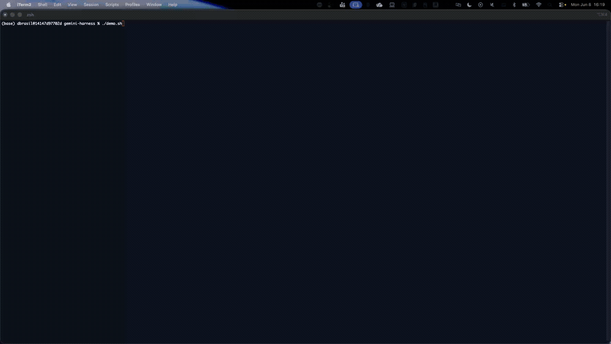

# GIF Shot-List — Gemini Harness (Console)

Record a short screen capture (~15–30s) of the Gemini harness in the **PROD
Console** and save it to `images/gemini-harness.gif`. Then reference it at the top
of `README.md`.

> The goal is to show the harness running on Gemini in the Console UI — the same
> agent the CLI commands create. Keep it tight; trim dead time.

## Suggested frames

1. **Console — harness list / create entry point**
   Region selector visible on a preview region (IAD / PDX / SYD / FRA). Show the
   AgentCore → Harness (agents) area.

2. **Create / configure — model provider = Gemini**
   The create or config panel with **provider = Gemini** and model
   **`gemini-2.5-flash`** selected. (This is the Console mirror of
   `--model-provider gemini --model-id gemini-2.5-flash`.)

3. **API key (credential) wired**
   Show the Gemini API-key credential provider attached (the Console equivalent of
   `agentcore add credential --type api-key`). Do **not** show the raw key — only
   that a credential is selected.

4. **Harness READY / details**
   The harness in `READY` status with its ARN/details panel.

5. **Invoke / playground turn**
   Send a sample prompt (e.g. *"What are three fun things to do in Seattle on a
   rainy day? Save your answer to a Markdown file."*) and show the streamed Gemini
   response (and a tool call if visible).

## Capture tips

- 1280×720 (or the Console viewport), trimmed; aim for a small file (< ~5 MB).
- Redact account id / ARNs if the capture is shared outside the team.
- macOS: record with `⇧⌘5` (or Kap/Gifox), export to GIF, save as
  `images/gemini-harness.gif`.
- After saving, add to the top of `README.md`:
  ```markdown
  
  ```
