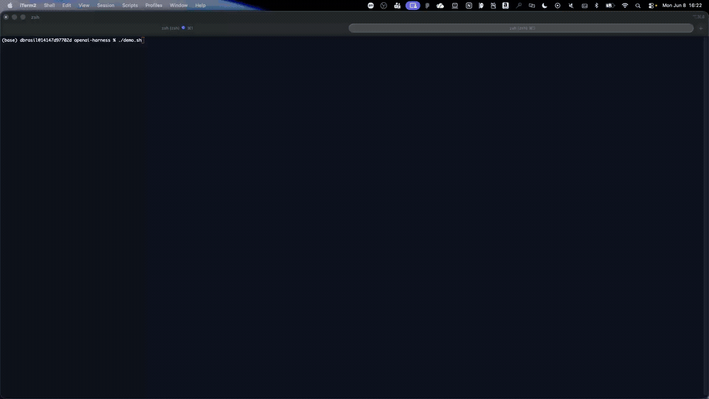

# GIF Shot-List — OpenAI Harness (Console)

Record ~15–30s of the OpenAI GPT-OSS harness in the PROD Console, save to
`images/openai-harness.gif`, then reference it at the top of `README.md`.

## Frames

1. **Console — harness create**, region on a preview region (IAD/PDX/SYD/FRA).
2. **Provider = Bedrock**, model `openai.gpt-oss-20b-1:0` selected (OpenAI GPT-OSS).
3. **Harness READY** with its ARN/details. (No API key — Bedrock provider uses IAM.)
4. **Invoke / playground** — send a prompt, show the streamed response identifying as an OpenAI model.

## Tips

- Trim to a small file (< ~5 MB); redact account id / ARNs if shared.
- macOS: `⇧⌘5` (or Kap/Gifox) → export GIF → `images/openai-harness.gif`.
- Then add to top of `README.md`:
  ```markdown
  
  ```
