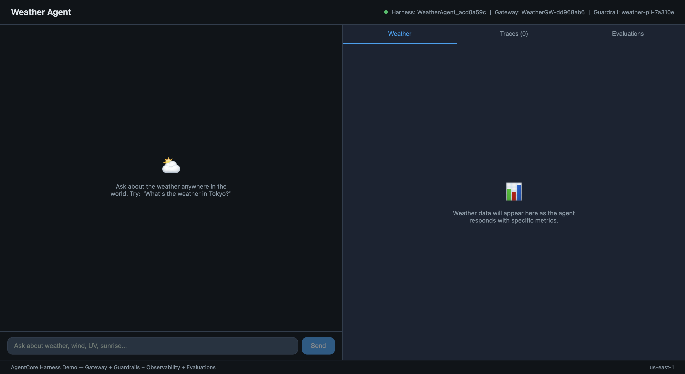

# Weather Agent — Harness + Evaluations + Gateway + Observability



## Overview

A full-stack weather agent web app that integrates **six AgentCore capabilities** in a single demo:

1. **AgentCore Gateway** — Creates a Gateway resource with an Exa MCP target, routing all tool calls through the managed proxy for centralized observability
2. **Guardrails** — Bedrock guardrail that anonymizes PII (email, phone, SSN, card number) in agent responses
3. **Observability** — CloudWatch traces with full agent loop visibility
4. **Skills** — Generate weather forecast Excel spreadsheets using the xlsx skill (fetched from Git at invocation time)
5. **Evaluations** — Batch evaluation scoring with built-in evaluators (Helpfulness, Correctness, Coherence, etc.)
6. **Optimization** — AI-generated system prompt recommendations based on agent traces

The web app features:
- A **chat interface** where users ask weather questions
- **Weather data cards** that update in real time (temperature, wind, UV, sunrise/sunset)
- A **Traces panel** showing live trace IDs from CloudWatch (searchable in GenAI Observability)
- A **Skills panel** to generate weather forecast XLSX reports
- An **Evaluations panel** that triggers batch evaluations and displays scores
- An **Optimization panel** that generates AI-improved system prompts from your traces

## Quick Start

```bash
./start.sh
```

One command: installs dependencies, provisions AWS resources (Gateway, Harness, Guardrail), starts the backend and frontend. Open **http://localhost:5173**.

To stop servers: `Ctrl+C`. To delete AWS resources: `./cleanup.sh`.

## Architecture

```
┌──────────────────────────────────────────────────────────────────┐
│  Frontend (React + Vite) — http://localhost:5173                 │
│                                                                  │
│  ┌─────────────────────┐    ┌─────────────────────────────────┐  │
│  │     Chat Panel       │   │  Weather / Traces / Evaluations │  │
│  │   (send queries)     │   │  (live cards, trace IDs, scores)│  │
│  └──────────┬───────────┘   └────────────────┬────────────────┘  │
└─────────────┼─────────────────────────────────┼──────────────────┘
              │                                 │
              │  POST /api/chat (SSE)           │  GET /api/traces
              │                                 │  POST /api/evaluate
              ▼                                 ▼
┌──────────────────────────────────────────────────────────────────┐
│  Backend (FastAPI) — http://localhost:8000                       │
│                                                                  │
│  ┌────────────┐  ┌────────┐  ┌──────────────┐  ┌─────────────┐   │
│  │ resources  │  │ agent  │  │observability │  │ evaluation  │   │
│  │    .py     │  │  .py   │  │     .py      │  │    .py      │   │
│  └─────┬──────┘  └───┬────┘  └──────┬───────┘  └──────┬──────┘   │
└────────┼──────────────┼──────────────┼─────────────────┼─────────┘
         │              │              │                  │
         ▼              ▼              ▼                  ▼
┌──────────────────────────────────────────────────────────────────┐
│  AWS (AgentCore + Bedrock + CloudWatch)                          │
│                                                                  │
│  AC Gateway ──► Exa MCP ──► Web Search (live weather data)       │
│  Harness ─────► Claude Haiku 4.5 (agent orchestration)           │
│  Guardrail ───► PII anonymization (email, phone, SSN, card)      │
│  Skills ──────► xlsx skill (Git-fetched, weather report gen)     │
│  CloudWatch ──► Trace observability (GenAI Observability)        │
│  Batch Eval ──► Built-in evaluators (Helpfulness, Correctness…)  │
│  Optimization ► System prompt recommendations from traces        │
└──────────────────────────────────────────────────────────────────┘
```

## How It Works

### Web App Flow

1. **Start** — `./start.sh` provisions Gateway + Harness + Guardrail (or reuses existing ones)
2. **Chat** — User asks weather questions; agent searches via Gateway's Exa MCP target
3. **Weather Cards** — Parsed metrics (temperature, wind, UV, etc.) appear as visual cards
4. **Traces** — Each invocation generates traces visible in the Traces tab and in CloudWatch > GenAI Observability > Bedrock AgentCore > Traces
5. **Skills** — Click "Generate Report" to create an XLSX weather forecast using the xlsx skill
6. **Evaluations** — Click "Run Eval" to trigger a batch evaluation; results show scores for Helpfulness, Correctness, Coherence, and more (also visible in Bedrock AgentCore > Evaluations > Batch evaluation)
7. **Optimization** — Click "Optimize" to generate an AI-improved system prompt from your traces (also visible in Bedrock AgentCore > Optimizations > Recommendations)
8. **Cleanup** — `./cleanup.sh` deletes all AWS resources including batch evaluations


## Key Features

### AgentCore Gateway
The demo creates an AgentCore Gateway resource (`create_gateway` + `create_gateway_target`) and passes it to the harness as `type: "agentcore_gateway"`. The Gateway acts as a managed proxy between the agent and external tool servers:
- Centralized routing for MCP tool traffic
- Automatic observability (every tool call through the Gateway is traced)
- Configurable auth (NONE in this demo, supports IAM/OAuth)

### Bedrock Guardrails
A guardrail anonymizes PII in agent responses. If you ask the agent to include personal info (email, phone), the guardrail masks it before the response reaches you — `{EMAIL}`, `{PHONE}` and so on appear in its place, and the app notes that it redacted something.

`CreateHarness`/`InvokeHarness` take no guardrail parameter, so a harness does not
apply one on its own: the response text is passed through
[`ApplyGuardrail`](https://docs.aws.amazon.com/bedrock/latest/APIReference/API_runtime_ApplyGuardrail.html)
explicitly, on the complete answer rather than per streamed chunk (an entity can
straddle two chunks, and a partial match would slip through).

The filters are `EMAIL`, `PHONE`, `US_SOCIAL_SECURITY_NUMBER` and
`CREDIT_DEBIT_CARD_NUMBER`. **`ADDRESS` is deliberately excluded**: Bedrock
classifies a bare city name as an address, so enabling it turns *"Current Weather
in Paris, France"* into *"Current Weather in `{ADDRESS}`"* and destroys the output
of a weather agent. Measured against the same text, the PII this demo injects
(email and phone) is redacted identically with or without it. The trade-off is
that a genuine postal address is no longer masked — add `ADDRESS` back for an
agent that handles real addresses and does not echo place names.

> Note: the model's own safety training usually refuses to repeat personal
> details back, so the guardrail often has nothing to redact. To see it fire,
> ask for a specific string verbatim.

### Observability
Every `invoke_harness` call automatically generates traces in CloudWatch. The Traces tab shows trace IDs that you can search in:
- **CloudWatch > GenAI Observability > Bedrock AgentCore > Traces**

### Skills (xlsx)
The "Generate Report" button creates a 7-day weather forecast Excel spreadsheet using the AgentCore xlsx skill. The skill is fetched from Git (`https://github.com/anthropics/skills`) at invocation time — no container setup or pre-installation required. The report uses the last city you asked about.

### Batch Evaluations
The "Run Eval" button triggers a batch evaluation that scores your session using built-in evaluators:
- InstructionFollowing, Helpfulness, Correctness, Faithfulness, ResponseRelevance, Coherence, Conciseness, Refusal

Results appear in the web app and are also visible in:
- **Bedrock AgentCore > Evaluations > Batch evaluation**

> **Known limitation.** The evaluation job discovers your sessions but may report
> every one as failed, with a reason like
> `AgentSpanMappingException: Failed to parse agent_response from agent-span with
> spanId: … and scope: strands.telemetry.tracer` (the field named varies —
> `agent_response` or `user_query`).
> The built-in evaluators need the prompt and response text on the agent span,
> and the spans a harness emits carry token counts and timings but no message
> content, so there is nothing for the evaluator to score. This is a property of
> the harness runtime's telemetry, not of this sample's configuration. Both the
> web app and `weather_agent.py` read the per-session reason out of the job's own
> output log group and print it, so you can tell this apart from a real
> misconfiguration — a bare `FAILED` with a session count says nothing.

### Optimization
The "Optimize" button analyzes your agent's traces and generates an AI-improved system prompt optimized for goal success. It uses the `start_recommendation` API with your harness traces as input. The recommended prompt and explanation are displayed in the web app.

Results are also visible in:
- **Bedrock AgentCore > Optimizations > Recommendations**

> **Known limitation.** A recommendation evaluates the same agent spans a batch
> evaluation does, so it fails the same way and for the same reason
> (`N/N sessions could not be evaluated`). See the note under Batch Evaluations.

## Prerequisites

- Python 3.10+
- Node.js 18+
- AWS CLI configured with credentials (`aws sts get-caller-identity` should work). Set a region where AgentCore harness is available — `AWS_REGION` or `AWS_DEFAULT_REGION`, or your profile's region; the scripts fall back to `us-east-1` if none is set. (Verified end to end in `us-west-2` as well as `us-east-1`.)
- Model access enabled for Claude Haiku 4.5 in Amazon Bedrock
- [CloudWatch Transaction Search](https://docs.aws.amazon.com/bedrock-agentcore/latest/devguide/observability-configure.html) enabled — **required** for Traces, Evaluations, and Optimization to work. After enabling, wait 10-15 minutes before using these feature so the Bedrock AgentCore dashboard in CloudWatch can become available. Only traces from invocations *after* enabling will be indexed.

## AWS Permissions Required

> **Note:** The policies below use broad access for simplicity in this demo. In production environments, follow the principle of least privilege and create custom IAM policies scoped to only the specific resources and actions your agent needs.

| Policy | Purpose |
|--------|---------|
| `BedrockAgentCoreFullAccess` | Harness, Gateway, Batch Evaluations |
| `AmazonBedrockFullAccess` | Model invocation, Guardrails |
| `IAMFullAccess` | Create the harness execution role (first run only) |
| `CloudWatchFullAccessV2` | Query traces + batch evaluation output logs |

## Running

### Web App (recommended)

```bash
./start.sh
```

One command: creates a virtual environment, installs Python and Node.js packages, provisions AWS resources, starts the FastAPI backend and React frontend.

Open **http://localhost:5173** once the script prints "App is running!".

```bash
# Stop servers without deleting AWS resources:
# Press Ctrl+C (resources persist for next ./start.sh)

# Stop servers AND delete all AWS resources:
./cleanup.sh
```

## Sample Prompts

- "What's the weather in Tokyo?"
- "What's the wind speed in Vancouver right now?"
- "What's the UV index in Miami today?"
- "When is sunrise and sunset in London?"

### CLI-only mode

A headless walkthrough of the same five pillars that runs in the terminal and
cleans up after itself. Run it separately — not while the web app is running,
since both provision the same kinds of resources under the shared execution role.

```bash
./run.sh                 # wrapper: checks prerequisites, then runs the script
./run.sh --fast          # → --skip-evals
./run.sh --keep          # → --skip-cleanup
./run.sh --cleanup       # → --cleanup-only (remove what a --keep run left behind)

# or drive the script directly:
python weather_agent.py
python weather_agent.py --skip-evals       # skip the batch evaluation wait
python weather_agent.py --skip-guardrail   # no guardrail
python weather_agent.py --skip-cleanup     # keep the resources afterwards
python weather_agent.py --cleanup-only     # delete leftovers and exit
```

Unlike the web app, this deletes everything it created on exit unless you pass
`--skip-cleanup`. If you did use `--skip-cleanup` (or a run died part-way),
`--cleanup-only` sweeps up: it deletes harnesses named `WeatherAgent_*`, gateways
named `WeatherGateway-*`/`WeatherGW-*`, guardrails named `weather-pii-guard-*`,
batch evaluations named `weather_eval_*`, and the shared execution role. It matches
on those prefixes only, so it will not touch unrelated resources in your account.

### Prompt optimization (CLI)

```bash
python optimize.py                              # analyse traces, recommend a prompt
python optimize.py --evaluator Builtin.Helpfulness
python optimize.py --lookback 1                 # only the last day of traces
python optimize.py --cleanup                    # delete weather_rec_* recommendations
```

This reads `resource_info.json`, so it only works **after** `./start.sh` has
provisioned the resources and you have used the app for a few sessions — there
have to be traces to analyse. It stops with a clear message if the state file is
not there rather than failing further in. Note the limitation described under
[Optimization](#optimization): the recommendation currently cannot score harness
spans.

## Clean Up

```bash
# Delete all AWS resources (gateway, harness, guardrail, batch evaluations,
# recommendations, IAM role):
./cleanup.sh

# To also remove the virtual environment and node_modules:
rm -rf venv frontend/node_modules
```

`cleanup.sh` reads `resource_info.json`, so run it before deleting the venv — it
needs boto3 to make the delete calls. It falls back to the system interpreter if
the venv is gone but boto3 is importable, and otherwise stops with a non-zero exit
rather than silently leaving resources running.

Creating a harness also provisions a managed memory named `harness_<name>_*`. It
cannot be deleted directly (`delete-memory` rejects it as managed) and cascades
when the harness is deleted — but asynchronously, so it can still appear in a
listing for a few minutes after `cleanup.sh` finishes. To confirm:

```bash
aws bedrock-agentcore-control list-memories --query "memories[?starts_with(id, 'harness_')]"
```