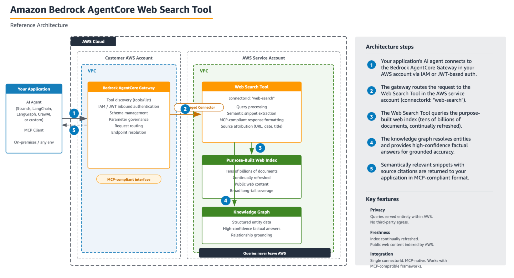
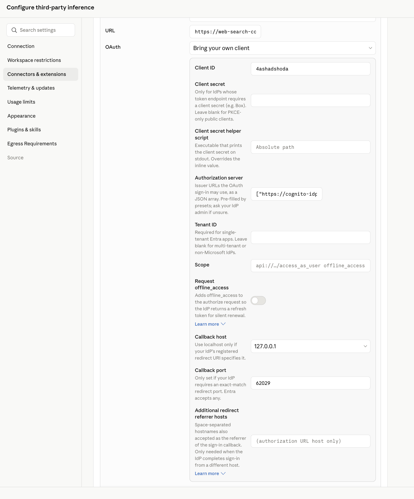
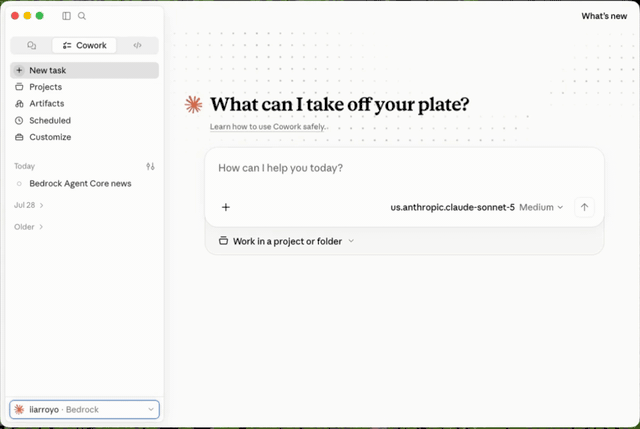
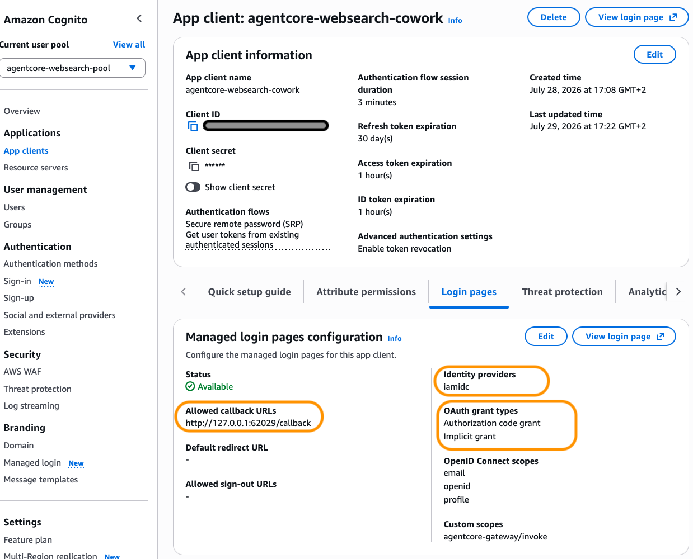

# Connect AgentCore Web Search to Claude Cowork

This guide provisions an **Amazon Bedrock AgentCore Gateway** that exposes the
**managed Web Search tool** as a standard MCP tool, and shows how to connect it
to **Claude Cowork** (and any other MCP client).

Web Search on AgentCore is a fully managed, MCP-compliant web search backed by an
Amazon-operated web index. There are no third-party search API keys to manage and
queries never leave AWS.
<p align="center">
  
</p>

([AWS docs](https://docs.aws.amazon.com/bedrock-agentcore/latest/devguide/gateway-target-connector-web-search-tool.html))

### Why go through an AgentCore Gateway?

Exposing Web Search through the gateway gives you an enterprise security and
governance layer that a raw search API doesn't — enforced **outside** the agent's
code, so the agent can't reason around it:

- **Private by design / no data egress** — queries are served inside AWS and are
  not sent to third-party search engines.
- **Fully managed, no keys** — no search API keys, quotas, or scaling to manage;
  backed by an Amazon-operated index with a knowledge graph and semantic snippet
  extraction optimized for a model's context window.
- **AWS WAF at the edge** — inspect and block every inbound request (bots,
  volumetric attacks, IP allow/deny, rate limits) before it reaches the tool.
  See [Harden with AWS WAF](#harden-with-aws-waf-recommended).
- **Domain filtering** — restrict which domains Web Search may return with a
  domain denylist.
  ([docs](https://docs.aws.amazon.com/bedrock-agentcore/latest/devguide/gateway-target-connector-web-search-tool.html))
- **Bedrock Guardrails** — content filtering on tool inputs/outputs (hate,
  violence, misconduct, prompt-injection, sensitive-data/PII) applied at the
  gateway via AgentCore Policy.
  ([docs](https://docs.aws.amazon.com/bedrock-agentcore/latest/devguide/policy-guardrails-in-policies.html))
- **Fine-grained authorization (Cedar Policy)** — deterministic allow/deny rules
  on tool calls, not just probabilistic filtering.
  ([docs](https://docs.aws.amazon.com/bedrock-agentcore/latest/devguide/use-gateway-with-policy.html))
- **Centralized auth + least privilege** — one secure MCP entry point for any
  client, with inbound OAuth/JWT (or IAM) and a scoped outbound IAM role.
- **Observability** — CloudWatch metrics for WAF blocks, guardrail activations,
  and usage, so you can alarm on anomalies.
- **Framework-agnostic** — a standard MCP endpoint usable by Claude, Strands,
  LangGraph, CrewAI, or any MCP client — no per-client integration.

> **Disclaimer:** This is a sample for learning and experimentation, not for
> production. It omits production concerns (fine-grained scope/audience
> validation, monitoring, rate limiting, HA, credential rotation). Review and
> adapt it before any real-world use.

---

## Architecture

```
Claude Cowork (MCP client)
      │  MCP over HTTPS + Bearer JWT (inbound: CUSTOM_JWT)
      ▼
AgentCore Gateway  ──assumes IAM service role──▶  web-search connector
 (in your AWS account, your region)               (managed web index, no egress)
```

- **Inbound** (client → gateway): a bearer **JWT** validated against your IdP's
  `discoveryUrl` and an `allowedClients` list. You bring your own IdP, or the
  script creates a **Cognito** user pool.
- **Outbound** (gateway → web search): the gateway assumes a least-privilege IAM
  **service role** that only allows `bedrock-agentcore:InvokeWebSearch`.

> **Region:** the managed Web Search connector must be in a region where it's
> available — check the
> [Web Search availability](https://docs.aws.amazon.com/bedrock-agentcore/latest/devguide/gateway-target-connector-web-search-tool.html)
> in the AWS docs. Set the region with `--region` / `AWS_REGION` (default
> `us-east-1`).

---

## What the script creates

| Resource | Purpose | Least-privilege note |
|---|---|---|
| IAM role `WebSearchGatewayRole` | Role the gateway assumes for outbound calls | Grants only `InvokeWebSearch` (on the web-search tool ARN) + `InvokeGateway`; trust scoped by `aws:SourceAccount` + `aws:SourceArn` |
| Cognito user pool *(optional)* | Inbound JWT authorizer | Only created when you don't pass your own `--auth-discovery-url` / `--auth-client-id` |
| AgentCore Gateway | MCP endpoint, `CUSTOM_JWT` inbound auth | — |
| Web-search target | The `web-search` managed connector on the gateway | Outbound creds = `GATEWAY_IAM_ROLE` |

When it creates Cognito, it provisions a user pool, a hosted-UI domain, a
resource server (scope `agentcore-gateway/invoke`), and:

- a **`*-cowork` authorization-code app client** — this is the one the Bedrock
  third-party (3P) connector in Claude Cowork uses. Claude connectors do **not**
  support the `client_credentials` grant, so this client uses the OAuth
  **authorization-code** grant with the **`openid`** scope (needed to issue
  id/refresh tokens), a real user must sign in, and it is pre-wired with the
  desktop loopback callback `http://127.0.0.1:62029/callback`.
- optionally (`--with-m2m-client`) a **`client_credentials`** app client used
  **only** for the browserless `curl` sanity check below. Cowork cannot use it.

> You also need a **sign-in user** in the pool. Pass `--user-email you@example.com`
> to `create` — Cognito emails an invitation and the user sets their own password
> at first sign-in (recommended; no password in code). To set a password directly
> instead, add `--user-password ...` (and avoid committing it).

---

## Prerequisites

- AWS credentials for an account with access to Bedrock AgentCore in a region
  where Web Search is available (check the AWS docs), able to create IAM roles,
  Cognito user pools, and AgentCore gateways.
- **AWS CLI v2 ≥ 2.35.0** (older versions lack the connector target shape) if you
  want to run the raw CLI equivalents.
- Python 3.10+ and `boto3 >= 1.43.57` (`pip install -r requirements.txt`). Older
  boto3 lacks the Web Search `connector` gateway target and fails with a
  `ParamValidationError`. In a notebook, upgrade and **restart the kernel**.

---

## Usage

```bash
pip install -r requirements.txt

# Option A: create a Cognito user pool + invite a sign-in user by email
# (Cognito emails a temp password; the user sets their own at first sign-in)
python provision.py create --user-email you@example.com

# Use a different region (check Web Search availability there first)
python provision.py create --region <region> --user-email you@example.com

# If the connector dialog shows a loopback port other than 62029
python provision.py create --callback-port 51000 --user-email you@example.com

# (Not recommended) set the password directly instead of emailing an invitation
python provision.py create --user-email you@example.com --user-password '<password>'

# Option B: bring your own IdP (client id + OIDC discovery URL)
python provision.py create \
  --auth-discovery-url https://your-idp/.well-known/openid-configuration \
  --auth-client-id your-client-id

# Tear everything down
python provision.py delete
```

Useful `create` flags:

| Flag | Purpose |
|---|---|
| `--region` | Region for the gateway + Web Search connector (default `us-east-1`; use one where Web Search is available). |
| `--callback-port` | Loopback port for the Bedrock 3P callback (default `62029`). Registers `http://127.0.0.1:<PORT>/callback`. |
| `--identity-provider` | Add a federated IdP (e.g. an IAM Identity Center provider) to the app client's supported providers. Repeatable. |
| `--with-m2m-client` | Also create a `client_credentials` client for the browserless `curl` test. |
| `--user-email` | Invite a Cognito sign-in user by email; they set their own password at first sign-in (recommended). |
| `--user-password` | Optional: set the user's password directly instead of emailing an invitation (avoid committing). |
| `--auth-discovery-url` / `--auth-client-id` | Bring your own IdP instead of creating Cognito. |
| `--extra-callback` | Register an extra OAuth callback URL. Repeatable. |

Most options also read from environment variables: `AWS_REGION`, `GATEWAY_NAME`,
`TARGET_NAME`, `ROLE_NAME`, `RESOURCE_PREFIX`, `AUTH_DISCOVERY_URL`,
`AUTH_CLIENT_ID`, `USER_EMAIL`, `USER_PASSWORD`, `CALLBACK_PORT`.

On success the script prints the **Gateway MCP URL**, the discovery/token
endpoints, and the client id/secret, and saves everything to
`.provision-state.json` (used by `delete`). Treat that file as a secret — it
contains client secrets — and do not commit it.

---

## Connect to Claude Cowork

> **Important auth reality check.** Claude connectors use the OAuth
> **authorization-code** grant (user sign-in), **not** `client_credentials` —
> Cognito's machine-to-machine flow will not work here. You therefore need: the
> `*-cowork` authorization-code client (with the `openid` scope so tokens can be
> issued/refreshed) and a **real user** to sign in.
>

### Fill in the "Add connector" dialog

In Claude, open **Configure 3rd party inference → Connectors → Add connector** and map the
fields as follows (using the values from the script output). See the official
[Claude Desktop extensions docs](https://claude.com/docs/third-party/claude-desktop/extensions)
for details.

<p align="center">
  
</p>

| Dialog field | Value |
|---|---|
| **URL** (server URL) | the **Gateway MCP URL** (ends in `/mcp`) |
| **OAuth Client ID** | the Cognito `*-cowork` app client `client_id` |
| **OAuth Client Secret** | the Cognito `*-cowork` app client `client_secret` |
| **Authorization server(s)** | `["https://cognito-idp.<REGION>.amazonaws.com/<USER_POOL_ID>"]` |

Note the **Authorization server** is the Cognito **issuer** URL — the discovery
URL *without* the `/.well-known/openid-configuration` suffix.

### The callback URL and its port must match Cognito

The Bedrock 3P connector completes OAuth against a **local loopback redirect**:

```
http://127.0.0.1:<PORT>/callback
```

The script pre-registers `http://127.0.0.1:62029/callback` on the `*-cowork`
client, which is the port the connector uses. Cognito matches the `redirect_uri`
**exactly** — scheme, host, **port** and path, with no wildcards and no
port-agnostic loopback — so if the connector dialog shows a **different port**,
register that exact URL or the sign-in fails with a `redirect_uri` mismatch:

```bash
python provision.py add-callback --url http://127.0.0.1:<PORT>/callback
```

(The command appends the URL to the existing app client without touching its
other settings. You can also pass `--extra-callback` at `create` time.)

### Finish connecting

1. You need a user in the pool to sign in with. If you passed `--user-email`,
   Cognito already emailed an invitation with a temporary password — check the
   inbox (and spam). To invite one now, or if you skipped it:
   ```bash
   aws cognito-idp admin-create-user \
     --user-pool-id <pool-id> --username you@example.com \
     --user-attributes Name=email,Value=you@example.com Name=email_verified,Value=true \
     --desired-delivery-mediums EMAIL --region us-east-1
   ```
2. Complete the sign-in when Claude opens the Cognito hosted UI. On first login
   you'll be prompted to set your own password.
3. Once connected, ask Cowork something like *"search the web for the latest AWS
   announcements"* — it will call the `WebSearch` tool.

<p align="center">
  
</p>

---

## Sign in with IAM Identity Center users (optional)

Instead of managing local users in the Cognito pool, you can let your workforce
sign in with their existing **IAM Identity Center** identities. You don't replace
Cognito: you **federate the Cognito user pool to Identity Center**, so Cognito
stays the JWT issuer the gateway trusts (the `discoveryUrl` and `allowedClients`
you already configured don't change), while users actually authenticate against
Identity Center. See the AWS walkthrough video:
[IAM Identity Center + Cognito integration](https://aws.amazon.com/video/watch/ae4d697184e/).



High-level steps (follow the video for the exact console clicks):

1. **In IAM Identity Center**, create an application for the Cognito pool. Use
   SAML 2.0 federation (or the Identity Center OIDC option) and note the IdP
   metadata / issuer.
2. **In the Cognito user pool**, add that Identity Center app as an external
   **identity provider** (SAML/OIDC) and map at least the `email` attribute.
3. **On the `*-cowork` app client**, add the Identity Center provider to the
   client's *Supported identity providers*, keeping the same loopback callback
   and `openid` scope. The hosted UI will then offer a "Sign in with Identity
   Center" option. You can pre-wire the provider at creation time by passing
   `--identity-provider <provider-name>` to `provision.py create` (repeatable).
4. **Nothing on the gateway changes** — it still validates Cognito-issued JWTs.
   Tokens now represent Identity Center users who signed in through Cognito.

What stays the same: the Bedrock 3P connector config in Claude (URL, Client ID /
Secret, Authorization server = the Cognito issuer) and the loopback callback.
What changes: users log in with Identity Center credentials instead of native
Cognito users, so you can skip creating `--user-email` accounts.

---

## Verify the tool works (M2M, no browser)

This uses the optional `client_credentials` client, so run `create` with
`--with-m2m-client` first. This path is for **testing the gateway only** — it is
not how Cowork connects.

```bash
# 1) get a token
TOKEN=$(curl -s -X POST "<token_endpoint>" \
  -H "Content-Type: application/x-www-form-urlencoded" \
  -d "grant_type=client_credentials" \
  -d "client_id=<m2m_client_id>" \
  -d "client_secret=<m2m_client_secret>" \
  -d "scope=agentcore-gateway/invoke" | python -c "import sys,json;print(json.load(sys.stdin)['access_token'])")

# 2) list tools on the gateway (MCP)
curl -s "<gateway_mcp_url>" \
  -H "Authorization: Bearer $TOKEN" \
  -H "Content-Type: application/json" \
  -d '{"jsonrpc":"2.0","id":1,"method":"tools/list"}'
```

You should see a `WebSearch` tool with a `query` (≤ 200 chars) and optional
`maxResults` (1–25) input.

---

## Harden with AWS WAF (recommended)

AgentCore Gateway integrates with **AWS WAF**, which makes this a genuinely
secure way to expose web search: WAF inspects **every inbound request inline
before it reaches the web-search target**, so you can block bots, abusive
clients, and volumetric attacks at the edge — on top of the JWT auth, the
least-privilege service role, and the fact that Web Search runs inside AWS with
no data egress. WAF is per-gateway (one web ACL per gateway) and adds zero
overhead when none is attached.
([AWS docs](https://docs.aws.amazon.com/bedrock-agentcore/latest/devguide/gateway-waf.html))


Requirements: a **regional** web ACL (CloudFront/global is not supported) in the
**same region as the gateway**, the gateway in `READY` state, and IAM permissions
for `wafv2:*WebACL*` plus `bedrock-agentcore:Gateway*WebACL*`.

1. Create a regional web ACL (start rules in `COUNT` mode, then switch to
   `BLOCK`). AWS Managed Rules + a rate-based rule is a good baseline.
2. Associate it with the gateway (use the `Gateway ARN` / `Gateway ID` from the
   script output):
   ```bash
   aws wafv2 associate-web-acl \
     --web-acl-arn arn:aws:wafv2:us-east-1:<ACCOUNT>:regional/webacl/<name>/<id> \
     --resource-arn <gateway-arn> \
     --region us-east-1
   ```
3. (Optional) Choose the failure mode. Default is **`FAIL_CLOSE`** (block if WAF
   is unreachable — security first). Use `FAIL_OPEN` only if availability matters
   more than security:
   ```bash
   aws bedrock-agentcore-control update-gateway \
     --gateway-identifier <gateway-id> --name WebSearchGateway \
     --role-arn <service-role-arn> \
     --authorizer-type CUSTOM_JWT \
     --authorizer-configuration '{"customJWTAuthorizer":{"discoveryUrl":"<discovery-url>","allowedClients":["<client-id>"]}}' \
     --waf-configuration '{"failureMode":"FAIL_CLOSE"}' --region us-east-1
   ```

When WAF blocks an MCP request, the client gets a JSON-RPC error (`-32002`,
"Authorization error - Request forbidden"). Monitor the `WafBlocks`,
`WafFailOpens`, and `WafFailCloses` CloudWatch metrics in the
`AWS/Bedrock-AgentCore` namespace to tune rules.

> **Before teardown:** you must disassociate the web ACL first, or `delete` will
> fail:
> ```bash
> aws wafv2 disassociate-web-acl --resource-arn <gateway-arn> --region us-east-1
> ```

---

## Troubleshooting

### `redirect_mismatch` on the Cognito hosted UI

The `redirect_uri` the connector sent doesn't **exactly** match an allowed
callback URL on the app client. Cognito does exact string matching, so watch for:

- a **different port** than the pre-registered `62029`,
- **`localhost` vs `127.0.0.1`** (Cognito treats them as different),
- a **different path** (e.g. `/oauth/callback` instead of `/callback`) or a
  trailing-slash difference.

Fix it:

1. Find the exact `redirect_uri`. The Cognito error page doesn't show it, but the
   `/oauth2/authorize?...&redirect_uri=<value>&...` URL the connector opens does —
   copy that value (or read it from the connector dialog).
2. Check what's currently registered:
   ```bash
   aws cognito-idp describe-user-pool-client \
     --user-pool-id <pool-id> --client-id <client-id> \
     --region us-east-1 --query "UserPoolClient.CallbackURLs"
   ```
3. Register the exact URL (repeat for each variant if unsure):
   ```bash
   python provision.py add-callback --url "http://127.0.0.1:<PORT>/callback"
   ```

---

## Cleanup

```bash
python provision.py delete
```

This deletes the target, gateway, the Cognito pool (if created), and the IAM
role, then removes the local state file.

---
