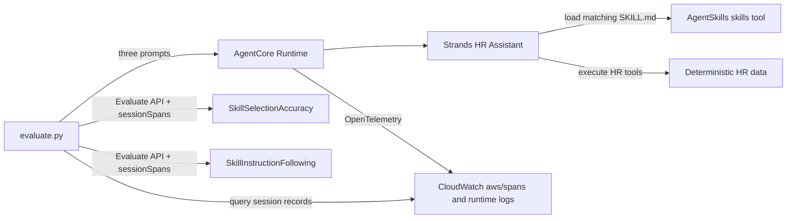

# Evaluate Agent Skills with Amazon Bedrock AgentCore

## Introduction

This sample adds [Agent Skills](https://agentskills.io/) to the evaluation suite's shared **HR Assistant** and demonstrates the two built-in Amazon Bedrock AgentCore skill evaluators:

| Evaluator | Question answered | Result scale |
|:----------|:------------------|:-------------|
| `Builtin.SkillSelectionAccuracy` | Did the agent load the best available skill for the user's request? | `Yes` (`1.0`) or `No` (`0.0`) |
| `Builtin.SkillInstructionFollowing` | After loading the skill, how completely did the agent execute its prescribed workflow? | `Fully Followed` (`1.0`), `Mostly Followed` (`0.75`), `Partially Followed` (`0.5`), `Minimally Followed` (`0.25`), or `Not Followed` (`0.0`) |

Both evaluators operate at the **tool-call level**. AgentCore emits one result per detected skill invocation and anchors it to the span that loaded the skill. The sample uses the native Strands `AgentSkills` plugin, whose `skills` tool call exposes the available skill catalog, selected skill, and loaded `SKILL.md` content in the trace.

The evaluator scores are model-generated assessments, not deterministic test assertions. Repeated runs may produce different explanations or instruction-following scores.

## Architecture



The shared HR Assistant remains unchanged for neighboring samples by default. Passing `--skills-dir` to `../utils/deploy.py` packages this folder's skills and enables `AgentSkills` only for a separate runtime whose configuration is written here.

## Skills in This Sample

### `pto-planning`

Selected for PTO balance, planning, and submission requests. Its required workflow checks the employee's balance, retrieves the PTO policy, submits only when the request is complete, and returns a structured summary.

### `benefits-advisor`

Selected for health, dental, vision, 401(k), or life-insurance questions. Its workflow retrieves the requested plan from the HR tool and reports eligibility, employee cost, coverage, and key details without inventing plan facts.

The pay-stub scenario is intentionally unrelated to either skill. It demonstrates expected **skip behavior**: when a session has no skill invocation, both evaluators return zero results.

## How the Evaluators Use the Trace

### Skill selection accuracy

`Builtin.SkillSelectionAccuracy` uses:

- `invoked_skill`: the skill loaded by the `skills` tool call
- `available_skills`: the skill catalog exposed by Strands
- `user_message`: the request that caused the invocation
- `context`: conversation turns before the skill call

It judges the selection decision only; it does not judge execution of the skill instructions.

### Skill instruction following

`Builtin.SkillInstructionFollowing` uses:

- `invoked_skill`: the loaded skill
- `skill_content`: the complete `SKILL.md` instruction body
- `context`: the full session, including actions after the skill was loaded

It identifies the required steps in `SKILL.md`, checks the recorded tool calls and response against each step, and produces an overall rating. Because it needs the full session, `evaluate.py` waits for telemetry ingestion before collecting the session records.

## Prerequisites

- Python 3.10+
- AWS CLI installed and configured with credentials for the target account and Region
- Amazon Bedrock model access for `us.amazon.nova-lite-v1:0`
- CloudWatch Transaction Search enabled in the Region so AgentCore traces reach `aws/spans`
- Permissions for AgentCore Runtime and Evaluations, CloudWatch Logs queries, IAM role creation and
  `iam:PassRole`, S3 bucket/object operations, STS identity lookup, and Bedrock model invocation

See [Enable Transaction Search](https://docs.aws.amazon.com/AmazonCloudWatch/latest/monitoring/Enable-TransactionSearch.html) before deploying. Allow approximately 10 minutes after enabling it for telemetry to become available.

## Usage

Run all commands from this `skills-evaluation/` directory.

### 1. Create an environment

```bash
python3 -m venv .venv
source .venv/bin/activate
pip install -r requirements.txt
```

### 2. Deploy a separate skill-enabled HR Assistant

```bash
python ../utils/deploy.py \
  --skills-dir skills \
  --config-output agent_config.json
```

The deployment script reuses the shared HR Assistant source, packages these two skills, creates a separate AgentCore runtime, and writes its resource details to the ignored `agent_config.json` file. Omit `--region` to use the Region from your boto3 configuration.

Do not use the regular `../utils/agent_config.json` for this sample. That runtime intentionally has no skills so the existing evaluation samples retain their original tool trajectories.

### 3. Run the evaluations

```bash
python evaluate.py
```

The evaluation Region must match the Region in `agent_config.json`. Normally, omit `--region` and let the
script use the deployed runtime's Region. To use a different config or telemetry wait:

```bash
python evaluate.py --config agent_config.json --wait 300
```

The script:

1. Invokes two explicit skill scenarios, matching the reference implementation, plus one no-skill control.
2. Waits for AgentCore telemetry ingestion, following the same flow as the reference implementation.
3. Collects each session from `aws/spans` and the runtime log group.
4. Calls the synchronous `bedrock-agentcore:Evaluate` API with `evaluationInput.sessionSpans`; AgentCore detects and anchors each skill invocation.
5. Runs both built-ins for each session and writes `results/skill_evaluation_results.json`.
6. Verifies that each skill invocation produced one result per evaluator and that the no-skill control produced none.

> **Where are the results?** This sample uses the on-demand `Evaluate` API. Results are printed and saved to
> `results/skill_evaluation_results.json`; on-demand results do not populate the CloudWatch **Evaluations** tab.
> That tab displays results from an [online evaluation configuration](https://docs.aws.amazon.com/bedrock-agentcore/latest/devguide/create-online-evaluations.html) associated with the endpoint.

### Test your own prompt

Run one PTO prompt instead of the three built-in scenarios:

```bash
python evaluate.py \
  --prompt "I am EMP-001. Can I take September 14 through September 16, 2026 off? Submit it using the pto-planning skill." \
  --expected-skill pto-planning \
  --wait 150
```

The script prints the agent response, waits for its telemetry, then runs both built-in evaluators. Change only the quoted prompt to try other PTO wording. Use `--expected-skill benefits-advisor` for a benefits prompt or `--expected-skill none` when the prompt should not load a skill.

## Sample Prompts

| Scenario | Prompt intent | Expected behavior |
|:---------|:--------------|:------------------|
| PTO planning | Request dated leave with `pto-planning` | Load `pto-planning`; check balance and policy before submission |
| Benefits advice | Request health-plan details with `benefits-advisor` | Load `benefits-advisor`; retrieve health benefit details |
| No-skill control | Retrieve an existing January 2026 pay stub | Call `get_pay_stub` directly; load no skill |

The complete prompt strings are defined in `evaluate.py` so they can be changed and rerun easily.

## Expected Output

Values and explanations can vary, but the result shape is stable:

```text
HR Assistant — Agent Skills Evaluation
Region: <deployed-region>
Skills: benefits-advisor, pto-planning

[Invoke] pto-planning (session=skill-eval-...)
  Response: ...

[Evaluate] pto-planning: ... records, 1 skill invocation(s)
  pto-planning         Builtin.SkillSelectionAccuracy       1.0   Yes
  pto-planning         Builtin.SkillInstructionFollowing    1.0   Fully Followed

[Evaluate] no-skill-control: ... records, 0 skill invocation(s)
  no-skill-control     Builtin.SkillSelectionAccuracy       SKIPPED (0 results)
  no-skill-control     Builtin.SkillInstructionFollowing    SKIPPED (0 results)
```

A low score is a valid evaluation result and does not make the script fail. Missing results for an actual skill invocation, unexpected results for the control, telemetry errors, and evaluator API errors do fail validation.

## Troubleshooting

### No `skills` span appears

- Confirm the deployment config contains `"skills_enabled": true`.
- Confirm both `skills/*/SKILL.md` files were present during deployment.
- Enable CloudWatch Transaction Search and wait for setup to complete.
- Verify that `aws/spans` contains records for the generated session ID.
- Confirm the runtime includes `aws-opentelemetry-distro` and uses the instrumented entry point.

### Where to find the selected skill

The `aws/spans` record identifies the loader with `gen_ai.tool.name="skills"`, but the selected name is stored in the matching runtime event. Query the runtime log group from `agent_config.json` with the same trace ID or tool-call ID:

```text
fields @timestamp, eventName, body, traceId, spanId
| filter traceId = "<trace-id>"
| filter @message like /skills|skill_name/
| sort @timestamp asc
```

Look for `body.message.tool_calls[].function.arguments.skill_name` in the `gen_ai.choice` event. A subsequent `strands.telemetry.tracer` event with the same `gen_ai.tool.call.id` contains the loaded skill instructions. AgentCore correlates those runtime events with the `execute_tool skills` span when both log groups are supplied in `sessionSpans`.

### Both evaluators return zero results

The evaluators deliberately skip tool calls that do not expose `invoked_skill` or `skill_content`. Confirm that the agent called the native Strands `skills` tool and that the tool result contains the complete, well-formed `SKILL.md` file.

### Selection runs but instruction following does not

`SkillInstructionFollowing` requires the loaded `SKILL.md` body in the trace. Check that each skill has YAML frontmatter with `name` and `description`, followed by a non-empty instruction body.

## Clean Up

Read the generated resource identifiers:

```bash
python -m json.tool agent_config.json
```

Delete the AgentCore runtime first:

```bash
aws bedrock-agentcore-control delete-agent-runtime \
  --agent-runtime-id <agent_id> \
  --region <region>
```

Then remove the deployment artifacts using `s3_bucket`, `s3_key`, `role_name`, and `policy_name` from
`agent_config.json`:

```bash
aws s3 rm s3://<s3_bucket>/<s3_key>
aws iam delete-role-policy --role-name <role_name> --policy-name <policy_name>
aws iam delete-role --role-name <role_name>
rm -rf results .venv
rm agent_config.json
```

The shared regional S3 bucket is intentionally retained because other AgentCore samples may use it. The built-in evaluators are managed by AgentCore and must not be deleted.

## Additional Resources

- [Skill evaluators](https://docs.aws.amazon.com/bedrock-agentcore/latest/devguide/skill-evaluators.html)
- [On-demand evaluations](https://docs.aws.amazon.com/bedrock-agentcore/latest/devguide/evaluations-types.html)
- [Boto3 Evaluate API](https://docs.aws.amazon.com/boto3/latest/reference/services/bedrock-agentcore/client/evaluate.html)
- [Agent Skills specification](https://agentskills.io/)
