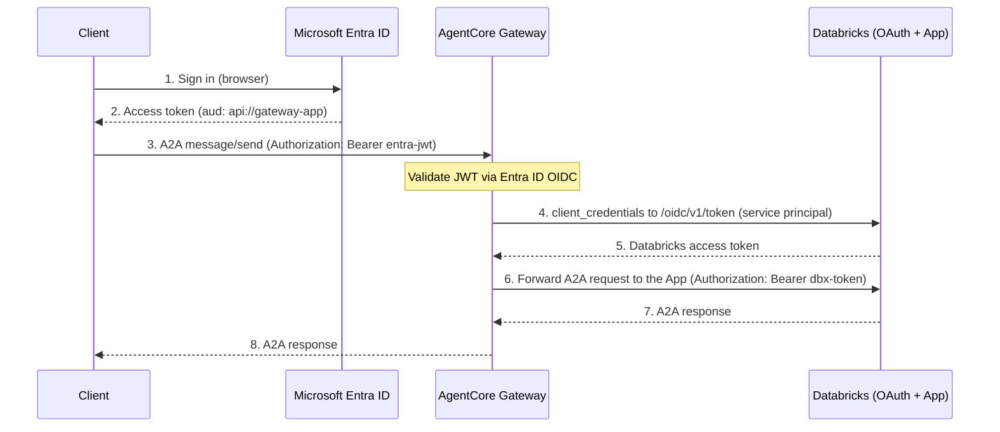

# A2A Agent on Databricks Apps

Front an Agent-to-Agent (A2A) agent hosted on **Databricks Apps** through the gateway as an `http.passthrough` target with `protocolType=A2A`. The gateway validates the inbound caller with Microsoft Entra ID, then authenticates outbound to the Databricks App as a **Databricks service principal** (OAuth machine to machine) and forwards the A2A request.

This tutorial uses a currency-conversion agent (LangGraph + a Databricks-served LLM + a `get_exchange_rate` tool) served over A2A with the `a2a-sdk`, deployed to Databricks Apps.

## Architecture

<!--  -->

| Component | Role |
| :-- | :-- |
| AgentCore Gateway | Fronts the Databricks App as an `http.passthrough` A2A target; validates the inbound Entra JWT and mints a Databricks token outbound |
| AgentCore Identity | Stores the Databricks OAuth credential provider the gateway uses outbound |
| Microsoft Entra ID | Issues the inbound JWT that authorizes the caller to the gateway |
| Databricks Apps | Hosts the A2A currency agent; enforces Databricks OAuth Bearer auth |



Path-based routing forwards `{GATEWAY_URL}/{targetName}/{path}` to the Databricks App URL.

> [!NOTE]
> **You do not need to federate your Databricks users with Entra ID.** Inbound auth (caller to gateway) uses Entra; outbound auth (gateway to the Databricks App) uses a Databricks **service principal** with OAuth client credentials. These are independent trust planes, and the service-principal path needs no SCIM user sync. You would only federate Databricks users with Entra (account-wide token federation) if you wanted the end user's identity to propagate into Databricks, which is out of scope for this proxy pattern.

## Tutorial details

| Item | Value |
| :-- | :-- |
| Target type | HTTP passthrough, `protocolType=A2A` |
| Endpoint | Your Databricks App URL |
| Inbound auth | Microsoft Entra ID (`CUSTOM_JWT`) |
| Outbound auth | Databricks service-principal OAuth (`CLIENT_CREDENTIALS`, scope `all-apis`) |
| Gateway | Shared `runtime-agents-gateway` (no protocol type) |
| Agent | Currency conversion (LangGraph) on Databricks Apps |

## Prerequisites

- Python 3.12+
- [uv](https://docs.astral.sh/uv/getting-started/installation/) installed
- Node.js >= 22.7.5
- [AgentCore CLI](https://www.npmjs.com/package/@aws/agentcore): `npm install -g @aws/agentcore`
- [AWS CLI](https://docs.aws.amazon.com/cli/latest/userguide/getting-started-install.html) configured with credentials (`aws configure`)
- [IAM permissions](https://github.com/aws/agentcore-cli/blob/main/docs/PERMISSIONS.md)
- A Databricks workspace with Databricks Apps enabled, and a **service principal** with an OAuth secret
- A Microsoft Entra ID gateway app registration. This tutorial reuses the gateway from the [A2A agent](../agentcore-runtime/) and [HTTP agent](../../http-agents/http-agents/) labs; follow their Step 1 to register the gateway app and record `MICROSOFT_TENANT_ID` and `MICROSOFT_GATEWAY_CLIENT_ID`.

## Deployment Steps

> [!IMPORTANT]
> All commands in this tutorial run from the [`gatewaylabproject/`](../../../../../gatewaylabproject/) directory. Navigate there before proceeding.

### Step 1: Set up the currency agent on Databricks Apps

The agent code is at [`gatewaylabproject/app/databricks_currency_agent/`](../../../../../gatewaylabproject/app/databricks_currency_agent/): an `a2a-sdk` A2A server wrapping a LangGraph currency agent (`get_exchange_rate` over the Frankfurter API, backed by a Databricks-served LLM).

1. In your Databricks workspace, go to **Compute** -> **Apps** -> **Create app** -> **Custom**.
2. Point the app at the `app/databricks_currency_agent/` code (sync it into your workspace or a connected repo).
3. The start command is defined in [`app.yaml`](../../../../../gatewaylabproject/app/databricks_currency_agent/app.yaml): `command: ["uvicorn", "app:app", "--host", "0.0.0.0", "--port", "8000"]`.
4. Click **Deploy**, then open the app and copy its URL.

```bash
export DATABRICKS_APP_URL="https://<app-name>-<id>.cloud.databricksapps.com"
```

> [!NOTE]
> The agent card uses a relative `url="/"` because Databricks Apps serve behind a reverse proxy. The agent is hosted on Databricks Apps, not AgentCore Runtime.

### Step 2: Export credentials

```bash
export MICROSOFT_TENANT_ID=""               # Directory (tenant) ID
export MICROSOFT_GATEWAY_CLIENT_ID=""       # Gateway app (client) ID
export DATABRICKS_WORKSPACE_HOST=""         # e.g. dbc-xxxxxxxx-xxxx.cloud.databricks.com
export DATABRICKS_SP_CLIENT_ID=""           # Databricks service principal application ID
export DATABRICKS_SP_CLIENT_SECRET=""       # Databricks service principal OAuth secret

export ENTRA_DISCOVERY_URL="https://login.microsoftonline.com/$MICROSOFT_TENANT_ID/.well-known/openid-configuration"
```

### Step 3: Create or reuse the gateway

HTTP passthrough targets attach to a gateway that has no protocol type set. This script creates that gateway with Entra ID inbound auth, or reuses it if it already exists.

```bash
uv run python scripts/databricks-a2a-target/deploy_gateway.py \
  --discovery-url $ENTRA_DISCOVERY_URL \
  --allowed-audience "api://$MICROSOFT_GATEWAY_CLIENT_ID"
```

> [!NOTE]
> This gateway (`runtime-agents-gateway`) is shared with the other runtime-agent labs. If you already created it there, this script detects the existing gateway and reuses it.

Capture the gateway URL:

```bash
export GATEWAY_URL=$(grep GATEWAY_URL scripts/databricks-a2a-target/.env | cut -d= -f2)

echo "Gateway URL: $GATEWAY_URL"
```

### Step 4: Create the Databricks OAuth credential provider

The gateway authenticates to the App as a Databricks service principal. This creates a CustomOauth2 credential provider pointed at the workspace OIDC metadata; the target uses `client_credentials` (scope `all-apis`) to mint a Databricks token.

```bash
uv run python scripts/databricks-a2a-target/deploy_credential.py \
  --name databricks-a2a-oauth \
  --workspace-host $DATABRICKS_WORKSPACE_HOST \
  --client-id $DATABRICKS_SP_CLIENT_ID \
  --client-secret $DATABRICKS_SP_CLIENT_SECRET
```

Capture the provider ARN:

```bash
export CREDENTIAL_PROVIDER_ARN=$(grep CREDENTIAL_PROVIDER_ARN scripts/databricks-a2a-target/.env | cut -d= -f2)

echo "Credential provider ARN: $CREDENTIAL_PROVIDER_ARN"
```

### Step 5: Create the A2A passthrough target

Attach the Databricks App as a passthrough target with `protocolType=A2A` and the Databricks OAuth provider for outbound auth.

```bash
uv run python scripts/databricks-a2a-target/deploy_target.py \
  --endpoint "$DATABRICKS_APP_URL"
```

The script calls `create_gateway_target` with this configuration:

```json
{
  "targetConfiguration": {
    "http": {
      "passthrough": {
        "endpoint": "https://<app-name>-<id>.cloud.databricksapps.com",
        "protocolType": "A2A"
      }
    }
  },
  "credentialProviderConfigurations": [
    {
      "credentialProviderType": "OAUTH",
      "credentialProvider": {
        "oauthCredentialProvider": {
          "providerArn": "<CREDENTIAL_PROVIDER_ARN>",
          "scopes": ["all-apis"],
          "grantType": "CLIENT_CREDENTIALS"
        }
      }
    }
  ]
}
```

- `protocolType: A2A` gets a default schema, so no `schema` is needed (unlike `CUSTOM`).
- `grantType: CLIENT_CREDENTIALS` mints a Databricks service-principal token outbound. HTTP passthrough targets support `OAUTH` (not `API_KEY`), so this is the correct outbound type for Databricks OAuth.

### Step 6: Verify

```bash
agentcore status
```

The `databricks-a2a` target should reach `READY`.

## Demo

Call the agent through the gateway with your Entra ID token. Acquire one by reusing the OBO lab's callback server (from the [`gatewaylabproject/`](../../../../../gatewaylabproject/) directory):

```bash
python3 scripts/obo-token-exchange/token_callback_server.py \
  $MICROSOFT_TENANT_ID $MICROSOFT_GATEWAY_CLIENT_ID "<gateway-app-client-secret>"

export BEARER_TOKEN=$(curl -sS http://localhost:9090/token \
  | python3 -c "import sys, json; print(json.load(sys.stdin)['access_token'])")
```

Send an A2A `message/send` through the gateway. The gateway validates the Entra JWT, mints a Databricks token, and forwards the request:

```bash
export SESSION_ID=$(python3 -c "import uuid; print((uuid.uuid4().hex + uuid.uuid4().hex)[:40])")

curl -sS -X POST "${GATEWAY_URL}/databricks-a2a/" \
  -H "Authorization: Bearer $BEARER_TOKEN" \
  -H "Content-Type: application/json" \
  -H "X-Amzn-Bedrock-AgentCore-Runtime-Session-Id: $SESSION_ID" \
  -d '{
    "jsonrpc": "2.0",
    "id": "1",
    "method": "message/send",
    "params": {
      "message": {
        "role": "user",
        "parts": [{"kind": "text", "text": "Convert 100 USD to EUR."}],
        "messageId": "m1"
      }
    }
  }'
```

The currency agent returns the conversion as an A2A artifact. You can also point an [a2a-sdk](https://github.com/a2aproject/a2a-inspector) client at `${GATEWAY_URL}/databricks-a2a` with the same headers.

## Cleanup

From the [`gatewaylabproject/`](../../../../../gatewaylabproject/) directory:

```bash
uv run python scripts/databricks-a2a-target/cleanup.py
```

> [!NOTE]
> The gateway is shared with the other runtime-agent labs. Cleanup removes only this lab's `databricks-a2a` target and its Databricks OAuth credential provider. It deletes the shared gateway and its IAM role only when no targets remain. Delete the Databricks App and service principal from the Databricks console.

## Documentation

- [AgentCore Gateway Developer Guide](https://docs.aws.amazon.com/bedrock-agentcore/latest/devguide/gateway.html)
- [HTTP targets](https://docs.aws.amazon.com/bedrock-agentcore/latest/devguide/gateway-targets-http.html)
- [Deploy A2A protocol on Databricks Apps](https://community.databricks.com/t5/technical-blog/how-to-deploy-agent-to-agent-a2a-protocol-on-databricks-apps-gt/ba-p/134213)
- [Databricks OAuth machine-to-machine authentication](https://docs.databricks.com/aws/en/dev-tools/auth/oauth-m2m)
