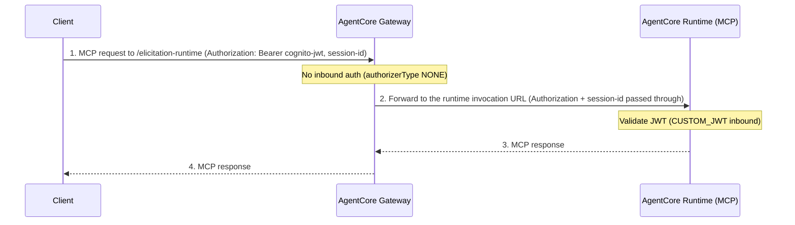

# MCP Server on AgentCore Runtime through the Gateway

Front an MCP server hosted on Amazon Bedrock AgentCore Runtime through the gateway as an `http.passthrough` target with `protocolType=MCP`. The passthrough `endpoint` is the runtime's invocation URL. The gateway uses **no inbound authorization** and **JWT passthrough** for outbound: it forwards the caller's `Authorization` header (a Cognito bearer) to the runtime, whose own `CUSTOM_JWT` inbound auth validates it.

This tutorial uses the elicitation MCP server (`app/labelicitation/`) deployed on AgentCore Runtime as `elicitation_mcp_jwt`.

> [!NOTE]
> This tutorial attaches the runtime via an `http.passthrough` target pointed at the runtime invocation URL. The more conventional way to attach a runtime-hosted server is an `http.agentcoreRuntime` target (the gateway resolves the runtime by ARN). This lab intentionally demonstrates the passthrough approach on a shared no-auth gateway.

## Architecture

<!--  -->

| Component | Role |
| :-- | :-- |
| AgentCore Gateway | Fronts the runtime invocation URL as an `http.passthrough` MCP target; no inbound auth, forwards the caller's Authorization and session-id headers outbound |
| AgentCore Runtime | Hosts the elicitation MCP server (`CUSTOM_JWT` inbound); validates the forwarded Cognito bearer |
| Amazon Cognito | Issues the bearer the runtime validates |



Path-based routing forwards `{GATEWAY_URL}/{targetName}/{path}` to the runtime invocation URL.

## Tutorial details

| Item | Value |
| :-- | :-- |
| Target type | HTTP passthrough, `protocolType=MCP` |
| Endpoint | The runtime invocation URL (captured at deploy time) |
| Inbound auth | None (`authorizerType=NONE`) |
| Outbound auth | JWT passthrough (forwards the caller's `Authorization` header) |
| Gateway | Shared no-auth `context7-gateway` (no protocol type) |
| MCP server | Elicitation MCP server (`elicitation_mcp_jwt`) on AgentCore Runtime |

> [!IMPORTANT]
> No-auth gateways accept unauthenticated requests from anyone who can reach the gateway URL. The runtime behind this target still enforces its own `CUSTOM_JWT` inbound auth, so a forwarded token is required to reach it. For the gateway itself to validate the token before forwarding, use `CUSTOM_JWT` inbound with `JWT_PASSTHROUGH` outbound instead.

## Prerequisites

- Python 3.12+
- [uv](https://docs.astral.sh/uv/getting-started/installation/) installed
- Node.js >= 22.7.5
- [AgentCore CLI](https://www.npmjs.com/package/@aws/agentcore): `npm install -g @aws/agentcore`
- [AWS CLI](https://docs.aws.amazon.com/cli/latest/userguide/getting-started-install.html) configured with credentials (`aws configure`)
- [IAM permissions](https://github.com/aws/agentcore-cli/blob/main/docs/PERMISSIONS.md)
- The shared Amazon Cognito stack from [00-optional-setup](../../../../00-optional-setup/) (the runtime validates a Cognito bearer)

## Deployment Steps

> [!IMPORTANT]
> All commands in this tutorial run from the [`gatewaylabproject/`](../../../../../gatewaylabproject/) directory. Navigate there before proceeding.

### Step 1: Deploy the elicitation MCP server on AgentCore Runtime

The MCP server code is at [`gatewaylabproject/app/labelicitation/`](../../../../../gatewaylabproject/app/labelicitation/). Register and deploy it with `CUSTOM_JWT` inbound auth, supplying the Cognito exports for the shared setup.

```bash
export COGNITO_STACK_NAME="agentcore-gateway-lab"
export DISCOVERY_URL=$(aws cloudformation describe-stacks \
  --stack-name $COGNITO_STACK_NAME \
  --query 'Stacks[0].Outputs[?OutputKey==`DiscoveryUrl`].OutputValue' --output text)
export MCP_CLIENT_ID=$(aws cloudformation describe-stacks \
  --stack-name $COGNITO_STACK_NAME \
  --query 'Stacks[0].Outputs[?OutputKey==`MCPClientId`].OutputValue' --output text)

agentcore add agent \
  --name elicitation_mcp_jwt \
  --type byo \
  --build CodeZip \
  --language Python \
  --protocol MCP \
  --code-location app/labelicitation \
  --entrypoint main.py \
  --authorizer-type CUSTOM_JWT \
  --discovery-url $DISCOVERY_URL \
  --allowed-clients $MCP_CLIENT_ID \
  --allowed-scopes api/mcp

agentcore deploy
```

Capture the runtime invocation URL:

```bash
export RUNTIME_URL=$(agentcore status --json | python3 -c "
import sys, json
data, _ = json.JSONDecoder().raw_decode(sys.stdin.read().lstrip())
print(next(r['invocationUrl'] for r in data['resources'] if r['name'] == 'elicitation_mcp_jwt'))
")

echo "Runtime URL: $RUNTIME_URL"
```

### Step 2: Create the no-auth gateway

HTTP passthrough targets attach to a gateway that has no protocol type set. This script creates a no-auth gateway (`authorizerType=NONE`), or reuses it if it already exists. The gateway is shared with the [Context7](../context7/) and [GitHub](../github/) MCP labs.

```bash
uv run python scripts/runtime-mcp-passthrough/deploy_gateway.py
```

Capture the gateway URL:

```bash
export GATEWAY_URL=$(grep GATEWAY_URL scripts/runtime-mcp-passthrough/.env | cut -d= -f2)

echo "Gateway URL: $GATEWAY_URL"
```

### Step 3: Create the passthrough target

Attach the runtime invocation URL as a passthrough target with `protocolType=MCP` and `JWT_PASSTHROUGH` outbound. The target also allowlists the runtime session-id header so it is forwarded alongside `Authorization`.

```bash
uv run python scripts/runtime-mcp-passthrough/deploy.py --endpoint "$RUNTIME_URL"
```

The script calls `create_gateway_target` with this configuration:

```json
{
  "targetConfiguration": {
    "http": {
      "passthrough": {
        "endpoint": "<RUNTIME_URL>",
        "protocolType": "MCP"
      }
    }
  },
  "credentialProviderConfigurations": [
    { "credentialProviderType": "JWT_PASSTHROUGH" }
  ],
  "metadataConfiguration": {
    "allowedRequestHeaders": [
      "X-Amzn-Bedrock-AgentCore-Runtime-Session-Id",
      "Content-Type",
      "Accept"
    ]
  }
}
```

- `protocolType: MCP` gets a default schema, so no `schema` is needed (unlike `CUSTOM`).
- `JWT_PASSTHROUGH` forwards the inbound `Authorization` header outbound unchanged. The runtime's `CUSTOM_JWT` inbound auth validates the forwarded Cognito bearer.
- AgentCore Runtime also requires the `X-Amzn-Bedrock-AgentCore-Runtime-Session-Id` header, so the target allowlists it via `metadataConfiguration`.

### Step 4: Verify

```bash
agentcore status
```

The `elicitation-runtime` target should reach `READY`.

## Demo

Call the runtime MCP server through the gateway. The runtime enforces `CUSTOM_JWT` inbound, so mint a Cognito machine-to-machine token and send it as the `Authorization` header; the gateway forwards it.

```bash
export TOKEN_ENDPOINT=$(aws cloudformation describe-stacks \
  --stack-name $COGNITO_STACK_NAME \
  --query 'Stacks[0].Outputs[?OutputKey==`TokenEndpoint`].OutputValue' --output text)
export USER_POOL_ID=$(aws cloudformation describe-stacks \
  --stack-name $COGNITO_STACK_NAME \
  --query 'Stacks[0].Outputs[?OutputKey==`UserPoolId`].OutputValue' --output text)
export MCP_CLIENT_SECRET=$(aws cognito-idp describe-user-pool-client \
  --user-pool-id $USER_POOL_ID --client-id $MCP_CLIENT_ID \
  --query 'UserPoolClient.ClientSecret' --output text)

export BEARER_TOKEN=$(curl -sS -X POST "$TOKEN_ENDPOINT" \
  -H "Content-Type: application/x-www-form-urlencoded" \
  -d "grant_type=client_credentials&client_id=$MCP_CLIENT_ID&client_secret=$MCP_CLIENT_SECRET&scope=api/mcp" \
  | python3 -c "import sys, json; print(json.load(sys.stdin)['access_token'])")

export SESSION_ID=$(python3 -c "import uuid; print((uuid.uuid4().hex + uuid.uuid4().hex)[:40])")

curl -sS -X POST "${GATEWAY_URL}/elicitation-runtime" \
  -H "Authorization: Bearer $BEARER_TOKEN" \
  -H "X-Amzn-Bedrock-AgentCore-Runtime-Session-Id: $SESSION_ID" \
  -H "Content-Type: application/json" \
  -H "Accept: application/json, text/event-stream" \
  -d '{"jsonrpc":"2.0","id":1,"method":"tools/list","params":{}}'
```

The elicitation server returns its tools (`book_room`, `cancel_with_confirm`, `log_expense`, ...).

## Cleanup

From the [`gatewaylabproject/`](../../../../../gatewaylabproject/) directory:

```bash
uv run python scripts/runtime-mcp-passthrough/cleanup.py
```

> [!NOTE]
> The `context7-gateway` is shared with the Context7 and GitHub MCP labs. Cleanup removes only this lab's `elicitation-runtime` target. It deletes the shared gateway and its IAM role only when no targets remain.

Remove the runtime:

```bash
agentcore remove agent --name elicitation_mcp_jwt -y
agentcore deploy
```

## Documentation

- [AgentCore Gateway Developer Guide](https://docs.aws.amazon.com/bedrock-agentcore/latest/devguide/gateway.html)
- [HTTP targets](https://docs.aws.amazon.com/bedrock-agentcore/latest/devguide/gateway-targets-http.html)
