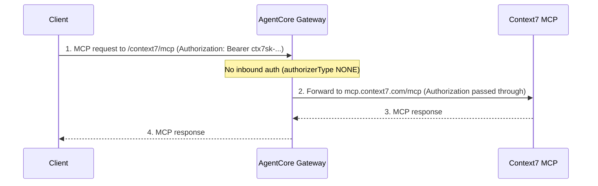

# Context7 MCP Server through the Gateway

Front the public [Context7](https://context7.com) MCP server (`https://mcp.context7.com/mcp`) through an AgentCore Gateway as an `http.passthrough` target with `protocolType=MCP`. The gateway uses **no inbound authorization** and **JWT passthrough** for outbound: it forwards the caller's `Authorization` header (the client's own Context7 API key) to Context7 unchanged.

Context7 provides up-to-date library and framework documentation as MCP tools. It works unauthenticated at a lower rate limit, or with a `ctx7sk-...` API key for higher limits.

## Architecture

<!--  -->

| Component | Role |
| :-- | :-- |
| AgentCore Gateway | Fronts `mcp.context7.com` as an `http.passthrough` MCP target; no inbound auth, forwards the caller's Authorization header outbound |
| Context7 MCP server | Public MCP server serving library documentation tools |



Path-based routing forwards `{GATEWAY_URL}/{targetName}/{path}` to `https://mcp.context7.com/{path}`.

## Tutorial details

| Item | Value |
| :-- | :-- |
| Target type | HTTP passthrough, `protocolType=MCP` |
| Endpoint | `https://mcp.context7.com/mcp` |
| Inbound auth | None (`authorizerType=NONE`) |
| Outbound auth | JWT passthrough (forwards the caller's `Authorization` header) |
| Gateway | Shared no-auth `context7-gateway` (no protocol type) |

> [!IMPORTANT]
> No-auth gateways accept unauthenticated requests from anyone who can reach the gateway URL. Use them only for public, rate-limited targets like Context7, or add your own access controls (for example, an interceptor). For a gateway that validates the inbound token before forwarding it, use `CUSTOM_JWT` inbound with `JWT_PASSTHROUGH` outbound instead.

## Prerequisites

- Python 3.12+
- [uv](https://docs.astral.sh/uv/getting-started/installation/) installed
- Node.js >= 22.7.5
- [AgentCore CLI](https://www.npmjs.com/package/@aws/agentcore): `npm install -g @aws/agentcore`
- [AWS CLI](https://docs.aws.amazon.com/cli/latest/userguide/getting-started-install.html) configured with credentials (`aws configure`)
- [IAM permissions](https://github.com/aws/agentcore-cli/blob/main/docs/PERMISSIONS.md)
- Optional: a [Context7 API key](https://context7.com/docs/howto/api-keys) (`ctx7sk-...`) for higher rate limits

## Deployment Steps

> [!IMPORTANT]
> All commands in this tutorial run from the [`gatewaylabproject/`](../../../../../gatewaylabproject/) directory. Navigate there before proceeding.

### Step 1: Create the no-auth gateway

HTTP passthrough targets attach to a gateway that has no protocol type set. This script creates a no-auth gateway (`authorizerType=NONE`), or reuses it if it already exists. The gateway is shared with the [GitHub MCP](../github/) lab.

```bash
uv run python scripts/context7-passthrough/deploy_gateway.py
```

Capture the gateway URL:

```bash
export GATEWAY_URL=$(grep GATEWAY_URL scripts/context7-passthrough/.env | cut -d= -f2)

echo "Gateway URL: $GATEWAY_URL"
```

### Step 2: Create the Context7 passthrough target

Attach `https://mcp.context7.com/mcp` as a passthrough target with `protocolType=MCP` and `JWT_PASSTHROUGH` outbound, so the caller's `Authorization` header is forwarded to Context7 unchanged.

```bash
uv run python scripts/context7-passthrough/deploy.py
```

The script calls `create_gateway_target` with this configuration:

```json
{
  "targetConfiguration": {
    "http": {
      "passthrough": {
        "endpoint": "https://mcp.context7.com/mcp",
        "protocolType": "MCP"
      }
    }
  },
  "credentialProviderConfigurations": [
    { "credentialProviderType": "JWT_PASSTHROUGH" }
  ]
}
```

- `protocolType: MCP` gets a default schema, so no `schema` is needed (unlike `CUSTOM`).
- `JWT_PASSTHROUGH` forwards the inbound `Authorization` header outbound unchanged. The gateway does not store a Context7 key; the client supplies its own. This is supported on passthrough targets with `NONE` or `CUSTOM_JWT` inbound auth.

### Step 3: Verify

```bash
agentcore status
```

The `context7` target should reach `READY`.

## Demo

Call the Context7 MCP server through the gateway. With `authorizerType=NONE`, no gateway token is needed; send your Context7 API key (optional) as the `Authorization` header, which the gateway forwards to Context7.

List the available tools:

```bash
curl -sS -X POST "${GATEWAY_URL}/context7/mcp" \
  -H "Authorization: Bearer ${CONTEXT7_API_KEY:-}" \
  -H "Content-Type: application/json" \
  -H "Accept: application/json, text/event-stream" \
  -d '{"jsonrpc":"2.0","id":1,"method":"tools/list","params":{}}'
```

Context7 exposes documentation tools such as `resolve-library-id` and `get-library-docs`. Without an API key, omit the `Authorization` header (Context7 serves unauthenticated requests at a lower rate limit).

You can also point any MCP client at `${GATEWAY_URL}/context7/mcp` with the same `Authorization` header.

## Cleanup

From the [`gatewaylabproject/`](../../../../../gatewaylabproject/) directory:

```bash
uv run python scripts/context7-passthrough/cleanup.py
```

> [!NOTE]
> The `context7-gateway` is shared with the GitHub MCP lab. Cleanup removes only this lab's `context7` target. It deletes the shared gateway and its IAM role only when no targets remain (that is, the GitHub lab has also been cleaned up).

## Documentation

- [AgentCore Gateway Developer Guide](https://docs.aws.amazon.com/bedrock-agentcore/latest/devguide/gateway.html)
- [HTTP targets](https://docs.aws.amazon.com/bedrock-agentcore/latest/devguide/gateway-targets-http.html)
- [Context7](https://context7.com)
- [Context7 API keys](https://context7.com/docs/howto/api-keys)
