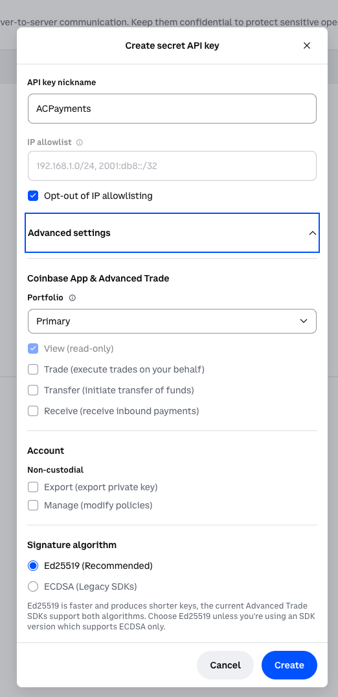
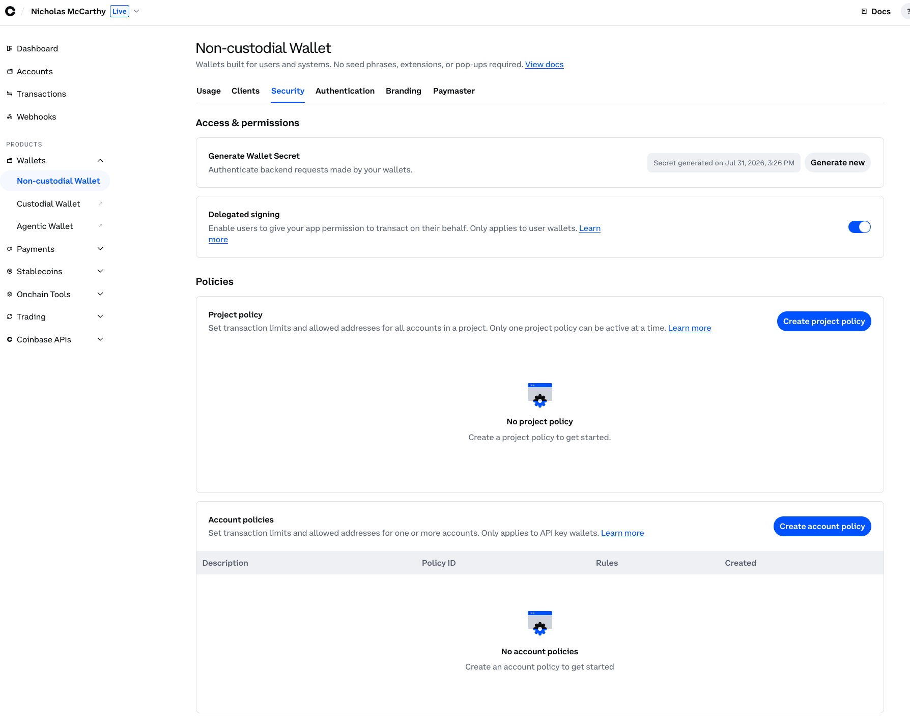
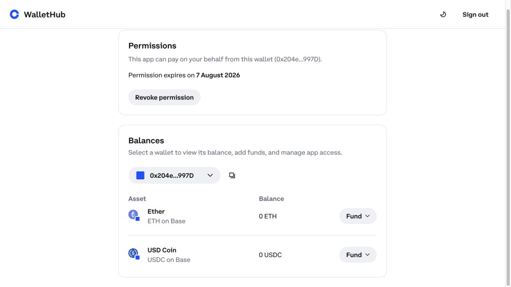
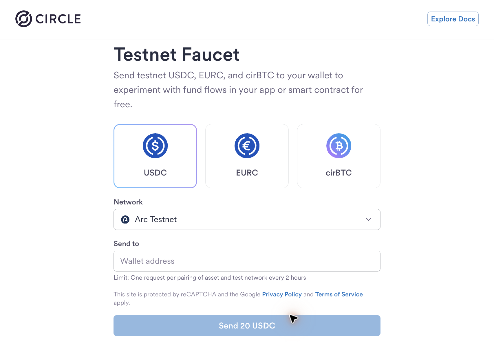
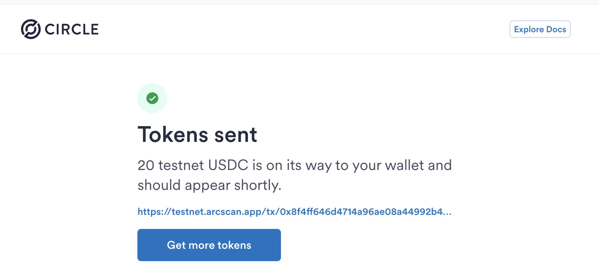

# Coinbase CDP Setup for AgentCore Payments

This guide covers the Coinbase-specific steps required by the AgentCore
Payments tutorials: creating the two project credentials, enabling delegated
signing, granting permission for one embedded wallet, funding that wallet on
Base Sepolia, and verifying the result.

Return to [Tutorial 00](../) for the provider-neutral AgentCore manager,
connector, IAM, instrument, and payment-session steps.

> This walkthrough uses testnet USDC. Testnet tokens have no monetary value,
> and no real Coinbase balance is required.

## What You Will Configure

Coinbase authorization has two separate layers:

1. **Project-level delegated signing** allows linked users to authorize wallets.
2. **Wallet-level permission** lets the AgentCore application pay from one
   specific embedded wallet for a limited period.

Both must be active. Enabling the project switch does not grant permission for
an individual wallet.

## Before You Start

- Sign in to the [Coinbase Developer Platform Portal](https://portal.cdp.coinbase.com/).
- Select the CDP project dedicated to this AgentCore demo.
- Have Coinbase 2-step verification available.
- Use a real inbox for Tutorial 00's `LINKED_EMAIL`.
- Keep downloaded credential files outside the repository.

The CDP CLI can import and validate existing credentials, but it does not
create the Secret API Key or Wallet Secret. Those two values must be generated
in the portal.

## 1. Create the Secret API Key

Open [CDP Portal -> Secret API Keys](https://portal.cdp.coinbase.com/api-keys/secret)
and choose **Create API Key**.

Use these settings:

| Setting | Demo value |
|:--|:--|
| API key nickname | `ACPayments` or another descriptive name |
| IP allowlist | **Opt-out of IP allowlisting: On** |
| Coinbase App & Advanced Trade | **View (read-only): On** |
| Trade, Transfer, Receive | Off |
| Account / Non-custodial Export and Manage | Off |
| Signature algorithm | **Ed25519 (Recommended)** |

Create a **Secret API Key**, not a Client API Key, then download its JSON file.



The AgentCore connector needs the API key ID and secret, but it does not need
trade, transfer, export, or policy-management permissions.

## 2. Generate the Wallet Secret and Enable Delegated Signing

Open
[CDP Portal -> Wallets -> Non-custodial Wallet -> Security](https://portal.cdp.coinbase.com/wallets/non-custodial/security).

1. Choose **Generate Wallet Secret** and download the one-time Wallet Secret
   file.
2. Turn **Delegated signing** on.
3. Complete Coinbase 2-step verification when prompted.
4. Leave project and account policies unset for this testnet demo.

Coinbase displays the Wallet Secret only once. Do not paste it into source
control, documentation, chat, or shell history.



The blue switch confirms that project-level delegated signing is enabled. The
empty project-policy and account-policy sections are expected for this demo.

## 3. Import the Downloaded Files Safely

From the Tutorial 00 directory, run:

```bash
npm install -g @coinbase/cdp-cli
python providers/coinbase_cdp_account_setup.py --open-portal
```

Provide the two local file paths when prompted:

- The Secret API Key JSON file
- The Wallet Secret text file

The helper parses the files locally, imports and verifies them with the official
CDP CLI, and writes the AgentCore fields to the shared gitignored `.env`. It
does not request your Coinbase password or MFA code and does not print secret
values.

Continue with [Tutorial 00 Step 2](../#step-2--provision-the-shared-stack-with-the-agentcore-cli)
to create the AgentCore payment manager and connector, then
[Step 3](../#step-3--create-the-per-user-wallet-and-session-with-the-agentcore-sdk)
to create the embedded wallet and session.

## 4. Grant Permission for the Embedded Wallet

After AgentCore creates the payment instrument, open the returned WalletHub
`redirectUrl` and sign in as the linked user.

1. Confirm that WalletHub shows the expected wallet.
2. Choose **Grant permission**.
3. Select an expiry. Use **7 days** for a short demo and revoke it sooner when
   testing is complete.



WalletHub should state that the app can pay from the wallet, show the expiry,
and provide **Revoke permission**. If this step is missing, `ProcessPayment`
returns:

```text
Delegated signing grant is not active for the end user wallet.
```

## 5. Fund Base Sepolia

Open the [Circle testnet faucet](https://faucet.circle.com/), select **USDC**,
choose **Base Sepolia**, paste the wallet address returned by AgentCore, and
send the test tokens.

The faucet can default to **Arc Testnet**. This is the wrong chain for the
Ethereum path in these tutorials:



If the success page links to `testnet.arcscan.app`, the transfer settled on Arc
and did not fund Base Sepolia:



Do not wait for an Arc transfer to appear on Base Sepolia. The chains maintain
independent balances; submit a new faucet request with **Base Sepolia**
selected.

WalletHub's **USDC on Base** card reports Base mainnet and can remain at zero
while the Base Sepolia test wallet is correctly funded.

## 6. Verify the Testnet Balance

Use the AgentCore SDK as the authoritative check:

```python
import os

from bedrock_agentcore.payments import PaymentManager

manager = PaymentManager(
    payment_manager_arn=os.environ["PAYMENT_MANAGER_ARN"],
    region_name=os.environ["AWS_REGION"],
)

balance = manager.get_payment_instrument_balance(
    payment_connector_id=os.environ["PAYMENT_CONNECTOR_ID"],
    payment_instrument_id=os.environ["INSTRUMENT_ID"],
    chain="BASE_SEPOLIA",
    token="USDC",
    user_id=os.environ["USER_ID"],
)

micro_usdc = int(balance["tokenBalance"]["amount"])
print(f"{micro_usdc / 1_000_000:.3f} USDC on Base Sepolia")
```

You can also inspect
`https://sepolia.basescan.org/address/<WALLET_ADDRESS>`.

## 7. Run the Paid Smoke Test

With a fresh payment session and the paid-research sample installed:

```bash
AWS_PROFILE=<your-profile> paid-research-e2e --payment
```

A successful run shows:

- Bedrock-hosted OpenAI model delegation passed
- HTTP 402 with an x402 v2 challenge
- Payment generated on the first attempt
- Paid retry returned HTTP 200

The verified walkthrough spent `0.002` testnet USDC per paid request.

## Troubleshooting

| Error or symptom | Cause | Fix |
|:--|:--|:--|
| `Delegated signing is not enabled for your Coinbase project` | Project-level CDP switch is off | Complete [Step 2](#2-generate-the-wallet-secret-and-enable-delegated-signing) and Coinbase 2FA |
| `Delegated signing grant is not active for the end user wallet` | Wallet-specific consent is missing | Open the instrument's WalletHub `redirectUrl` and complete [Step 4](#4-grant-permission-for-the-embedded-wallet) |
| WalletHub shows `0 USDC` after funding | WalletHub displays Base mainnet, or the faucet used Arc Testnet | Select Base Sepolia and verify with the SDK in [Step 6](#6-verify-the-testnet-balance) |
| `Wallet does not have a USDC balance` | The correct wallet has no USDC on the merchant's chain | Fund the instrument address with Base Sepolia USDC |
| Payment session expired | Sessions are time bounded | Create a fresh session before rerunning the paid test |

## Security and Cleanup

- Never commit the Secret API Key JSON, Wallet Secret, `.env`, or
  `agentcore/.env.local`.
- Prefer a dedicated CDP project for the demo.
- Use the shortest practical WalletHub permission period.
- Revoke WalletHub permission when testing is complete.
- Let short-lived payment sessions expire or delete them explicitly.
- Follow [Tutorial 00 cleanup](../#clean-up) to remove AgentCore resources.
