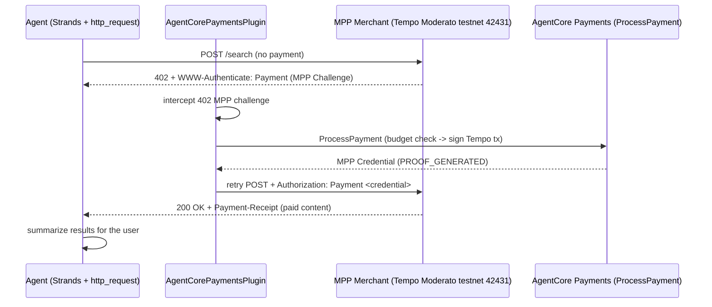

# Diagrams -- Tutorial 08 (MPP)

Source definitions for the architecture images referenced in the README.
Render these to PNG and save alongside as `strands_mpp_flow.png`.

> **Rendering note:** the committed `strands_mpp_flow.png` was rendered from the mermaid
> source below. If you have the mermaid CLI (`mmdc`), re-render for visual consistency with
> the rest of the repo:
> ```bash
> mmdc -i diagrams.md -o strands_mpp_flow.png -b white -s 2
> ```
> (Extract the ```mermaid block first, or use your repo's standard diagram toolchain.)

## strands_mpp_flow.png


