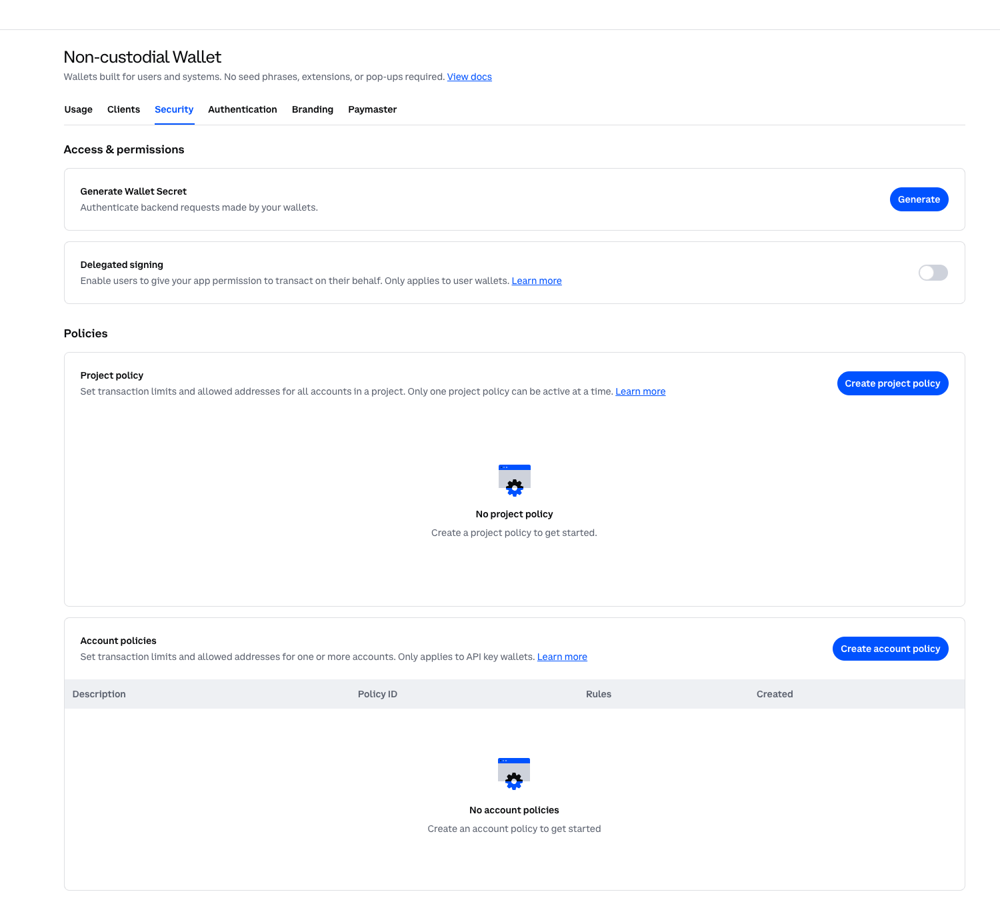

# Budget-Bounded Multi-Agent Research with AgentCore and OpenAI

## Introduction

This sample pairs the OpenAI Agents SDK with Amazon Bedrock AgentCore Payments
(preview) to build a three-agent financial research workflow that can buy
x402-protected evidence without giving every agent payment authority.

The research lead delegates free-source discovery to a public evidence analyst.
Only when that work leaves a material gap can it call a premium evidence
analyst. The application binds that specialist to one exact merchant URL, and
AgentCore enforces the payment session's maximum spend and expiry outside every
model.

> This is an educational testnet sample, not investment advice. AgentCore
> Payments is in preview; verify APIs, regions, pricing, and model availability
> before publication or production use.

## Architecture

<p align="center">
  
</p>

The sample uses the OpenAI Agents SDK manager pattern: the lead retains the
conversation and final answer while specialists are exposed through
`Agent.as_tool()`.

| Agent | Responsibility | Capabilities |
|---|---|---|
| Research lead | Plans delegation and synthesizes the cited brief | Public and premium specialists as tools |
| Public evidence analyst | Searches free sources and identifies residual gaps | OpenAI hosted web search, when supported |
| Premium evidence analyst | Acquires one approved source and reports remaining budget | Bound x402 fetch and read-only session status |

The lead and public analyst have no payment function tool. If the application
does not supply a premium URL, it omits the premium specialist from the lead's
tool list entirely.

## Control Boundaries

| Question | Control |
|---|---|
| What public evidence is available? | Public evidence analyst |
| Is a remaining evidence gap material? | Research lead |
| Which agent can spend? | Premium evidence analyst only |
| Which merchant may be called? | Application-bound URL plus exact host allowlist |
| May a person approve the purchase? | Optional nested Agents SDK tool approval |
| How much and for how long? | AgentCore payment session budget and TTL |
| Who may raise a budget vs. spend it? | Separate application and payment execution roles |
| What happened across agents and payment? | OpenAI traces plus AgentCore CloudWatch/X-Ray telemetry |

## Prerequisites

- Python 3.10+
- OpenAI API key, or AWS credentials that can generate a short-lived Amazon
  Bedrock API key for a Bedrock-hosted OpenAI model
- AgentCore CLI `0.20.0` or later
- AWS credentials in a supported preview region
- An AgentCore Payment Manager, connector, active instrument, and delegated
  testnet wallet

Complete [Tutorial 00](../00-setup-agentcore-payments/) first, or use the
official
[AgentCore Payments skill](https://github.com/aws/agent-toolkit-for-aws/blob/main/plugins/aws-agents/skills/agents-build/references/payments.md).
Do not put provider credentials in this repository. The skill's interactive
connector wizard writes provider secrets to `agentcore/.env.local` before
deploying them to AgentCore Identity, so keep that file gitignored.

## Install

```bash
python -m venv .venv
source .venv/bin/activate
pip install -e '.[dev]'
cp .env.example .env
```

Populate `.env` with the resource IDs printed by your AgentCore setup. Use an
exact merchant host in `PAID_RESEARCH_ALLOWED_HOSTS`.

## Create a Per-Run Session

The application backend, not the agent, creates the financial boundary:

```bash
python scripts/create_payment_session.py --budget 0.25 --expiry-minutes 60
export PAYMENT_SESSION_ID=<printed-session-id>
```

AgentCore supports session expiry values from 15 to 480 minutes. The helper
uses a fresh idempotency token and creates a USD-denominated maximum spend.

## Usage

```bash
paid-research \
  "Assess the material near-term drivers and risks for AMZN" \
  --paid-url https://x402-test.genesisblock.ai/api/market-news
```

For human review before each paid tool call:

```bash
paid-research \
  "Assess the material near-term drivers and risks for AMZN" \
  --paid-url https://x402-test.genesisblock.ai/api/market-news \
  --require-payment-approval
```

The default model is `gpt-5.6-sol`, resolved from current OpenAI guidance on
July 30, 2026. Set `OPENAI_MODEL` to preserve your own model-selection policy.

### Bedrock-hosted OpenAI model

The sample can also obtain a short-lived Bedrock bearer token from the active
AWS credential chain and configure the OpenAI Agents SDK for the Bedrock
Responses API:

```bash
export AWS_PROFILE=mccartni-codex
export AWS_REGION=us-east-1
export BEDROCK_OPENAI_ENABLED=true
export BEDROCK_OPENAI_REGION=us-east-1
export BEDROCK_OPENAI_MODEL=openai.gpt-5.5
```

The Bedrock Responses endpoint currently rejects the `filters` field emitted by
the Agents SDK hosted web-search tool, so this mode disables hosted web search
for the public evidence analyst by default. The manager and premium specialist
still run. Set
`BEDROCK_OPENAI_WEB_SEARCH_ENABLED=true` only after confirming the endpoint
supports the current Agents SDK schema.

## Sample Prompts

```text
Assess the material near-term drivers and risks for AMZN. Use premium evidence
only when public sources leave a material gap.
```

```text
Compare the latest public and premium evidence on a company's revenue outlook.
Separate direct evidence from inference and include a paid-data ledger.
```

```text
Produce the best supported brief possible within the current session budget.
If a purchase is rejected, disclose the remaining evidence gap.
```

## Test the Hard Limit

Create a session with a cap below the endpoint price:

```bash
python scripts/create_payment_session.py --budget 0.01 --expiry-minutes 15
```

The research lead may still delegate the gap and the premium specialist may
still request the bound source, but AgentCore rejects a payment that would
exceed the session limit. This is the important property: prompt injection
cannot edit an infrastructure-enforced budget.

## Verify

```bash
pytest
ruff check .
paid-research-e2e
```

Offline tests cover the three-agent topology, payment-tool isolation, removal
of the premium specialist when no URL is approved, the free path, x402 v2
header handoff, bounded retries with a stable idempotency token, merchant
allowlisting, private-address blocking, and budget-status redaction.

`paid-research-e2e` makes a live model call, verifies lead-to-public-specialist
delegation, and checks that the configured merchant returns an x402 challenge.
Add `--payment` only with a funded, delegated testnet instrument and a fresh
payment session; that path spends testnet USDC.

For the Coinbase path, first run Tutorial 00's file-based onboarding helper:

```bash
cd ../00-setup-agentcore-payments
npm install -g @coinbase/cdp-cli
python providers/coinbase_cdp_account_setup.py --open-portal
python setup_agentcore_payments.py
```

Coinbase requires two portal actions to establish project root trust: create and
download the Secret API Key, then generate and download the Wallet Secret. The
helper securely imports and verifies those files; it does not request a Coinbase
password, MFA code, or pasted secret. After AgentCore prints the embedded-wallet
address and WalletHub URL, fund the address with free Base Sepolia USDC and grant
delegated signing. No real funds are needed.

At the Circle faucet, explicitly select **Base Sepolia**. The faucet can default
to Arc Testnet, whose successful transaction will not fund this sample. Also,
WalletHub's **USDC on Base** card is a Base-mainnet balance; verify the testnet
balance with Tutorial 00's AgentCore SDK check. See
[If WalletHub still shows zero](../00-setup-agentcore-payments/#if-wallethub-still-shows-zero)
for screenshots and diagnosis.

For the two manual portal actions:

1. Go to [CDP Portal → Secret API Keys](https://portal.cdp.coinbase.com/api-keys/secret),
   select the demo project, choose **Create API Key**, and download the JSON file.
   Use a Secret API Key, not a Client API Key. For this demo, turn on
   **Opt-out of IP allowlisting**, keep only **View (read-only)**, leave Trade,
   Transfer, Receive, Export, and Manage off, and keep **Ed25519 (Recommended)**.
2. Go to
   [CDP Portal → Wallets → Non-custodial Wallet → Security](https://portal.cdp.coinbase.com/wallets/non-custodial/security),
   choose **Generate Wallet Secret**, download the one-time Wallet Secret file,
   and turn **Delegated signing** on. No project or account policy is needed.
3. Give the helper the two local file paths. Never paste their contents into the
   repository, documentation, chat, or shell history.

The project toggle enables delegated signing. Consent is still granted later
for the specific AgentCore-created embedded wallet through its returned
WalletHub `redirectUrl`.




The second screenshot shows the delegated-signing switch before it is enabled.
Turn it **on** before continuing; leave project and account policies unset.

The guided notebook is at
[`notebooks/agentcore_openai_paid_research.ipynb`](notebooks/agentcore_openai_paid_research.ipynb).

## Clean Up

This tutorial creates only short-lived payment sessions. Delete an individual
session with the AgentCore Payments API when it is no longer needed, or let it
expire. To remove the shared Payment Manager, connector, instrument, and IAM
roles created by Tutorial 00, follow its
[cleanup instructions](../00-setup-agentcore-payments/#cleanup).
