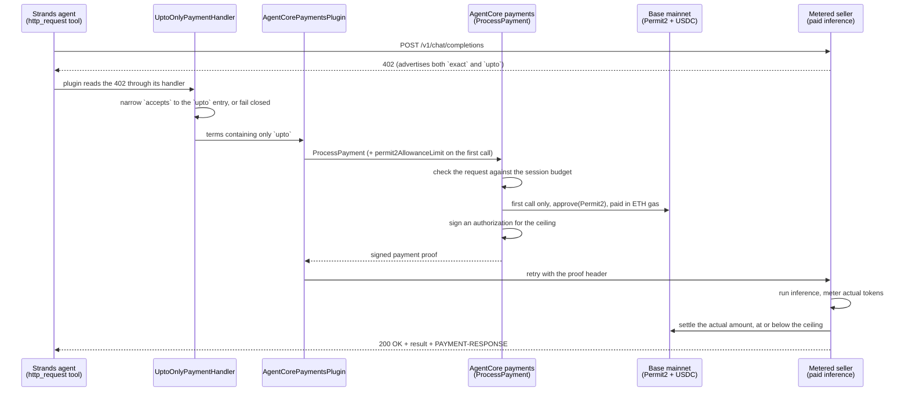

# Tutorial 09 — Pay Per Use with the x402 `upto` Scheme

> **Real funds on mainnet.** This tutorial runs on Base mainnet and transfers **real USDC** from the
> wallet connected to your payment instrument, at approximately **$0.003 per call**. On-chain
> settlement is final and cannot be reversed.
>
> The script refuses to run until you opt in explicitly:
>
> ```bash
> UPTO_ALLOW_MAINNET=1 python upto_payment_agent.py
> ```
>
> Fund the wallet with only what you intend to spend, keep the session limit (`maxSpendAmount`) at the
> default `$0.05` or lower, and complete [Tutorial 01](../01-agents-payments-and-limits/) on testnet
> first to validate your setup.

| Information         | Details                                                                    |
|:--------------------|:---------------------------------------------------------------------------|
| Tutorial type       | Conversational                                                             |
| Agent type          | Single, payment-enabled                                                    |
| Agentic Framework   | Strands Agents                                                             |
| LLM model           | Anthropic Claude Sonnet 4.6 (`us.anthropic.claude-sonnet-4-6`)             |
| Components          | `PaymentManager`, `AgentCorePaymentsPlugin`, x402 `upto` scheme, Permit2, sessions |
| SDK requirement     | `bedrock-agentcore>=1.22.0` (the release that adds `upto`)                  |
| Example complexity  | Intermediate                                                               |

> **Reads** the shared `.env` from Tutorial 00 (`PAYMENT_MANAGER_ARN`, `USER_ID`, `INSTRUMENT_ID`).
> **Does** run a local Strands agent that buys metered inference from an x402 `upto` seller, granting
> the one-time Permit2 approval on its first payment and omitting it afterwards.
> → [How the pieces fit together](../README.md#cli-vs-sdk)

## Overview

Every other tutorial here pays a fixed price: the seller declares $0.01 and the agent pays $0.01. That
is the x402 `exact` scheme, and it applies when the price is known before the work is done.

Metered sellers do not meet that condition. An inference endpoint cannot quote a price in advance
because the cost depends on tokens generated, so a fixed price means either overcharging and refunding,
or estimating. The `upto` scheme removes the estimate:

| | `exact` | `upto` |
|---|---|---|
| Amount in the 402 | the price | a **ceiling**, the maximum for this request |
| Buyer authorizes | the price | that ceiling |
| Seller settles | the same amount | the **actual amount consumed** |
| Asset transfer | EIP-3009 | Permit2 |
| Wallet setup | none | one-time on-chain approval |

**Amazon Bedrock AgentCore payments supports both schemes, and `AgentCorePaymentsPlugin` pays either
one for you** — it intercepts the 402, calls `ProcessPayment`, and retries with the proof, exactly as in
[Tutorial 01](../01-agents-payments-and-limits/). All the `upto`-specific signing happens server-side
inside `ProcessPayment`.

This tutorial has the buyer **state which scheme it is willing to pay with**. The seller used here
advertises `exact` *and* `upto` at the same price on the same network, and without an explicit choice the
run would silently pay with `exact`. See [Pinning the scheme](#pinning-the-scheme).

The payment manager, connector, IAM roles, and funded wallet are already provisioned by
[Tutorial 00](../00-setup-agentcore-payments/). The `upto` scheme needs no additional infrastructure and
no AgentCore CLI configuration, because the scheme and the Permit2 approval are per-request data-plane
concerns.

In the 402 itself, the ceiling arrives as `amount` under x402 v2 and `maxAmountRequired` under v1. Your
code passes the seller's payload through unchanged, so either works.

> **Billable resources.** Each call is metered by AgentCore payments and spends USDC from your wallet.
> See [AgentCore pricing](https://aws.amazon.com/bedrock/agentcore/pricing/) and [Cost](#cost).

> **Third-party services.** This tutorial integrates with Coinbase Developer Platform (CDP) or
> Stripe (Privy) for wallets, the Uniswap Permit2 contract, and a third-party inference endpoint. AWS
> does not control these services and makes no representation about their availability, pricing, or
> terms of use.

> **Supported regions:** `us-east-1`, `us-west-2`, `eu-central-1`, `ap-southeast-2`.

## Cost

| Cost | Charged by | Amount |
|---|---|---|
| AgentCore payments metering | AWS | See [AgentCore pricing](https://aws.amazon.com/bedrock/agentcore/pricing/) |
| Bedrock inference for the agent | AWS | Per-token, see [Bedrock pricing](https://aws.amazon.com/bedrock/pricing/) |
| Metered inference from the seller | Third-party seller | ~$0.003 USDC per call, from your wallet |
| One-time Permit2 approval | Base network gas fee | A fraction of a cent in ETH, from your wallet |

The USDC and ETH amounts are paid from your wallet. They are **not** AWS charges and do not appear on
your AWS bill. The default run makes two paid calls.

## Architecture



The proof header is `PAYMENT-SIGNATURE` for x402 v2, which this seller uses, and `X-PAYMENT` for v1; the
plugin reads the version from the 402 and picks the right one.

## Pinning the scheme

A seller may advertise several ways to pay, and the order is not meaningful. This one returns:

```
accepts[0]  scheme=exact  amount=3301  network=eip155:8453   (fixed price)
accepts[1]  scheme=upto   amount=3301  network=eip155:8453   (ceiling for this request)
```

The plugin selects an entry by **network** (`network_preferences_config`) and has no scheme preference.
Both entries share `eip155:8453`, so no network preference can separate them and the plugin resolves to
`accepts[0]` — `exact`. `ProcessPayment` then forwards `permit2AllowanceLimit` only when the resolved
scheme is `upto`, so the allowance is silently dropped too. The result is a run that appears to succeed
while demonstrating the wrong scheme.

A **payment handler** is the plugin's seam between a tool's raw 402 and
`PaymentManager.generate_payment_header`: whatever it returns is what the plugin selects from. Narrowing
`accepts` there expresses the scheme preference the config has no field for, and leaves budget check,
signing, and retry inside the plugin:

```python
from bedrock_agentcore.payments.integrations import handlers

class UptoOnlyPaymentHandler(handlers.HttpRequestPaymentHandler):
    """Only ever let the plugin see `upto` terms."""

    def extract_headers(self, result):   # x402 v2: base64 PAYMENT-REQUIRED header
        ...

    def extract_body(self, result):      # x402 v1: payload in the body
        ...

handlers.PAYMENT_HANDLERS["http_request"] = UptoOnlyPaymentHandler()
```

Both extraction points are narrowed because either can carry the terms, and the SDK prefers the header
whenever it is present.

Two details worth knowing if you adapt this:

- **It fails closed.** If a seller stops offering `upto`, the script exits instead of falling back to
  `exact`.
- **The plugin config's `custom_handlers` field does not apply here.** As of SDK 1.22.0 only the
  LangGraph middleware consults it; the Strands plugin resolves handlers from the
  `handlers.PAYMENT_HANDLERS` tool-name registry, which is why the example registers there.

When a seller offers a single scheme, none of this is needed — Tutorial 01's plain plugin setup is
enough.

## What `upto` changes

### 1. A session limits authorization, not settlement

A payment session limits what AgentCore payments will **sign for**. It does not track what settles
on-chain. `status: PROOF_GENERATED` is the moment the session is debited the authorized ceiling;
settlement is the seller's subsequent action.

| | Amount |
|---|---|
| Seller's declared ceiling | `$0.003303` |
| Debited from the session | `$0.003303` |
| Settled on-chain | `$0.003001` |
| Left in your wallet | `$0.000302` |
| Returned to the session | `$0.000000` |

If **signing itself fails** after a deduction, AgentCore payments rolls it back, so a failed payment
consumes no budget. Successful authorization followed by lower settlement is not a failure and is not
rolled back.

So a session budget can be consumed faster than your actual spend suggests. Size `maxSpendAmount` as
`ceiling × expected calls`, not as expected spend. The script prints the remaining budget at each step.

### 2. A new wallet needs one on-chain approval, and it costs gas

The `upto` scheme transfers funds through Permit2, Uniswap's token approval contract, because the
settled amount is unknown when the buyer signs. Permit2 can move only tokens the owner has already
approved it to spend, so the wallet needs a one-time `ERC20.approve(Permit2)` per wallet, asset, and
chain. Your agent does not call Permit2 directly.

Set `permit2_allowance_limit` on the **first** payment from a new instrument, and `ProcessPayment`
submits the approval before it signs:

```python
AgentCorePaymentsPluginConfig(
    ...,
    permit2_allowance_limit="1000000",  # 1 USDC at 6 decimals — the cap Permit2 may ever transfer
)
```

That approval is an on-chain transaction, so it costs a gas fee in **native token** (ETH on Base) from
the wallet's own balance. Every other tutorial in this series works with a USDC-only wallet.

**Omit the field on every later payment,** because `approve` *sets* the allowance rather than adding to
it. Passing it again is not rejected, but it submits a second transaction that overwrites the allowance
and charges another gas fee, and lowers the allowance if the new value is smaller. Setting it on an
`exact` payment returns a `ValidationException`.

| | First payment from a wallet | Every payment after |
|---|---|---|
| `permit2_allowance_limit` | set it | omit it |
| On-chain approval | submitted | already in place |
| ETH required | yes, for the gas fee | no |
| USDC required | yes | yes |

The approval is granted **per wallet**, so a `.env` holding two wallet providers pays the gas fee once
per wallet — see [Choosing which wallet pays](#choosing-which-wallet-pays).

This applies to re-running the tutorial. Step 5 grants the approval by default, assuming a wallet that
has never paid with `upto`. Re-run against the same wallet with the approval skipped:

```bash
UPTO_ALLOW_MAINNET=1 UPTO_GRANT_PERMIT2_ALLOWANCE=0 python upto_payment_agent.py
```

An unlimited allowance is possible by passing the maximum `uint256` value as a string, but a bounded
value is safer: the allowance is the outer bound on what Permit2 can ever move from that wallet.

## Prerequisites

- **Tutorial 00 completed** — the shared `.env` one directory up must contain `PAYMENT_MANAGER_ARN`,
  `USER_ID`, and `INSTRUMENT_ID`. The `upto` scheme works with either wallet provider, Coinbase CDP or
  Stripe (Privy), and needs no new payment manager or connector.
- **Delegated signing granted** for the wallet (Tutorial 00, Step 4). The end user must authorize the
  agent to transact on their behalf before any payment can be signed.
- **USDC on Base mainnet** above the seller's declared ceiling. There is no mainnet faucet, so transfer
  USDC to the wallet address (`manager.get_payment_instrument(...)` returns it).
- **A few cents of ETH on Base mainnet** for the one-time Permit2 approval.
- **Python 3.10+** and AWS credentials configured (`aws sts get-caller-identity`).
- **Python dependencies** — pinned to exact versions. `upto` needs `bedrock-agentcore>=1.22.0`, the
  release that adds the plugin's `permit2_allowance_limit` field; the script exits with an explicit
  message rather than a `TypeError` if an older SDK is installed:
  ```bash
  pip install -r requirements.txt
  ```
- **AgentCore CLI (optional)** — only for the inspect step. Install a pinned version rather than letting
  `npm` resolve whatever is newest (Node.js 20+):
  ```bash
  npm install -g @aws/agentcore@0.27.0
  ```

## Walkthrough

### Step 1 — Confirm Tutorial 00 populated the shared `.env`

```bash
grep -E 'PAYMENT_MANAGER_ARN|INSTRUMENT_ID|USER_ID' ../.env
```

If any is missing, run [Tutorial 00](../00-setup-agentcore-payments/) again.

### Step 2 — Run the agent

```bash
UPTO_ALLOW_MAINNET=1 python upto_payment_agent.py
```

The agent reads the seller's 402 (costs nothing and signs nothing), pins the scheme, and makes two
payments from the same wallet and session: one that grants the Permit2 approval and one that does not.

```
── Step 2: What the seller is asking for ──
   HTTP 402 — the seller declares 2 way(s) to pay:
     accepts[0]  scheme=exact  amount=3301     network=eip155:8453  (fixed price)
     accepts[1]  scheme=upto   amount=3301     network=eip155:8453  (ceiling for this request)

   This seller lists 'exact' first and 'upto' second, both on the same network. The plugin
   selects by network only, so the handler below narrows the terms to the 'upto' entry
   before the plugin chooses.

── Step 3: Scheme pinned to 'upto' via UptoOnlyPaymentHandler ──

── Step 5: First `upto` payment ── budget {'value': '0.05', 'currency': 'USD'}
   ... authorized 3301 atomic ($0.003301) · settled 3001 atomic ($0.003001) · 98 tokens

Budget after payment 1: {'value': '0.046699', 'currency': 'USD'}
Debited at the ceiling that was signed for, not at the amount the seller settled.
```

The budget dropped by the ceiling, though less than that settled.

### Step 3 — Confirm the session limit denies an over-budget payment (optional)

Enforcement is deterministic and runs at the infrastructure layer, so prompt injection cannot raise the
limit. Set a budget below the seller's ceiling:

```bash
UPTO_ALLOW_MAINNET=1 UPTO_SESSION_BUDGET=0.0001 python upto_payment_agent.py
```

### Step 4 — Verify the settlement on-chain (optional)

`upto` is the one scheme where authorized and settled amounts differ. Follow
[Inspect / verify](#inspect--verify) to compare the ceiling the session was charged against the transfer
that actually landed.

> **Deploying to AgentCore Runtime.** This script is a local walkthrough, not a Runtime entrypoint — it
> runs top to bottom and prints, rather than exposing a handler for Runtime to invoke.
> [Tutorial 02](../02-deploy-to-agentcore-runtime/) covers deployment with a purpose-built entrypoint;
> the `upto` specifics here (the handler registration and `permit2_allowance_limit`) carry over
> unchanged. If you do deploy a payment agent, attach payment data-plane permissions to the auto-created
> execution role — the CLI does not add them. Grant `ProcessPayment`, `GetPaymentInstrument`, and
> `GetPaymentSession` scoped to your payment manager, and **not** `CreatePaymentSession`.

## Choosing which wallet pays

`load_tutorial_env()` resolves a single `instrument_id` from `CREDENTIAL_PROVIDER_TYPE`, so a
single-provider `.env` needs no configuration. A `.env` provisioned for both wallet providers (see
[Tutorial 07](../07-multi-agent-payment-orchestrator/)) also carries one instrument per provider, and
`UPTO_PROVIDER` picks the payer:

```bash
UPTO_ALLOW_MAINNET=1 UPTO_PROVIDER=coinbase     python upto_payment_agent.py
UPTO_ALLOW_MAINNET=1 UPTO_PROVIDER=stripe_privy python upto_payment_agent.py
```

The script prints which wallet it is paying from, and exits listing the configured providers if
`UPTO_PROVIDER` names one that is not in the `.env`.

This matters more for `upto` than for `exact`, because the Permit2 approval is granted per wallet: each
provider's wallet pays its own one-time `approve` gas fee before it can settle `upto`. Switching
providers means `UPTO_GRANT_PERMIT2_ALLOWANCE=0` is wrong again until that wallet's approval lands.

## Switching sellers

The `SELLERS` dictionary holds one entry per endpoint, and `.env` selects which runs:

```bash
UPTO_ALLOW_MAINNET=1                 # required: opt in to spending real USDC on mainnet
UPTO_SELLER=surplus                  # key from the SELLERS dictionary (default)
UPTO_SELLER_MODEL=                   # optional: override the model id
UPTO_PROVIDER=                       # optional: coinbase | stripe_privy, for a multi-provider .env
UPTO_SESSION_BUDGET=0.05             # optional: authorization limit in USD
UPTO_PERMIT2_ALLOWANCE_LIMIT=1000000 # optional: one-time Permit2 cap, smallest denomination
UPTO_GRANT_PERMIT2_ALLOWANCE=1       # optional: set to 0 on an already-approved wallet
```

To use an endpoint that is not in the dictionary:

```bash
UPTO_SELLER_URL=https://your-seller.example.com/v1/chat/completions
UPTO_SELLER_MODEL=your-model-id
```

The URL must be `https`; the script validates the scheme before making any request. The system prompt
also forbids the agent from following free-trial or alternative URLs a seller returns in the 402 body,
since the plugin, not the model, decides what gets signed. Metered endpoints are also discoverable
through the Coinbase x402 Bazaar MCP server, which
[Tutorial 04](../04-agent-with-coinbase-bazaar-via-gateway/) fronts with an AgentCore Gateway.

Any replacement seller must advertise `upto`. If it does not, the script exits at Step 2 with the list of
schemes it did offer rather than paying under a scheme you did not choose.

Model ids change. A stale id returns `404 no_sellers_for_model` **after** payment verification, which
resembles a payment failure but is not one:

```bash
curl -s https://api.surplusintelligence.ai/v1/models | jq -r '.data[].id'
```

An `upto` entry also carries `extra.facilitatorAddress`: the buyer binds its authorization to that
facilitator, a field an `exact` 402 does not have.

## What the agent does

| Scenario | How to run it | What it shows |
|----------|---------------|---------------|
| Read the declared terms | Default run, Step 2 | The amount in an `upto` 402 is a ceiling |
| Pin the scheme | Default run, Steps 2–3 | The handler narrows a two-scheme 402 to `upto` |
| Refuse a seller without `upto` | Point `UPTO_SELLER_URL` at an `exact`-only endpoint | Fails closed instead of paying with `exact` |
| First payment from a wallet | Default run, Step 5 | `permit2_allowance_limit` triggers the on-chain approval |
| Every later payment | Default run, Step 6 | The same code without the field; no approval, no gas fee |
| Authorization vs settlement | Default run, budget printed each step | Budget drops by the ceiling, not the settlement |
| Over-budget payment denied | `UPTO_SESSION_BUDGET=0.0001` | Infrastructure-layer enforcement, before signing |
| A different wallet provider | `UPTO_PROVIDER=stripe_privy` | Per-wallet Permit2 approval |
| A different seller | Set `UPTO_SELLER_URL` | No code change; the plugin reads the terms from the 402 |
| Budget-aware tools | Default run, Step 7 | Plugin tools `get_payment_session`, `get_payment_instrument` |

The declared `amount` is a ceiling, not a price. Reading it as a price is the most common error with
`upto`.

## Inspect / verify

```bash
# Live view of managers, connectors, and payment status (requires the AgentCore CLI), run from the
# Tutorial 00 project dir because `status --type payment` reads a scaffolded project's config:
cd ../00-setup-agentcore-payments/PaymentSetup && agentcore status --type payment
```

Read the session's remaining authorization limit, which is what the script prints between steps:

```python
sess = manager.get_payment_session(user_id=USER_ID, payment_session_id=SESSION_ID)
print(sess["availableLimits"]["availableSpendAmount"])  # drops by the ceiling, not the settlement
```

Check the wallet's USDC balance on Base **mainnet** (`chain="BASE"`, not `BASE_SEPOLIA`):

```python
bal = manager.get_payment_instrument_balance(
    payment_connector_id=PAYMENT_CONNECTOR_ID,
    payment_instrument_id=INSTRUMENT_ID,
    chain="BASE",
    token="USDC",
    user_id=USER_ID,
)
print(bal["tokenBalance"]["amount"] / 1_000_000, "USDC")  # micro-USDC → USDC
```

To confirm what moved, take the transaction hash from the seller's `PAYMENT-RESPONSE` header and look it
up on [BaseScan](https://basescan.org/). The transfer amount there is the settled amount; comparing it
against the ceiling the session was charged is the clearest way to see `upto` working. On a wallet's
first payment you also see the separate `approve` transaction and the ETH that paid its gas fee.

## Troubleshooting

| Symptom | Cause | Fix |
|---|---|---|
| The script exits saying it settles real USDC | The mainnet opt-in is missing — by design | Re-run with `UPTO_ALLOW_MAINNET=1` once you accept the cost |
| `load_tutorial_env()` raises `FileNotFoundError`, or `PaymentManager` fails on a `None` ARN | Tutorial 00 did not finish — `../.env` has no resource IDs | Run Tutorial 00 again |
| `Fail closed: seller offers ['exact'], not 'upto'` | The seller no longer advertises `upto` | Use a seller that does, or run Tutorial 01 for the `exact` flow |
| `UPTO_PROVIDER=... is not configured in .env` | That wallet provider was never provisioned | Use one of the providers listed in the error, or omit `UPTO_PROVIDER` |
| The run settles `exact` instead of `upto` | The handler registration was removed or the tool is not named `http_request` | Register the handler under the tool name the agent actually calls |
| The agent receives a 402 but the payment fails | Delegated signing was never granted | Coinbase CDP: enable Delegated Signing in CDP Portal → Wallets → Embedded Wallet → Policies. Stripe (Privy): open the Privy reference frontend at `http://localhost:3000`, sign in as `LINKED_EMAIL`, choose **Connect agent** |
| The payment fails on a wallet's first `upto` call, or the approval never lands | `approve(Permit2)` could not be submitted — the wallet holds USDC but no ETH for the gas fee | Send a few cents of ETH on Base and re-run. Required once per wallet, asset, and chain |
| A Permit2-allowance precondition error | The wallet has no approval and the allowance field was omitted | Leave `UPTO_GRANT_PERMIT2_ALLOWANCE` at its default of `1` |
| An unexpected second `approve` and gas fee | The tutorial was re-run against an already-approved wallet. `approve` overwrites rather than adds | Re-run with `UPTO_GRANT_PERMIT2_ALLOWANCE=0` |
| `ValidationException` mentioning the allowance | The field was set on a payment that resolved to `exact` | Omit it for `exact`; it applies to `upto` only |
| `TypeError: unexpected keyword argument 'permit2_allowance_limit'`, or the script exits saying the SDK lacks the field | The installed `bedrock-agentcore` predates 1.22.0 | `pip install -r requirements.txt`, or set `UPTO_GRANT_PERMIT2_ALLOWANCE=0` for an already-approved wallet |
| The budget is exceeded immediately | The session limit is below the declared ceiling, or the wallet holds less USDC than the ceiling | Raise `UPTO_SESSION_BUDGET`, or add USDC |
| The budget is consumed faster than expected | Sessions are charged the authorized ceiling; settlement is not tracked | Expected. Size as `ceiling × expected calls` |
| `404 no_sellers_for_model` **after** a successful payment | The model id is not in the seller's catalog — a seller error, not a payment error | Set `UPTO_SELLER_MODEL` to a current id |
| The settled amount equals the ceiling | Not an error — the request consumed enough tokens to reach it | Nothing to fix |
| `agentcore: command not found` | The CLI is not installed (only needed for the inspect step) | `npm install -g @aws/agentcore@0.27.0` |

## Clean Up

Running the agent locally provisions nothing durable. Payment **sessions expire automatically** at
`expiryTimeInMinutes`, after which nothing further can be authorized against them. To stop
authorizations sooner, delete the session, or delete the payment instrument to prevent any further
payment from that wallet. Neither reverses transactions that already settled.

The Permit2 approval stays on-chain by design; that is what makes later payments gas-free. Revoking it
means sending your own `approve(Permit2, 0)` transaction.

The shared manager, connector, and instrument are removed in Tutorial 00's Clean Up, which deletes the
per-user instrument with the SDK first.

## Next steps

- **[Tutorial 03](../03-user-onboarding-wallet-funding/)** — per-user wallet onboarding, funding,
  delegation, and balance checks. `upto` needs both USDC and the ETH that the `approve(Permit2)` gas
  fee is paid in.
- **[Tutorial 07](../07-multi-agent-payment-orchestrator/)** — multiple agents, separate wallets,
  per-agent budgets. The Permit2 approval is per wallet, so each one grants it on its first payment.
- **[Tutorial 02](../02-deploy-to-agentcore-runtime/)** — deploy this agent to AgentCore Runtime with
  role separation using the AgentCore CLI.
- **[Tutorial 04](../04-agent-with-coinbase-bazaar-via-gateway/)** — discover and call paid MCP tools
  on Coinbase Bazaar through an AgentCore Gateway.
