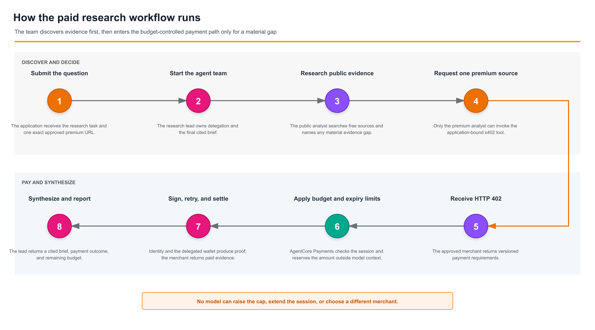

# Pay for Research with an OpenAI Agent

| Information | Details |
|:---|:---|
| Use case type | Budget-bounded purchase of premium research |
| Agent type | Multi-agent (research lead + 2 specialists, agents-as-tools) |
| Hosting | Local Python application using AWS credentials |
| Framework | OpenAI Agents SDK |
| LLM model | OpenAI models on Amazon Bedrock (`openai.gpt-5.5`) |
| Payment protocol | x402 (HTTP 402 Payment Required) |
| AgentCore components | AgentCore Payments, AgentCore Identity |
| Complexity | Advanced |

## Overview

This sample uses the OpenAI Agents SDK with OpenAI models on Amazon Bedrock and
AgentCore Payments to build a three-agent financial research workflow that can
buy x402-protected evidence without giving every agent payment authority.

The research lead delegates free-source discovery to a public evidence analyst.
Only when that work leaves a material gap can it call a premium evidence
analyst. The application binds that specialist to one exact merchant URL, and
AgentCore enforces the payment session's maximum spend and expiry outside every
model.

> This is an educational testnet sample, not investment advice. Verify service
> availability, pricing, and model access before production use.

## Architecture

<p align="center">
  
</p>

*Figure 1 - Application, AWS Cloud, and approved external-service boundaries.*

The sample uses the OpenAI Agents SDK manager pattern: the lead retains the
conversation and final answer while specialists are exposed through
`Agent.as_tool()`.

### Why this sample uses a small framework adapter

AgentCore Payments currently provides framework-native integrations for
[Strands (plugin) and LangGraph (middleware)][framework-integrations]. It does
not provide a native plugin for the OpenAI Agents SDK, so this sample follows
the documented framework-agnostic path: it registers a small OpenAI
`function_tool` adapter.

This adapter does not reimplement payment processing. It reuses
`PaymentManager.generate_payment_header`, which validates the 402 challenge,
selects the network, calls `ProcessPayment`, and creates the version-aware x402
proof header. The local code only exposes that capability as an OpenAI function
tool, applies the sample's exact-URL and public-address policy, and performs a
cookie-free, no-redirect request with bounded retries.

[framework-integrations]: https://docs.aws.amazon.com/bedrock-agentcore/latest/devguide/payments-framework-integrations.html

<p align="center">
  
</p>

*Figure 2 - Public evidence comes first; the payment path begins only for a
material gap.*

| Agent | Responsibility | Capabilities |
|---|---|---|
| Research lead | Plans delegation and synthesizes the cited brief | Public and premium specialists as tools |
| Public evidence analyst | Analyzes public evidence and identifies residual gaps | OpenAI hosted web search, when supported |
| Premium evidence analyst | Acquires one approved source and reports remaining budget | Bound x402 fetch and read-only session status |

The lead and public analyst have no payment function tool. If the application
does not supply a premium URL, it omits the premium specialist from the lead's
tool list entirely.

## Control Boundaries

| Question | Control |
|---|---|
| What public evidence is available? | Public evidence analyst |
| Is a remaining evidence gap material? | Research lead |
| Which agent can spend? | Premium evidence analyst only |
| Which merchant may be called? | Application-bound URL plus exact host allowlist |
| May a person approve the purchase? | Optional nested Agents SDK tool approval |
| How much and for how long? | AgentCore payment session budget and TTL |
| Who may raise a budget vs. spend it? | Separate application and payment execution roles |
| What happened across agents and payment? | Agent run output plus AgentCore telemetry |

## Prerequisites

- Python 3.10+
- Node.js 20+ if you need to install or run the AgentCore CLI
- AWS CLI v2 configured with an active AWS credential profile
- AgentCore CLI `0.20.0` or later if you need to provision payment resources
- AWS credentials that can invoke the configured OpenAI models on Amazon Bedrock
- An AgentCore Payment Manager, connector, active instrument, and delegated
  testnet wallet configured with a supported wallet provider

Complete the
[AgentCore Payments setup](../../00-getting-started/00-setup-agentcore-payments/)
first, or use the
official
[AgentCore Payments skill](https://github.com/aws/agent-toolkit-for-aws/blob/main/plugins/aws-agents/skills/agents-build/references/payments.md).
Choose a supported wallet provider and follow the
[shared wallet-provider setup guide](../../00-getting-started/00-setup-agentcore-payments/providers/)
for provider-specific credentials, delegation, and testnet funding.
Do not put provider credentials in this repository. The skill's interactive
connector wizard writes provider secrets to `agentcore/.env.local` before
deploying them to AgentCore Identity, so keep that file gitignored.

## Running the Use Case

This is a local Python use case. It reuses the Payment Manager, connector,
instrument, and delegated wallet created by the shared setup; it does not deploy
another AgentCore Runtime.

### Step 1: Create the environment

From the repository root:

```bash
cd 01-features/08-agents-that-transact/02-use-cases/pay-for-research-with-openai-agent
python3.12 -m venv .venv  # Python 3.10 or 3.11 also works
source .venv/bin/activate
python -m pip install -r requirements.txt
```

### Step 2: Check AWS and AgentCore access

```bash
export AWS_PROFILE=<your-profile>
export AWS_REGION=us-east-1
aws --version              # AWS CLI v2
aws sts get-caller-identity
agentcore --version        # 0.20.0 or later; needed only for provisioning
```

The live smoke test in Step 4 is the quickest way to confirm that the selected
profile can invoke `openai.gpt-5.5` through Amazon Bedrock.

### Step 3: Configure the sample

```bash
cp .env.sample .env
```

Populate `.env` with the data-plane identifiers from the shared AgentCore
Payments setup:

| This sample | Shared setup output |
|---|---|
| `PAYMENT_MANAGER_ARN` | `PAYMENT_MANAGER_ARN` |
| `PAYMENT_INSTRUMENT_ID` | `INSTRUMENT_ID` |
| `PAYMENT_USER_ID` | `USER_ID` |
| `PAYMENT_SESSION_ID` | Leave blank until Step 5 |

`PAID_RESEARCH_ALLOWED_HOSTS` must contain the exact hostname from
`PAID_RESEARCH_URL`. Do not copy wallet-provider credentials into this sample.
The OpenAI Agents SDK uses a short-lived Bedrock bearer token from the active
AWS credential chain; no OpenAI API key is required.

### Step 4: Run the offline and no-payment checks

Install the test-only dependencies and run the complete offline suite:

```bash
python -m pip install -r test/requirements.txt
python -m pytest -q test/unit
python -m ruff check .
python -m ruff format --check .
python -m pip check
python test/run_notebook.py
```

Then run the live model and merchant-challenge smoke test:

```bash
python e2e.py
```

This command invokes OpenAI models on Amazon Bedrock, verifies
lead-to-public-specialist delegation, and confirms that the configured merchant
returns an x402 v2 `402 Payment Required` challenge. It does not make an
AgentCore payment, although standard model-invocation charges may apply. The
JSON report shows `"payment": {"status": "skipped", ...}`.

### Step 5: Create a per-run payment session

The application backend, not the agent, creates the financial boundary:

```bash
python create_payment_session.py --budget 0.25 --expiry-minutes 60
export PAYMENT_SESSION_ID=<printed-session-id>
```

AgentCore supports session expiry values from 15 to 480 minutes. The helper
uses a fresh idempotency token and creates a USD-denominated maximum spend.

### Step 6: Run the complete research workflow

```bash
python pay_for_research.py \
  "Assess the material near-term drivers and risks for AMZN" \
  --paid-url https://x402-test.genesisblock.ai/api/market-news
```

The lead calls the public specialist first. If a material evidence gap remains,
it delegates to the premium specialist, which alone can use the bound payment
tool. A successful paid run returns the final cited brief and a paid-data
ledger containing the payment outcome and remaining session budget.

To require human review before the premium specialist spends:

```bash
python pay_for_research.py \
  "Assess the material near-term drivers and risks for AMZN" \
  --paid-url https://x402-test.genesisblock.ai/api/market-news \
  --require-payment-approval
```

### Step 7: Run the deterministic paid E2E check

```bash
python create_payment_session.py --budget 0.25 --expiry-minutes 60
export PAYMENT_SESSION_ID=<printed-session-id>
python e2e.py --payment
```

This uses a fresh capped session and spends testnet USDC. Success requires all
three report sections to show `"status": "passed"`: model delegation, merchant
challenge, and payment. The payment section must also show
`"payment_made": true` and `"status_code": 200`.

## Model and Web Search Configuration

The sample obtains a short-lived Bedrock bearer token from the active AWS
credential chain and configures the OpenAI Agents SDK for the Bedrock Responses
API. Defaults are in `.env.sample`.

The Bedrock Responses endpoint currently rejects the `filters` field emitted by
the Agents SDK hosted web-search tool, so the sample disables hosted web search
by default. The manager and premium specialist still run. Set
`BEDROCK_OPENAI_WEB_SEARCH_ENABLED=true` only after confirming the endpoint
supports the current Agents SDK schema.

## Sample Prompts

```text
Assess the material near-term drivers and risks for AMZN. Use premium evidence
only when public sources leave a material gap.
```

```text
Compare the latest public and premium evidence on a company's revenue outlook.
Separate direct evidence from inference and include a paid-data ledger.
```

```text
Produce the best supported brief possible within the current session budget.
If a purchase is rejected, disclose the remaining evidence gap.
```

## Test the Hard Limit

Create a session with a cap below the endpoint price:

```bash
python create_payment_session.py --budget 0.01 --expiry-minutes 15
```

The research lead may still delegate the gap and the premium specialist may
still request the bound source, but AgentCore rejects a payment that would
exceed the session limit. This is the important property: prompt injection
cannot edit an infrastructure-enforced budget.

## What the Checks Cover

The offline suite covers the three-agent topology, payment-tool isolation,
removal of the premium specialist when no URL is approved, the free path, x402
v2 header handoff, bounded retries with a stable idempotency token, merchant
allowlisting, private-address blocking, budget-status redaction, and offline
execution of every notebook cell.

Before running the live payment command, complete the
[shared wallet-provider setup guide](../../00-getting-started/00-setup-agentcore-payments/providers/).
Follow the instructions for your selected provider to configure credentials,
complete end-user delegation, and fund the testnet wallet.

### Verified live output

On August 26, 2026, `python e2e.py --payment` completed against the default
financial-research test merchant with OpenAI models on Amazon Bedrock and
AgentCore Payments:

```json
{
  "model": {
    "provider": "bedrock",
    "model": "openai.gpt-5.5",
    "delegated_tools": "research_public_evidence",
    "status": "passed"
  },
  "merchant_challenge": {
    "status_code": 402,
    "x402_version": 2,
    "status": "passed"
  },
  "payment": {
    "payment_attempts": 1,
    "payment_made": true,
    "status_code": 200,
    "status": "passed"
  }
}
```

The settlement spent `0.002` testnet USDC. A separate
`python pay_for_research.py` run also completed the full lead → public
specialist → premium specialist → paid tool → final ledger path, with one
payment attempt and the remaining session budget reported.

The guided notebook is at
[`notebooks/pay_for_research.ipynb`](notebooks/pay_for_research.ipynb).

## Clean Up

This tutorial creates only short-lived payment sessions. Delete an individual
session with the AgentCore Payments API when it is no longer needed, or let it
expire. To remove the shared Payment Manager, connector, instrument, and IAM
roles created by the shared setup, follow its
[cleanup instructions](../../00-getting-started/00-setup-agentcore-payments/#cleanup).
