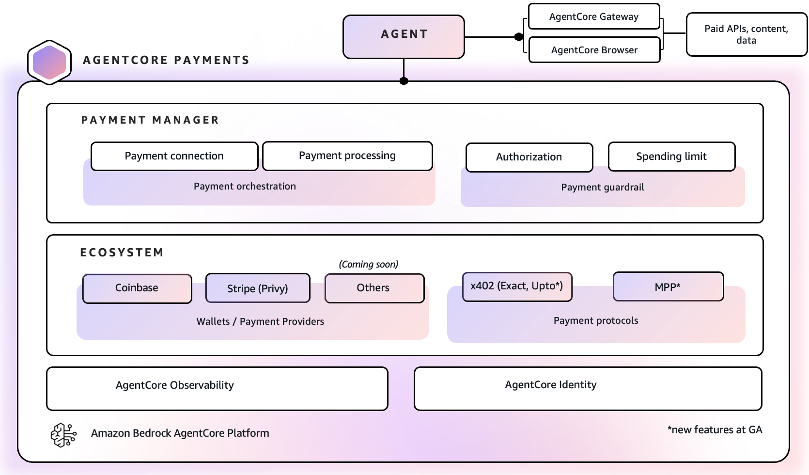

# Agents That Transact — Amazon Bedrock AgentCore payments

Amazon Bedrock AgentCore payments is a fully managed service that enables microtransaction payments in AI agents to access paid APIs, MCP servers, and content. AI agents increasingly handle complex tasks by calling APIs, accessing MCP servers, and interacting with other agents. As more services monetize through pay-per-use models, developers face challenges integrating payments into agentic workflows. Transactions are typically microtransactions (often under $1 or fractions of a cent), making traditional payment methods cost-prohibitive due to high minimum transaction fees. Meanwhile, content providers and publishers are introducing paywalls for AI agents to access their content. AgentCore payments provides a suite of developer-friendly capabilities that help you develop solutions to enable secure, instant payments to paid services using stablecoin, open protocols like x402 and MPP for cost-effective microtransactions, and configurable guardrails to help control agent spending. This can reduce developer effort from months to days.




**AgentCore payments is generally available**

Learn more about the latest features in this [blog post](https://aws.amazon.com/blogs/machine-learning/amazon-bedrock-agentcore-payments-is-now-generally-available-enabling-agents-to-transact-safely-and-autonomously-at-scale/).

> **Testnet by default.** Tutorials 00–07 use test networks. Tutorial 08 supports
> Tempo testnet and optional mainnet merchants; Tutorial 09 runs on Base mainnet.
> Mainnet paths transfer real funds—read each tutorial's warning before opting in.

## Start here

New? There are various ways to get started with [AgentCore payments](https://docs.aws.amazon.com/bedrock-agentcore/latest/devguide/payments-getting-started.html).

 Begin with [`00-getting-started/00-setup-agentcore-payments/`](00-getting-started/00-setup-agentcore-payments/) to create IAM roles and the payment stack that all other tutorials depend on.

## Top-level layout

| Folder | What's inside |
|--------|---------------|
| [`00-getting-started/`](00-getting-started/) | Ten step-by-step tutorials covering setup, local and deployed agents, wallet operations, x402, MPP, and metered payments |
| [`01-payments-skills-and-cli/`](01-payments-skills-and-cli/) | Add AgentCore x402 payments to an agent via the `aws-agents` coding-assistant plugin (existing agent, new agent, or OpenClaw — no coding assistant) |
| [`02-use-cases/`](02-use-cases/) | Real-world end-to-end payment flows for local and AgentCore Runtime-hosted agents |

## How this tree is organized

Tutorials in `00-getting-started/` build on each other — start with Tutorial 00
which provisions the payment stack, then run any of 01–09 in the order that
fits your use case. `01-payments-skills-and-cli/` is a coding-assistant-driven
path that adds payments to an agent for you. `02-use-cases/` contains complete
end-to-end payment flows for local and AgentCore Runtime-hosted agents.

## Finding things

- **Payment stack setup** → `00-getting-started/00-setup-agentcore-payments/`
- **Strands agent with automatic payments** → `00-getting-started/01-agents-payments-and-limits/strands_payment_agent.py`
- **LangGraph agent with payments** → `00-getting-started/01-agents-payments-and-limits/langgraph_payment_agent.py`
- **Deploy payment agent to runtime** → `00-getting-started/02-deploy-to-agentcore-runtime/`
- **Wallet lifecycle (fund, delegate, balance)** → `00-getting-started/03-user-onboarding-wallet-funding/`
- **Discover paid tools via gateway** → `00-getting-started/04-agent-with-coinbase-bazaar-via-gateway/`
- **Browser + payment pattern** → `00-getting-started/05-agent-with-browser-tool-pay-for-content/`
- **Memory-aware agent (skip redundant paid calls)** → `00-getting-started/06-research-agent-with-payment-memory/`
- **Multi-agent with per-agent budgets** → `00-getting-started/07-multi-agent-payment-orchestrator/`
- **Machine Payments Protocol (MPP)** → `00-getting-started/08-mpp-machine-payments-protocol/`
- **Metered x402 `upto` payments** → `00-getting-started/09-pay-per-use-with-upto/`
- **Add payments to an existing agent (coding assistant)** → `01-payments-skills-and-cli/add-to-existing-agent/`
- **Scaffold a new agent that can transact (coding assistant)** → `01-payments-skills-and-cli/build-new-agent-that-can-transact/`
- **OpenClaw agent with payments (no coding assistant)** → `01-payments-skills-and-cli/converse-with-openclaw-agent/`
- **End-to-end browser paywall use case** → `02-use-cases/pay-for-content-browser-use/`
- **Pay for a metered HTTP API** → `02-use-cases/pay-for-api-agent/`
- **Pay for data with a pre-payment trust gate (x402-secure)** → `02-use-cases/pay-for-x402-secure-data/`
- **Pay for data (simple x402 flow)** → `02-use-cases/pay-for-data/`
- **Pay for premium research with an OpenAI agent** → `02-use-cases/pay-for-research-with-openai-agent/`

## Resources

- [AgentCore payments documentation](https://docs.aws.amazon.com/bedrock-agentcore/latest/devguide/payments.html)
- [Launch blog post](https://aws.amazon.com/blogs/machine-learning/agents-that-transact-introducing-amazon-bedrock-agentcore-payments-built-with-coinbase-and-stripe/)
- [Coinbase announcement](https://www.coinbase.com/en-ca/blog/introducing-amazon-bedrock-agentcore-payments-powered-by-x402-and-coinbase)
- [Stripe announcement](https://stripe.com/newsroom/news/aws-stripe-agentcore-privy)
- [Technical Deep Dive blog](https://aws.amazon.com/blogs/machine-learning/technical-deep-dive-agentcore-payments-and-innovation-in-agentic-commerce/)

## Prerequisites

- Python 3.10+
- AWS CLI configured (`aws sts get-caller-identity` to verify)
- AWS account with access to AgentCore payments
- Wallet provider credentials — Coinbase CDP or Stripe (Privy) — see `00-getting-started/00-setup-agentcore-payments/providers/`

## Running the Python Scripts

```bash
pip install -r 00-getting-started/00-setup-agentcore-payments/requirements.txt

# Tutorial 00 — one-time payment stack setup
python 00-getting-started/00-setup-agentcore-payments/setup_agentcore_payments.py

# Tutorial 01 — Strands agent with automatic payments
python 00-getting-started/01-agents-payments-and-limits/strands_payment_agent.py

# Tutorial 01 — LangGraph agent with payments
python 00-getting-started/01-agents-payments-and-limits/langgraph_payment_agent.py
```

## Security

- Tutorials 00–07 use test networks. Tutorial 08 supports Tempo testnet and optional
  mainnet merchants; Tutorial 09 requires explicit opt-in and uses Base mainnet.
- Never commit `.env` files or private keys. Use AWS Secrets Manager for production credentials.
- Follow IAM least-privilege: separate ControlPlaneRole, ManagementRole, and ProcessPaymentRole.
- Follow [AWS shared responsibility model](https://aws.amazon.com/compliance/shared-responsibility-model/)
