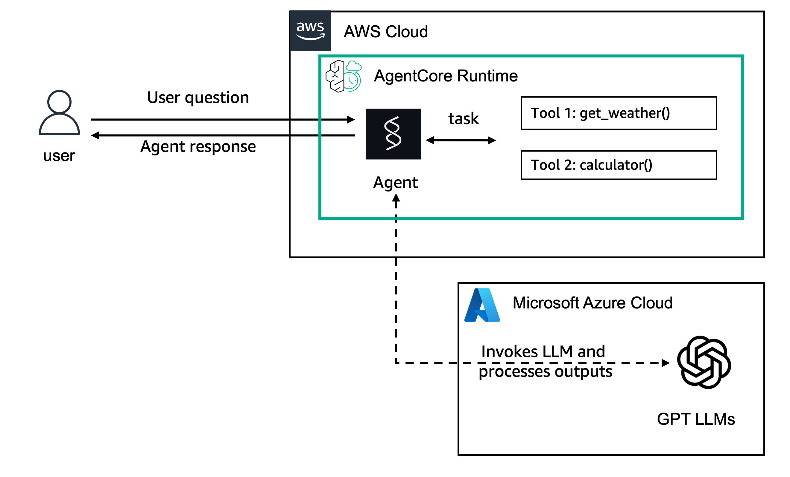

# Hosting Strands Agents with OpenAI models in Amazon Bedrock AgentCore Runtime

## Overview

In this tutorial we will learn how to host your existing agent, using Amazon Bedrock AgentCore Runtime.

We will focus on a Strands Agents with OpenAI model example. For Strands Agents with Amazon Bedrock model check [here](../01-strands-with-bedrock-model) and
for LangGraph with Amazon Bedrock model check [here](../02-langgraph-with-bedrock-model)


### Tutorial details

| Information         | Details                                                                  |
|:--------------------|:-------------------------------------------------------------------------|
| Tutorial type       | Conversational                                                           |
| Agent type          | Single                                                                   |
| Agentic Framework   | Strands Agents                                                           |
| LLM model           | GPT 4.1 mini                                                             |
| Tutorial components | Hosting agent on AgentCore Runtime. Using Strands Agent and OpenAI Model |
| Tutorial vertical   | Cross-vertical                                                           |
| Example complexity  | Easy                                                                     |
| SDK used            | Amazon BedrockAgentCore Python SDK and boto3                             |

---

## Architecture

When hosting agents, the SDK automatically:

- Hosts your agent on port `8080`
- Provides two key endpoints:
  - **`/invocations`**: Primary agent interaction (JSON input → JSON/SSE output)
  - **`/ping`**: Health check for monitoring

<div style="text-align:left">
    
</div>

AgentCore Runtime is **model-agnostic** — it can host agents using any LLM provider (Amazon Bedrock, OpenAI, Azure OpenAI, Gemini, etc.) via Strands Agents' LiteLLM integration. The lifecycle:

1. **Local experimentation** — run your agent locally with OpenAI credentials in env vars
2. **Wrap with SDK** — add `BedrockAgentCoreApp` decorator
3. **Deploy to Runtime** — package code, upload to S3, create runtime via boto3 with env var injection
4. **Invoke** — call via boto3 `invoke_agent_runtime`

---

## What's This Feature

Amazon Bedrock AgentCore Runtime is framework and model-agnostic. This tutorial demonstrates hosting a Strands agent backed by Azure OpenAI (GPT 4.1 mini), showing that you can bring your own LLM provider.

### Tutorial key Features

* Hosting Agents on Amazon Bedrock AgentCore Runtime
* Using OpenAI models (Azure OpenAI GPT 4.1 mini via LiteLLM)
* Using Strands Agents
* CodeZip deployment (no Docker required) via boto3 `create_agent_runtime`
* Session lifecycle management with `stop_runtime_session`
* Environment variable injection for API credentials

---

## CLI Commands

> **CLI version**: `agentcore@0.11.0`
>
> Install or update: `npm install -g @aws/agentcore@0.11.0`

### 1. Create a new project

```bash
agentcore create \
  --name strandsopenai \
  --framework Strands \
  --model-provider OpenAI \
  --api-key "<YOUR_OPENAI_KEY>" \
  --build CodeZip \
  --skip-git \
  --skip-install \
  --json
```

### 2. Replace the generated agent code

```bash
cp strands_agents_openai.py app/strandsopenai/main.py
cp requirements.txt app/strandsopenai/requirements.txt
```

### 3. Deploy to AgentCore Runtime

```bash
cd strandsopenai
agentcore deploy -y --json
```

### 4. Check deployment status

```bash
agentcore status --json
```

### 5. Invoke the deployed agent

```bash
agentcore invoke "What is the weather now?" --json
```

### 6. View logs

```bash
agentcore logs --since 30m -n 50
```

---

## Cleanup

**Using boto3** (from the notebook cleanup cell):

```python
import boto3
agentcore_control = boto3.client('bedrock-agentcore-control', region_name=region)
agentcore_control.delete_agent_runtime(agentRuntimeId=agent_runtime_id)
```

**Using CLI** (if deployed via `agentcore deploy`):

```bash
agentcore remove agent --name strandsopenai --json
agentcore deploy -y --json
```

Also delete the S3 deployment artifact:

```python
s3 = boto3.client('s3', region_name=region)
s3.delete_object(Bucket=bucket_name, Key=s3_key)
```
