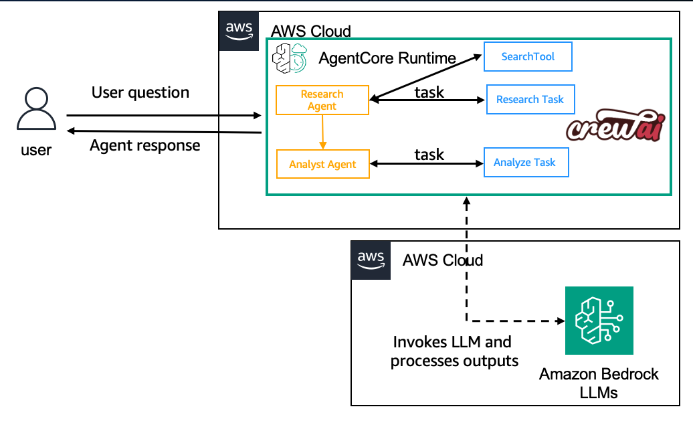

# Hosting CrewAI on Amazon Bedrock AgentCore Runtime

## Overview

In this tutorial we will learn how to host your existing CrewAI crew, using Amazon Bedrock AgentCore Runtime.

### Tutorial details

| Information | Details |
|:--------------------|:-----------------------------------------------------------------------------|
| Tutorial type | Conversational |
| Agent type | Multi-agent crew |
| Agentic Framework | CrewAI |
| LLM model | Anthropic Claude 3.5 Haiku |
| Tutorial components | Hosting agent on AgentCore Runtime. Using CrewAI and Amazon Bedrock Model |
| Tutorial vertical | Cross-vertical |
| Example complexity | Easy |
| SDK used | Amazon BedrockAgentCore Python SDK and boto3 |

### Tutorial Architecture

In this tutorial we will describe how to deploy an existing agent to AgentCore runtime.

For demonstration purposes, we will use CrewAI using Amazon Bedrock models

    

### Tutorial key Features

* Hosting Agents on Amazon Bedrock AgentCore Runtime
* Using Amazon Bedrock models
* Using CrewAI
