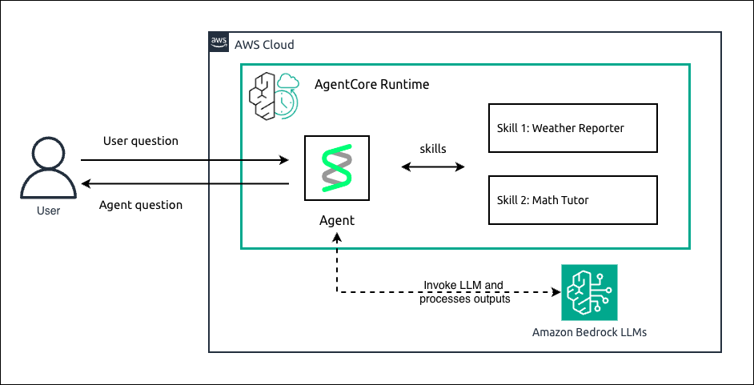

# Hosting Strands Agents with AgentSkills Plugin in Amazon Bedrock AgentCore Runtime

## Overview

In this tutorial we will learn how to host a Strands agent that uses the `AgentSkills` plugin for on-demand specialized instructions, using Amazon Bedrock AgentCore Runtime.

The `AgentSkills` plugin allows you to define reusable skills as markdown files (`SKILL.md`) with YAML frontmatter. Each skill declares its name, description, allowed tools, and behavioral instructions. The agent discovers available skills at runtime and activates the appropriate one based on the user's request.

We will walk through creating two example skills — a **weather-reporter** skill that formats weather data with emoji, temperature ranges, and recommendations, and a **math-tutor** skill that solves math problems step-by-step showing all work. We will first experiment locally, then deploy the agent to AgentCore Runtime.

For a basic Strands agent without skills check [here](../01-strands-with-bedrock-model).

### Tutorial Details

| Information         | Details                                                                                                          |
|:--------------------|:-----------------------------------------------------------------------------------------------------------------|
| Tutorial type       | Conversational                                                                                                   |
| Agent type          | Single                                                                                                           |
| Agentic Framework   | Strands Agents                                                                                                   |
| LLM model           | Anthropic Claude Haiku 4.5                                                                                       |
| Tutorial components | Hosting agent on AgentCore Runtime. Using Strands Agent with AgentSkills plugin for on-demand skill activation   |
| Tutorial vertical   | Cross-vertical                                                                                                   |
| Example complexity  | Intermediate                                                                                                     |
| SDK used            | Amazon BedrockAgentCore Python SDK and boto3                                                                     |

---

## Architecture

<div style="text-align:left">
    
</div>

The agent uses the `AgentSkills` plugin which scans a `skills/` directory. Each skill is a folder containing a `SKILL.md` file with YAML frontmatter (`name`, `description`, `allowed-tools`) and markdown instructions. The agent selects the appropriate skill based on the user's request.

Two example skills are provided:
- **weather-reporter**: Defined as a file-based `SKILL.md`. Paired with a custom `@tool` weather function.
- **math-tutor**: Defined programmatically using the `Skill` class (no file needed). Paired with the `calculator` tool.

The deployment packages the entire project directory (agent code + `skills/` directory) as a ZIP, uploads to S3, and creates the runtime using `codeConfiguration`.

---

## What's This Feature

The `AgentSkills` plugin enables **on-demand skill activation** — the agent loads only the skill relevant to the user's current request, keeping the context window efficient. Skills can be defined as:

1. **File-based**: a `skills/<name>/SKILL.md` file with YAML frontmatter
2. **Programmatic**: a `Skill(name, description, instructions)` object inline in Python

### Tutorial Key Features

* Hosting Agents on Amazon Bedrock AgentCore Runtime
* Using the Strands `AgentSkills` plugin for on-demand specialized instructions
* Defining skills with `SKILL.md` files using YAML frontmatter
* Defining skills programmatically with the `Skill` class (no file needed)
* Mixing file-based and programmatic skills in a single agent
* Pairing skills with custom `@tool` functions and existing tools
* Local agent experimentation before deployment
* CodeZip deployment (includes `skills/` directory) via boto3 `create_agent_runtime`

---

## CLI Commands

> **CLI version**: `agentcore@0.11.0`
>
> Install or update: `npm install -g @aws/agentcore@0.11.0`

### 1. Create a new project

```bash
agentcore create \
  --name strandsskills \
  --framework Strands \
  --model-provider Bedrock \
  --build CodeZip \
  --skip-git \
  --skip-install \
  --json
```

### 2. Copy agent code and skills directory

```bash
cp agent_with_skills.py app/strandsskills/main.py
cp requirements.txt app/strandsskills/requirements.txt
cp -r skills/ app/strandsskills/skills/
```

### 3. Deploy to AgentCore Runtime

```bash
cd strandsskills
agentcore deploy -y --json
```

### 4. Check deployment status

```bash
agentcore status --json
```

### 5. Invoke the deployed agent — weather skill

```bash
agentcore invoke "What's the weather like today? Give me a full report with emoji and activity recommendations." --json
```

### 6. Invoke the deployed agent — math skill

```bash
agentcore invoke "Help me solve 23+458*89" --json
```

### 7. View logs

```bash
agentcore logs --since 30m -n 50
```

---

## Cleanup

**Using boto3** (from the notebook cleanup cell):

```python
import boto3
agentcore_control = boto3.client('bedrock-agentcore-control', region_name=REGION)
runtimes = agentcore_control.list_agent_runtimes()
agent_id = next(
    (r["agentRuntimeId"] for r in runtimes["agentRuntimes"] if r["agentRuntimeName"] == agent_name),
    None
)
if agent_id:
    agentcore_control.delete_agent_runtime(agentRuntimeId=agent_id)
```

**Using CLI** (if deployed via `agentcore deploy`):

```bash
agentcore remove agent --name strandsskills --json
agentcore deploy -y --json
```

Also delete the S3 deployment artifact:

```python
s3 = boto3.client('s3', region_name=REGION)
s3.delete_object(Bucket=bucket_name, Key=s3_key)
```
