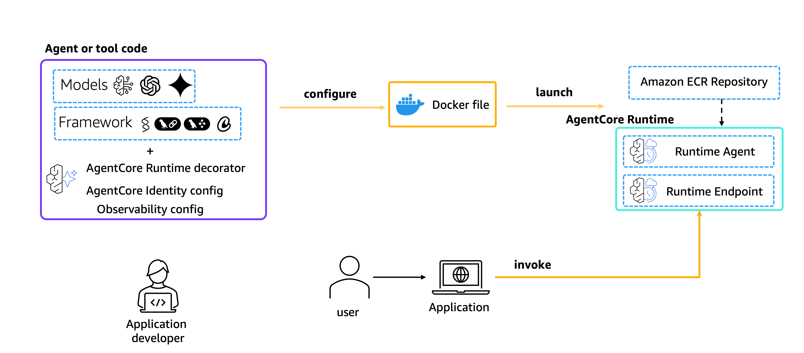

# Amazon Bedrock AgentCore Runtime

## Overview
Amazon Bedrock AgentCore Runtime is a secure, serverless runtime designed for deploying and scaling AI agents and tools.
It supports any frameworks, models, and protocols, enabling developers to transform local prototypes into production-ready solutions with minimal code changes.

Amazon BedrockAgentCore Python SDK provides a lightweight wrapper that helps you deploy your agent functions as HTTP services that are compatible with Amazon Bedrock. It handles all the HTTP server details so you can focus on your agent's core functionality.

All you need to do is decorate your function with the `@app.entrypoint` decorator and use the `create_agent_runtime` boto3 API to deploy your agent to AgentCore Runtime. Your application is then able to invoke this agent using the SDK or any of the AWS's developer tools such as boto3, AWS SDK for JavaScript or the AWS SDK for Java.



---

## Architecture

Amazon Bedrock AgentCore Runtime uses a **CodeZip deployment model**: your Python agent code is packaged as a ZIP file, uploaded to S3, and the runtime is provisioned via `create_agent_runtime`. Each invocation runs in an isolated microVM with automatic scaling.

The deployment flow:

1. Package your agent code (Python files + `requirements.txt`) as a ZIP
2. Upload the ZIP to an S3 bucket
3. Call `create_agent_runtime` with `codeConfiguration` pointing to the S3 artifact
4. Wait for `READY` status via `get_agent_runtime`
5. Invoke via `invoke_agent_runtime`

```
Your Agent Code
      │
      ▼ (ZIP + S3 upload)
   S3 Bucket
      │
      ▼ create_agent_runtime (CodeZip)
AgentCore Runtime (CREATING → READY)
      │
      ▼ invoke_agent_runtime
   Response
```

---

## What's This Feature

### Key Features

#### Framework and Model Flexibility

- Deploy agents and tools from any framework (such as Strands Agents, LangChain, LangGraph, CrewAI)
- Using any model (in Amazon Bedrock or not)

#### Integration

Amazon Bedrock AgentCore Runtime integrates with other Amazon Bedrock AgentCore capabilities through a unified SDK, including:

- Amazon Bedrock AgentCore Memory
- Amazon Bedrock AgentCore Gateway
- Amazon Bedrock AgentCore Observability
- Amazon Bedrock AgentCore Tools

This integration aims to simplify the development process and provide a comprehensive platform for building, deploying, and managing AI agents.

#### Use Cases

The runtime is suitable for a wide range of applications, including:

- Real-time, interactive AI agents
- Long-running, complex AI workflows
- Multi-modal AI processing (text, image, audio, video)

---

## CLI Commands

> **CLI version**: `agentcore@0.11.0`
>
> Install or update: `npm install -g @aws/agentcore@0.11.0`

The `agentcore` CLI provides an end-to-end workflow for creating, deploying, and managing AgentCore Runtime projects using CDK + CodeZip.

### Create a new runtime project

```bash
agentcore create \
  --name myagent \
  --framework Strands \
  --model-provider Bedrock \
  --build CodeZip \
  --skip-git --skip-install \
  --json
```

### Deploy the runtime

```bash
cd myagent
agentcore deploy -y --json
```

### Check deployment status

```bash
agentcore status --json
```

### Invoke the deployed agent

```bash
agentcore invoke "Hello, what can you do?" --json
```

### Stream real-time logs

```bash
agentcore logs --since 1h -n 50
```

---

## Tutorials overview

In these tutorials we will cover the following functionality:

- [Hosting agents](01-hosting-agent)
- [Hosting MCP Servers](02-hosting-MCP-server)
- [Advanced Concepts](03-advanced-concepts)

---

## Cleanup

**Using boto3** (recommended):

```python
import boto3

region = boto3.session.Session().region_name
agentcore_control = boto3.client('bedrock-agentcore-control', region_name=region)

# Delete the runtime
agentcore_control.delete_agent_runtime(agentRuntimeId=agent_runtime_id)

# Delete S3 deployment artifact
s3 = boto3.client('s3', region_name=region)
s3.delete_object(Bucket=bucket_name, Key=s3_key)
```

**Using CLI** (when deployed via `agentcore deploy`):

```bash
# Remove the agent from config and redeploy to destroy resources
agentcore remove agent --name myagent --json
agentcore deploy -y --json
```
