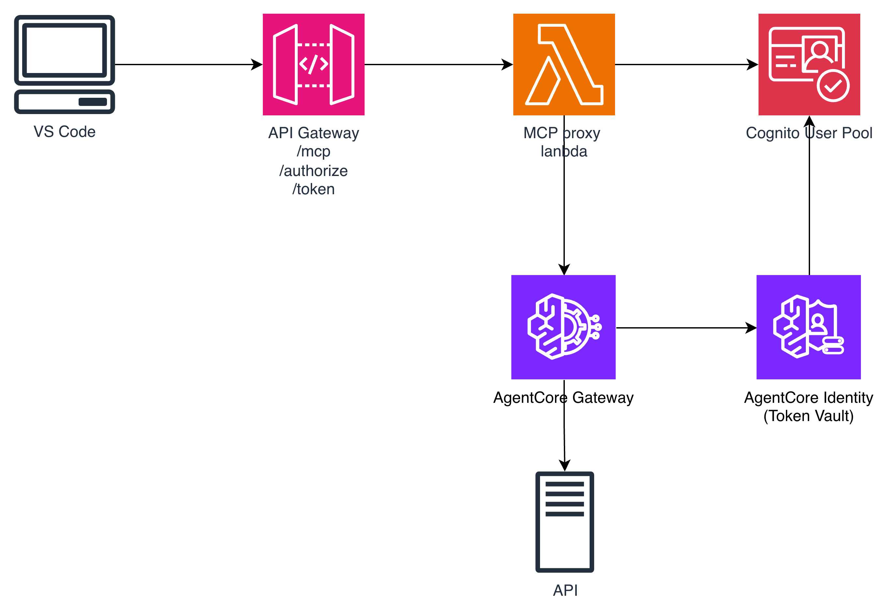

# AgentCore Gateway with CIMD OAuth Flow

## Overview

This sample demonstrates **CIMD (Client ID Metadata Document)** OAuth flow with Amazon Bedrock AgentCore Gateway, enabling **dynamic OAuth client registration** for VS Code Copilot integration. Instead of using pre-registered client IDs, CIMD uses a **URL as the client_id** that points to a JSON document describing the OAuth client configuration.

**Key Innovation**: This eliminates manual OAuth client pre-registration by allowing the authorization server to dynamically discover and register clients by fetching their metadata from a URL.

## What is CIMD?

### Traditional OAuth vs CIMD

| Aspect                    | Traditional OAuth                   | CIMD OAuth                                                       |
| ------------------------- | ----------------------------------- | ---------------------------------------------------------------- |
| **client_id**             | Static string (e.g., `"abc123xyz"`) | URL (e.g., `"https://api.example.com/.well-known/oauth-client"`) |
| **Registration**          | Manual pre-registration required    | Automatic via URL resolution                                     |
| **Configuration Updates** | Must update auth server console     | Update JSON document at URL                                      |
| **Deployment**            | Multi-step setup process            | Deploy and use immediately                                       |

### How CIMD Works

1. Client provides a URL as the `client_id` (e.g., `https://api.example.com/.well-known/oauth-client`)
2. Authorization server fetches the JSON document from that URL
3. The document contains OAuth client metadata (redirect URIs, grant types, etc.)
4. Authorization server dynamically registers or validates the client
5. OAuth flow proceeds normally

**Example CIMD Document**:

```json
{
  "redirect_uris": [
    "vscode://github.copilot/oauth/callback",
    "https://my-api.example.com/callback"
  ],
  "grant_types": ["authorization_code", "refresh_token"],
  "response_types": ["code"],
  "token_endpoint_auth_method": "none"
}
```

## Architecture

```
┌─────────────────────────┐
│  VS Code with Copilot   │
│  CIMD Client            │
│  client_id = URL        │
└───────────┬─────────────┘
            │ MCP over HTTP
            │ OAuth with CIMD
            ▼
┌─────────────────────────────────────────┐
│  AWS API Gateway + Lambda               │
│  ┌────────────────────────────────────┐ │
│  │  MCP Proxy Lambda                  │ │
│  │  • CIMD resolution                 │ │
│  │  • Dynamic Cognito client creation │ │
│  │  • OAuth metadata endpoints        │ │
│  │  • MCP forwarding                  │ │
│  └────────────────────────────────────┘ │
│  ┌────────────────────────────────────┐ │
│  │  Callback Lambda                   │ │
│  │  • 3LO OAuth callbacks             │ │
│  │  • CompleteResourceTokenAuth       │ │
│  └────────────────────────────────────┘ │
└──────┬──────────────────────┬───────────┘
       │                      │
       │ Inbound Auth         │ 3LO Callback
       ▼                      ▼
┌──────────────┐      ┌────────────────┐
│   Cognito    │      │  AgentCore     │
│  User Pool   │      │  Identity      │
└──────┬───────┘      └────────────────┘
       │ JWT
       ▼
┌─────────────────────────────────────────┐
│  Amazon Bedrock AgentCore Gateway       │
│  • MCP server                           │
│  • JWT authentication (inbound)         │
│  • 3LO OAuth (outbound to Confluence)   │
└──────────────┬──────────────────────────┘
               │ OAuth 3LO
               ▼
┌─────────────────────────────────────────┐
│  Atlassian Confluence                   │
│  • OAuth 2.0 provider                   │
│  • REST API v2                          │
└─────────────────────────────────────────┘
```

## Two OAuth Flows

This implementation uses **two distinct OAuth flows**:

### 1. Inbound Authentication (VS Code → AgentCore Gateway)

| Property           | Value                                                 |
| ------------------ | ----------------------------------------------------- |
| **Purpose**        | Authenticate VS Code user to access AgentCore Gateway |
| **OAuth Provider** | Amazon Cognito                                        |
| **Flow Type**      | Authorization Code Grant **with CIMD**                |
| **When**           | On MCP server connection                              |
| **Token Type**     | JWT (short-lived)                                     |
| **Innovation**     | Uses CIMD for dynamic client registration             |

**Flow Steps**:

1. VS Code provides CIMD URL as `client_id`
2. MCP Proxy Lambda fetches metadata from the URL
3. Lambda creates Cognito user pool client dynamically
4. User authenticates with Cognito (username/password)
5. Cognito issues JWT access token
6. VS Code includes JWT in all MCP requests

### 2. Outbound Authentication (AgentCore Gateway → Confluence)

| Property           | Value                                                       |
| ------------------ | ----------------------------------------------------------- |
| **Purpose**        | AgentCore Gateway accesses Confluence API on behalf of user |
| **OAuth Provider** | Atlassian                                                   |
| **Flow Type**      | Three-Legged OAuth (3LO)                                    |
| **When**           | First Confluence tool call                                  |
| **Token Type**     | Access + Refresh tokens (long-lived)                        |
| **Management**     | Automatic by AgentCore Identity                             |

**Flow Steps**:

1. AgentCore Gateway detects missing Confluence token
2. Returns `-32042` elicitation error with authorization URL
3. User grants consent in browser
4. Atlassian redirects to Callback Lambda
5. Lambda calls `CompleteResourceTokenAuth`
6. AgentCore caches tokens and auto-refreshes

## Key Components



### Infrastructure (CDK)

- **Amazon API Gateway (HTTP API)**: Public HTTPS endpoint for VS Code
- **MCP Proxy Lambda** ([mcp_proxy_lambda.py](lambda/mcp_proxy_lambda.py)): CIMD resolution, OAuth metadata, MCP forwarding
- **Callback Lambda** ([callback_lambda.py](lambda/callback_lambda.py)): 3LO OAuth callback handling
- **Amazon Cognito User Pool**: JWT token issuance with dynamic clients
- **Amazon Bedrock AgentCore Gateway**: MCP server with Cognito JWT auth
- **IAM Roles**: Permissions for Lambda and AgentCore Gateway

### Key Features

1. **CIMD Resolution**: Dynamically creates Cognito clients by fetching metadata from URL
2. **Stateless OAuth**: Encodes state in OAuth state parameter
3. **3LO Token Management**: Automatic token refresh by AgentCore Identity
4. **MCP Protocol 2025-11-25**: Supports URL elicitation for 3LO flows

## Prerequisites

- Python 3.10+
- Node.js 18+ (for CDK)
- AWS CLI configured with credentials
- AWS permissions for:
  - Lambda, API Gateway, Cognito, IAM
  - Bedrock AgentCore (control plane + data plane)
- Atlassian Cloud account with Confluence
- VS Code 1.107+ with GitHub Copilot (for MCP support)

## Setup

### Step 1: Create Atlassian OAuth App

1. Go to https://developer.atlassian.com/console/myapps/
2. Create → OAuth 2.0 integration
3. Under **Permissions**, add Confluence **granular scopes**:
   - `read:space:confluence`
   - `read:page:confluence`
4. Copy **Client ID** and **Client Secret**
5. Note: You'll add the callback URL after deployment (Step 2)

### Step 2: Deploy Infrastructure

Open and run the Jupyter notebook [01_vscode_agentcore_confluence_serverless_cdk.ipynb](./01_vscode_agentcore_confluence_serverless_cdk.ipynb)

The notebook will:

- Create Cognito user (username: `vscode-user`, password: `TempPassword123!`)
- Configure Atlassian credential provider for 3LO OAuth in AgentCore Identity
- Create Confluence target in AgentCore Gateway

**Important**: After creating the credential provider, copy the **AgentCore callback URL** from the notebook output and add it to your Atlassian OAuth app settings.

### Step 3: Configure VS Code

Create or update `.vscode/mcp.json` with the configuration from notebook output:

```json
{
  "servers": {
    "agentcore-confluence": {
      "type": "http",
      "url": "https://<api-gateway-id>.execute-api.<region>.amazonaws.com/mcp",
      "headers": {
        "MCP-Protocol-Version": "2025-11-25"
      }
    }
  }
}
```

**Note**: The `MCP-Protocol-Version: 2025-11-25` header is **required** for 3LO URL elicitation support.

### Step 4: Connect and Use

1. **Reload VS Code** to activate the MCP server
2. **Authenticate with Cognito** when prompted:
   - Username: `vscode-user`
   - Password: `TempPassword123!` (or your custom password)
3. **Use Confluence tools** in Copilot (e.g., "List my Confluence spaces")
4. **Grant Atlassian consent** when prompted (first tool call only)
5. **Retry the tool** after granting consent

## Files

| File                                                                                                       | Description                           |
| ---------------------------------------------------------------------------------------------------------- | ------------------------------------- | --- | ------------------------------------ |
| [01_vscode_agentcore_confluence_serverless_cdk.ipynb](01_vscode_agentcore_confluence_serverless_cdk.ipynb) | Setup notebook for CDK deployment     |     | CDK infrastructure code (TypeScript) |
| [cdk/lib/cdk-stack.ts](cdk/lib/cdk-stack.ts)                                                               | Main CDK stack definition             |
| [lambda/mcp_proxy_lambda.py](lambda/mcp_proxy_lambda.py)                                                   | MCP Proxy Lambda with CIMD resolution |
| [lambda/callback_lambda.py](lambda/callback_lambda.py)                                                     | 3LO OAuth callback handler            |
| [CIMD_OAUTH_FLOW.md](CIMD_OAUTH_FLOW.md)                                                                   | Detailed technical documentation      |

### "Cannot initiate authorization code grant flow"

**Cause**: Missing `MCP-Protocol-Version: 2025-11-25` header.

**Solution**: Add to `mcp.json`:

```json
"headers": {
  "MCP-Protocol-Version": "2025-11-25"
}
```

### "Unable to fetch client metadata from URL"

**Cause**: CIMD URL not accessible or malformed JSON.

**Solution**:

1. Check Lambda CloudWatch logs for detailed errors
2. Verify Lambda has internet access (NAT Gateway if in VPC)
3. Test URL manually: `curl https://your-cimd-url`

### "redirect_uri_mismatch" from Cognito

**Cause**: Callback URL not registered in OAuth provider.

**Solution**:

1. Ensure API Gateway callback URL is in Cognito allowed list
2. Re-run notebook to recreate resources with correct URLs

### 3LO completed but tool still fails

**Cause**: VS Code doesn't auto-retry after 3LO completion.

**Solution**: Manually retry the tool call after completing the OAuth flow in the browser.

### Lambda timeout errors

**Cause**: Lambda function timing out during MCP forwarding.

**Solution**: Increase Lambda timeout in CDK stack or AWS Console (currently 60s for proxy, 30s for callback)

## Security Considerations

### CIMD URL Validation

The current implementation fetches metadata from any URL provided as `client_id`. For production:

1. **Validate URL scheme** (only allow HTTPS)
2. **Implement domain allowlist**
3. **Set fetch timeout** (prevent long-running requests)
4. **Validate JSON structure** before parsing

Example validation:

```python
def validate_cimd_url(url):
    parsed = urllib.parse.urlparse(url)
    if parsed.scheme != 'https':
        raise ValueError("CIMD URL must use HTTPS")
    if parsed.hostname not in ALLOWED_DOMAINS:
        raise ValueError("CIMD URL must be from trusted domain")
```

### Token Storage

The Callback Lambda uses **in-memory dictionary** for token storage (not production-ready). For production:

1. Use **DynamoDB** with TTL for temporary token storage
2. Encrypt tokens at rest with **AWS KMS**
3. Implement token rotation policies

## Cleanup

Run the cleanup cell at the end of the notebook, or manually delete resources:

```python
# In notebook - Step 1b: Cleanup
# Deletes:
# - AgentCore Gateway Targets
# - Credential providers

```

Or delete the CDK stack:

```bash
cd cdk
npx cdk destroy
```

## Learn More

- [CIMD_OAUTH_FLOW.md](CIMD_OAUTH_FLOW.md) - Detailed technical documentation with flow diagrams
- [MCP Specification 2025-11-25](https://modelcontextprotocol.io/specification/2025-11-25)
- [VS Code MCP Documentation](https://code.visualstudio.com/docs/copilot/customization/mcp-servers)
- [AgentCore Gateway Documentation](https://docs.aws.amazon.com/bedrock-agentcore/)
- [OAuth 2.0 Dynamic Client Registration (RFC 7591)](https://datatracker.ietf.org/doc/html/rfc7591)
- [Atlassian OAuth 2.0 (3LO)](https://developer.atlassian.com/cloud/confluence/oauth-2-3lo-apps/)

## Benefits of CIMD

### vs Traditional OAuth Setup

| Traditional OAuth                      | CIMD OAuth                               |
| -------------------------------------- | ---------------------------------------- |
| 1. Manually register client in console | 1. Deploy application with CIMD endpoint |
| 2. Copy client_id and client_secret    | 2. Use CIMD URL as client_id             |
| 3. Configure redirect_uris in console  | 3. OAuth proxy handles registration      |
| 4. Hard-code client_id in application  |                                          |
| 5. Deploy application                  |                                          |

### Multi-Environment Deployment

- **Traditional**: Create separate client registrations for dev/staging/prod
- **CIMD**: Single implementation, URL includes environment context:
  ```
  https://dev-api.example.com/.well-known/oauth-client
  https://prod-api.example.com/.well-known/oauth-client
  ```

### Configuration Updates

- **Traditional**: Update auth server console + redeploy application
- **CIMD**: Update JSON document, redeploy application

## Related Samples

- **03-gateway-with-cognito**: Basic Cognito authentication without CIMD
- **05-entraid-3lo-gateway**: Similar architecture using Microsoft Entra ID
- **04-gateway-with-3lo-oauth**: Local proxy server version

## Contributing

This sample is part of the [Amazon Bedrock AgentCore Samples](https://github.com/aws-samples/amazon-bedrock-agentcore-samples) repository. See the main repository for contribution guidelines.
