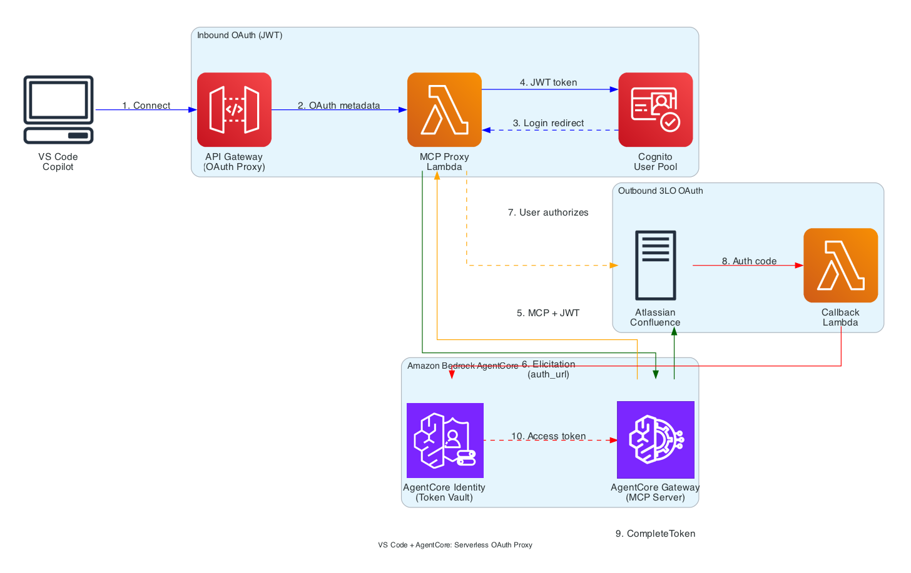

# VS Code + AgentCore Gateway: Secure IDE Tool Access with Figma

## Overview

This sample connects **Visual Studio Code** (with GitHub Copilot) to **Amazon Bedrock AgentCore Gateway**, giving the IDE access to **Figma** as an MCP tool with **OAuth 2.0 three-legged authorization (3LO)** for user-delegated access.

A serverless proxy layer (API Gateway + Lambda) sits between VS Code and the AgentCore Gateway. No local servers are required — developers configure a single URL in VS Code and authenticate through the browser.

**Requires**: `MCP-Protocol-Version: 2025-11-25` (adds URL elicitation support).

## Architecture



**Flow summary:**
1. VS Code connects to the API Gateway endpoint via MCP/HTTP
2. The IDP Lambda serves OAuth metadata and a login page; the user authenticates against Cognito
3. The MCP Proxy Lambda forwards authenticated tool requests to AgentCore Gateway
4. When Figma access is needed, the gateway returns a 3LO elicitation (`-32042`)
5. The proxy rewrites the elicitation URL so the callback routes through our API Gateway
6. The user grants consent in the browser via Figma OAuth
7. The Callback Lambda receives the authorization code and calls `CompleteResourceTokenAuth`
8. AgentCore Gateway can now call the Figma API on behalf of the user

## Two OAuth Flows

This sample involves two independent OAuth flows:

| Flow | Purpose | Direction | When |
|------|---------|-----------|------|
| **Inbound Auth** | VS Code authenticates to the proxy | VS Code &rarr; Cognito &rarr; Proxy | On MCP server connection |
| **Outbound Auth (3LO)** | AgentCore accesses Figma on behalf of the user | AgentCore &rarr; Figma &rarr; User consent | On first Figma tool call |

Cognito handles only inbound auth. The 3LO tokens for Figma are managed entirely by AgentCore Identity.

### Token Lifetime and Consent Persistence

AgentCore Identity manages 3LO tokens automatically: after the user completes consent, AgentCore stores the access token and refresh token and refreshes transparently on expiration. Re-consent is required only if the user revokes access in Figma, the refresh token expires from inactivity, or the app's requested scopes change.

## Components

| Component | Purpose | Source |
|-----------|---------|--------|
| **API Gateway** (HTTP API) | Public HTTPS endpoint for VS Code | [cdk-stack.ts](cdk/lib/cdk-stack.ts) |
| **IDP Lambda** | OAuth authorization server facade (metadata, login, token, DCR) | [idp_lambda.py](lambda/idp_lambda.py) |
| **MCP Proxy Lambda** | Forwards MCP requests to AgentCore Gateway, rewrites elicitation URLs | [mcp_lambda.py](lambda/mcp_lambda.py) |
| **Callback Lambda** | 3LO callback handling, `CompleteResourceTokenAuth`, session verification | [callback_lambda.py](lambda/callback_lambda.py) |
| **Cognito User Pool** | JWT tokens for inbound authentication | CDK |
| **AgentCore Gateway** | AWS-managed MCP gateway with Figma target | CDK + notebook |
| **DynamoDB Table** | Short-lived auth codes and elicitation sessions | CDK |

**Note on terminology**: "API Gateway" refers to Amazon API Gateway (the HTTP API fronting the Lambdas). "AgentCore Gateway" refers to the AWS-managed MCP server that routes tool calls to Figma.

## Design Choices

### Why a Proxy Layer Is Needed

VS Code's MCP client expects standard OAuth endpoints (`/.well-known/oauth-authorization-server`, `/authorize`, `/token`) at the MCP server URL. AgentCore Gateway validates incoming JWTs but does not act as an OAuth Authorization Server. The proxy provides this facade:

- **IDP Lambda** proxies the OAuth authorization flow to Cognito while serving a custom login page, handling PKCE validation, and issuing authorization codes.
- **MCP Proxy Lambda** adds the `Authorization` header and forwards requests to the gateway. It also serves RFC 9728 Protected Resource Metadata (`/.well-known/oauth-protected-resource`) — the `resource` identifier must match the URL the client connects to (the proxy URL), not the underlying gateway URL.
- **Callback Lambda** handles the 3LO redirect: when the user completes Figma consent, the OAuth callback must be received server-side so that `CompleteResourceTokenAuth` can be called with the correct user identity.

### Single DynamoDB Table for Auth Codes and Elicitation Sessions

Both the IDP auth codes and the 3LO elicitation sessions share a single DynamoDB table. This is intentional — both record types have the same shape and lifecycle:

- **Short-lived**: 5-minute TTL
- **Single-use**: consumed via `delete_item` with `ConditionExpression` (atomic delete-and-read)
- **Keyed by an opaque string** as the partition key

The `elicitation:` prefix on elicitation keys (e.g., `elicitation:urn:ietf:params:oauth:request_uri:...`) acts as a namespace, preventing collisions with UUID-based auth codes. Splitting into two tables would double the IAM grants (across 3 Lambdas), environment variables, and CDK resources for no practical benefit.

**IDP auth codes** (written by `idp_lambda.py`, consumed by `idp_lambda.py`):
```
{code: "uuid", access_token: "...", id_token: "...", code_challenge: "...", ttl: now+300}
```

**Elicitation sessions** (written by `mcp_lambda.py`, consumed by `callback_lambda.py`):
```
{code: "elicitation:{session_id}", user_token: "...", ttl: now+300}
```

### Cookie-Based Session for the Callback Flow

When the user completes 3LO consent, Figma redirects to `/oauth2/callback` on our API Gateway. The Callback Lambda needs to know *which user* initiated the flow so it can call `CompleteResourceTokenAuth` with the correct identity. Two mechanisms work together:

1. **DynamoDB lookup**: The MCP Proxy Lambda stores the user's bearer token keyed by elicitation session ID when it rewrites the elicitation URL. The Callback Lambda reads and deletes this entry.
2. **Cookie verification**: The Callback Lambda also reads the user's `access_token` cookie (set during login), verifies the JWT signature against Cognito's JWKS, and checks that the `sub` claim matches the stored token's `sub`. This prevents a user from completing another user's 3LO flow.

If the cookie is missing or expired, the Callback Lambda redirects to `/authorize` with a `return_to` parameter so the user can re-authenticate and resume the callback.

### Custom Login Page Instead of Cognito Hosted UI

The IDP Lambda serves its own login page rather than redirecting to the Cognito Hosted UI. This allows:

- Setting `HttpOnly; Secure; SameSite=Lax` cookies for `access_token` and `refresh_token` in the login response, which are needed later by the Callback Lambda
- Handling the `NEW_PASSWORD_REQUIRED` challenge inline (Cognito creates users with temporary passwords)
- Keeping the entire flow on the same origin (API Gateway domain), avoiding cross-origin cookie issues

### Dynamic Client Registration (DCR)

The IDP Lambda implements the `/register` endpoint (RFC 7591). VS Code's MCP client calls this to discover the `client_id` before starting the OAuth flow. The implementation is a thin passthrough — it returns the pre-configured Cognito app client ID rather than creating new clients, since all VS Code instances share the same public client.

### Elicitation URL Rewriting

When AgentCore Gateway returns a `-32042` elicitation error (requesting user consent), the elicitation URL points to `bedrock-agentcore.{region}.amazonaws.com`. The MCP Proxy Lambda rewrites this URL to route the OAuth callback through our API Gateway's `/oauth2/callback` endpoint instead. This is necessary because:

1. The callback needs to happen server-side (Lambda calls `CompleteResourceTokenAuth`)
2. The callback needs access to the user's session (cookie + DynamoDB lookup)
3. Figma's DCR (Dynamic Client Registration) at the MCP endpoint registers our API Gateway callback URL as the `redirect_uri`

### PKCE Validation

The IDP Lambda implements PKCE (RFC 7636) with S256 challenge method. VS Code's MCP client sends a `code_challenge` during `/authorize` and a `code_verifier` during `/token`. The auth code stored in DynamoDB includes the challenge, and the token endpoint verifies the verifier against it before returning tokens. This prevents authorization code interception attacks, which is important since the VS Code client is a public client (no client secret).

## Infrastructure (CDK)

The infrastructure is defined in [cdk/lib/cdk-stack.ts](cdk/lib/cdk-stack.ts) and deploys:

- Cognito User Pool with two app clients:
  - **VS Code client** — authorization code grant, no secret (public client), with PKCE
  - **M2M client** — client credentials grant, with secret (for testing)
- Resource Server with `mcp.read` and `mcp.write` scopes
- DynamoDB table with TTL (`ttl` attribute)
- Three Lambda functions with minimal IAM roles
- HTTP API Gateway with routes for OAuth, MCP proxy, and callbacks
- AgentCore Gateway with Cognito JWT authorizer

The Figma credential provider and gateway target are created via the [setup notebook](01_vscode_agentcore_figma_serverless_cdk.ipynb) after CDK deployment, because they require interactive steps (Figma DCR registration, target authorization).

## Setup

### Prerequisites

- Node.js 18+ and npm/pnpm (for CDK)
- Python 3.10+ (for the notebook and Lambda code)
- AWS credentials with permissions for Lambda, API Gateway, Cognito, IAM, DynamoDB, and Bedrock AgentCore
- Figma account
- VS Code 1.107+ with GitHub Copilot

### Step 1: Deploy the CDK Stack

```bash
cd cdk
npm install
npx cdk deploy
```

Copy the stack outputs — you will need them in the next step.

### Step 2: Run the Setup Notebook

Open [01_vscode_agentcore_figma_serverless_cdk.ipynb](01_vscode_agentcore_figma_serverless_cdk.ipynb) and follow the steps:

1. Paste the CDK stack outputs into the config cell
2. Create a Cognito user (`vscode-user@example.com`)
3. Create the Figma credential provider (uses Figma's MCP DCR endpoint)
4. Create the gateway target pointing to `https://mcp.figma.com/mcp`
5. Authorize the target (initial 3LO consent for the credential provider)

### Step 3: Configure VS Code

Add to `.vscode/mcp.json` (values from CDK output):

```json
{
  "servers": {
    "figma-agentcore": {
      "type": "http",
      "url": "https://<api-gateway-id>.execute-api.<region>.amazonaws.com/mcp",
      "headers": {
        "MCP-Protocol-Version": "2025-11-25"
      }
    }
  }
}
```

### Step 4: Connect and Use

1. Reload VS Code
2. When prompted, sign in with the Cognito user credentials
3. Use Figma tools — 3LO consent will be triggered on first use
4. After granting Figma consent in the browser, retry the tool call

## Troubleshooting

### "Cannot initiate authorization code grant flow"
The gateway is not receiving the `MCP-Protocol-Version: 2025-11-25` header. Add `"headers": {"MCP-Protocol-Version": "2025-11-25"}` to your `mcp.json` config.

### "redirect_mismatch" from Cognito
The callback URL is not registered in the Cognito app client. Verify the CDK stack deployed correctly and the callback URLs include your API Gateway endpoint.

### Lambda timeout errors
Increase the Lambda timeout in CDK or check that the AgentCore Gateway target is in `ACTIVE` status (not `FAILED`).

### 3LO completed but tool still fails
VS Code does not auto-retry after 3LO completion. Invoke the tool again after completing consent in the browser.

### "Session Expired" on callback page
The elicitation session entry in DynamoDB has a 5-minute TTL. If the user takes too long to complete Figma consent, the session expires. Retry the tool call to generate a new elicitation.

## Files

| File | Description |
|------|-------------|
| [cdk/lib/cdk-stack.ts](cdk/lib/cdk-stack.ts) | CDK stack — all AWS infrastructure |
| [lambda/idp_lambda.py](lambda/idp_lambda.py) | IDP Lambda — OAuth endpoints, login page, PKCE |
| [lambda/mcp_lambda.py](lambda/mcp_lambda.py) | MCP Proxy Lambda — gateway forwarding, elicitation rewriting |
| [lambda/callback_lambda.py](lambda/callback_lambda.py) | Callback Lambda — 3LO completion, session verification |
| [01_vscode_agentcore_figma_serverless_cdk.ipynb](01_vscode_agentcore_figma_serverless_cdk.ipynb) | Setup notebook — credential provider, target, user creation |

## Cleanup

1. Run the cleanup cell in the notebook to delete the credential provider and gateway targets
2. Destroy the CDK stack:
   ```bash
   cd cdk
   npx cdk destroy
   ```

## References

- [MCP Specification 2025-11-25](https://modelcontextprotocol.io/specification/2025-11-25)
- [VS Code MCP Documentation](https://code.visualstudio.com/docs/copilot/customization/mcp-servers)
- [AgentCore Gateway Documentation](https://docs.aws.amazon.com/bedrock-agentcore/)
- [Figma MCP Server](https://mcp.figma.com)
- [RFC 7636 — PKCE](https://datatracker.ietf.org/doc/html/rfc7636)
- [RFC 7591 — Dynamic Client Registration](https://datatracker.ietf.org/doc/html/rfc7591)
- [RFC 9728 — Protected Resource Metadata](https://datatracker.ietf.org/doc/html/rfc9728)
