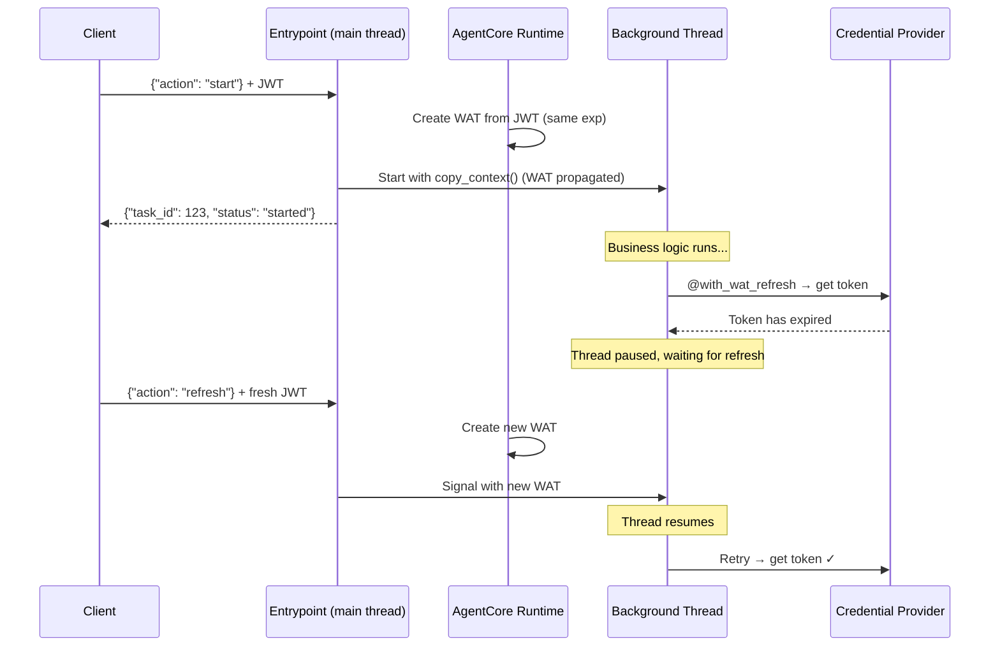

# Async WAT Refresh for Long-Running Agents

## Overview

When an AgentCore agent runs a long-running background task in a thread, the Workload Access Token (WAT) — created from the inbound JWT — expires after the JWT's TTL. This causes the SDK to fall back to creating orphaned workload identities via IAM, breaking user binding and auditability.

This sample demonstrates a companion library (`agentcore_thread_utils`) that solves the WAT expiration problem by:
- Propagating the WAT to background threads via `contextvars.copy_context()`
- Pausing the thread when the WAT expires and waiting for the client to send a fresh JWT
- Retrying the credential provider call with the refreshed WAT

No orphan workload identities are created. The WAT stays bound to the original user.

## Architecture

| Component | Description |
|---|---|
| `@with_wat_refresh` | Drop-in replacement for `@requires_access_token`. Catches WAT expiration, pauses the thread, waits for client refresh, retries. |
| `ThreadTaskManager` | Manages thread lifecycle with WAT propagation. Handles start/status/refresh/result actions. |

## Prerequisites

- AWS CLI configured
- `agentcore` CLI installed
- `jq` installed
- Python 3.10+

## Setup

### 1. Create Cognito User Pool (5-min access token TTL)

```bash
source setup_cognito.sh
```

### 2. Create Credential Provider

```bash
bash setup_credential_provider.sh
```

### 3. Deploy the Agent

```bash
bash deploy.sh
```

Export the Agent ARN from the output:

```bash
export AGENT_ARN="arn:aws:bedrock-agentcore:us-east-1:123456789012:runtime/thread_async_utils-XXXXXXXXXX"
```

## Test

### Start a task

```bash
bash test_curl.sh
```

### Wait 6 minutes, then check status

```bash
bash test_refresh.sh <session-id> status
```

### Send WAT refresh

```bash
bash test_refresh.sh <session-id> refresh
```

### Check result

```bash
bash test_refresh.sh <session-id> status
```

## Expected Flow

1. Client invokes agent with JWT (5-min TTL) → task starts in background thread with propagated WAT
2. Thread sleeps 6 minutes (WAT expires at minute 5)
3. Thread calls credential provider → WAT expired → decorator pauses thread
4. Client sends `{"action": "refresh"}` with fresh JWT → Runtime creates new WAT
5. Thread resumes, retries credential provider → success
6. Task completes, agent returns to Healthy

## How It Works



## Cleanup

```bash
agentcore destroy
aws cognito-idp delete-user-pool --user-pool-id $POOL_ID --region us-east-1
```

## Related

- [AgentCore Identity - Getting Started](../01-getting_started.md)
- [AgentCore Identity - How It Works](../02-how_it_works.md)
