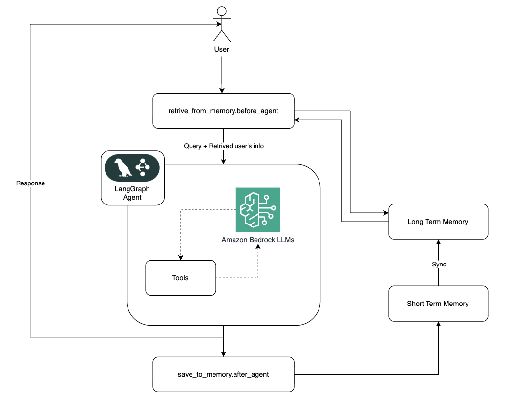

# LangGraph Agent with AgentCore Memory Middlewares

This tutorial demonstrates how to integrate Amazon Bedrock AgentCore Memory with a LangGraph agent using **middlewares** to enable long-term memory across conversation sessions.

## Architecture



## Key Features

- **`@before_agent` middleware**: Retrieves relevant user preferences from AgentCore Memory once per agent call
- **`@after_agent` middleware**: Saves conversation to AgentCore Memory for long-term extraction
- **Built-in Memory Strategies**: Uses `USER_PREFERENCE` and `SEMANTIC` strategies (no IAM role required)
- **MemoryManager**: Simplified memory creation from the starter toolkit

## Memory Strategies

This example uses two built-in strategies:

1. **USER_PREFERENCE**: Automatically extracts user preferences from conversations
2. **SEMANTIC**: Stores factual information mentioned in conversations

```python
memory = memory_manager.get_or_create_memory(
    name="NutritionAssistant",
    strategies=[
        {StrategyType.USER_PREFERENCE.value: {...}},
        {StrategyType.SEMANTIC.value: {...}}
    ]
)
```

## Middleware Pattern

```python
from langchain.agents.middleware import before_agent, after_agent, AgentState
from langgraph.runtime import Runtime

@before_agent
def retrieve_from_memory(state: AgentState, runtime: Runtime):
    # Retrieve memories and inject into context
    ...

@after_agent
def save_to_memory(state: AgentState, runtime: Runtime):
    # Save conversation to AgentCore Memory
    ...

# Create agent with middlewares
graph = create_agent(
    llm,
    tools=[],
    middleware=[retrieve_from_memory, save_to_memory],
    checkpointer=InMemorySaver(),
)
```

## Prerequisites

- Python 3.10+
- AWS account with appropriate permissions
- Access to Amazon Bedrock models

## Installation

```bash
pip install -r requirements.txt
```

## Files

| File | Description |
|------|-------------|
| `nutrition-assistant-with-user-preference-saving.ipynb` | Main tutorial notebook |
| `architecture.png` | Architecture diagram |
| `requirements.txt` | Python dependencies |
