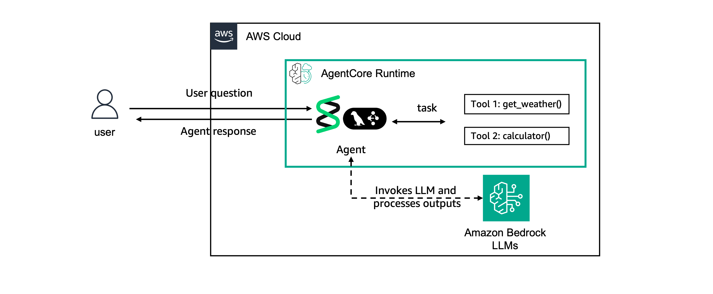

# Prerequisites: Creating Sample Agents

## Architecture

```
┌─────────────────────────────────────────────────────────┐
│  Agent Deployment                                        │
│                                                          │
│  agentcore create   ──► project scaffold                 │
│       │                  (pyproject.toml, agent.py)      │
│       ▼                                                  │
│  agentcore deploy   ──► CodeBuild (image build)          │
│       │                    │                             │
│       │                    ▼                             │
│       │               Amazon ECR                         │
│       │                    │                             │
│       ▼                    ▼                             │
│  AgentCore Runtime   ◄── Docker image                    │
│  (READY status)                                          │
│       │                                                  │
│       ▼                                                  │
│  invoke_agent_runtime() ──► OTel spans ──► CloudWatch    │
└─────────────────────────────────────────────────────────┘
```

## What's This Feature

Before we can evaluate agents, we need an agent to evaluate. This tutorial sets up two sample agents that we'll use throughout the remaining evaluation tutorials: one using [Strands Agents SDK](https://strandsagents.com/) and the other one using [LangGraph](https://www.langchain.com/langgraph).

## The Agents

The agents created are essentially the same just using two different frameworks to showcase the "any framework" proposition of AgentCore.

The agents have two key capabilities:

**Code Execution**
- Uses AgentCore Code Interpreter to run Python code
- Handles math calculations and data analysis

**Memory**
- Stores user facts and preferences
- Retrieves relevant context for personalized responses

Both agents use Anthropic Claude Haiku 4.5 from Amazon Bedrock as the LLM model, but with AgentCore you can use any model of your preference.

The architecture looks as following:



## Prerequisites

Before deploying the agent you need:
- Python 3.10+
- AWS credentials configured
- Node.js (for the AgentCore CLI)

## CLI Commands

Install the AgentCore CLI:

```bash
npm install -g @aws/agentcore@0.11.0
```

Deploy the Strands agent:

```bash
# CLI names must be alphanumeric only (no underscores/hyphens), max 23 chars
agentcore create --name acevalstrands2 --framework Strands --model-provider Bedrock --defaults

# Copy your agent code into the project
cp eval_agent_strands.py acevalstrands2/app/acevalstrands2/main.py
cd acevalstrands2

# Populate aws-targets.json (agentcore create --defaults leaves it empty;
# agentcore deploy -y requires a "default" target entry with account + region)
ACCOUNT_ID=$(aws sts get-caller-identity --query Account --output text)
REGION=$(aws configure get region)
echo "[{\"name\": \"default\", \"description\": \"Default target\", \"account\": \"$ACCOUNT_ID\", \"region\": \"$REGION\"}]" > agentcore/aws-targets.json

# Deploy
agentcore deploy -y

# Check deployment status
agentcore status

# Invoke the agent after deployment
agentcore invoke "What is the weather now?" --stream
```

Deploy the LangGraph agent:

```bash
agentcore create --name acevallanggraph2 --framework LangChain_LangGraph --model-provider Bedrock --defaults
cp eval_agent_langgraph.py acevallanggraph2/app/acevallanggraph2/main.py
cd acevallanggraph2

# Populate aws-targets.json
ACCOUNT_ID=$(aws sts get-caller-identity --query Account --output text)
REGION=$(aws configure get region)
echo "[{\"name\": \"default\", \"description\": \"Default target\", \"account\": \"$ACCOUNT_ID\", \"region\": \"$REGION\"}]" > agentcore/aws-targets.json

agentcore deploy -y
agentcore invoke "How much is 2+2?" --stream
```

List deployed agents and check status:

```bash
aws bedrock-agentcore-control list-agent-runtimes --region us-east-1
aws bedrock-agentcore-control get-agent-runtime --agent-runtime-id <agent-id> --region us-east-1
```

## Cleanup

Delete the agent runtimes when no longer needed:

```bash
aws bedrock-agentcore delete-agent-runtime \
  --agent-runtime-id <strands-agent-id> \
  --region us-east-1

aws bedrock-agentcore delete-agent-runtime \
  --agent-runtime-id <langgraph-agent-id> \
  --region us-east-1
```

Delete the ECR repositories:

```bash
aws ecr delete-repository \
  --repository-name bedrock-agentcore-ac_eval_strands2 \
  --region us-east-1 \
  --force

aws ecr delete-repository \
  --repository-name bedrock-agentcore-ac_eval_langgraph2 \
  --region us-east-1 \
  --force
```

## What's Next

Now that you have all the required pre-requisites, let's go through the individual evaluation tutorials:

- **[Tutorial 01](../01-creating-custom-evaluators)**: Create custom evaluators
- **[Tutorial 02](../02-running-evaluations)**: Run on-demand and online evaluations
- **[Tutorial 03](../03-advanced)**: Advanced techniques and dashboards
