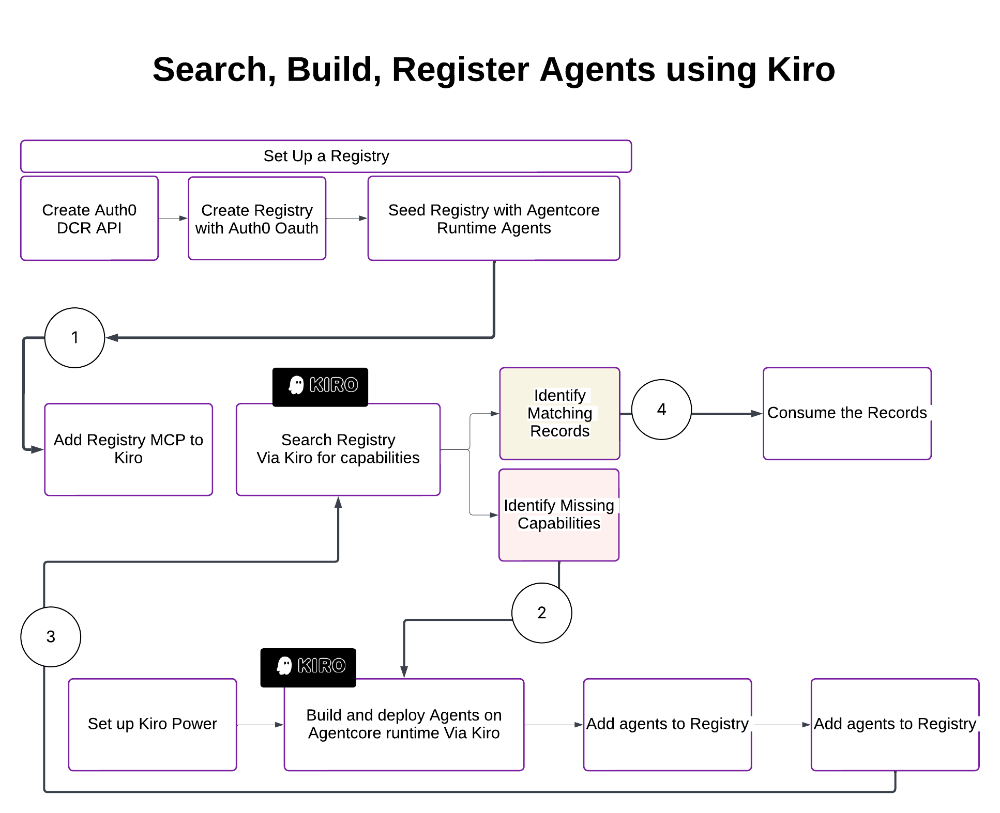
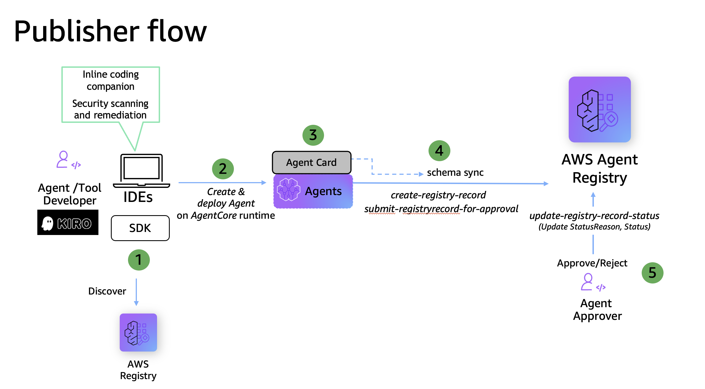
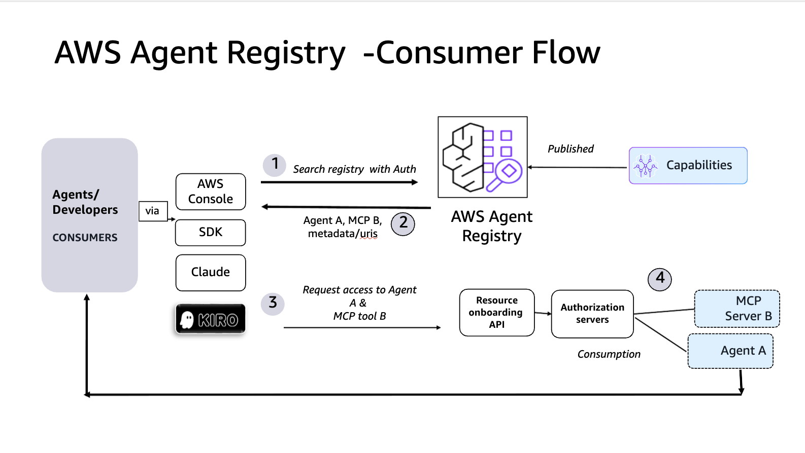
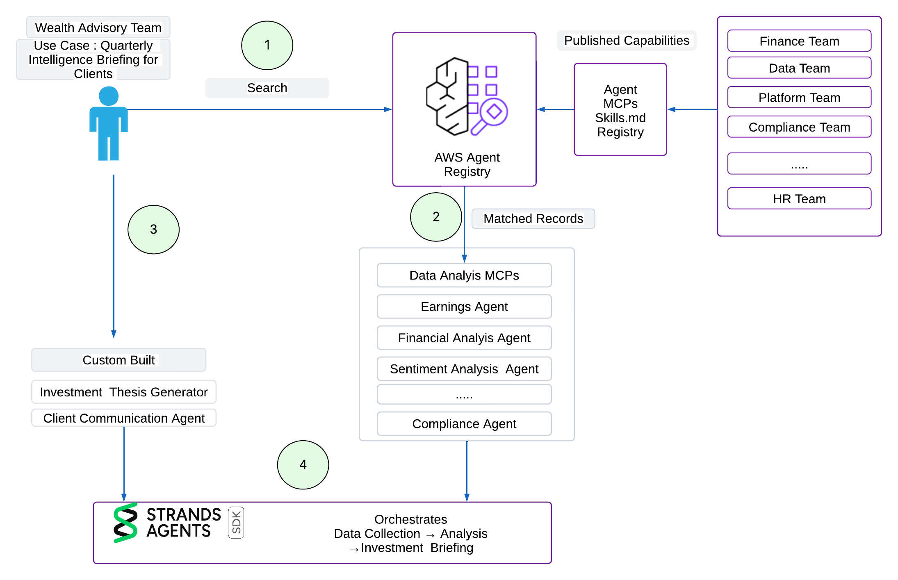

# Registry-First Development Workflow with Kiro

Discover agentic capabilities from your organization's AWS Agent Registry, identify gaps, build missing agents, and publish them back — __all from the Kiro IDE__ using MCP-based search and Kiro Powers for publisher workflows.

## What This Tutorial Demonstrates

This tutorial walks through a **registry-first development workflow** powered by Kiro:

1. **Search** — Use the AWS Agent Registry MCP server in Kiro to semantically search for existing agents and tools across your organization, directly from the IDE.

2. **Identify gaps** — Map discovered capabilities against your workflow requirements and pinpoint what's missing.

3. **Build & Publish** — Use Kiro Powers (which define the AWS Agent Registry publisher APIs) to build the missing agents and publish them back to the registry, all via the Kiro chat interface.

4. **Invoke** — Resolve runtime ARNs from registry records and invoke agents via AgentCore Runtime.

The key idea: a developer sitting in Kiro can go from "what agents exist?" to "I built and published the missing ones" without leaving the IDE.

## What is AWS Agent Registry?

AWS Agent Registry is a centralized, governed catalog for discovering, publishing, and managing AI agents and tools across an organization. It provides semantic search for capability-based discovery, IAM and OAuth access control, rich metadata management (protocol, version, connection info, tool schemas), and a built-in governance workflow (DRAFT → PENDING_APPROVAL → APPROVED) so teams can trust what they find and reuse what others have built. AWS Agent Registry has three pain personas, Publishers - who publish capabilities to the Registry , Admins - who approve the published capabilities and Consumers - who search and access the approved registry records downstream.

 
## What is Dynamic Client Registration?

Dynamic Client Registration is an OAuth and OpenID Connect protocol that lets client applications automatically register with an authorization server instead of requiring manual pre-registration. The DCR protocol is formally defined in RFC 7591, with optional registration management extensions in RFC 7592. It was designed to work within the Open Authorization (OAuth) and OpenID Connect (OIDC) ecosystems. It enables automatic creation of client IDs, secrets, and metadata (redirect URIs, scopes), often used for automation, AI agents, and dynamic scaling.

### Why DCR Matters for Kiro

For Kiro to search the registry as an MCP tool, the registry needs to be configured with a **CUSTOM_JWT authorizer** backed by an OAuth provider (Auth0 in this example). Kiro's MCP client uses the **authorization_code + PKCE** flow — it dynamically registers itself via Dynamic Client Registration (DCR), opens a browser for login, catches the callback on localhost, and exchanges the code for a token. This means zero manual credential management for the developer.

## How Kiro Powers Fit In this Development Workflow

A **Kiro Power** is a curated, pre-packaged bundle of capabilities designed for the Kiro AI-powered IDE that gives the Kiro agent instant, specialized expertise in a specific technology or workflow.

Each power typically bundles three components :

- **POWER.md** — A steering file that acts as an onboarding manual, telling the agent what MCP tools are available and when to use them
- **MCP server configuration** — The tools and connection details for the Model Context Protocol server
- **Additional steering or hooks** — Extra guidance files or automated validation hooks [ We use this for publisher of records]

The key innovation is **dynamic context loading**: rather than loading every tool upfront (which can overwhelm the agent), powers activate only when relevant. For example, mention "database" and the Neon power loads; switch to deployment and the Netlify power activates while Neon deactivates.

In this sample Kiro Powers package the AWS Agent Registry publisher APIs (`CreateRegistryRecord`, `SubmitRegistryRecordForApproval`, etc.) as steering files that guide Kiro through the publish workflow. When you ask Kiro to "publish this agent to the registry," the Power provides the step-by-step instructions and API calls — so you get a governed publish-and-approve cycle without writing boto3 code yourself.

## Use Case: 

To ground this tutorial in a real world usecase , let imagine a scenrio of AnyCompany financial services.

AnyCompany financial services firm has a multi team structure. Core teams include investment management, wealth advisory, trading operations, and compliance. Over the past year, multiple teams have independently built AI agents, MCP servers, and automation tools — but with no shared catalog, no common standard, and no way for one team to discover what another has already built.

The Wealth Advisory team has been asked to build a Quarterly Intelligence Briefing workflow. 
Here's the requirement: 

> *"When a publicly traded company reports quarterly results, automatically generate a comprehensive client-ready investment brief — including what happened, why it matters, how it affects each client's portfolio, and what (if any) action to consider — all within 30 minutes of the earnings release."*

In order to build this,the key capabilities needed include :
* **First**, gathering data — pull raw earnings data, market context, competitive intel.
* **Second**, analyze and synthesize — run financial analysis compliance tests  and generate an investment thesis based on the data.
* **Third** is generate a perosnlaized investment brief for each client.

The Wealth Advisory team has **zero** existing capabilties in house for earnings data ingestion, financial analysis, or compliance screening. Building from scratch would take **couple of months and $1M+**.

But they don't need to build from scratch. **Other teams already have the pieces.** The Wealth Advisory team just needs a way to find them, verify they're approved for use, and wire them together into a flow.

The result: what would have been a 6-month greenfield project becomes a composition exercise — 7 agents discovered from 5 teams, 2 new agents built to fill gaps, and a single orchestrator tying them all together.

## Steps Involved: 

Set Up:

- Create an Auth0 DCR-enabled registry (CUSTOM_JWT authorizer) [DCR set up instructions here](https://github.com/awslabs/agentcore-samples/blob/main/01-tutorials/10-Agent-Registry/01-advanced/kiro-registry-dcr-auth0/DCR_registry_search_mcp_in_kiro.ipynb)
- Deploy sample agents to AgentCore Runtime and register them as records

Search

- In Kiro Use the registry MCP server to search for existing agents from chat interface.
- Resolve runtime ARNs from search results and invoke agents from their URIs

Build

- Set up and Use Kiro Powers to create and publish new agents to registry from Kiro Chat interface. [Sample Kiro powers available here ](https://github.com/sanaiqbalw/amazon-bedrock-agentcore-samples/tree/br_dcr-registry_for_kiro-mcp-search/01-tutorials/10-Agent-Registry/01-advanced/kiro/kiro-power-publisher-workflow)
