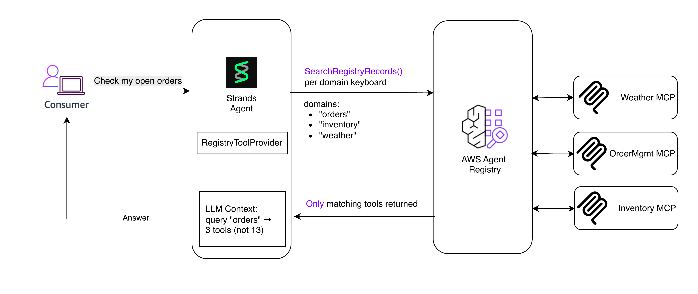

# RegistryToolProvider — Dynamic Tool Discovery for Strands Agents

A Strands `ToolProvider` that discovers tools from AWS Agent Registry via semantic search. Instead of hardcoding tools at startup, the agent gets only the tools relevant to the current domain.




## How It Works

1. Agent calls `load_tools()` before each LLM turn
2. Provider searches Registry with each domain keyword (semantic search)
3. Matching records are parsed based on protocol:
   - **MCP** → extracts tools from `tools`, routes `tools/call` through Gateway
   - **A2A** → creates an `invoke_<agent>` tool, routes through AgentCore Runtime
   - **Custom** → creates a passthrough tool from record metadata
4. Only tools from `APPROVED` records are returned (configurable)
5. Results are cached for `cache_ttl` seconds (default 300)

## Supported Protocols

| Protocol | Record contains | Provider creates | Invocation path |
|---|---|---|---|
| MCP | `tools` with tool definitions | One `PythonAgentTool` per tool | Gateway `tools/call` |
| A2A | `agentCard` with skills and endpoint | Single `invoke_<agent>` tool | Runtime `invoke_agent_runtime` |
| Custom | Free-form metadata | Passthrough tool | Returns record metadata |

For A2A records, the runtime ARN or endpoint URL is extracted from the `agentCard.inlineContent` JSON (`url` or `runtimeArn` field). If not found there, falls back to the top-level record field.

## How It Works

On each request, the provider searches the Registry for tools matching your domains, injects only the relevant ones into the LLM context, and routes tool calls through the Gateway to upstream MCP servers. The LLM picks the right tools, gets responses, and synthesizes a final answer.

## Example: Enterprise Customer Support Agent
An org has 50+ tools registered across teams — Salesforce, ServiceNow, knowledge bases, Databricks, SAP, and escalation agents. Instead of hardcoding all tools, the provider dynamically selects what's relevant per request:

"Status of ticket INC-4821?" → finds ServiceNow tools, returns ticket status
"Last quarter's invoices for Acme Corp" → finds SAP + Salesforce tools, returns invoices with account context
"Escalate this, customer is upset" → finds the A2A escalation agent, creates a priority ticket
Same agent, same code, different tools per request. When a team adds a new tool to the Registry, the agent picks it up automatically — no code change, no redeploy.

## Prerequisites

### IAM Policy

```json
{
    "Version": "2012-10-17",
    "Statement": [
        {
            "Sid": "RegistryRecordManagement",
            "Effect": "Allow",
            "Action": [
                "bedrock-agentcore:CreateRegistryRecord",
                "bedrock-agentcore:GetRegistryRecord",
                "bedrock-agentcore:UpdateRegistryRecord",
                "bedrock-agentcore:ListRegistryRecords",
                "bedrock-agentcore:DeleteRegistryRecord"
            ],
            "Resource": [
                "arn:aws:bedrock-agentcore:REGION:ACCOUNT_ID:registry/*",
                "arn:aws:bedrock-agentcore:REGION:ACCOUNT_ID:registry/*/record/*"
            ]
        },
        {
            "Sid": "RegistryManagement",
            "Effect": "Allow",
            "Action": [
                "bedrock-agentcore:CreateRegistry",
                "bedrock-agentcore:GetRegistry",
                "bedrock-agentcore:ListRegistries"
            ],
            "Resource": "arn:aws:bedrock-agentcore:REGION:ACCOUNT_ID:*"
        },
        {
            "Sid": "OAuthTokenForSync",
            "Effect": "Allow",
            "Action": "bedrock-agentcore:GetResourceOauth2Token",
            "Resource": "arn:aws:bedrock-agentcore:REGION:ACCOUNT_ID:token-vault/*/oauth2credentialprovider/*"
        },
        {
            "Sid": "IAMPassRoleForSync",
            "Effect": "Allow",
            "Action": "iam:PassRole",
            "Resource": "arn:aws:iam::ACCOUNT_ID:role/*",
            "Condition": {
                "StringEquals": {
                    "iam:PassedToService": "bedrock-agentcore.amazonaws.com"
                }
            }
        }
    ]
}
```

## Key Benefits

- **Dynamic Discovery**: Tools are resolved at runtime via semantic search — no hardcoded tool lists
- **Protocol Aware**: Handles MCP, A2A, and Custom records with the right invocation path for each
- **Scoped Context**: Only injects tools relevant to the current domain, keeping LLM context small and cost-effective
- **Zero Redeploy**: New tools added to the Registry are picked up automatically — no code changes needed
- **Production Ready**: Supports approval filtering, runtime ARN restrictions, caching, and configurable failure modes
- **Pluggable Auth**: Bring your own token function for Gateway authentication (Cognito, custom OAuth, etc.)

## Getting Started

The included notebook walks through the full setup end-to-end:

1. Creating a Registry and seeding it with MCP and A2A records
2. Configuring the `RegistryToolProvider` with domains and Gateway auth
3. Running an agent that dynamically discovers and invokes tools
4. Testing with different queries to see domain-scoped tool selection in action

## Next Steps

- Add your own MCP servers and A2A agents to the Registry
- Tune domain keywords to match your agent's use cases
- Lock down with `required_status`, `allowed_runtime_arns`, and `fail_open` for production
- Shorten `cache_ttl` for environments where records change frequently
