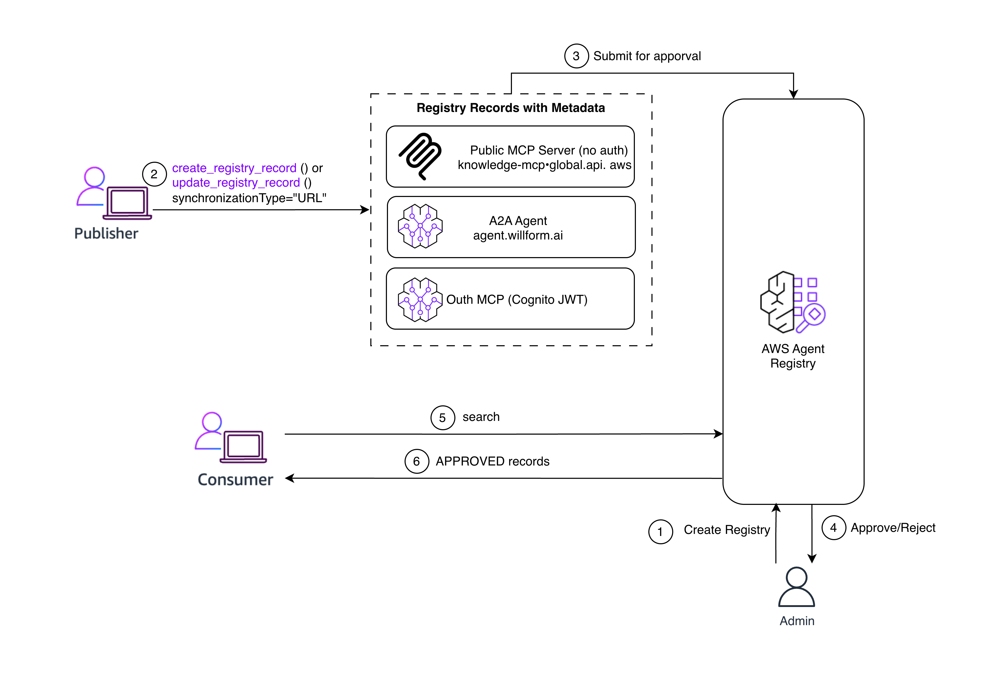

# Synchronize MCP and A2A Server Metadata with Registry

Auto-populate registry records by pointing to an MCP server or A2A agent URL. The registry connects to the endpoint, fetches metadata (tools, server info, agent card), and populates the record — no manual entry needed.



## Use Cases

Catalog MCP servers and A2A agents by pointing to their URLs — the registry auto-imports tools, schemas, and metadata. Keep records in sync on re-trigger, with support for public, OAuth-protected, and IAM-protected endpoints.

## Prerequisites

### IAM Policy

```json
{
    "Version": "2012-10-17",
    "Statement": [
        {
            "Sid": "RegistryRecordManagement",
            "Effect": "Allow",
            "Action": [
                "bedrock-agentcore:CreateRegistryRecord",
                "bedrock-agentcore:GetRegistryRecord",
                "bedrock-agentcore:UpdateRegistryRecord",
                "bedrock-agentcore:ListRegistryRecords",
                "bedrock-agentcore:DeleteRegistryRecord"
            ],
            "Resource": [
                "arn:aws:bedrock-agentcore:REGION:ACCOUNT_ID:registry/*",
                "arn:aws:bedrock-agentcore:REGION:ACCOUNT_ID:registry/*/record/*"
            ]
        },
        {
            "Sid": "RegistryManagement",
            "Effect": "Allow",
            "Action": [
                "bedrock-agentcore:CreateRegistry",
                "bedrock-agentcore:GetRegistry",
                "bedrock-agentcore:ListRegistries"
            ],
            "Resource": "arn:aws:bedrock-agentcore:REGION:ACCOUNT_ID:*"
        },
        {
            "Sid": "OAuthTokenForSync",
            "Effect": "Allow",
            "Action": "bedrock-agentcore:GetResourceOauth2Token",
            "Resource": "arn:aws:bedrock-agentcore:REGION:ACCOUNT_ID:token-vault/*/oauth2credentialprovider/*"
        },
        {
            "Sid": "IAMPassRoleForSync",
            "Effect": "Allow",
            "Action": "iam:PassRole",
            "Resource": "arn:aws:iam::ACCOUNT_ID:role/*",
            "Condition": {
                "StringEquals": {
                    "iam:PassedToService": "bedrock-agentcore.amazonaws.com"
                }
            }
        }
    ]
}
```

### New registry required

Registries created before the URL sync feature was deployed lack the workload identity needed for credential resolution. **Create a new registry** to use OAuth or IAM sync.

## Tutorial Examples

[`url_synchronization.ipynb`](url_synchronization.ipynb): Interactive notebook covering all sync scenarios end-to-end: public MCP, A2A agent cards, OAuth-protected servers, re-sync, failure handling, and governance workflow


## Key Benefits

- **Zero Manual Entry**: Point to a URL and the registry auto-populates tools, schemas, server info, and agent cards
- **Multi-Protocol**: Supports both MCP servers and A2A agent cards
- **Auth Flexible**: Works with public endpoints, OAuth-protected gateways (Cognito), and IAM-protected gateways (SigV4)
- **Keep In Sync**: Re-trigger sync anytime to refresh records when upstream servers change
- **Governance Built-In**: Synced records follow the same approval workflow as manually created ones

## Getting Started

The included notebook walks through the full setup end-to-end:

1. Creating a new registry with workload identity support
2. Syncing a public MCP server (no auth)
3. Syncing an A2A agent card
4. Syncing an OAuth-protected MCP server via Cognito + AgentCore Gateway
5. Updating and re-syncing an existing record
6. Handling failure cases and inspecting error reasons
7. Walking through the full record lifecycle (Publisher → Approver → Consumer)

## Next Steps

- Sync your own MCP servers and A2A agents into the Registry
- Set up OAuth or IAM credential providers for protected endpoints
- Integrate with the [RegistryToolProvider](../registry-tool-provider) for dynamic tool discovery at runtime
- Use `triggerSynchronization` to keep records up to date as upstream servers evolve
