# 08 — Harness in ISOLATED Mode with Memory and S3 (CLI + boto3 hybrid)

This sample shows how to run an AgentCore Harness with **`networkMode: ISOLATED`** — the agent's microVM has no internet egress and reaches AWS services exclusively through AWS PrivateLink interface endpoints plus an S3 gateway endpoint. While running, it exercises two capabilities you probably want in real workloads:

- **Persistent Memory** — long-term user facts and preferences automatically extracted from conversations (SEMANTIC + USER_PREFERENCE + SUMMARIZATION + EPISODIC strategies)
- **S3 read/write** — the agent reads an input file from S3 and writes results back, all through the S3 gateway endpoint

The walkthrough follows the style of [`06-vpc-integration`](../06-vpc-integration/README.md) where it can, and falls back to small `boto3` scripts for the few things the current `agentcore` preview CLI doesn't yet surface (`networkMode: ISOLATED` and post-deploy memory binding).

## Architecture

<p align="left">
  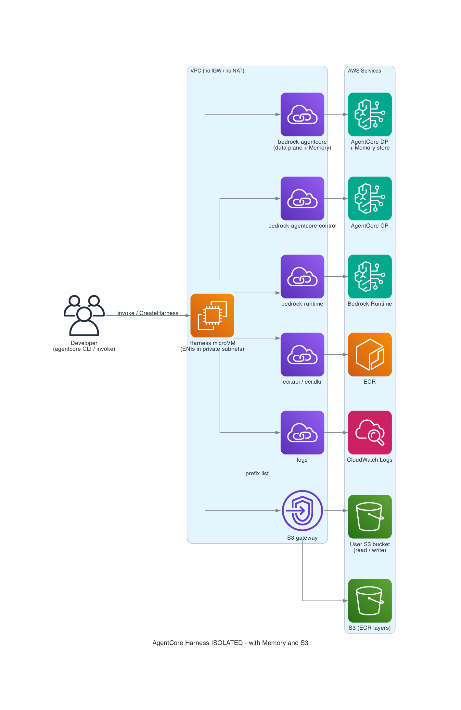
</p>

The developer only interacts with the Harness (via `agentcore invoke` or `invoke_harness`). All AWS API calls originate from the Harness microVM and travel through PrivateLink endpoints or the S3 gateway endpoint. No traffic leaves the VPC through an internet gateway or NAT, because there aren't any.

## Prerequisites

You need to bring three things. This sample does not provision them for you — it documents what they must look like so your security review can approve the shape ahead of time.

### 1. Tools on your laptop

- Node.js 20+ and `npm` (for the CLI)
- Python 3.12+ and `pip` (for the helper scripts)
- **AWS CLI v2** — used for the role-creation commands in Step 0 and for bucket operations in Step 6
- `uv` is optional, used the same way as `06-vpc-integration` if you want it

Install the AgentCore CLI (same channel as sample 06):

```bash
npm i -g @aws/agentcore@preview
agentcore --version
# Expected: 1.0.0-preview.2 or newer
```

Install the helper scripts' Python dependencies into a virtualenv. Create it alongside the **scripts folder in this repo** (not inside the agentcore project folder — the agentcore project folder can be recreated during the walkthrough, which would strand a venv inside it):

```bash
# From the tutorial folder in the samples repo
cd <path-to>/amazon-bedrock-agentcore-samples/01-tutorials/11-AgentCore-harness/01-advanced-examples/08-isolated-integration

python3 -m venv .venv
source .venv/bin/activate
pip install -r scripts/requirements.txt

# Sanity check — the service has to be known for the scripts to work
python3 -c "import boto3; boto3.Session().client('bedrock-agentcore-control'); print('OK')"
# Expected: OK
```

Any time you return to run a helper script, re-activate this venv first:

```bash
source <path-to>/amazon-bedrock-agentcore-samples/01-tutorials/11-AgentCore-harness/01-advanced-examples/08-isolated-integration/.venv/bin/activate
```

> **`python` vs `python3`:** the walkthrough's script invocations use `python scripts/...`. If you'd rather use `python3`, just substitute. The two forms are equivalent wherever both binaries exist.
>
> ```bash
> # Either of these works:
> python  scripts/flip_to_isolated.py  [flags...]
> python3 scripts/flip_to_isolated.py  [flags...]
> ```
>
> Inside the activated venv created above, both `python` and `python3` resolve to the venv's Python. Outside a venv on macOS with Homebrew Python there's no `python` symlink, so prefer `python3` there (or activate the venv first).

Verify the AWS CLI is installed and authenticated to the right account:

```bash
aws --version
aws sts get-caller-identity --profile <your-profile>
```

### 2. AWS credentials

The walkthrough assumes a named profile — substitute your own everywhere you see `--profile <your-profile>` below. Verify it resolves before you start:

```bash
aws sts get-caller-identity --profile <your-profile>
```

### 3. The VPC infrastructure

Your account needs the following networking and IAM set up in the region you're deploying to (we use `us-west-2` throughout). How you provision it is up to you — CloudFormation, CDK, Terraform, or console are all fine. The shape is what matters.

| Resource | Requirements |
|---|---|
| **VPC** | DNS hostnames enabled, DNS resolution enabled. |
| **Private subnets** | At least 2 subnets in different AgentCore-supported AZs (in `us-west-2`: `usw2-az1`, `usw2-az2`, `usw2-az3`). Each subnet must have **no default route** — no IGW, no NAT. |
| **Route table** | Private route table with only the local VPC CIDR route plus the S3 prefix-list route (added by the S3 gateway endpoint below). No `0.0.0.0/0` entry. |
| **Security group** | A single group shared by the Harness ENIs and the interface-endpoint ENIs, with a **self-referential tcp/443 ingress rule** (source = the same SG). Egress can be narrow — the route table enforces isolation regardless. |
| **Interface endpoints** (6) | All attached to both private subnets and the shared SG, all with `PrivateDnsEnabled: true`: `com.amazonaws.<region>.bedrock-agentcore`, `com.amazonaws.<region>.bedrock-agentcore-control`, `com.amazonaws.<region>.bedrock-runtime`, `com.amazonaws.<region>.ecr.api`, `com.amazonaws.<region>.ecr.dkr`, `com.amazonaws.<region>.logs` |
| **S3 gateway endpoint** | `com.amazonaws.<region>.s3` attached to the private route table. Gateway endpoints are free and they're what let the microVM reach S3 (both for ECR layer pulls and for the user bucket in this demo). |
| **IAM execution role** | **Step 0 below walks you through creating this role via `aws iam create-role` + `aws iam put-role-policy` — no CFN required.** The role's trust policy allows `bedrock-agentcore.amazonaws.com` to assume it. The inline policy grants: `bedrock:InvokeModel*`, ECR pull + auth, `logs:Create*` / `PutLogEvents` scoped to `/aws/bedrock-agentcore/*`, `bedrock-agentcore:*Memory*` + `*Event*` scoped to `:memory/*`, and — for this sample's S3 demo — `s3:GetObject` / `s3:PutObject` / `s3:ListBucket` on the user bucket. |
| **S3 bucket** | One bucket in the same region for the read/write demo. Pre-upload an input file at `input/sample-input.txt` with any text you like. |

Collect the following values before starting the walkthrough — every step below references them:

```text
REGION            = us-west-2
PROFILE           = <your-profile>
ACCOUNT_ID        = <your-account-id>
SUBNETS           = subnet-aaaaaaaaaaaaaaaaa,subnet-bbbbbbbbbbbbbbbbb
SECURITY_GROUP    = sg-cccccccccccccccc
BUCKET            = <your-bucket>
# ROLE_ARN is created in Step 0 below — don't need it yet
```

> **Cost note.** Six interface endpoints at ~$0.01/hr each in two AZs ≈ $0.10/hr ≈ **~$75/month if left running**. The S3 gateway endpoint and the memory resource are free. Tear everything down when you finish the tutorial.

### What the prerequisite VPC looks like in the Console

If you already have an ISOLATED-ready VPC, it should look close to the screenshots below. Use them as a self-check before you run the walkthrough.

**VPC overview** — `10.43.0.0/16`, DNS hostnames + resolution enabled, no IGW attached. The resource map shows 2 private subnets across two AZs and a single network connection (the S3 gateway endpoint).

<p align="left">
  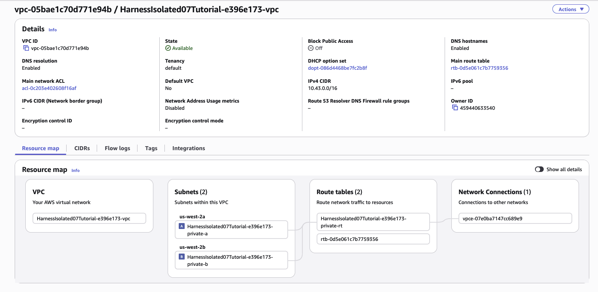
</p>

**VPC endpoints** — 6 interface endpoints (`bedrock-agentcore`, `bedrock-agentcore-control`, `bedrock-runtime`, `ecr.api`, `ecr.dkr`, `logs`) + 1 S3 gateway endpoint, all `Available`. The interface endpoints give the microVM a private path to each AWS service; the S3 gateway endpoint covers object-storage traffic including ECR layer pulls.

<p align="left">
  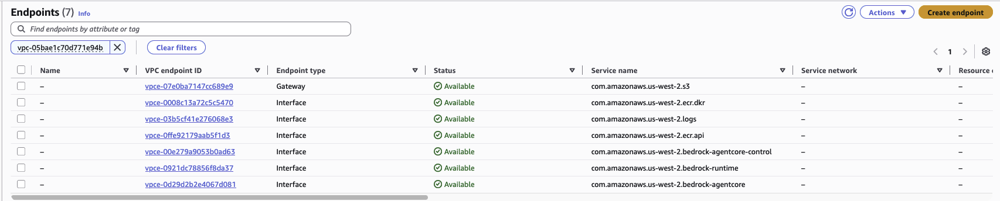
</p>

**Interface endpoint subnets** — each of the 6 interface endpoints should be attached to **both** private subnets (across two AZs). Clicking any one of them and opening the **Subnets** tab shows two rows, each with a subnet ID, AZ, and a per-AZ ENI (`eni-…`). If an endpoint were only in one AZ, traffic from the other AZ's subnet would fail at DNS resolution.

<p align="left">
  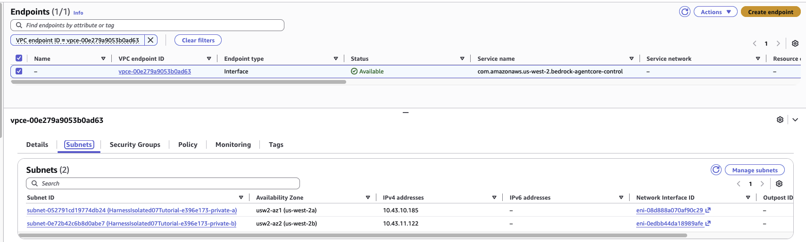
</p>

**Interface endpoint security group** — the same SG is attached to both the Harness ENIs AND the interface endpoint ENIs. That's what makes the self-referential ingress rule (below) work.

<p align="left">
  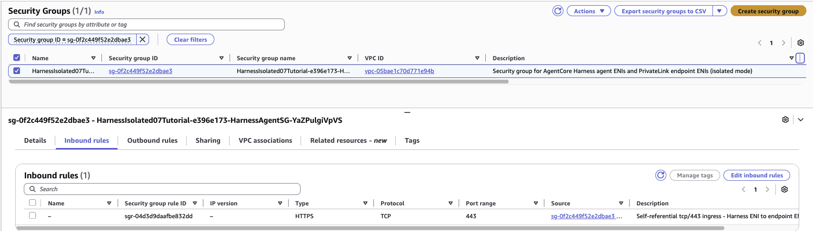
</p>

**Private route table** — the only two routes are `10.43.0.0/16 → local` and `pl-68a54001 → vpce-<s3-gw-id>`. There is no `0.0.0.0/0` entry, so any packet not destined for the local VPC CIDR or for S3's prefix list is black-holed. This is the mechanism that enforces isolation. (Note: the S3 prefix list is a list of AWS-owned CIDRs for S3 in this region — traffic to these addresses goes to the S3 gateway endpoint over AWS's backbone, not to the public internet.)

<p align="left">
  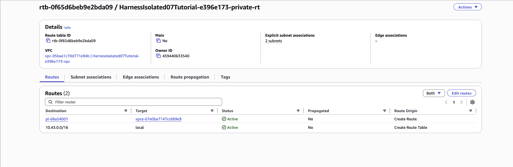
</p>

**Shared security group** — one rule, `HTTPS tcp/443` with **source = the SG itself** (self-referential). When the Harness ENI and the interface-endpoint ENIs all share this SG, this rule is what permits the Harness microVM to initiate a 443 connection to the endpoint ENI. Without it, the traffic is dropped.

<p align="left">
  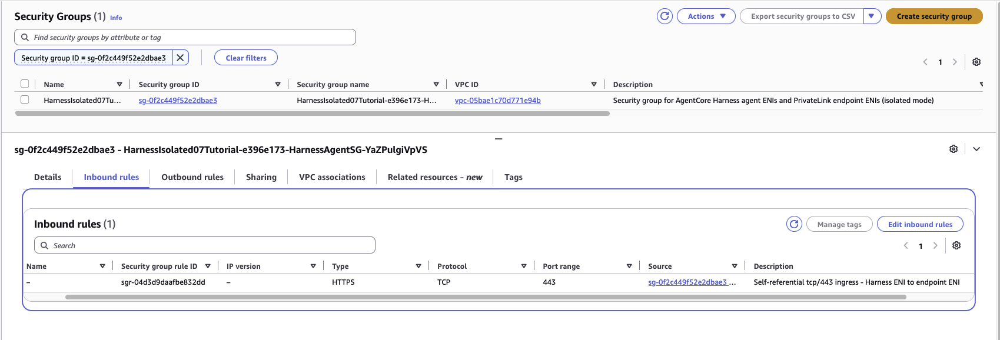
</p>

## Step 0 — Create the Harness execution role

The Harness microVM assumes an IAM execution role to reach Bedrock, ECR, CloudWatch Logs, your AgentCore Memory resource, and your user S3 bucket. This step creates that role using pure AWS CLI commands — no CloudFormation template required.

Export the values you collected in the prerequisites so the commands below are copy-paste ready:

```bash
export AWS_PROFILE=<your-profile>
export AWS_REGION=us-west-2

# Values you'll substitute throughout the tutorial
export ACCOUNT_ID="<your-account-id>"
export BUCKET="<your-bucket>"                      # the pre-existing S3 bucket for the demo
export ROLE_NAME="AgentCoreHarness07TutorialRole"  # name used below; pick any unique name if you prefer

aws sts get-caller-identity                        # confirm you're in the right account
```

<p align="left">
  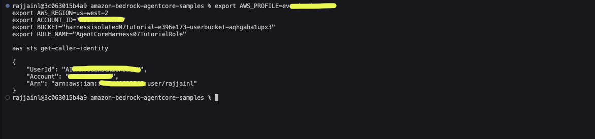
</p>

### 0.1 — Trust policy

The Harness microVM is launched by the AgentCore service, which assumes this role on your behalf. Only the `bedrock-agentcore.amazonaws.com` service principal should be trusted.

```bash
cat > /tmp/harness-trust-policy.json <<'JSON'
{
  "Version": "2012-10-17",
  "Statement": [
    {
      "Effect": "Allow",
      "Principal": { "Service": "bedrock-agentcore.amazonaws.com" },
      "Action": "sts:AssumeRole"
    }
  ]
}
JSON
```

### 0.2 — Create the role

```bash
aws iam create-role \
  --role-name "$ROLE_NAME" \
  --assume-role-policy-document file:///tmp/harness-trust-policy.json \
  --description "Execution role for the 08-isolated-integration Harness tutorial"
```

<p align="left">
  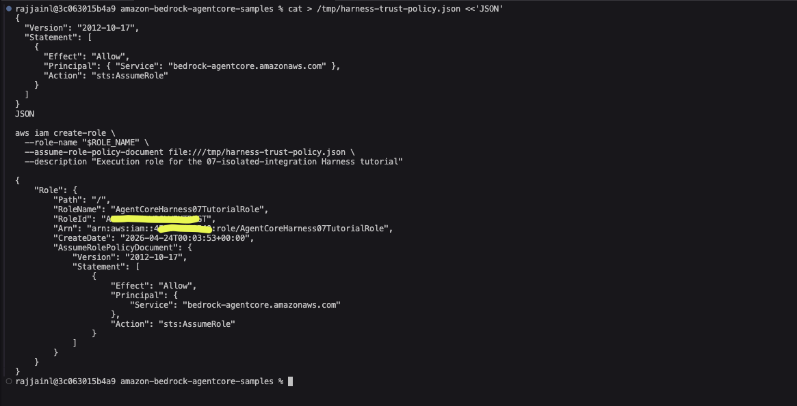
</p>

### 0.3 — Inline policy (permissions the microVM needs)

This policy grants the minimum set to run an ISOLATED-mode harness with Memory + an S3 bucket for the read/write demo. It's scoped tightly — no `Resource: "*"` except where AWS IAM requires it (e.g. `GetAuthorizationToken`, `GetServiceBearerToken`, `X-Ray Put*`).

```bash
cat > /tmp/harness-inline-policy.json <<JSON
{
  "Version": "2012-10-17",
  "Statement": [
    {
      "Sid": "BedrockInvokeModel",
      "Effect": "Allow",
      "Action": ["bedrock:InvokeModel", "bedrock:InvokeModelWithResponseStream"],
      "Resource": [
        "arn:aws:bedrock:*::foundation-model/*",
        "arn:aws:bedrock:*:${ACCOUNT_ID}:inference-profile/*"
      ]
    },
    {
      "Sid": "ECRPullScoped",
      "Effect": "Allow",
      "Action": [
        "ecr:GetDownloadUrlForLayer",
        "ecr:BatchGetImage",
        "ecr:BatchCheckLayerAvailability"
      ],
      "Resource": "arn:aws:ecr:*:${ACCOUNT_ID}:repository/*"
    },
    {
      "Sid": "ECRAuth",
      "Effect": "Allow",
      "Action": [
        "ecr:GetAuthorizationToken",
        "ecr-public:GetAuthorizationToken",
        "sts:GetServiceBearerToken"
      ],
      "Resource": "*"
    },
    {
      "Sid": "CloudWatchLogs",
      "Effect": "Allow",
      "Action": ["logs:CreateLogGroup", "logs:CreateLogStream", "logs:PutLogEvents"],
      "Resource": [
        "arn:aws:logs:*:${ACCOUNT_ID}:log-group:/aws/bedrock-agentcore/*",
        "arn:aws:logs:*:${ACCOUNT_ID}:log-group:/aws/bedrock-agentcore/*:log-stream:*"
      ]
    },
    {
      "Sid": "XRay",
      "Effect": "Allow",
      "Action": ["xray:PutTraceSegments", "xray:PutTelemetryRecords"],
      "Resource": "*"
    },
    {
      "Sid": "AgentCoreMemory",
      "Effect": "Allow",
      "Action": [
        "bedrock-agentcore:CreateMemory",
        "bedrock-agentcore:GetMemory",
        "bedrock-agentcore:ListMemories",
        "bedrock-agentcore:UpdateMemory",
        "bedrock-agentcore:DeleteMemory",
        "bedrock-agentcore:CreateEvent",
        "bedrock-agentcore:GetEvent",
        "bedrock-agentcore:ListEvents",
        "bedrock-agentcore:ListMemoryRecords",
        "bedrock-agentcore:RetrieveMemoryRecords"
      ],
      "Resource": "arn:aws:bedrock-agentcore:*:${ACCOUNT_ID}:memory/*"
    },
    {
      "Sid": "UserS3ReadWrite",
      "Effect": "Allow",
      "Action": ["s3:GetObject", "s3:PutObject", "s3:DeleteObject", "s3:ListBucket"],
      "Resource": [
        "arn:aws:s3:::${BUCKET}",
        "arn:aws:s3:::${BUCKET}/*"
      ]
    }
  ]
}
JSON

aws iam put-role-policy \
  --role-name "$ROLE_NAME" \
  --policy-name HarnessExecutionPolicy \
  --policy-document file:///tmp/harness-inline-policy.json
```

<p align="left">
  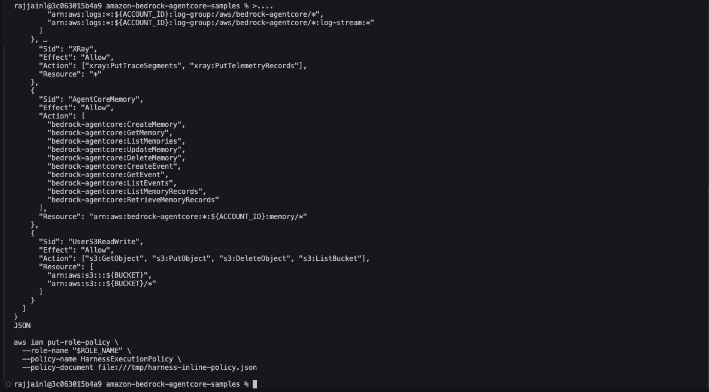
</p>

### 0.4 — Capture the role ARN

```bash
export ROLE_ARN=$(aws iam get-role --role-name "$ROLE_NAME" --query 'Role.Arn' --output text)
echo "ROLE_ARN = $ROLE_ARN"
```

<p align="left">
  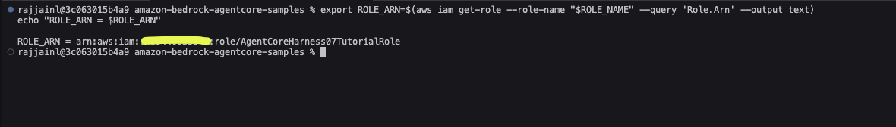
</p>

You'll reference this ARN in Step 1 when wiring it into `harness.json`. If you ever lose track of it, re-run the `get-role` command above.

## Step 1 — Scaffold the project

Create the project from a clean working directory using non-interactive flags. We pass `--network-mode VPC` here because the preview CLI doesn't yet accept `ISOLATED`; we flip to ISOLATED at the API level in step 3.

```bash
mkdir -p ~/agentcore-08-tutorial && cd ~/agentcore-08-tutorial

agentcore create \
  --name HarnessIso07Fresh \
  --model-provider bedrock \
  --memory longAndShortTerm \
  --network-mode VPC \
  --subnets <SUBNET_IDS> \
  --security-groups <SG_ID>
```

Expected output ends with `Harness project created successfully!` and the next-step hint `cd HarnessIso07Fresh && agentcore deploy`.

<p align="left">
  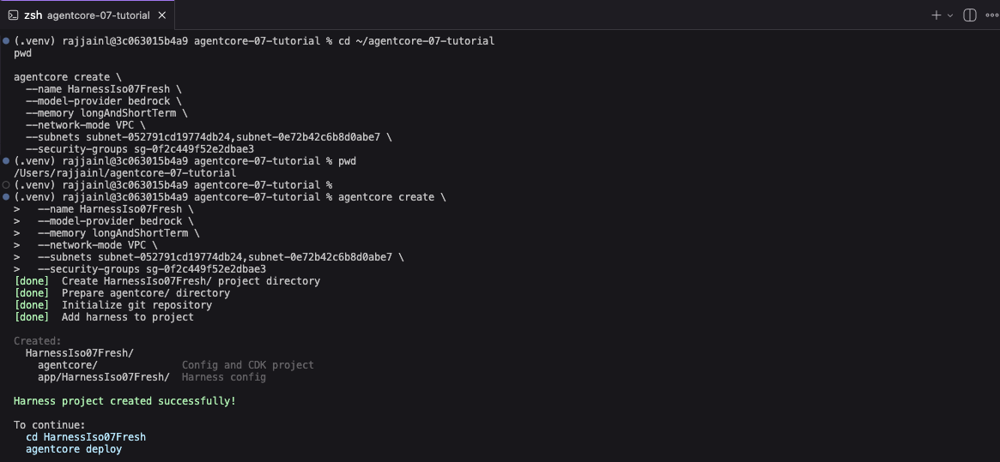
</p>

### Wire the execution role into the generated config

The CLI generates `HarnessIso07Fresh/app/HarnessIso07Fresh/harness.json` without an execution-role reference, which makes CDK synth a fresh role at deploy time. To use the role you created in Step 0 instead, overwrite the file.

> **Heads up:** the commands below reference `$ROLE_ARN`. If you've opened a new terminal since Step 0, re-derive it first:
> ```bash
> export AWS_PROFILE=<your-profile>
> export ROLE_NAME="AgentCoreHarness07TutorialRole"
> export ROLE_ARN=$(aws iam get-role --role-name "$ROLE_NAME" --query 'Role.Arn' --output text)
> echo "ROLE_ARN = $ROLE_ARN"
> ```

```bash
cd HarnessIso07Fresh

cat > app/HarnessIso07Fresh/harness.json <<JSON
{
  "name": "HarnessIso07Fresh",
  "model": { "provider": "bedrock", "modelId": "global.anthropic.claude-sonnet-4-6" },
  "tools": [],
  "skills": [],
  "memory": { "name": "HarnessIso07FreshMemory" },
  "executionRoleArn": "${ROLE_ARN}",
  "networkMode": "VPC",
  "networkConfig": {
    "subnets": ["<SUBNET_ID_A>", "<SUBNET_ID_B>"],
    "securityGroups": ["<SG_ID>"]
  }
}
JSON
```

(Replace `<SUBNET_ID_A>`, `<SUBNET_ID_B>`, and `<SG_ID>` with your values.)

Verify:

```bash
cat app/HarnessIso07Fresh/harness.json
agentcore validate
# Expected: cat shows the full ARN inlined; validate prints `Valid`
```

<p align="left">
  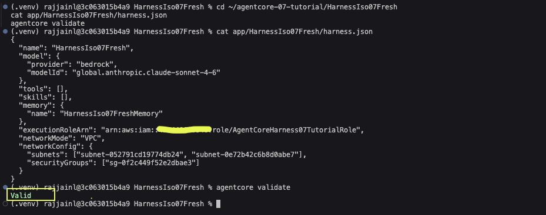
</p>

### Point the project at your AWS target

```bash
cat > agentcore/aws-targets.json <<JSON
[
  { "name": "default", "account": "<YOUR_ACCOUNT_ID>", "region": "us-west-2" }
]
JSON
```

<p align="left">
  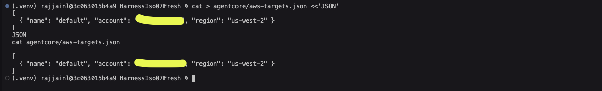
</p>

## Step 2 — Deploy (VPC mode first)

```bash
export AWS_PROFILE=<your-profile>
export AWS_REGION=us-west-2

agentcore deploy
```

The deploy does three things:

1. Bootstraps CDK if this is the first deploy to the account.
2. Creates the Memory resource (`HarnessIso07FreshMemory`) with all four strategies — SEMANTIC, USER_PREFERENCE, SUMMARIZATION, EPISODIC.
3. Creates the Harness resource in `networkMode: VPC`, wired to your subnets / SG / execution role.

<p align="left">
  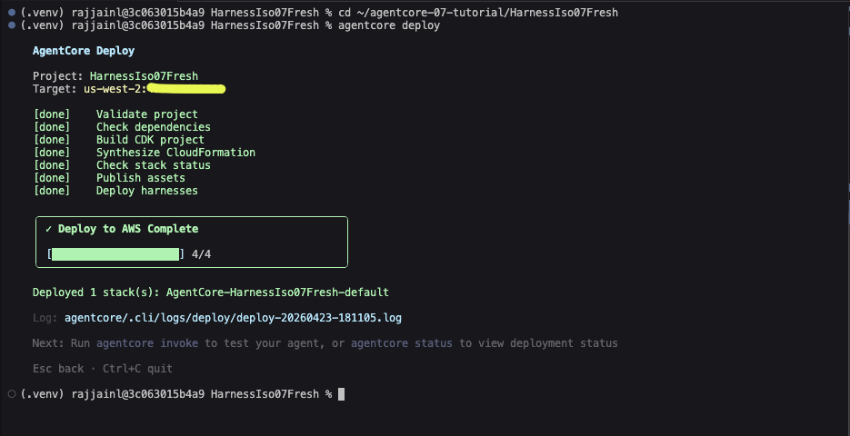
</p>

Poll until ready:

```bash
agentcore status
# Look for: HarnessIso07Fresh: Deployed (READY ...)
```

<p align="left">
  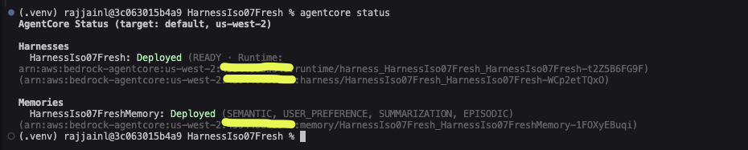
</p>

Capture the IDs that appear in `agentcore status`:

```text
HARNESS_ARN  = arn:aws:bedrock-agentcore:<region>:<acct>:harness/HarnessIso07Fresh_HarnessIso07Fresh-XXXXX
HARNESS_ID   =                                                   HarnessIso07Fresh_HarnessIso07Fresh-XXXXX
MEMORY_ARN   = arn:aws:bedrock-agentcore:<region>:<acct>:memory/HarnessIso07Fresh_HarnessIso07FreshMemory-YYYYY
```

Export them so later steps can reference them as shell variables:

```bash
export HARNESS_ARN="arn:aws:bedrock-agentcore:us-west-2:${ACCOUNT_ID}:harness/HarnessIso07Fresh_HarnessIso07Fresh-XXXXX"
export HARNESS_ID="HarnessIso07Fresh_HarnessIso07Fresh-XXXXX"
export MEMORY_ARN="arn:aws:bedrock-agentcore:us-west-2:${ACCOUNT_ID}:memory/HarnessIso07Fresh_HarnessIso07FreshMemory-YYYYY"
export MEMORY_ID="HarnessIso07Fresh_HarnessIso07FreshMemory-YYYYY"
```

## Step 3 — Flip to ISOLATED

Now that the harness exists, switch its `networkMode` to `ISOLATED` using the helper script. This calls `UpdateHarness` directly — the service API accepts `ISOLATED`; only the CLI's schema validator rejects it today.

Before the commands below, make sure `$HARNESS_ID` is still exported (if you opened a new terminal, re-export from the Step 2 status):

```bash
echo "HARNESS_ID=$HARNESS_ID"
# If empty: export HARNESS_ID="<paste-from-agentcore-status>"
```

> **Env-var tip:** steps 3 through 7 all rely on shell variables (`$HARNESS_ID`, `$MEMORY_ARN`, `$MEMORY_ID`, `$BUCKET`, `$ROLE_ARN`, `$ACCOUNT_ID`). If you open a new terminal or activate a different venv, they're gone. Either re-run the export block from Step 2, or keep a notes file with all the values so you can paste them back in.

<p align="left">
  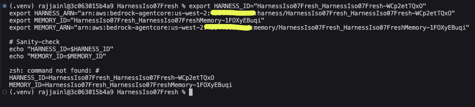
</p>

```bash
python scripts/flip_to_isolated.py \
  --harness-id "$HARNESS_ID" \
  --subnets <SUBNET_IDS> \
  --security-groups <SG_ID> \
  --region us-west-2 \
  --profile <your-profile>
```

Expected tail of output:

```text
UpdateHarness likely accepted (HTTP 200; client-side parse error on a tagged-union response field is a known preview quirk):
  Invalid service response: HarnessMemoryConfiguration must have one and only one member set.

Run verify_harness.py to confirm the live networkMode.
```

<p align="left">
  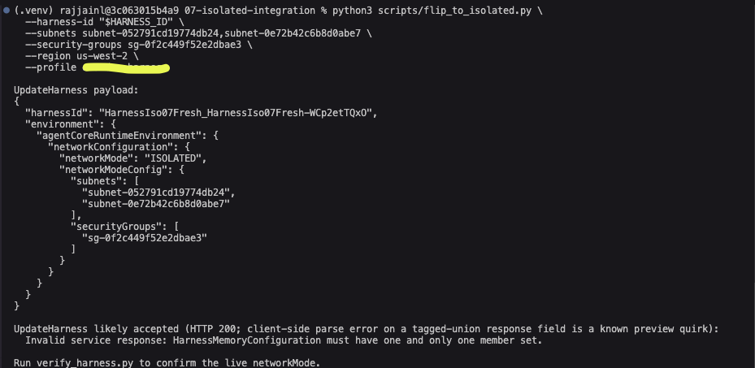
</p>

> **Why the "likely accepted" wording.** In the preview, `GetHarness` / `UpdateHarness` sometimes return a `HarnessMemoryConfiguration` tagged union with zero members populated, and the public boto3 parser rejects it even though the service returned HTTP 200. The request already succeeded by the time parsing runs. The verification script below confirms this from the service's own view.

Verify:

```bash
python scripts/verify_harness.py \
  --harness-id "$HARNESS_ID" \
  --region us-west-2 \
  --profile <your-profile> \
  --field network
```

Expected:

```text
HTTP 200
{
  "networkMode": "ISOLATED",
  "networkModeConfig": {
    "securityGroups": ["<SG_ID>"],
    "subnets": ["<SUBNET_ID_A>", "<SUBNET_ID_B>"]
  }
}
```

<p align="left">
  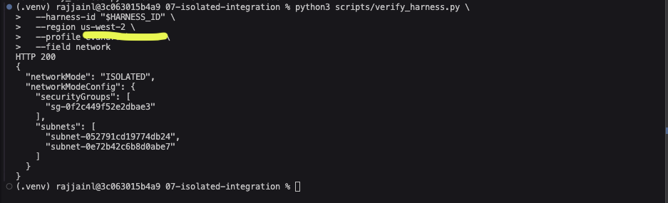
</p>

You can also see the ISOLATED network mode on the Harness in the Amazon Bedrock AgentCore Console — **Build → Harness → HarnessIso07Fresh_HarnessIso07Fresh → Advanced configurations → Network**.

<p align="left">
  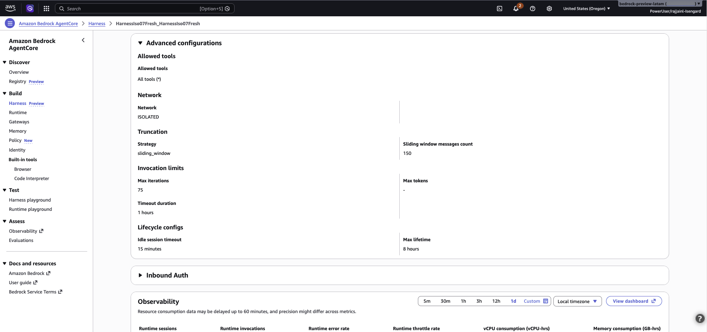
</p>

## Step 4 — Bind the Memory resource to the Harness

The Memory resource was created in step 2 but `agentcore deploy` doesn't automatically bind it to the Harness on the control-plane side — `verify_harness.py --field memory` will show `{}` until you run this step. Without the binding, conversation turns aren't persisted as memory events and the async extractors have nothing to work with.

First, confirm the baseline (memory not yet bound):

```bash
python scripts/verify_harness.py \
  --harness-id "$HARNESS_ID" \
  --region us-west-2 \
  --profile <your-profile> \
  --field memory
# Expected: HTTP 200 and an empty object: {}
```

<p align="left">
  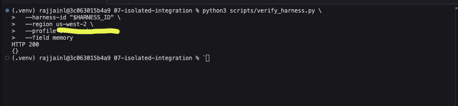
</p>

Attach the memory:

```bash
python scripts/attach_memory.py \
  --harness-id "$HARNESS_ID" \
  --memory-arn "$MEMORY_ARN" \
  --region us-west-2 \
  --profile <your-profile>
```

<p align="left">
  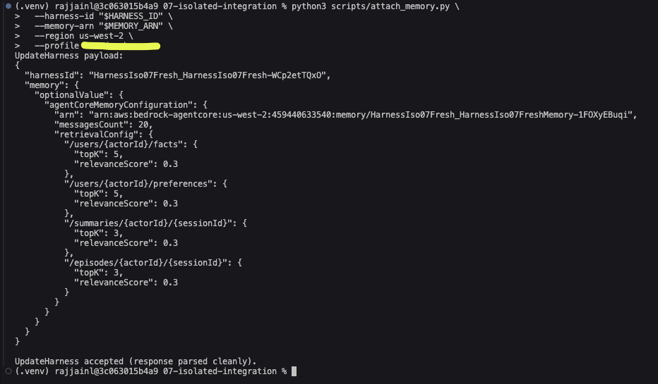
</p>

Verify the binding took effect:

```bash
python scripts/verify_harness.py \
  --harness-id "$HARNESS_ID" \
  --region us-west-2 \
  --profile <your-profile> \
  --field memory
```

Expected: an `agentCoreMemoryConfiguration` block listing your memory ARN, `messagesCount: 20`, and retrieval config for all four namespace templates.

<p align="left">
  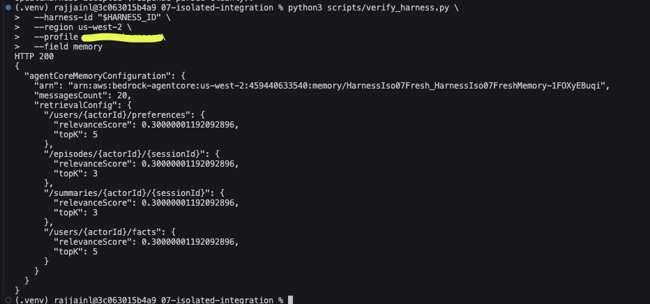
</p>

You can also see the bound Memory resource in the AgentCore Console — **Build → Harness → HarnessIso07Fresh_HarnessIso07Fresh**. The Memory section shows the memory ARN, messages count, and the retrieval configs for all four strategies.

<p align="left">
  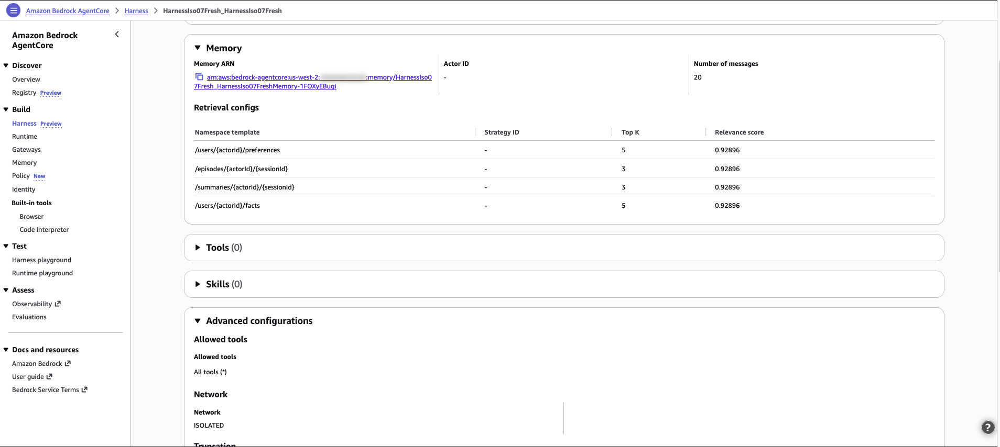
</p>

## Step 5 — Smoke test

> **Working directory reminder:** `agentcore` CLI commands (`invoke`, `deploy`, `status`, `validate`) must be run from inside the agentcore project directory created by `agentcore create` (for this tutorial: `~/agentcore-08-tutorial/HarnessIso07Fresh`). The boto3 helper scripts, by contrast, can be run from anywhere because they take all IDs via flags.

```bash
cd ~/agentcore-08-tutorial/HarnessIso07Fresh
agentcore invoke "Hello! What tools do you have available?"
```

<p align="left">
  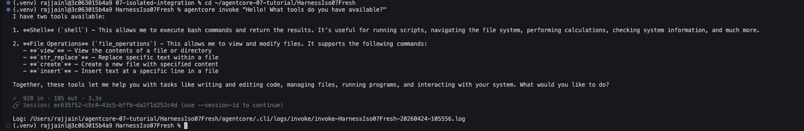
</p>

Expected: a short message listing the `shell` and `file_operations` tools the default container ships with. This proves:

- The microVM booted (ECR pull via PrivateLink endpoints + S3 gateway endpoint for layer blobs)
- It reached Bedrock via `bedrock-runtime` endpoint (model response came back)
- No internet was involved end to end

## Step 6 — S3 read + write through the gateway endpoint

### Step 6a — Confirm the sample input file is in the bucket

The existing bucket already has `input/sample-input.txt` from earlier testing. Confirm it's still there:

```bash
aws s3 ls s3://"$BUCKET"/ --recursive --profile <your-profile> --region us-west-2
# Expected: one line showing `input/sample-input.txt` with its size.
```

<p align="left">
  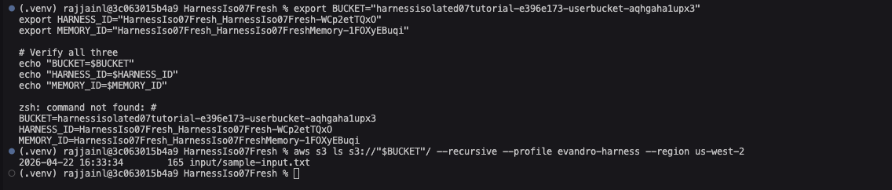
</p>

If the bucket is empty or the file is gone, re-upload:

```bash
echo "Welcome to the AgentCore Harness ISOLATED demo.
This file lives in S3 and the agent will read it via the S3 gateway endpoint." \
  > /tmp/sample-input.txt

aws s3 cp /tmp/sample-input.txt s3://"$BUCKET"/input/sample-input.txt \
  --profile <your-profile> --region us-west-2
```

### Step 6b — Agent reads from S3

The default container has `python3` + `boto3` but **no `aws` CLI**, so we ask the agent to use boto3 directly:

```bash
cd ~/agentcore-08-tutorial/HarnessIso07Fresh

agentcore invoke "Using shell, run this Python one-liner and show me the verbatim output:
python3 -c \"import boto3; c=boto3.client('s3', region_name='us-west-2'); r=c.get_object(Bucket='$BUCKET', Key='input/sample-input.txt'); print('--- S3 READ OK ---'); print(r['Body'].read().decode())\""
```

Expected: the agent prints `--- S3 READ OK ---` followed by the file contents. This proves the microVM reaches S3 through the gateway endpoint — no internet involved.

<p align="left">
  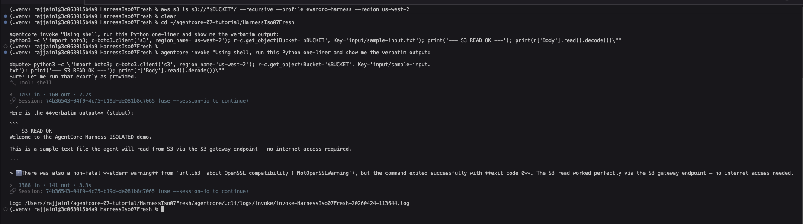
</p>

### Step 6c — Agent writes to S3

```bash
agentcore invoke "Using shell, run this Python one-liner and show me the verbatim output:
python3 -c \"import boto3, datetime; body=f'Written by ISOLATED harness at {datetime.datetime.utcnow().isoformat()}Z'; c=boto3.client('s3', region_name='us-west-2'); c.put_object(Bucket='$BUCKET', Key='output/agent-write.txt', Body=body.encode()); print('--- S3 WRITE OK ---'); print(body)\""
```

<p align="left">
  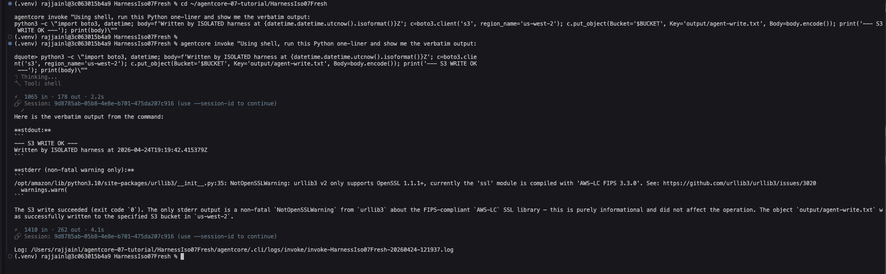
</p>

### Step 6d — Verify the write from your laptop

```bash
aws s3 cp s3://"$BUCKET"/output/agent-write.txt - \
  --profile <your-profile> --region us-west-2
```

Expected: the exact line the agent wrote.

<p align="left">
  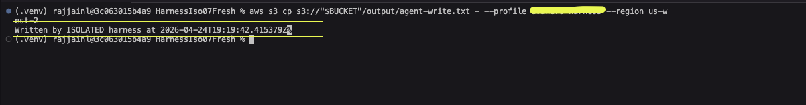
</p>

## Step 7 (optional) — Memory demo

The memory resource you bound in Step 4 is now fully wired. Any invocation — whether through `agentcore invoke` or through the data-plane `invoke_harness` API — will persist turns as memory events, and the four extractors (SEMANTIC, USER_PREFERENCE, SUMMARIZATION, EPISODIC) run asynchronously over them.

This step seeds memory with two quick turns via the CLI, waits for extraction, and inspects the result.

### Seed via the CLI

```bash
export DEMO_SESSION=$(uuidgen | tr '[:upper:]' '[:lower:]')
echo "session: $DEMO_SESSION"

agentcore invoke --session-id "$DEMO_SESSION" \
  "Hi, I'm Raj and I work at AWS on AgentCore. I strongly prefer bullet-point answers."

agentcore invoke --session-id "$DEMO_SESSION" "Remember that about me."
```

**Expected:** two agent responses. The first acknowledges the facts/preference; the second confirms it recalls them within the session.

<p align="left">
  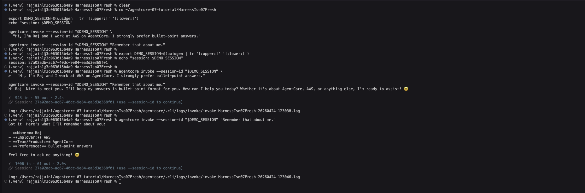
</p>

If you prefer to script the seed programmatically (e.g. for custom prompts, long conversations, or when you want the session ID surfaced in a structured way), run the equivalent via `seed_memory.py`:

```bash
python scripts/seed_memory.py \
  --harness-arn <HARNESS_ARN> \
  --region us-west-2 \
  --profile <your-profile>
```

With no `--prompt` flags the script uses a sensible default pair; supply `--prompt` repeatedly to customize.

### Wait, then inspect

Extractors run asynchronously — give them about 60-90 seconds.

```bash
sleep 90

python scripts/inspect_memory.py \
  --memory-id <MEMORY_ID> \
  --session-id "$DEMO_SESSION" \
  --region us-west-2 \
  --profile <your-profile>
```

`inspect_memory.py` first calls `list_actors` to discover which actor IDs have records (see "Known quirks" below), then for each one lists records under `/users/<actor>/facts` and `/users/<actor>/preferences`. When `--session-id` is provided, session-scoped namespaces (`/summaries/<actor>/<session>` and `/episodes/<actor>/<session>`) are inspected too.

Expected output:

```text
Actors discovered: ['default']

========== actor 'default' ==========

=== /users/default/facts ===
  mem-<uuid>
    The user's name is Raj.
  mem-<uuid>
    The user works at AWS.
  ...

=== /users/default/preferences ===
  mem-<uuid>
    {"context":"...","preference":"Strongly prefers bullet-point answers","categories":["communication","format"]}
```

<p align="left">
  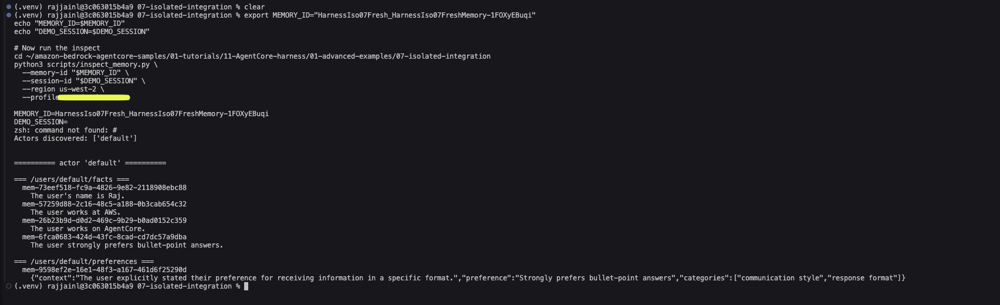
</p>

### Known quirks in this preview

- The runtime writes memory events under `actorId = "default"` regardless of any `--user-id` you pass to `agentcore invoke` or any `userId` you pass to `invoke_harness`. `inspect_memory.py` handles this by iterating over whatever actor IDs `list_actors` returns, so you don't need to know the value up front. (Per-user memory support through the CLI is on the backlog.)
- `GetHarness` / `UpdateHarness` responses can carry a zero-member `HarnessMemoryConfiguration` tagged union. Public boto3's parser rejects it. `verify_harness.py` avoids this by making raw signed HTTPS GETs.

## Troubleshooting

A few gotchas that have tripped up this walkthrough end-to-end. They're platform-level rather than AgentCore-specific, but they all affect how the commands above behave.

### Shell variables disappear between terminal sessions

Steps 3 onward rely on `$HARNESS_ID`, `$MEMORY_ID`, `$MEMORY_ARN`, `$BUCKET`, `$ROLE_ARN`, and `$ACCOUNT_ID`. These live only in the shell that exported them. A new terminal tab, a venv re-activation, or a shell exit resets them all, and subsequent commands silently run with empty strings — which typically surfaces as opaque validation errors from the service (`Invalid length for parameter memoryId, value: 0, valid min length: 12` and similar).

Whenever you return to the walkthrough, either re-run the export block from Step 2, or keep the values in a notes file you can `source`:

```bash
cat > ~/agentcore-08-tutorial/env.sh <<'ENV'
export AWS_PROFILE=<your-profile>
export AWS_REGION=us-west-2
export ACCOUNT_ID="<your-account-id>"
export BUCKET="<your-bucket>"
export ROLE_NAME="AgentCoreHarness07TutorialRole"
export ROLE_ARN="<your-role-arn>"
export HARNESS_ID="<your-harness-id>"
export HARNESS_ARN="<your-harness-arn>"
export MEMORY_ID="<your-memory-id>"
export MEMORY_ARN="<your-memory-arn>"
ENV

# Then at the start of any new terminal:
source ~/agentcore-08-tutorial/env.sh
```

### `python` isn't found on macOS with Homebrew

On macOS, Homebrew Python only installs `python3` — there's no `python` symlink. If you see `zsh: command not found: python` outside an activated venv, either activate the venv (`python` inside the venv works) or use `python3` directly. Both invocations are equivalent when both binaries exist.

### `zsh: bad pattern: [200~...`

This is **bracketed-paste mode** misfiring. zsh normally recognizes the `\e[200~ ... \e[201~` escape sequences that bracket pasted content, but some terminal / profile combinations strip the escape character and leave the raw `[200~` in the command line. The shell then treats `[200~aws` as a glob pattern, fails, and leaves you with half-pasted input.

Fixes:

- Type (or paste one line at a time) instead of pasting a multi-line block
- Enable bracketed-paste for zsh: add `autoload -Uz bracketed-paste; zle -N bracketed-paste` to your `~/.zshrc`
- Or use a terminal/profile known to handle bracketed paste correctly (iTerm2 Default profile, Ghostty, Terminal.app with default shell)

### `quote>` prompt hanging forever

The shell thinks you started a quoted string that's still open. Press **Ctrl+C** to cancel. This usually happens when copying a multi-line heredoc (`cat > file <<'EOF' … EOF`) and the terminating delimiter gets stripped by clipboard or rendering.

If you can't paste heredocs cleanly, split them into multiple `printf`/`echo` commands, or save the JSON body to a file first with a text editor and then `cat the-file | ...`.

### "Unknown service: 'bedrock-agentcore-control'" on script runs

The AgentCore services aren't in Homebrew Python's globally installed boto3 (which is often pinned to an older version). Activate the sample's venv that has the `boto3>=1.42` pinned via `scripts/requirements.txt`, or install a fresh boto3 with `pip install --user boto3` in a clean Python environment. Confirm with:

```bash
python3 -c "import boto3; boto3.Session().client('bedrock-agentcore-control'); print('OK')"
```

### "UpdateHarness likely accepted (HTTP 200; client-side parse error …)"

Not an error — the service accepted the call and returned HTTP 200, but the client-side parser hit a tagged-union quirk on the response. Run `verify_harness.py` to read the harness state authoritatively via a raw signed GET; if the field you updated is now in the expected state, you're done.

## Cleanup

```bash
# In the project directory
agentcore status
agentcore deploy --destroy   # (or the equivalent destroy command in your CLI version)
```

If the CLI's destroy command isn't available in your version, delete the harness and memory directly:

```bash
aws bedrock-agentcore-control delete-harness --harness-id <HARNESS_ID> \
  --profile <your-profile> --region us-west-2
aws bedrock-agentcore-control delete-memory  --memory-id  <MEMORY_ID> \
  --profile <your-profile> --region us-west-2
```

Then tear down the VPC infrastructure using whatever method you used to provision it. Until that's gone, the six interface endpoints continue to accrue charges.

## Files in this folder

| Path | What it is |
|---|---|
| `README.md` | This walkthrough. |
| `images/architecture.png` | Conceptual architecture diagram. |
| `images/console/*.png` | AWS Console screenshots of the prerequisite VPC infrastructure. |
| `images/*.png` | Terminal screenshots from the walkthrough steps (added during validation). |
| `scripts/requirements.txt` | Pinned Python deps for the helper scripts. |
| `scripts/flip_to_isolated.py` | `UpdateHarness` → flip `networkMode` to `ISOLATED`. |
| `scripts/attach_memory.py`    | `UpdateHarness` → bind a Memory resource with retrieval config. |
| `scripts/verify_harness.py`   | Raw signed `GetHarness` that bypasses the boto3 parser quirk. |
| `scripts/seed_memory.py`      | Multi-turn `invoke_harness` driver — optional, use when you want scripted seed prompts. |
| `scripts/inspect_memory.py`   | List actors + memory records across global and session namespaces. |

## What changes when the CLI catches up

When the preview CLI surfaces `ISOLATED` in its schema and wires memory at deploy time:

- Step 1's `--network-mode VPC` becomes `--network-mode ISOLATED`.
- Step 3 (flip to ISOLATED) goes away.
- Step 4 (attach memory) goes away — memory will be bound to the harness at `agentcore deploy` time.
- `verify_harness.py` becomes a nice-to-have debugging aid rather than a required verification step.
- `inspect_memory.py` stays useful as long as the CLI doesn't surface a memory-record browser; `seed_memory.py` becomes optional (kept for power users who want programmatic multi-turn seeding).

At that point the walkthrough collapses into something very close to `06-vpc-integration/README.md`, and this README gets shortened to match.
