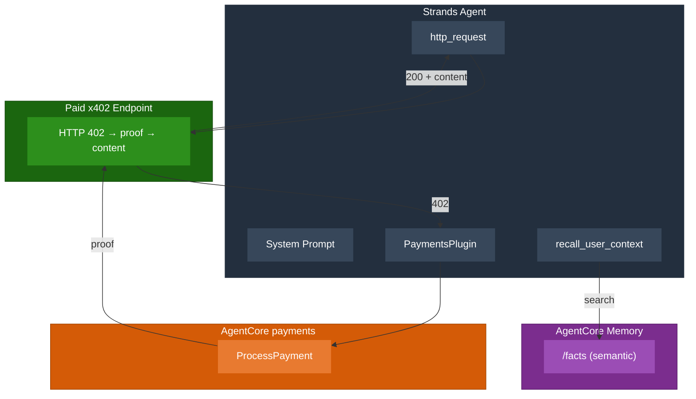
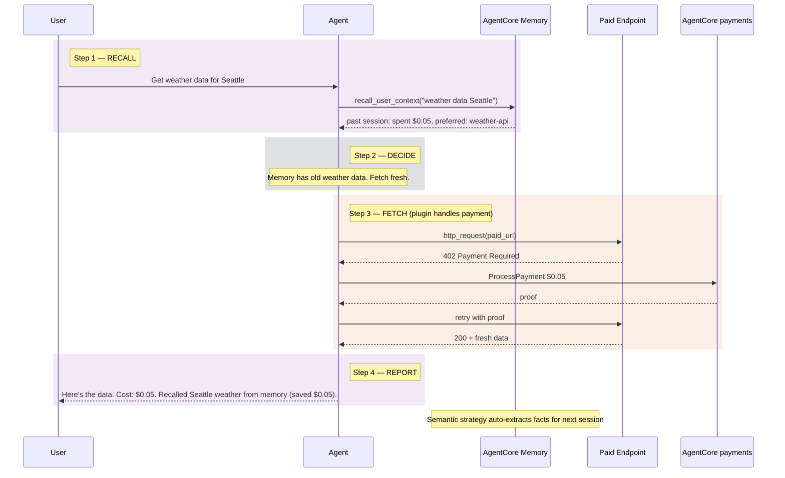
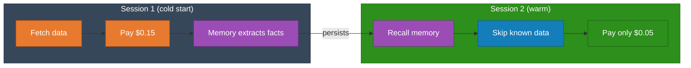

# Tutorial 06 Diagrams

Render with https://mermaid.live/ or mmdc CLI.

AWS-inspired palette:
- Agent: #232F3E (navy), inner: #37475A
- Memory: #7B2D8E (purple), inner: #9B4DB5
- Payments: #D45B07 (orange), inner: #E87A30
- Accent: #147EBA (blue)

## 1. architecture.png

## 2. session_flow.png

## 3. memory_workflow.png

