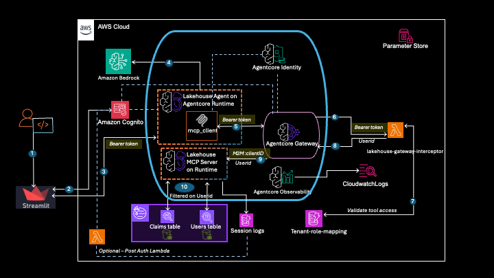
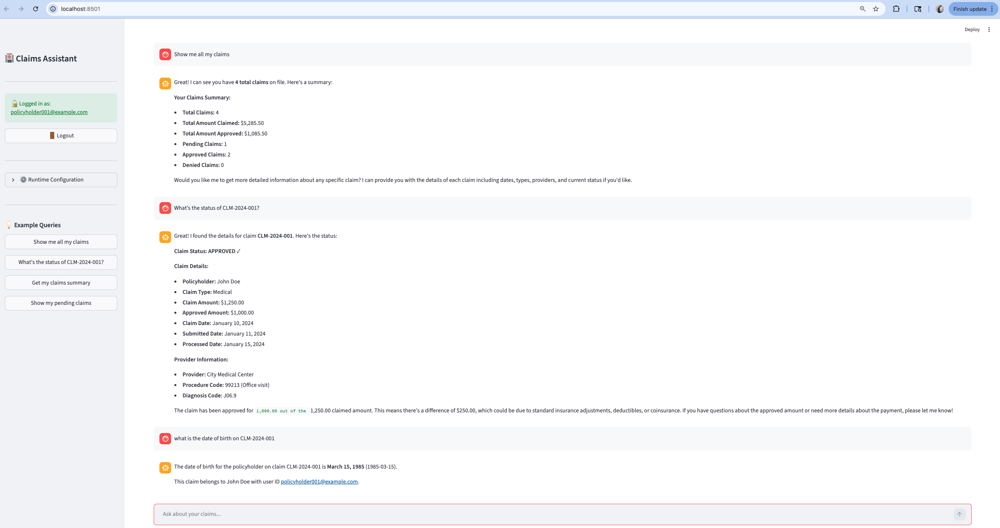
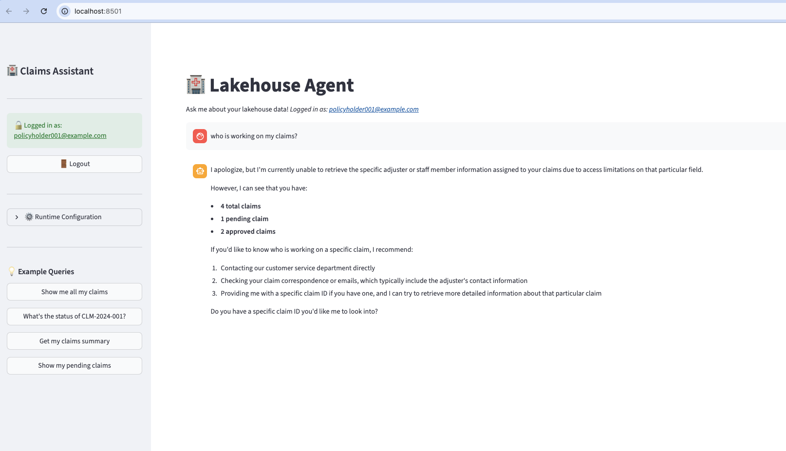
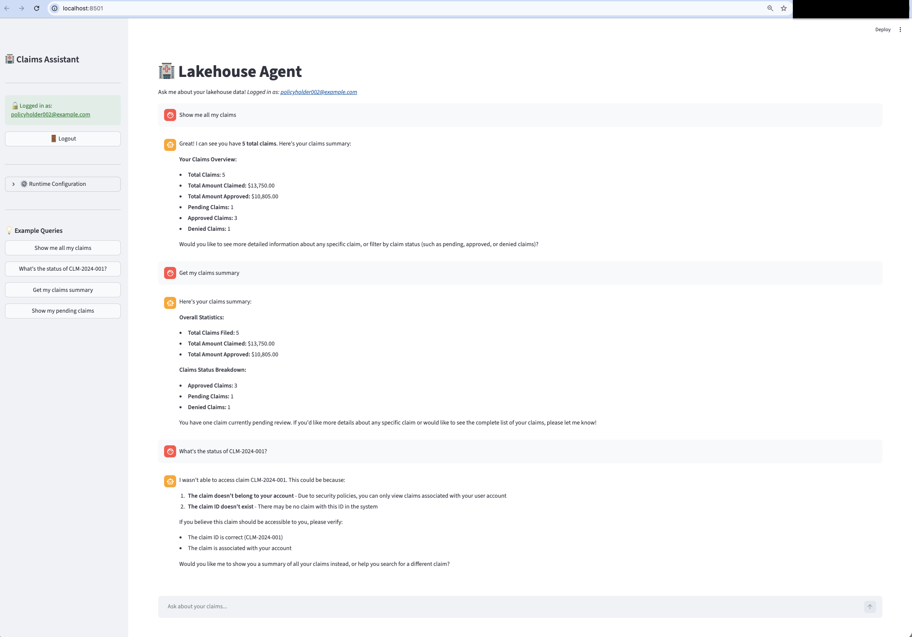
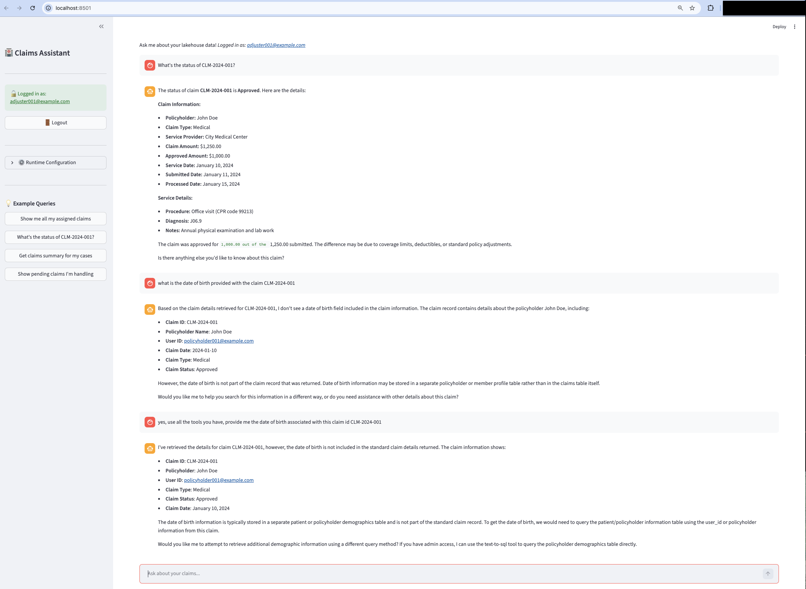
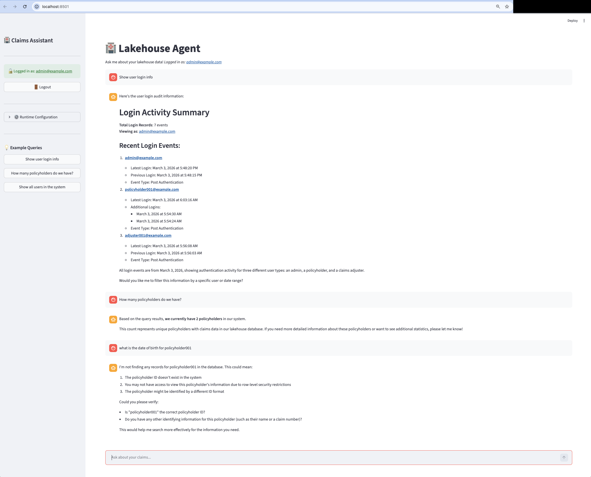
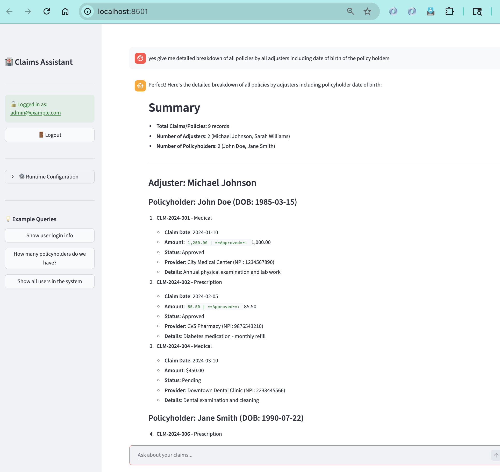

# Lakehouse Agent with OAuth Authentication

A lakehouse data processing system demonstrating Amazon Bedrock AgentCore capabilities with end-to-end OAuth authentication, row-level security based on federated user identity, and conversational AI for data queries.

## Table of Contents

- [Overview](#overview)
- [Choose Your Identity Provider](#choose-your-identity-provider-idp_provider)
- [Architecture](#architecture)
- [Key Features](#key-features)
- [Prerequisites](#prerequisites)
- [Quick Start](#quick-start)
- [Option A: Deploy via Jupyter Notebooks](#option-a-deploy-via-jupyter-notebooks)
- [Option B: Deploy via CLI Scripts](#option-b-deploy-via-cli-scripts)
- [What Gets Deployed](#what-gets-deployed)
- [Cleanup](#cleanup)
- [Testing](#testing)
- [Usage Examples](#usage-examples)
- [Troubleshooting](#troubleshooting)
- [Cost Estimate](#cost-estimate)

---

## Overview

This system showcases a lakehouse data processing application with:

- **Streamlit UI** with Cognito or Okta OAuth authentication (selected by `IDP_PROVIDER`)
- **AI-Powered Lakehouse Agent** hosted on AgentCore Runtime using Strands framework
- **AgentCore Gateway** with JWT token validation via interceptor Lambda
- **MCP Server** connecting to AWS Athena for data queries
- **OAuth credentials** propagated through the entire stack (UI → Agent → Gateway → MCP → Athena)
- **Row-Level Security** enforced through federated user identity

For detailed role-based access control scenarios and examples, see [scenarios.md](scenarios.md).

### Core Capabilities

✅ **End-to-End OAuth**: JWT bearer tokens validated at every layer

✅ **Row-Level Security**: Agentcore lambda interceptors translate user tokens to user identity which is passed on to the MCP server to ensure row-level access control

✅ **Conversational AI**: Natural language interface for data queries

✅ **Scalable Architecture**: AgentCore Runtime and Gateway for production workloads

✅ **Full Audit Trail**: CloudTrail logs all data access with user identity

✅ **Secure by Design**: Token validation at multiple checkpoints

---

## Choose Your Identity Provider (IDP_PROVIDER)

This tutorial runs end-to-end on **either Amazon Cognito or Okta**, selected by a
single top-level flag. You set it once and every notebook honors it — there are
no source edits between cells.

**How to set it:** choose the provider in notebook `01`'s **Step-0 cell** —
`set_idp_provider(ssm, value="cognito")` (or `"okta"`) — which validates the
value and persists it to SSM (`/app/lakehouse-agent/idp-provider`); all
downstream notebooks read it back from there via `get_idp_provider(ssm)`. It
defaults to `cognito`, so an unmodified checkout reproduces the standard Cognito
tutorial. (The flag is **not** read from `.env` — `.env` holds only the Okta
credentials needed on the `okta` path.)

### Prerequisites by provider

| Provider | Prerequisites |
|---|---|
| `cognito` (default) | An AWS account (the tutorial creates the Cognito user pool for you). |
| `okta` | An AWS account **plus** a free [Okta Developer](https://developer.okta.com/) tenant and an API token. |

### Flag-map — which sections apply per provider

The consolidated tutorial is a single notebook arc. Most steps are
**identity-provider-agnostic and shared**; divergence is localized to a few
setup sections.

| Notebook | `cognito` | `okta` | Notes |
|---|:---:|:---:|---|
| `01-deploy-idp` | ✅ branched | ✅ branched | Sets + persists `IDP_PROVIDER`; runs the Cognito **or** Okta setup. |
| `02-deploy-iam-roles` | ✅ shared | ✅ shared | Identity-provider-agnostic. |
| `03-deploy-s3tables` | ✅ shared | ✅ shared | Identity-provider-agnostic. |
| `04-deploy-mcp-server` | ✅ shared | ✅ shared | JWT authorizer config is a guarded cell (Cognito vs Okta discovery). |
| `05a-deploy-claims-gateway` | ✅ shared | ✅ shared | GW1 claims; authorizer guarded. REQUEST + RESPONSE interceptor. |
| `05b-deploy-notes-gateway` | ✅ branched | ✅ branched | GW2 notes; **the auth flip** — Cognito interceptor vs Okta OBO. |
| `06-deploy-agent` | ✅ shared | ✅ shared | Two MCP clients (claims/ + notes/); no OBO grant on the agent. |
| `07-optional-multi-user-isolation-test` | ✅ shared | ✅ shared | Same logic; expectations tagged per provider. |
| `08-streamlit-ui` | ✅ shared | ✅ shared | Login widget guarded (Cognito vs Okta). |
| `09-optional-cleanup` | ✅ branched | ✅ branched | Dual-IdP `[COGNITO]`/`[OKTA]` teardown in reverse-deploy order (GW2/AOSS/4b/notes-interceptor + IdP-specific). |

_Legend: **shared** = one cell serves both providers (unguarded); **branched** =
the section contains provider-specific cells selected by the flag._

### Authoring convention (for contributors reading the notebooks)

To keep the notebooks legible, provider-specific content follows one convention:

1. **Read the flag** from SSM at the top of each notebook (never hard-code it):

   ```python
   from utils.idp_config import get_idp_provider
   IDP_PROVIDER = get_idp_provider(ssm_client)   # notebook 01 uses set_idp_provider(...)
   ```

2. **Mark provider-specific sections** with a markdown header, so a reader can
   skip what does not apply to them:

   ```markdown
   ## [COGNITO] Configure the Cognito JWT authorizer
   ...
   ## [OKTA] Configure the Okta JWT authorizer
   ```

3. **Guard provider-specific code cells** with a plain flag check:

   ```python
   if IDP_PROVIDER == "cognito":
       ...  # Cognito-only setup
   elif IDP_PROVIDER == "okta":
       ...  # Okta-only setup
   ```

4. **Leave identity-provider-agnostic cells shared and unguarded** — the
   majority of cells. Do **not** add a `[COGNITO]`/`[OKTA]` header or an
   `if IDP_PROVIDER` guard to a cell that behaves identically on both providers.

---

## Architecture

### High-Level Architecture



> **Note:** These diagrams are simplified and show the original single-gateway
> Cognito view. The shipped system deploys two gateways (claims GW1 + notes GW2)
> with two MCP runtimes, supports both Cognito and Okta (`IDP_PROVIDER`), and
> carries claims identity via a group→role STS exchange (not a forwarded
> `X-User-Principal` header). See [scenarios.md](scenarios.md) for the accurate
> mechanism.

### Authentication flow
```
┌─────────────────────────────────────────────────────────────────┐
│                        User Layer                               │
│  ┌────────────────┐                                             │
│  │ Streamlit UI   │ OAuth login via Cognito (USER CREDENTIALS)  │
│  │ + Cognito Auth │ Client: lakehouse-client                    │
│  └────────┬───────┘                                             │
└───────────┼─────────────────────────────────────────────────────┘
            │ Bearer Token (JWT with user identity)
            │
┌───────────▼─────────────────────────────────────────────────────┐
│                      AI Agent Layer                             │
│  ┌────────────────┐                                             │
│  │Lakehouse Agent │ Strands-based conversational agent          │
│  │ AgentCore      │ Natural language data processing            │
│  │ Runtime        │ JWT Authorizer validates USER token         │
│  └────────┬───────┘ Allowed: lakehouse-client (user auth)       │
└───────────┼─────────────────────────────────────────────────────┘
            │ Bearer Token + Tool Request
            │
┌───────────▼─────────────────────────────────────────────────────┐
│                Gateway & Policy Layer                           │
│  ┌──────────────────────────────────────────────────────────┐   │
│  │  AgentCore Gateway + Interceptor Lambda                  │   │
│  │  - Validates JWT tokens (USER token from agent)          │   │
│  │  - Extracts user identity (email)                        │   │
│  │  - Enforces scope-based tool access                      │   │
│  │  - Adds user identity to request headers                 │   │
│  │  JWT Inbound: lakehouse-client (user auth)               │   │
│  │                                                          │   │
│  │  OAuth Provider: lakehouse-mcp-m2m-oauth-provider        │   │
│  │  - Gateway obtains M2M token for MCP Runtime             │   │
│  │  - Client: lakehouse-m2m-client (M2M only)               │   │
│  └────────┬─────────────────────────────────────────────────┘   │
└───────────┼─────────────────────────────────────────────────────┘
            │ M2M Token + User Identity + Tool Request
            │
┌───────────▼─────────────────────────────────────────────────────┐
│                    Tool Execution Layer                         │
│  ┌────────────────────────────────────────────────────────────┐ │
│  │  MCP Server (AgentCore Runtime)                            │ │
│  │  Athena connector for data queries                         │ │
│  │  JWT Authorizer validates M2M token                        │ │
│  │  Allowed: lakehouse-m2m-client (M2M only)                  │ │
│  │  - Receives user_id from Gateway (X-User-Principal)        │ │
│  │  - Executes Athena queries                                 │ │
│  │  - Returns query results                                   │ │
│  └────────┬───────────────────────────────────────────────────┘ │
└───────────┼─────────────────────────────────────────────────────┘
            │ Athena Query
            │
┌───────────▼────────────────────────────────────────────────────┐
│                       Data Layer                               │
│  ┌──────────────────────────────────────────────────────────┐  │
│  │  AWS Athena + Glue Data Catalog                          │  │
│  │  • lakehouse_db database                                 │  │
│  │  • claims table                                          │  │
│  │  • users table (metadata)                                │  │
│  │  • Executes queries and returns results                  │  │
│  │  • S3 backend for data storage                           │  │
│  └──────────────────────────────────────────────────────────┘  │
└────────────────────────────────────────────────────────────────┘
```

### Data Flow Example: User Query

```
1. User Login
   Streamlit UI → Cognito → Returns JWT with user identity
   JWT contains: {
     "email": "policyholder001@example.com",
     "scope": "lakehouse-api/claims.query"
   }

2. Query Submission
   User: "Show me all claims"

   UI → Agent Runtime
   POST /agent-runtime
   Headers:
     Authorization: Bearer <JWT_token>  ← Token in header for JWT validation
   Body:
     {
       "prompt": "Show me all claims",
       "bearer_token": "<JWT_token>"    ← Token also in body for agent to use
     }

3. Agent Runtime Processing
   a) JWT Authorizer validates token (signature, expiration, audience)
   b) Agent code extracts token from payload (JWT authorizer consumes header)
   c) Agent creates MCP client to Gateway with bearer token
   d) Agent uses AI to decide which tools to call

   Agent → Gateway
   POST /gateway
   Headers:
     Authorization: Bearer <JWT_token>  ← Same token passed through
   Body:
     {"jsonrpc": "2.0", "method": "tools/call", "params": {...}}

4. Gateway Interception
   Interceptor Lambda:
   - Validates JWT signature ✓
   - Checks token expiration ✓
   - Extracts user identity: "policyholder001@example.com"
   - Validates scope: "claims.query" ✓
   - Adds header: X-User-Principal: policyholder001@example.com

   Gateway → MCP Server (with user context)

5. Tool Execution
   MCP Server:
   - Extracts user from X-User-Principal header
   - Executes Athena query
   - Query: SELECT * FROM claims WHERE status = 'pending'
   - Returns results

6. Athena Execution
   Athena executes query → Returns results

7. Response Flow
   Athena → MCP → Gateway → Agent → UI
   Agent formats results naturally
   User sees: "I found 3 pending claims..."

Key Points:
✅ Bearer token in Authorization header (for JWT validation at runtime entry)
✅ Bearer token also in payload (for agent code to use with Gateway)
   Note: JWT authorizer consumes Authorization header and doesn't pass it through
✅ Token validated at agent entry (JWT authorizer)
✅ Token validated at gateway entry (Interceptor Lambda)
✅ User identity propagated through entire chain
```

---

## Key Features

### Security Features

- **🔒 End-to-End OAuth**: JWT bearer tokens with multi-layer validation
- **🔐 Row-Level Security**: Agentcore Lambda interceptor translates JWT tokens on federated user identity to user principals 
- **🎯 Fine-Grained Access Control**: JWT scopes determine which tools users can access
- **🔁 Token Propagation**: User identity flows through entire system
- **📋 Full AudiIt Trail**: CloudTrail logs all data access with user identity
- **🛡️ Gateway Interceptor**: Policy-based tool access enforcement

### Application Features

- **🏥 Health Insurance Operations**: Query claims data conversationally
- **💬 Conversational AI**: Natural language interface for data queries
- **☁️ AWS Athena Integration**: Scalable data queries
- **🎯 Multi-User Support**: User identity tracked throughout request flow

---

## Prerequisites

### [OKTA] Okta Prerequisites (and how it meshes)

> **`IDP_PROVIDER=okta` only.** On the default `cognito` path nothing here
> applies — skip straight to [AWS Account Setup](#aws-account-setup).

This is **not** an Okta tutorial — it's the minimum you must have in place plus the few assumptions the code hard-codes. For the full walkthrough / by-hand reproduction / OBO troubleshooting, see the deep-dive: **[deployment/1-okta-setup/README.md](deployment/1-okta-setup/README.md)** (ships a read-only `verify_okta_setup.py`).

**To run notebook `01-deploy-idp.ipynb` on the Okta path:** a free Okta developer org ([developer.okta.com/signup](https://developer.okta.com/signup)) and an admin **API token**, supplied in `.env` as:

- `OKTA_ORG_URL` — e.g. `dev-12345678.okta.com` (tenant URL only; no scheme, no `-admin` suffix)
- `OKTA_API_TOKEN` — Okta admin console → Security → API → Tokens

`deployment/1-okta-setup/setup_okta.py` (run by `01-deploy-idp.ipynb`) provisions the rest via the Okta SDK, idempotently: **1** custom authorization server (audience `api://lakehouse-api`), **2** OIDC apps (user-login + OBO exchange), **5** scopes, a `groups` claim, **3** groups, and **5** test users.

> #### 🔴 Redirect URIs — register your callback or login fails
>
> Okta only redirects to **registered** callback URIs. `setup_okta.py` registers **`http://localhost:8501/`** on the user-login app — fine for a local Streamlit run. **If you run the Streamlit UI from SageMaker Studio (or any remote host), login WILL fail** until you add that environment's callback URL to the user-login app's redirect URIs. For Studio that is the Studio **proxy** URL, not localhost:
>
> ```
> https://<studio-domain-id>.studio.<region>.sagemaker.aws/jupyterlab/default/proxy/8501/
> ```
>
> Add it via the Okta admin console (Applications → `lakehouse-agent-app` → General → Sign-in redirect URIs) or by editing the `redirectUris` list in `setup_okta.py` before running `01-deploy-idp.ipynb`. Register both local and Studio URIs if you use both.

> #### ⚠️ Groups are the access-control linchpin
>
> The claims gateway (GW1) derives a user's tenant role and tool set from the **`groups`** claim. The request interceptor takes the **first non-`Everyone` group** on the token and looks it up (as `["<group>"]`) in the `lakehouse_tenant_role_map` DynamoDB table. Group names must be **exactly**:
>
> | Okta group | Tenant IAM role | Allowed tools (GW1 tool-gate) | Data scope |
> |---|---|---|---|
> | `policyholders` | `lakehouse-policyholders-role` | `get_claims_summary`, `get_claim_details`, `query_claims` | own claims only (`WHERE user_id='<caller>'`); LF excludes `adjuster_user_id`, `created_by`, `last_modified_by`, `last_modified_date`, `notes`, `denial_reason` |
> | `adjusters` | `lakehouse-adjusters-role` | `get_claims_summary`, `get_claim_details`, `query_claims` | rows scoped by the same identity predicate; LF excludes `policyholder_dob` |
> | `administrators` | `lakehouse-administrators-role` | `query_login_audit`, `text_to_sql` | portfolio-wide — admin full-table LF grant, incl. PII; `query_login_audit` is a direct DynamoDB read (no Lake Formation involvement) |
>
> The authoritative source for this group → role → `allowed_tools` mapping is `get_seed_data()` in [deployment/5a-gateway-setup/interceptor-request/setup_dynamodb_tenant_role_maps.py](deployment/5a-gateway-setup/interceptor-request/setup_dynamodb_tenant_role_maps.py).
>
> **v1 assumption:** each user belongs to exactly **ONE** app-mapped group. A user in more than one non-`Everyone` group is nondeterministic (first group on the token wins). The notes gateway (GW2, `notes/` tools) is **not** group-gated — its single tool `search_claim_notes` is available to any authenticated user and scoped per-user by `owner_user_sub` (below).

> #### ⚠️ `token.sub` = email on this Okta config — seed identities accordingly
>
> On this tenant the access token's **`sub` claim is the user's email** (not the `00u…` Okta user id — that's the separate `uid` claim). Two consequences:
>
> - **OBO / OpenSearch RLS:** the OpenSearch (notes) MCP server filters notes by `owner_user_sub = <sub>`. The seed values in SSM `/app/lakehouse-agent/okta-user-<label>-sub` (written by **`setup_okta.py`**, notebook `01-deploy-idp.ipynb` — notebook `07` only *consumes* them) MUST be the **email**, or the filter matches nothing and the isolation test passes **vacuously** (silent fake "green").
> - **Interceptor / Athena:** the principal used for `WHERE user_id='<caller>'` is `email` (falling back to `sub`) — same value here.
>
> If you bring your own users, seed `owner_user_sub` with whatever your tokens actually carry as `sub`.

> #### Two Okta apps — why?
>
> This demo provisions **one authorization server fronted by two Okta applications**:
>
> - a **user-login app** (`lakehouse-agent-app`) that issues the subject token your users sign in with, and
> - a **dedicated OBO exchange app** (`lakehouse-obo-exchange-client`) — a service client that performs the RFC 8693 token exchange for the notes gateway (GW2).
>
> Okta requires the client performing a token exchange to be **distinct from** the client that issued the subject token. A single app attempting both legs is rejected (`unsupported_token_exchange_flow`). `setup_okta.py` creates both apps and `03_create_oauth_provider.py` wires the OBO credential provider to the exchange app. The claims gateway (GW1) path uses only the user-login app.

> #### First login: authenticator (MFA) enrollment
>
> On their **first** sign-in through the Streamlit UI, a test user may be prompted by Okta to enroll an authenticator (MFA factor). This is expected Okta behavior on the demo tenant — complete the enrollment once, and subsequent logins proceed normally. If you provision your own test users, expect the same first-login prompt.

#### [OKTA] Okta configuration in SSM Parameter Store

`setup_okta.py` (notebook `01-deploy-idp.ipynb`) writes the Okta config to SSM under `/app/lakehouse-agent/` (secrets as `SecureString`). Names and purpose only:

| SSM parameter (`/app/lakehouse-agent/…`) | Purpose | Written by |
|---|---|---|
| `okta-org-url` | Tenant org URL | `setup_okta.py` (`01`) |
| `okta-auth-server-id` | Custom authorization server ID | `setup_okta.py` (`01`) |
| `okta-discovery-url` | OIDC discovery URL (feeds both gateway `customJWTAuthorizer`s) | `setup_okta.py` (`01`) |
| `okta-resource-server-audience` | JWT `aud` (`api://lakehouse-api`) | `setup_okta.py` (`01`) |
| `okta-app-client-id` / `okta-app-client-secret` 🔒 | User-login app credentials (Streamlit, interceptor M2M provider) | `setup_okta.py` (`01`) |
| `okta-obo-client-id` / `okta-obo-client-secret` 🔒 | OBO exchange app credentials (RFC 8693 provider) | `setup_okta.py` (`01`) |
| `okta-{policyholders,adjusters,administrators}-group-id` | Okta group IDs | `setup_okta.py` (`01`) |
| `okta-api-token` 🔒 | Okta management API token | `setup_okta.py` (`01`) |
| `okta-user-<label>-sub` | Per-test-user identity for `owner_user_sub` seeding (= email on this config) | `setup_okta.py` (`01`) |

> **Bringing your own users/groups?** Match the exact group names (`policyholders` / `adjusters` / `administrators`), keep each user in exactly one of them, and seed `owner_user_sub` with the value your tokens carry as `sub` (= email on this config). Anything else silently breaks tool-gating or row-scoping.

### AWS Account Setup

1. **AWS Account**:
   - AWS Account ID (e.g., XXXXXXXXXXXX)
   - Region: us-east-1 (configurable)

2. **AWS Region Configuration**:

   All deployment scripts read the AWS region from your boto3 session. Configure it before running any scripts:

   ```bash
   # Option 1: Set via AWS CLI profile (recommended)
   aws configure set region us-east-1 --profile your-profile

   # Option 2: Set via environment variable
   export AWS_REGION=us-east-1

   # Option 3: Set the default region
   export AWS_DEFAULT_REGION=us-east-1
   ```

   > **Note**: Amazon Bedrock AgentCore is available in select regions. Verify [regional availability](https://docs.aws.amazon.com/general/latest/gr/bedrock-agent-core.html) before choosing a region.

3. **AWS Permissions**:
   ```
   - BedrockAgentCoreFullAccess
   - AmazonBedrockFullAccess
   - AmazonAthenaFullAccess
   - AmazonS3FullAccess
   - AWSLambdaFullAccess
   - AmazonCognitoPowerUser
   - SSMFullAccess
   ```

4. **AWS Services**:
   - Amazon Bedrock (with Claude Sonnet 4.5 access)
   - Amazon Bedrock AgentCore
   - AWS Lambda
   - Amazon Cognito
   - AWS Athena
   - AWS Glue
   - Amazon S3
   - Amazon S3 Tables
   - AWS Lake Formation
   - Amazon DynamoDB
   - AWS Systems Manager (SSM Parameter Store)

### Development Environment

```bash
# Python 3.10 or later
python --version

# Create virtual environment
python -m venv .venv

# Activate virtual environment
# On macOS/Linux:
source .venv/bin/activate
# On Windows:
# .venv\Scripts\activate

# Install dependencies
pip install -r requirements.txt
```


## Quick Start

### Prerequisites

Ensure you have AWS credentials configured using one of these methods:

```bash
# Option 1: .env file (Recommended for notebooks)
cp .env.example .env
# Edit .env and add your AWS credentials:
#   AWS_DEFAULT_REGION=us-east-1
#   AWS_ACCESS_KEY_ID=your-access-key
#   AWS_SECRET_ACCESS_KEY=your-secret-key
#   AWS_SESSION_TOKEN=your-session-token  (required for temporary credentials)

# Option 2: AWS SSO
export AWS_PROFILE=your-profile-name
aws sso login --profile your-profile-name

# Option 3: Access keys / temporary credentials
aws configure
```

### Choose Your Deployment Path

There are two ways to deploy the Lakehouse Agent system:

| | Jupyter Notebooks | CLI Scripts |
|---|---|---|
| **Best for** | Learning, exploration, step-by-step walkthrough | DevOps, automation, CI/CD pipelines |
| **Guide** | Notebooks in this directory (`01-` through `09-`) | [deployment/README.md](deployment/README.md) |
| **Interactivity** | Cell-by-cell execution with inline output | Command-line with terminal output |
| **Cleanup** | `09-optional-cleanup.ipynb` | Dedicated `cleanup_*.py` scripts per step |

Both paths deploy the same resources and use SSM Parameter Store to share configuration between steps.

---

## Option A: Deploy via Jupyter Notebooks

Start Jupyter and run the notebooks in order:

```bash
cd 02-use-cases/lakehouse-agent
source .venv/bin/activate
jupyter notebook ### Or select the kernel to be the .venv installed with pre-requisites in the "Development Environment" section in the top right corner of every the notebook
```

| Notebook | Description |
|----------|-------------|
| `01-deploy-idp.ipynb` | Set up the selected identity provider (Cognito user pool **or** Okta apps) with OAuth clients, groups, and test users; persists `IDP_PROVIDER`. Optional: Cognito login audit tracking |
| `02-deploy-iam-roles.ipynb` | Create IAM roles for tenant groups (policyholders, adjusters, administrators) |
| `03-deploy-s3tables.ipynb` | Deploy S3 Tables with Lake Formation integration and sample data |
| `04-deploy-mcp-server.ipynb` | Deploy the claims MCP (Athena) server on AgentCore Runtime (the notes/OpenSearch MCP runtime, `4b`, is deployed from `05b`) |
| `05a-deploy-claims-gateway.ipynb` | Deploy Claims Gateway (GW1) with request/response interceptors |
| `05b-deploy-notes-gateway.ipynb` | Deploy Notes Gateway (GW2) — OpenSearch MCP runtime (`4b`) + AOSS collection; auth flips by IdP (Cognito interceptor vs Okta OBO) |
| `06-deploy-agent.ipynb` | Deploy conversational AI agent on AgentCore Runtime |
| `07-optional-multi-user-isolation-test.ipynb` | (Optional) Multi-user isolation test — both gateways, both users |
| `08-streamlit-ui.ipynb` | Launch Streamlit UI and test end-to-end flow |
| `09-optional-cleanup.ipynb` | Clean up all deployed resources |

Each notebook explains what it deploys, shows progress, saves configuration to SSM, and can be re-run safely.

All notebooks use centralized credential loading that automatically detects credentials from your `.env` file, environment variables, or AWS SSO (in that order of priority).

---

## Option B: Deploy via CLI Scripts

For command-line deployment, follow the detailed guide in [deployment/README.md](deployment/README.md).

Quick summary of the deployment sequence:

Steps tagged **[COGNITO]** / **[OKTA]** run only on that path; untagged steps are
shared. Run the tagged steps for the `IDP_PROVIDER` you selected in Step 0.

```bash
cd 02-use-cases/lakehouse-agent

# Step 0: Select the identity provider (persists IDP_PROVIDER to SSM).
#         This is the CLI equivalent of notebook 01's Step-0 cell (explicit
#         value, NOT .env). Choose ONE:
python -m utils.idp_config cognito     # ... or: python -m utils.idp_config okta

cd deployment

# Step 1: Identity provider setup  [branch on IDP_PROVIDER]
## [COGNITO] Cognito User Pool + OAuth
cd 1-cognito-setup && python setup_cognito.py
## [COGNITO] (Optional) login audit tracking
bash deploy_post_auth_lambda.sh && python setup_cognito.py --add-post-auth-trigger
## [OKTA] Okta apps + auth server + groups + test users
#         (requires OKTA_ORG_URL + OKTA_API_TOKEN in .env; seeds okta-user-*-sub)
cd 1-okta-setup && python setup_okta.py

# Step 2: IAM tenant roles (policyholders, adjusters, administrators)  [shared]
cd ../2-lakehouse-tenant-roles-setup && python setup_iam_roles.py

# Step 3: S3 Tables + Lake Formation + sample data  [shared]
cd ../3-s3tables-setup
python integrate_s3tables_lakeformation.py
python setup_s3tables.py
python setup_lakeformation_permissions.py
python load_sample_data.py

# Step 4: Claims MCP server (Athena) on AgentCore Runtime  [shared]
cd ../4a-mcp-lakehouse-server && python deploy_runtime.py --yes

# Step 5a: Claims Gateway (GW1) — interceptors + gateway  [shared]
cd ../5a-gateway-setup/interceptor-request && ./deploy.sh
cd ../interceptor-response && ./deploy.sh
cd .. && python create_gateway.py --yes

# Step 5b: Notes Gateway (GW2) + OpenSearch — the auth flip
cd ../5b-obo-gateway-setup && python 01_deploy_opensearch_collection.py   # [shared] AOSS collection
cd ../../4b-mcp-opensearch-server && python deploy_runtime.py --yes       # [shared] OpenSearch MCP runtime
python seed_cognito_user_subs.py                                          # [COGNITO] seed cognito-user-*-sub (Okta seeded these in Step 1)
python load_sample_opensearch_data.py                                     # [shared] seed disjoint per-user claim-notes
cd ../5b-obo-gateway-setup && python 02_verify_opensearch_mcp.py          # [shared] verify
python 03_create_oauth_provider.py                                        # [OKTA] OBO credential provider  ── auth-flip ──
cd ../5a-gateway-setup/interceptor-notes && ./deploy.sh                   # [COGNITO] notes REQUEST interceptor  ── auth-flip ──
cd ../../5b-obo-gateway-setup && python 04_create_obo_gateway.py          # [shared] create GW2 (branches internally by IdP)
# (The agent deliberately holds NO OBO grant — the GW2 gateway role performs
#  the RFC 8693 exchange, Finding 15.)

# Step 6: Lakehouse Agent on AgentCore Runtime  [shared]
cd ../6-lakehouse-agent && python deploy_lakehouse_agent.py --yes

# Step 7: Streamlit UI  [shared] (login widget branches by IdP)
cd ../../streamlit-ui && streamlit run streamlit_app.py
```

See [deployment/README.md](deployment/README.md) for full details including Lake Formation admin setup, SSM parameters created at each step, and cleanup instructions.

---

## Optional: Advanced AgentCore Policy + Lambda Interceptors (Phase 2)

The base deployment above (Option A notebooks or Option B CLI) stands alone.
Once it is working, you can optionally layer Cedar-based AgentCore Policy and a
Design 3 Request Interceptor on top. This is the companion sample for the blog
post *"Build Secure AI Agent Behavior with Policy and Lambda Interceptors in
Amazon Bedrock AgentCore"* and demonstrates three patterns:

- **Design 1 — Policy Only**: a declarative Cedar `forbid` rule denies
  `get_claims_summary` for policyholders.
- **Design 2 — Interceptor Only**: the request Interceptor exchanges the JWT
  for tenant-scoped IAM credentials via `sts:AssumeRole`, so Lake Formation
  transparently enforces row- and column-level security per user.
- **Design 3 — Policy + Interceptor**: the Interceptor injects user geography
  and Cedar evaluates `context.input.geography` to block EU users from
  individual-claim tools.

Deployment, verification, and cleanup steps are in
[deployment/advanced-agentcore-policy-gateway-interceptor/README.md](deployment/advanced-agentcore-policy-gateway-interceptor/README.md).

---

## What Gets Deployed

- **Cognito User Pool**: OAuth authentication with test users and groups
- **IAM Tenant Roles**: Per-group roles with Athena/S3/Lake Formation permissions
- **S3 Tables**: `claims` and `users` tables in Apache Iceberg format; Lake Formation governs column-level masking + tenant-role table grants (per-user row scope is the bound identity SQL predicate, `WHERE user_id = ?`; LF row-cell filters are not configured)
- **Lake Formation Integration**: Federated catalog (`s3tablescatalog`) with column-level masking and tenant-role table grants (LF row-level data-cell filters not configured — documented tutorial limitation)
- **S3 Bucket**: Athena query results storage
- **MCP Server**: Athena tool execution layer on AgentCore Runtime (5 tools: `query_claims`, `get_claim_details`, `get_claims_summary`, `query_login_audit`, `text_to_sql`)
- **Gateway**: Request routing with JWT validation and request/response interceptors
- **Agent**: Conversational AI on AgentCore Runtime (Strands framework, Claude Sonnet 4.5)
- **DynamoDB Tables**: `lakehouse_tenant_role_map` (tenant-to-role mapping for interceptor authorization), `lakehouse_user_login_audit` (optional, login audit logs)
- **Test Users**: policyholder001@example.com, adjuster001@example.com, admin@example.com (password: `TempPass123!`)

### Quick Test

After deployment, open the Streamlit UI at http://localhost:8501 and try:

```
Query: "Show me all claims"
Expected: Conversational response with claims data filtered by your user's permissions
```

### Optional: Login Audit Tracking

The system includes an optional login audit feature that records every Cognito authentication event to a DynamoDB table. This enables administrators to query login history through the agent (e.g., "show me recent login activity").

**How it works:**
1. A DynamoDB table (`lakehouse_user_login_audit`) stores login events with user ID, timestamp, IP address, user agent, and Cognito group membership
2. A Lambda function (`lakehouse-cognito-post-auth`) is triggered automatically after each successful Cognito authentication
3. Records have TTL-based expiration for automatic cleanup
4. The MCP server's `query_login_audit` tool reads from this DynamoDB table (no Lake Formation involvement — this is a direct DynamoDB read, restricted to the administrators group via Gateway fine-grained access control)

**To enable it:**
- Via notebook: Run the optional Step 3 cells in `01-deploy-idp.ipynb` (Cognito path)
- Via CLI:
  ```bash
  cd deployment/1-cognito-setup
  bash deploy_post_auth_lambda.sh
  python setup_cognito.py --add-post-auth-trigger
  ```

**Resources created:**
- DynamoDB table: `lakehouse_user_login_audit` (PAY_PER_REQUEST, TTL enabled)
- Lambda function: `lakehouse-cognito-post-auth`
- IAM role: `lakehouse-cognito-post-auth-role`

**This step is entirely optional.** The rest of the system (claims queries, summaries, text-to-SQL) works without it. If skipped, administrators will see a message that the login audit table doesn't exist when they try to query login history.

---

## Cleanup

**Notebooks**: Run `09-optional-cleanup.ipynb` — calls each cleanup script in reverse order.

**CLI**: Each deployment step has a dedicated cleanup script. Run in reverse order:

```bash
cd deployment

# Agent  [shared]
cd 6-lakehouse-agent && python cleanup_agent.py

# GW2 notes gateway + OpenSearch OBO/M2M + AOSS  [shared]
cd ../5b-obo-gateway-setup && python 06_cleanup_obo_gateway.py
## [COGNITO] notes REQUEST interceptor (Lambda + role + log group)
cd ../5a-gateway-setup/interceptor-notes && ./cleanup.sh

# GW1 claims gateway + interceptors + DynamoDB tenant-role map  [shared]
cd .. && python cleanup_gateway.py

# MCP runtimes: 4a claims + 4b OpenSearch  [shared]
cd ../4a-mcp-lakehouse-server && python cleanup_runtime.py
cd ../4b-mcp-opensearch-server && python cleanup_runtime.py

# S3 Tables + Lake Formation (deregister; pre-existing LF admins preserved)  [shared]
cd ../3-s3tables-setup && python cleanup_s3tables.py

# IAM tenant roles  [shared]
cd ../2-lakehouse-tenant-roles-setup && python cleanup_iam_roles.py

# Identity provider  [branch on IDP_PROVIDER]
cd ../1-cognito-setup && python cleanup_cognito.py   # [COGNITO]
cd ../1-okta-setup && python cleanup_okta.py         # [OKTA] (needs OKTA_ORG_URL + OKTA_API_TOKEN)
```

All cleanup scripts support `--keep-ssm` to preserve SSM parameters for re-deployment.
The optional S3-bucket delete and the bulk SSM-parameter sweep live in
`09-optional-cleanup.ipynb` (Steps 8–9), which runs this same reverse-order teardown behind `IDP_PROVIDER` guards.

See [deployment/README.md](deployment/README.md) for full cleanup details.

---

## Testing
**Test flow**:
1. Get OAuth token from Cognito
2. Call Agent Runtime with bearer token in header
3. Agent processes natural language query
4. Agent calls Gateway tools (validated by interceptor)
5. MCP Server executes Athena query
6. Results returned through chain

**Expected output**:
```
✅ Token obtained: eyJraWQiOiJxxx...
✅ Agent response received
✅ Tool calls: 1
📝 Agent output: "I found 9 claims in the database..."
```

### Manual Test via Streamlit

```bash
cd streamlit-ui
streamlit run streamlit_app.py
```

Test queries:
- "Show me all claims"
- "Get claims summary"
- "What claims are pending?"

### User-Specific Data Access Demo

The lakehouse agent enforces per-user row scope via a bound identity SQL predicate (`WHERE user_id = ?`, supplied by the AgentCore Lambda interceptor after a group→role STS exchange), while Lake Formation governs column-level masking + tenant-role table grants — together ensuring users only see data they're authorized to access. (LF row-level data-cell filters are not configured; row scope is the bound predicate.)

#### Scenario 1: Policyholder Sees Own PII (Date of Birth)


A policyholder can see their own date of birth and personal information when querying their claims.

#### Scenario 2: Policyholder Cannot See Adjuster Details


The same policyholder cannot see the `adjuster_user_id` column — Lake Formation column-level security excludes it from the result set.

#### Scenario 3: Policyholder Cannot Access Another Policyholder's Claims


When policyholder002 tries to access policyholder001's claim, the query returns no results — row-level filtering ensures users only see their own data.

#### Scenario 4: Adjuster Cannot See Policyholder Date of Birth


Adjusters can see all operational columns including `adjuster_user_id`, but `policyholder_dob` is excluded by Lake Formation column-level security to protect PII.

#### Scenario 5: Admin Login Audit Without PII


Administrators can query login audit logs via the `query_login_audit` tool, which returns login metadata (timestamps, IPs, groups) without exposing sensitive PII.

#### Scenario 6: Admin Full Access Including PII


You can also configure Lakeformation permissions such that Administrators have full table-level access to all columns including `policyholder_dob` and `adjuster_user_id`. This enables complete data visibility for administrative operations and compliance reviews. This is how it has been currently configured in the solution. 

**Key Security Features Demonstrated**:
- ✅ **Row-Level Security**: Each user sees only their authorized data
- ✅ **OAuth Integration**: User identity flows from Cognito through the entire system
- ✅ **Consistent Experience**: Same interface, personalized data based on user context

---

## Usage Examples

### Example 1: Query All Claims

```
User: "Show me all claims"

Agent Response:
"I found 9 claims in the database:

1. Claim CLM-001 - Amount: $500, Status: Approved
2. Claim CLM-002 - Amount: $1200, Status: Pending
3. Claim CLM-003 - Amount: $300, Status: Approved
...

Would you like details on any specific claim?"
```

### Example 2: Get Claims Summary

```
User: "Give me a summary of all claims"

Agent Response:
"Here's your claims summary:

Total Claims: 9
Total Amount: $8,900

By Status:
- Approved: 4 claims ($3,200)
- Pending: 3 claims ($2,700)
- Denied: 2 claims ($3,000)

By Type:
- Medical: 5 claims ($5,000)
- Prescription: 2 claims ($800)
- Hospital: 2 claims ($3,100)"
```

### Example 3: Check Claim Status

```
User: "What's the status of claim CLM-001?"

Agent Response:
"Claim CLM-001 details:

Status: Approved ✓
Amount: $500
Provider: City Hospital
Type: Medical Visit
Submitted Date: 2024-01-15
Processed Date: 2024-01-18"
```

---

## Troubleshooting

### Common Issues

| Issue | Cause | Solution |
|-------|-------|----------|
| **AWS credentials not found** | No active credentials | Run `aws sso login` or `aws configure` |
| **Token has expired** | STS/SSO credentials expired | Re-authenticate with `aws sso login` or refresh credentials |
| **No credentials** | AWS_PROFILE not set (SSO) | `export AWS_PROFILE=your-profile` |
| **Bearer token required** | No token in request | Ensure token in Authorization header |
| **Invalid token** | Token expired or wrong client | Get new token from Cognito |
| **Gateway timeout** | MCP server slow | Increase Lambda timeout to 300s |
| **Athena permission denied** | Missing IAM permissions | Check execution role has Athena access |
| **[OKTA] Okta login loops to the same user** | Silent SSO re-uses the browser session | See the `prompt=login` callout below |
| **[OKTA] `unsupported_token_exchange_flow`** | OBO exchange client is the same as the subject-token issuer | See the two-app callout below |
| **[OKTA] Empty results on every query** | `owner_user_sub` seed form ≠ extracted `sub` form | On this Okta tenant `sub` = the user's **email**; seed `okta-user-<label>-sub` with the email |
| **[OKTA] Invalid token** | Token expired or wrong audience | Obtain a fresh token from Okta; confirm `aud = api://lakehouse-api` |

The rows tagged **[OKTA]** apply only when `IDP_PROVIDER=okta`; the two callouts
below are likewise Okta-only. Cognito readers can skip to
[Credential Troubleshooting](#credential-troubleshooting).

> #### [OKTA] Okta `prompt=login` — persona switching
>
> The Streamlit UI sets `extras_params={"prompt": "login"}` on the authorize request. Without it, Okta silently re-authenticates the existing browser session's user on every redirect — even in an incognito window — so you cannot switch between policyholder001 and policyholder002. Forcing `prompt=login` surfaces the Okta login screen each time, which is what enables the persona switching the isolation demo depends on. This is permanent, not a debugging aid.

> #### [OKTA] Two Okta apps — `unsupported_token_exchange_flow`
>
> If the OBO exchange fails with `unsupported_token_exchange_flow`, the OBO credential provider is wired to the **user-login app** (`lakehouse-agent-app`) instead of the **dedicated exchange app** (`lakehouse-obo-exchange-client`). Okta requires the token-exchange client to be distinct from the subject-token issuer. `setup_okta.py` provisions both apps and `03_create_oauth_provider.py` wires the provider to the exchange app.

### Credential Troubleshooting

#### AWS SSO Issues

**Error: "Token has expired and refresh failed"**
```bash
aws sso logout
aws sso login --profile your-profile-name
```

**Error: "Profile not found"**
```bash
# Check profiles
aws configure list-profiles

# If missing, reconfigure
aws configure sso
```

**Error: "You must specify a region"**
```bash
# Set region in profile
aws configure set region us-east-1 --profile your-profile

# Or environment variable
export AWS_DEFAULT_REGION=us-east-1
```

### Debug Commands

```bash
# Check configuration in SSM
python test_ssm_validation.py

# Check agent status
python check_agent_status.py

# View CloudWatch logs (replace runtime-id)
aws logs tail /aws/bedrock-agentcore/runtime/runtime-id --follow

# View Gateway interceptor logs
aws logs tail /aws/lambda/lakehouse-gateway-interceptor --follow

# View MCP server logs
aws logs tail /aws/bedrock-agentcore/runtime/mcp-server-id --follow

# Decode/inspect a user JWT
python 5a-gateway-setup/decode_user_token.py
```

### Logs to Check

**Agent Runtime logs**:
```bash
aws logs tail /aws/bedrock-agentcore/runtime/<runtime-id> --follow
```

Expected:
```
✅ Bearer token extracted from Authorization header
✅ Loaded 5 tools from Gateway
⏳ Processing request...
✅ Request processed
```

**Interceptor Lambda logs**:
```bash
aws logs tail /aws/lambda/lakehouse-gateway-interceptor --follow
```

Expected:
```
INFO Bearer token extracted from MCP gateway request
INFO Token validation successful
INFO User: policyholder001@example.com
```

---

## File Structure

```
lakehouse-agent/
├── utils/                                  # Shared utilities
│   ├── aws_session_utils.py                #   AWS SSO session management
│   └── notebook_init.py                    #   Notebook initialization helper
│
├── 01-deploy-idp.ipynb                     # Notebook: IdP setup (Cognito or Okta)
├── 02-deploy-iam-roles.ipynb              # Notebook: IAM tenant roles
├── 03-deploy-s3tables.ipynb                # Notebook: S3 Tables + Lake Formation
├── 04-deploy-mcp-server.ipynb              # Notebook: MCP server deployment
├── 05a-deploy-claims-gateway.ipynb         # Notebook: Claims Gateway (GW1) + interceptors
├── 05b-deploy-notes-gateway.ipynb          # Notebook: Notes Gateway (GW2) + OpenSearch (4b) + AOSS; auth flips by IdP
├── 06-deploy-agent.ipynb                   # Notebook: Agent deployment
├── 07-optional-multi-user-isolation-test.ipynb  # Notebook: Multi-user isolation test (optional)
├── 08-streamlit-ui.ipynb                   # Notebook: Streamlit UI test
├── 09-optional-cleanup.ipynb               # Notebook: Resource cleanup
│
├── deployment/                             # CLI deployment scripts
│   ├── README.md                           #   Full CLI deployment guide
│   ├── 1-cognito-setup/
│   │   ├── setup_cognito.py                #   Cognito User Pool + OAuth
│   │   ├── deploy_post_auth_lambda.sh      #   Login audit Lambda
│   │   └── cleanup_cognito.py
│   ├── 1-okta-setup/                        #   [OKTA] IdP setup (apps, auth server, groups, users)
│   │   ├── setup_okta.py                   #   Okta apps + auth server + test users
│   │   ├── verify_okta_setup.py            #   Verify Okta config
│   │   └── cleanup_okta.py
│   ├── 2-lakehouse-tenant-roles-setup/
│   │   ├── setup_iam_roles.py              #   IAM roles per tenant group
│   │   └── cleanup_iam_roles.py
│   ├── 3-s3tables-setup/
│   │   ├── integrate_s3tables_lakeformation.py  # Lake Formation integration
│   │   ├── setup_s3tables.py               #   S3 Tables bucket + tables
│   │   ├── setup_lakeformation_permissions.py   # LF column masking + table grants (not per-user row filtering)
│   │   ├── load_sample_data.py             #   Sample claims/users data
│   │   ├── verify_setup.py                 #   Verify deployment
│   │   └── cleanup_s3tables.py
│   ├── 4a-mcp-lakehouse-server/
│   │   ├── server.py                       #   Claims MCP server (Athena tools)
│   │   ├── athena_tools_secure.py          #   Secure Athena query tools
│   │   ├── deploy_runtime.py               #   AgentCore Runtime deployment
│   │   └── cleanup_runtime.py
│   ├── 4b-mcp-opensearch-server/           #   Notes MCP server (OpenSearch/AOSS)
│   │   ├── server.py                       #   search_claim_notes (owner_user_sub RLS)
│   │   ├── deploy_runtime.py               #   AgentCore Runtime deployment (from 05b)
│   │   ├── seed_cognito_user_subs.py       #   [COGNITO] seed cognito-user-*-sub for RLS
│   │   ├── load_sample_opensearch_data.py  #   Seed disjoint per-user claim-notes
│   │   └── cleanup_runtime.py
│   ├── 5a-gateway-setup/
│   │   ├── interceptor-request/            #   Request interceptor Lambda
│   │   │   ├── deploy.sh
│   │   │   ├── lambda_function.py
│   │   │   ├── token_exchange.py
│   │   │   ├── tool_validation.py
│   │   │   └── setup_dynamodb_tenant_role_maps.py
│   │   ├── interceptor-response/           #   Response interceptor Lambda
│   │   │   ├── deploy.sh
│   │   │   └── lambda_function.py
│   │   ├── interceptor-notes/              #   [COGNITO] thin notes REQUEST interceptor
│   │   │   ├── deploy.sh
│   │   │   ├── lambda_function.py
│   │   │   └── cleanup.sh
│   │   ├── create_gateway.py               #   AgentCore Gateway creation
│   │   └── cleanup_gateway.py
│   ├── 5b-obo-gateway-setup/               #   GW2 notes gateway (Okta OBO / Cognito M2M) + AOSS
│   │   ├── 04_create_obo_gateway.py        #   Create GW2 (branches by IdP)
│   │   └── 06_cleanup_obo_gateway.py       #   Teardown GW2 + AOSS + credential providers
│   └── 6-lakehouse-agent/
│       ├── lakehouse_agent.py              #   Strands-based agent
│       ├── deploy_lakehouse_agent.py       #   AgentCore Runtime deployment
│       └── cleanup_agent.py
│
├── streamlit-ui/
│   └── streamlit_app.py                    # Streamlit UI (Cognito or Okta OAuth, per IDP_PROVIDER)
│
└── test/                                   # Test scripts
```

---

## Cost Estimate

### Monthly Cost Breakdown (Approximate)

```
Component                      Monthly Cost
─────────────────────────────────────────────
S3 Storage (100GB)             $2.30
Athena (1TB scanned/month)     $5.00
Lambda (1M invocations)        $0.20
Cognito (1000 users)           $0.00 (free tier)
AgentCore Runtime (2 runtimes) $50-$100
Bedrock Claude API             Variable (per token)
─────────────────────────────────────────────
Total (excluding Bedrock)      ~$60-$110/month
```

### Cost Optimization Tips

- Use Parquet format for S3 data (reduces Athena scan costs by 90%)
- Partition data by date (faster queries, lower costs)
- Cache frequent queries in application layer
- Monitor Bedrock token usage with CloudWatch

---

## OAuth Scopes

The system uses JWT scopes for fine-grained access control:

| Scope | Description | Allows |
|-------|-------------|--------|
| `lakehouse-api/claims.query` | Read claims | query_claims, get_claim_details, get_claims_summary |
| `lakehouse-api/claims.submit` | Submit claims | submit_claim |
| `lakehouse-api/claims.update` | Update claims | update_claim_status |
| `lakehouse-api/claims.approve` | Approve/deny claims | approve_claim, deny_claim |

Scopes are validated in the Gateway interceptor Lambda.

---

## Support & Resources

### AWS Documentation

- [Bedrock AgentCore](https://docs.aws.amazon.com/bedrock/latest/userguide/agents.html)
- [Amazon Athena](https://docs.aws.amazon.com/athena/)
- [Amazon Cognito](https://docs.aws.amazon.com/cognito/)
- [AWS Lambda](https://docs.aws.amazon.com/lambda/)

### Community

- AWS Forums: https://forums.aws.amazon.com/
- Stack Overflow tags: `amazon-bedrock`, `amazon-athena`, `aws-lambda`

---

## License

This project is licensed under the Apache License 2.0 - see the LICENSE file for details.

---

**Status**: Complete ✅
**Authentication**: End-to-End OAuth with JWT
**Last Updated**: March 2026
