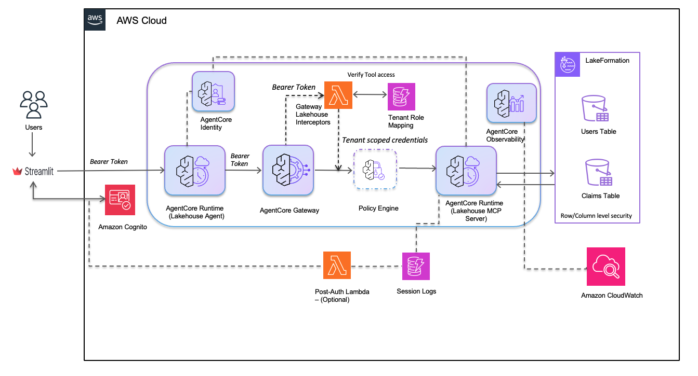

# Lakehouse Agent Deployment Guide (DevOps)

This guide provides the deployment sequence for the Lakehouse Agent system using command-line scripts. For a guided notebook-based approach, see the Jupyter notebooks in the parent directory.

This system supports **two identity providers**, selected by a single flag
`IDP_PROVIDER ∈ {cognito, okta}` (default `cognito`). One deployment sequence
serves both: IdP-specific steps are marked **`[COGNITO]`** or **`[OKTA]`** and
you run only the branch matching your choice; all unmarked steps are shared.
Pick the IdP once in **Step 0** — the CLI equivalent of notebook `01-deploy-idp`'s
Step-0 cell.

The deployment is organized in two phases:

- **Phase 1 — Base lakehouse-agent (Steps 0–8, this guide).** Chooses the IdP,
  then deploys the IdP (Cognito user pool **or** Okta app), IAM tenant roles,
  S3 Tables + Lake Formation, the claims MCP server, the claims Gateway (GW1)
  with request/response Interceptors, the notes Gateway (GW2) over OpenSearch
  Serverless, and the conversational agent.
- **Phase 2 — Advanced AgentCore Policy + Interceptor (optional, CDK).** Layers
  Cedar-based AgentCore Policy on top of Phase 1 and upgrades the request
  Interceptor with geography-based access control. See
  [advanced-agentcore-policy-gateway-interceptor/README.md](advanced-agentcore-policy-gateway-interceptor/README.md).

## Architecture



The diagram above shows the end-to-end architecture deployed by this guide:
users authenticate with Amazon Cognito from the Streamlit UI, the AgentCore
Runtime (Lakehouse Agent) forwards the bearer token to the AgentCore Gateway,
and the Gateway Interceptors validate tool access and exchange the JWT for
tenant-scoped IAM credentials via the Tenant Role Mapping table. Those
credentials let the MCP server query Athena / S3 Tables under Lake Formation
row- and column-level security. AgentCore Identity, Observability, and the
optional Post-Auth Lambda / Session Logs round out the operational surface.
Phase 2 adds the **Policy Engine** between the Gateway and the MCP server so
Cedar rules can deny tool calls declaratively (shown with a dashed outline in
the diagram).

### Dual-IdP topology

The topology is **symmetric across both IdPs** — the flag flips authentication
methods, never the shape of the system (see DR-1). Both `cognito` and `okta`
deploy **two gateways**:

- **GW1 (claims gateway)** is identical on both paths: a REQUEST interceptor
  validates the caller's group claim against the `lakehouse_tenant_role_map`
  DynamoDB table and exchanges the JWT for tenant-scoped IAM credentials, and a
  RESPONSE interceptor filters the tool list by group. The seeded key differs
  only in `claim_name` — `cognito:groups` for Cognito, `groups` for Okta — which
  the seeder branches on `IDP_PROVIDER` so the interceptor lookup hits on both.
- **GW2 (notes gateway)** is where the flag actually flips. It fronts the
  OpenSearch notes MCP server and differs only in how per-user identity reaches
  the target (DR-9):
  - **`[OKTA]`** — an OBO (RFC 8693) credential provider on the gateway target
    exchanges the caller's bearer token, and the OpenSearch server derives the
    owner `sub` from the forwarded bearer.
  - **`[COGNITO]`** — a thin dedicated notes REQUEST interceptor injects the
    caller's `sub` on the body-context channel
    (`params.arguments.context.user_id`); a Cognito M2M provider authenticates
    the gateway→runtime leg.

The agent (Step 8) is IdP-agnostic: it wires two prefixed MCP clients
(`claims/*` → GW1, `notes/*` → GW2) with the same inbound user bearer.

## Prerequisites

1. AWS CLI configured with appropriate permissions
2. Python 3.10+ with virtual environment
3. Docker running (for AgentCore Runtime deployments)
4. `bedrock-agentcore-starter-toolkit` installed

> **`[OKTA]` additional prerequisites.** If you deploy the Okta path
> (`IDP_PROVIDER=okta`), you also need an Okta org (a free
> [developer.okta.com](https://developer.okta.com/signup) tenant is sufficient)
> and an Okta API token (Okta admin console → Security → API → Tokens). Set both
> in `.env` before running Step 1:
>
> ```bash
> OKTA_ORG_URL=dev-12345678.okta.com   # your tenant org URL, no scheme
> OKTA_API_TOKEN=00abC...              # Okta management API token
> ```
>
> `.env` holds Okta credentials **only** — the IdP flag itself is set in Step 0,
> not in `.env` (see DR-12).

### AWS Region Configuration

All deployment scripts read the AWS region from your boto3 session. Configure it before running any scripts:

```bash
# Option 1: Set via AWS CLI profile (recommended)
aws configure set region us-east-1 --profile your-profile

# Option 2: Set via environment variable
export AWS_REGION=us-east-1

# Option 3: Set the default region
export AWS_DEFAULT_REGION=us-east-1

# Verify your region
aws configure get region
```

> **Note**: Amazon Bedrock AgentCore is available in select regions. Verify [regional availability](https://docs.aws.amazon.com/general/latest/gr/bedrock-agent-core.html) before choosing a region.

### Setup

```bash
# Setup virtual environment
cd 02-use-cases/01-conversational-agents/lakehouse-agent
python -m venv .venv
source .venv/bin/activate
pip install -r requirements.txt
pip install bedrock-agentcore-starter-toolkit
```

## Deployment Sequence

### Step 0: Choose Your Identity Provider

Select the IdP once and persist it to SSM (`/app/lakehouse-agent/idp-provider`).
Every downstream step reads the flag from SSM; the default is `cognito`
(R1.4), so Cognito users may skip this step.

```bash
cd 02-use-cases/01-conversational-agents/lakehouse-agent
python -m utils.idp_config cognito   # or: okta
```

This is the command-line equivalent of notebook `01-deploy-idp`'s Step-0 cell
(DR-12). The flag is chosen here — **not** in `.env` (which holds Okta
credentials only).

SSM Parameters created:

- `/app/lakehouse-agent/idp-provider`

---

### Step 1: Deploy Identity Provider

Provisions the identity provider selected in Step 0. Run **only** the branch
that matches your `IDP_PROVIDER`.

#### [COGNITO] Deploy Cognito

Creates User Pool, OAuth clients, groups (policyholders, adjusters, administrators), and test users.
Automatically configures Post-Authentication trigger if Lambda exists.

```bash
cd deployment/1-cognito-setup
python setup_cognito.py
```

SSM Parameters created:

- `/app/lakehouse-agent/cognito-user-pool-id`
- `/app/lakehouse-agent/cognito-user-pool-arn`
- `/app/lakehouse-agent/cognito-app-client-id`
- `/app/lakehouse-agent/cognito-app-client-secret` (SecureString)
- `/app/lakehouse-agent/cognito-m2m-client-id`
- `/app/lakehouse-agent/cognito-m2m-client-secret` (SecureString)
- `/app/lakehouse-agent/cognito-domain`
- `/app/lakehouse-agent/cognito-resource-server-id`
- `/app/lakehouse-agent/cognito-region`

Test users created:

- `policyholder001@example.com` → policyholders group
- `policyholder002@example.com` → policyholders group
- `adjuster001@example.com` → adjusters group
- `adjuster002@example.com` → adjusters group
- `admin@example.com` → administrators group

Default password: `TempPass123!`

> **Important — first-time sign-in required.** `setup_cognito.py` creates users with the default password as a _temporary_ password, so every user starts in Cognito `FORCE_CHANGE_PASSWORD` state. `admin_initiate_auth` returns a `NEW_PASSWORD_REQUIRED` challenge (not an `AuthenticationResult`) until each user signs in once and completes the challenge. The Streamlit UI (Step 9) has a built-in challenge handler — launch it and sign in once per user, setting the new password to the same `TempPass123!` (the user pool does not configure `PasswordHistorySize`, so reusing the value is allowed). Only after this step will plain `admin_initiate_auth` calls (for example, from `verify_policy.py` in the Phase 2 sample) succeed.

#### Optional: Enable Login Audit Logging

To enable login audit logging, deploy the Post-Authentication Lambda before running setup_cognito.py:

```bash
# Deploy Lambda and DynamoDB table first
bash deploy_post_auth_lambda.sh

# Then run setup (will automatically configure the trigger)
python setup_cognito.py
```

Or add the trigger to an existing User Pool:

```bash
# Deploy Lambda if not already deployed
bash deploy_post_auth_lambda.sh

# Add trigger to existing pool
python setup_cognito.py --add-post-auth-trigger
```

This creates:

- DynamoDB table: `lakehouse_user_login_audit`
- Lambda function: `lakehouse-cognito-post-auth`
- IAM role: `lakehouse-cognito-post-auth-role`

See [POST_AUTH_SETUP.md](1-cognito-setup/POST_AUTH_SETUP.md) for details.

#### [OKTA] Deploy Okta

Creates the Okta OIDC application, the dedicated OBO token-exchange service app
(`lakehouse-obo-exchange-client`), a custom authorization server, groups
(policyholders, adjusters, administrators), and test users. Requires
`OKTA_ORG_URL` and `OKTA_API_TOKEN` in `.env` (see Prerequisites).

```bash
cd deployment/1-okta-setup
pip install -r requirements.txt
python setup_okta.py
```

This step also seeds one `okta-user-<label>-sub` per test user, set to the
user's **email/login** (the value Okta places in the access-token `sub` claim),
so the notes path can match owners by construction later.

SSM Parameters created:

- `/app/lakehouse-agent/okta-org-url`
- `/app/lakehouse-agent/okta-auth-server-id`
- `/app/lakehouse-agent/okta-app-client-id`
- `/app/lakehouse-agent/okta-app-client-secret` (SecureString)
- `/app/lakehouse-agent/okta-obo-client-id`
- `/app/lakehouse-agent/okta-obo-client-secret` (SecureString)
- `/app/lakehouse-agent/okta-api-token` (SecureString)
- `/app/lakehouse-agent/okta-resource-server-audience`
- `/app/lakehouse-agent/okta-discovery-url`
- `/app/lakehouse-agent/okta-policyholders-group-id`
- `/app/lakehouse-agent/okta-adjusters-group-id`
- `/app/lakehouse-agent/okta-administrators-group-id`
- `/app/lakehouse-agent/okta-user-<label>-sub` (one per test user)

Verify the Okta setup at any time:

```bash
python verify_okta_setup.py
```

---

### Step 2: Deploy IAM Roles for Tenant Groups

Creates IAM roles for policyholders, adjusters, and administrators groups with Athena/S3 permissions.
These roles are required before setting up Lake Formation permissions on S3 Tables.

```bash
cd ../2-lakehouse-tenant-roles-setup
python setup_iam_roles.py
```

SSM Parameters created:

- `/app/lakehouse-agent/roles/lakehouse-policyholders-role`
- `/app/lakehouse-agent/roles/lakehouse-adjusters-role`
- `/app/lakehouse-agent/roles/lakehouse-administrators-role`

---

### Step 3: Deploy S3 Tables Database

Creates S3 Tables bucket, namespace, tables (claims, users), and S3 bucket for query results.
Integrates S3 Tables with Lake Formation and configures permissions for tenant roles (requires roles from Step 2).

#### 3a. Grant Lake Formation Admin Permissions (One-time Setup)

Before running the integration script, your AWS role needs Lake Formation administrator permissions.

**Option 1: AWS Console**

1. Go to AWS Lake Formation console
2. Navigate to "Administrative roles and tasks" → "Data lake administrators"
3. Click "Choose administrators"
4. Add your IAM role (e.g., `arn:aws:iam::{account_id}:role/YourRole`)
5. Click "Save"

**Option 2: AWS CLI**

```bash
# Get current Lake Formation admins
aws lakeformation get-data-lake-settings --region us-east-1

# Add your role (replace with your role ARN)
aws lakeformation put-data-lake-settings \
  --data-lake-settings '{
    "DataLakeAdmins": [
      {
        "DataLakePrincipalIdentifier": "arn:aws:iam::123456789012:role/YourRole"
      }
    ]
  }' \
  --region us-east-1
```

> ⚠️ **`put-data-lake-settings` replaces the entire `DataLakeAdmins` list — it
> does not append.** Passing a single-element array (as shown above for
> brevity) will **remove every other existing data-lake administrator**. Unless
> you are certain the account has no other admins, use the **union-append**
> pattern instead: read the current admins with `get-data-lake-settings`, add
> your role ARN to the existing `DataLakeAdmins` array, and write back the
> **union** — never a bare single-element list. This preserves pre-existing
> admins (the notebook path applies the same read → append → write union and
> never clobbers).

#### 3b. Integrate S3 Tables with Lake Formation

```bash
cd ../3-s3tables-setup
python integrate_s3tables_lakeformation.py
```

This script:

- Creates IAM role for Lake Formation data access
- Registers S3 Tables bucket with Lake Formation (with federation enabled)
- Creates federated catalog `s3tablescatalog` for S3 Tables
- Grants the calling principal permissions on the catalog

SSM Parameters created:

- `/app/lakehouse-agent/lakeformation-role-arn`
- `/app/lakehouse-agent/s3tables-catalog-name`

#### 3c. Create S3 Tables

```bash
python setup_s3tables.py  # Uses default: lakehouse-{account_id}-{random}
# Or specify custom name:
# python setup_s3tables.py --table-bucket-name my-lakehouse
```

SSM Parameters created:

- `/app/lakehouse-agent/table-bucket-name`
- `/app/lakehouse-agent/table-bucket-arn`
- `/app/lakehouse-agent/namespace`
- `/app/lakehouse-agent/catalog-name`
- `/app/lakehouse-agent/s3-bucket-name`

#### 3d. Configure Lake Formation Permissions

```bash
python setup_lakeformation_permissions.py
```

Lake Formation permissions configured:

- Grants database and table permissions to tenant roles (from Step 2)
- Configures column-level access for row-level security
- Sets up data filters for policyholders (user_id column)

#### 3e. Load Sample Data

```bash
python load_sample_data.py
```

This script assumes the administrators role (created in Step 2) to insert data via Athena.
The admin role has Lake Formation permissions granted in Step 3d.

---

### Step 4: Deploy Claims MCP Server

Deploys the claims MCP Athena server (`4a-mcp-lakehouse-server`) to AgentCore Runtime.

```bash
cd ../4a-mcp-lakehouse-server
python deploy_runtime.py --yes
```

SSM Parameters created:

- `/app/lakehouse-agent/mcp-server-runtime-arn`

> **Note:** the second MCP runtime — the OpenSearch notes server
> (`4b-mcp-opensearch-server`) — is deployed later in **Step 7 (Notes Gateway)**,
> because it depends on the OpenSearch Serverless collection created there.

---

### Step 5: Deploy Claims Gateway (GW1) Interceptors

Deploys the request and response interceptor Lambdas for the claims gateway
(GW1) and creates the tenant role mapping table.

#### 5.1 Deploy Request Interceptor

```bash
cd ../5a-gateway-setup/interceptor-request
./deploy.sh
```

This script:

1. Packages Lambda function with dependencies (python-jose, cryptography)
2. Creates Lambda execution role
3. Deploys request interceptor Lambda function
4. Creates DynamoDB table `lakehouse_tenant_role_map`
5. Seeds tenant-to-role mappings with allowed tools

> **Dual-IdP note:** the seeder reads `IDP_PROVIDER` once and branches the
> `claim_name` it writes — `cognito:groups` for Cognito, `groups` for Okta — so
> the interceptor's group-claim lookup hits on whichever IdP is active. The
> `claim_value` and `allowed_tools` are IdP-invariant.

SSM Parameters created:

- `/app/lakehouse-agent/interceptor-lambda-arn`
- `/app/lakehouse-agent/interceptor-lambda-role-arn`
- `/app/lakehouse-agent/tenant-role-mapping-table`

#### 5.2 Deploy Response Interceptor

```bash
cd ../interceptor-response
./deploy.sh
```

This script:

1. Packages Lambda function with dependencies (python-jose, cryptography)
2. Uses shared Lambda execution role from request interceptor
3. Deploys response interceptor Lambda function
4. Filters tool list based on user group permissions from DynamoDB
5. Always removes system tools (e.g., x_amz_bedrock_agentcore_search)

SSM Parameters created:

- `/app/lakehouse-agent/response-interceptor-lambda-arn`

---

### Step 6: Deploy AgentCore Claims Gateway (GW1)

Creates the claims gateway (GW1) connecting to the claims MCP server with the
request and response interceptors from Step 5. On the Okta path the gateway
authorizer is created against the Okta authorization server; on the Cognito
path against the Cognito user pool. The branching lives inside
`create_gateway.py` (read the flag once, DR-8) — you run the same command
either way.

```bash
cd ..
python create_gateway.py --yes
```

SSM Parameters created:

- `/app/lakehouse-agent/gateway-id`
- `/app/lakehouse-agent/gateway-arn`
- `/app/lakehouse-agent/gateway-url`
- `/app/lakehouse-agent/gateway-name`

---

### Step 7: Deploy Notes Gateway (GW2) + OpenSearch

Deploys the notes path: an OpenSearch Serverless (AOSS) collection, the
OpenSearch notes MCP runtime, sample notes data, and the notes gateway (GW2).
This is where the IdP flag flips (DR-9): Okta uses an OBO credential provider,
Cognito uses a thin notes REQUEST interceptor. Run the sub-steps in order; the
auth-flip sub-step (7.5) runs **only** the branch matching your `IDP_PROVIDER`.
Mirrors notebook `05b-deploy-notes-gateway`.

**7.1 Create the AOSS collection** (`lakehouse-claim-notes`) — shared:

```bash
cd ../5b-obo-gateway-setup
python 01_deploy_opensearch_collection.py
```

SSM: `/app/lakehouse-agent/opensearch-collection-arn`, `/app/lakehouse-agent/opensearch-collection-endpoint`

**7.2 Deploy the OpenSearch notes MCP runtime** (`4b`) — shared:

```bash
cd ../4b-mcp-opensearch-server
python deploy_runtime.py --yes
```

SSM: `/app/lakehouse-agent/opensearch-mcp-runtime-arn`, `/app/lakehouse-agent/opensearch-mcp-runtime-id`

**7.3 `[COGNITO]` Seed Cognito user subs** — Cognito only (Okta seeded its
`okta-user-*-sub` in Step 1). Writes `cognito-user-<label>-sub` = each test
user's Cognito `sub` so notes owners match by construction:

```bash
python seed_cognito_user_subs.py
```

SSM: `/app/lakehouse-agent/cognito-user-<label>-sub` (one per test user)

**7.4 Load sample notes data** into the AOSS `claim-notes` index — shared
(signs directly to the collection; requires 7.1 + the seeded subs):

```bash
python load_sample_opensearch_data.py
```

**7.5 Configure GW2 authentication** — run **one** branch:

```bash
# [OKTA] Create the OBO (RFC 8693) credential provider
cd ../5b-obo-gateway-setup
python 03_create_oauth_provider.py
```

SSM (`[OKTA]`): `/app/lakehouse-agent/obo-credential-provider-arn`

```bash
# [COGNITO] Deploy the thin notes REQUEST interceptor
cd ../5a-gateway-setup/interceptor-notes
./deploy.sh
```

SSM (`[COGNITO]`): `/app/lakehouse-agent/notes-interceptor-lambda-arn`
(also creates IAM role `lakehouse-notes-interceptor-role`; the Cognito M2M
provider `lakehouse-notes-cognito-oauth-provider` for the gateway→runtime leg
is created in 7.6)

**7.6 Create the notes gateway (GW2)** — shared entrypoint; branches internally
on `IDP_PROVIDER` (the DR-11 pre-flight IdP-mismatch guard fires here):

```bash
cd ../5b-obo-gateway-setup   # from interceptor-notes: cd ../../5b-obo-gateway-setup
python 04_create_obo_gateway.py
```

SSM Parameters created:

- `/app/lakehouse-agent/notes-gateway-id`
- `/app/lakehouse-agent/notes-gateway-arn`
- `/app/lakehouse-agent/notes-gateway-url`
- `/app/lakehouse-agent/notes-gateway-name`

> **Note:** the agent deliberately holds **NO** OBO grant — the GW2 gateway role
> performs the RFC 8693 exchange with its own role (Finding 15). No agent-IAM
> patch step is needed.

---

### Step 8: Deploy Lakehouse Agent

Deploys the conversational AI agent to AgentCore Runtime. The agent is
IdP-agnostic: it wires **two prefixed MCP clients** — `claims/*` → GW1
(`gateway-url`) and `notes/*` → GW2 (`notes-gateway-url`) — authenticated by the
same inbound user bearer. It holds **no OBO grant** (Finding 15); if
`notes-gateway-url` is absent it falls back to claims-only.

```bash
cd ../6-lakehouse-agent
python deploy_lakehouse_agent.py --yes
```

SSM Parameters created:

- `/app/lakehouse-agent/agent-runtime-arn`

---

### Step 9: Run Streamlit UI (Optional)

```bash
cd ../../streamlit-ui
streamlit run streamlit_app.py
```

Access at: http://localhost:8501

---

### Step 10 (Optional): Layer AgentCore Policy + Design 3 Interceptor (Phase 2)

To add declarative Cedar-based access control and geography-aware request
enrichment on top of the Phase 1 Gateway, follow
[advanced-agentcore-policy-gateway-interceptor/README.md](advanced-agentcore-policy-gateway-interceptor/README.md).

This Phase 2 deployment adds:

- `CfnPolicyEngine` with four Cedar policies (`permit_all` + three `forbid` rules).
- An IAM inline policy granting the existing Gateway role policy-evaluation permissions.
- A single `UpdateGateway` call that re-attaches both Interceptors together with
  the Policy Engine in `ENFORCE` mode.
- An upgraded request Interceptor Lambda that injects user geography so Cedar
  can enforce data-residency rules (Design 3).

Prerequisite: Phase 1 Steps 0–8 must be deployed first — the CDK stack reads
every ARN / ID it needs from SSM parameters populated by those steps.

---

## Quick Reference

Steps are marked **shared** (run on both IdPs), **`[COGNITO]`**, or **`[OKTA]`**
(run only on the matching path).

| Step          | IdP          | Directory                                       | Command                                           |
| ------------- | ------------ | ----------------------------------------------- | ------------------------------------------------- |
| 0             | shared       | `.` (repo root)                                 | `python -m utils.idp_config cognito` (or `okta`)  |
| 1             | `[COGNITO]`  | `1-cognito-setup`                               | `python setup_cognito.py`                         |
| 1             | `[OKTA]`     | `1-okta-setup`                                  | `python setup_okta.py`                            |
| 2             | shared       | `2-lakehouse-tenant-roles-setup`                | `python setup_iam_roles.py`                       |
| 3a            | shared       | Lake Formation Console/CLI                      | Grant LF admin (one-time, **union-append**)       |
| 3b            | shared       | `3-s3tables-setup`                              | `python integrate_s3tables_lakeformation.py`      |
| 3c            | shared       | `3-s3tables-setup`                              | `python setup_s3tables.py`                        |
| 3d            | shared       | `3-s3tables-setup`                              | `python setup_lakeformation_permissions.py`       |
| 3e            | shared       | `3-s3tables-setup`                              | `python load_sample_data.py`                      |
| 4             | shared       | `4a-mcp-lakehouse-server`                       | `python deploy_runtime.py --yes`                  |
| 5.1           | shared       | `5a-gateway-setup/interceptor-request`          | `./deploy.sh`                                     |
| 5.2           | shared       | `5a-gateway-setup/interceptor-response`         | `./deploy.sh`                                     |
| 6             | shared       | `5a-gateway-setup`                              | `python create_gateway.py --yes`                  |
| 7.1           | shared       | `5b-obo-gateway-setup`                          | `python 01_deploy_opensearch_collection.py`       |
| 7.2           | shared       | `4b-mcp-opensearch-server`                      | `python deploy_runtime.py --yes`                  |
| 7.3           | `[COGNITO]`  | `4b-mcp-opensearch-server`                      | `python seed_cognito_user_subs.py`                |
| 7.4           | shared       | `4b-mcp-opensearch-server`                      | `python load_sample_opensearch_data.py`           |
| 7.5           | `[OKTA]`     | `5b-obo-gateway-setup`                          | `python 03_create_oauth_provider.py`              |
| 7.5           | `[COGNITO]`  | `5a-gateway-setup/interceptor-notes`            | `./deploy.sh`                                     |
| 7.6           | shared       | `5b-obo-gateway-setup`                          | `python 04_create_obo_gateway.py`                 |
| 8             | shared       | `6-lakehouse-agent`                             | `python deploy_lakehouse_agent.py --yes`          |
| 9 (optional)  | shared       | `streamlit-ui`                                  | `streamlit run streamlit_app.py`                  |
| 10 (optional) | shared       | `advanced-agentcore-policy-gateway-interceptor` | `bash scripts/pre-deploy.sh && npx cdk deploy`    |

---

## Directory Structure

```
deployment/
├── 1-cognito-setup/                      # Step 1 [COGNITO] — Cognito user pool, clients, groups, test users
│   ├── setup_cognito.py
│   └── cleanup_cognito.py
├── 1-okta-setup/                         # Step 1 [OKTA] — Okta OIDC app, OBO exchange app, auth server, groups, users
│   ├── setup_okta.py
│   ├── verify_okta_setup.py
│   ├── decode_token.py
│   └── cleanup_okta.py
├── 2-lakehouse-tenant-roles-setup/       # Step 2 — IAM tenant roles
│   ├── setup_iam_roles.py
│   └── cleanup_iam_roles.py
├── 3-s3tables-setup/                     # Step 3 — S3 Tables + Lake Formation
│   ├── integrate_s3tables_lakeformation.py
│   ├── setup_s3tables.py
│   ├── setup_lakeformation_permissions.py
│   ├── load_sample_data.py
│   ├── verify_setup.py
│   └── cleanup_s3tables.py
├── 4a-mcp-lakehouse-server/              # Step 4 — claims MCP (Athena) runtime
│   ├── deploy_runtime.py
│   └── cleanup_runtime.py
├── 4b-mcp-opensearch-server/             # Step 7 — notes MCP (OpenSearch) runtime + seed/load helpers
│   ├── deploy_runtime.py
│   ├── seed_cognito_user_subs.py         #   Step 7.3 [COGNITO]
│   ├── load_sample_opensearch_data.py    #   Step 7.4
│   ├── server.py
│   ├── opensearch_tools.py
│   └── cleanup_runtime.py
├── 5a-gateway-setup/                     # Steps 5-6 — claims Gateway (GW1)
│   ├── interceptor-request/              # Step 5.1 — REQUEST interceptor + tenant-role-map seeder
│   │   ├── deploy.sh
│   │   ├── lambda_function.py
│   │   ├── token_exchange.py
│   │   ├── tool_validation.py
│   │   └── setup_dynamodb_tenant_role_maps.py
│   ├── interceptor-response/             # Step 5.2 — RESPONSE interceptor (tool-list filter)
│   │   ├── deploy.sh
│   │   ├── lambda_function.py
│   │   └── README.md
│   ├── interceptor-notes/                # Step 7.5 [COGNITO] — thin notes REQUEST interceptor (body-context sub)
│   │   ├── deploy.sh
│   │   ├── cleanup.sh
│   │   └── lambda_function.py
│   ├── create_gateway.py                 # Step 6
│   └── cleanup_gateway.py
├── 5b-obo-gateway-setup/                 # Step 7 — notes Gateway (GW2): AOSS collection, OBO provider, gateway
│   ├── 01_deploy_opensearch_collection.py   #   Step 7.1
│   ├── 02_verify_opensearch_mcp.py
│   ├── 03_create_oauth_provider.py          #   Step 7.5 [OKTA]
│   ├── 04_create_obo_gateway.py             #   Step 7.6
│   └── 06_cleanup_obo_gateway.py
├── 6-lakehouse-agent/                    # Step 8 — conversational agent (two clients: claims/ + notes/)
│   ├── deploy_lakehouse_agent.py
│   └── cleanup_agent.py
└── advanced-agentcore-policy-gateway-interceptor/   # Step 10 (optional, Phase 2)
    ├── README.md
    ├── bin/app.ts
    ├── lib/policy-stack.ts
    ├── policies/              # Cedar policies (Design 1 + Design 3)
    ├── lambda/interceptor-request/  # Design 3 Lambda source
    ├── scripts/               # pre-deploy + cdk.json generation
    └── verification/
        └── verify_policy.py
```

---

## Verify Deployment

Check all SSM parameters (IdP-agnostic — works for either path):

```bash
aws ssm get-parameters-by-path \
  --path /app/lakehouse-agent/ \
  --recursive \
  --query 'Parameters[*].[Name,Value]' \
  --output table
```

Which parameters exist depends on your choices: the active IdP determines
whether you see the `cognito-*` or `okta-*` keys (plus `idp-provider` from
Step 0), and the OpenSearch / notes-gateway keys
(`opensearch-collection-*`, `opensearch-mcp-runtime-*`, `notes-gateway-*`, and
`[COGNITO] notes-interceptor-lambda-arn` / `[OKTA] obo-credential-provider-arn`)
appear only after **Step 7**.

---

## Cleanup

Each deployment step has a dedicated cleanup script. Run them in reverse order.

Tear down in **reverse deploy order** (this mirrors notebook `09-optional-cleanup`).
IdP-specific teardown steps are marked `[COGNITO]` / `[OKTA]` — run only the
branch matching the IdP you deployed.

**If you deployed Phase 2 (Step 10), destroy it first** — it depends on the
Phase 1 Gateway and the Gateway role, so Phase 1 cleanup will fail while the
Policy Engine is still attached.

```bash
# Step 10 (Phase 2): Destroy Policy Engine + Cedar policies + role inline policy.
# Interceptors remain attached; the CDK stack only added the Policy Engine.
cd advanced-agentcore-policy-gateway-interceptor
npx cdk destroy --force
cd ..
```

See [advanced-agentcore-policy-gateway-interceptor/README.md#cleanup](advanced-agentcore-policy-gateway-interceptor/README.md#cleanup) for notes on rolling back the Design 3 Lambda source before Phase 1 cleanup.

Then run the Phase 1 cleanup scripts:

```bash
# Step 8: Delete Lakehouse Agent
cd 6-lakehouse-agent
python cleanup_agent.py

# Step 7: Delete Notes Gateway (GW2) — AOSS collection, OBO provider / M2M
# provider, notes-gateway, and the net-new notes-gateway-* / opensearch-* SSM keys.
cd ../5b-obo-gateway-setup
python 06_cleanup_obo_gateway.py

# Step 7 [COGNITO] only: delete the thin notes REQUEST interceptor
# (Lambda + role + log group + SSM). Skip on the Okta path.
cd ../5a-gateway-setup/interceptor-notes
./cleanup.sh

# Step 6/5: Delete Claims Gateway (GW1), request/response interceptors,
# and the lakehouse_tenant_role_map DynamoDB table.
cd ..
python cleanup_gateway.py

# Step 4: Delete claims MCP Server runtime
cd ../4a-mcp-lakehouse-server
python cleanup_runtime.py

# Step 7 (runtime): Delete notes (OpenSearch) MCP Server runtime
cd ../4b-mcp-opensearch-server
python cleanup_runtime.py

# Step 3: Delete S3 Tables + Lake Formation integration
cd ../3-s3tables-setup
python cleanup_s3tables.py

# Step 2: Delete IAM tenant roles
cd ../2-lakehouse-tenant-roles-setup
python cleanup_iam_roles.py

# Step 1 [COGNITO]: Delete Cognito User Pool, Lambda, DynamoDB audit table
cd ../1-cognito-setup
python cleanup_cognito.py

# Step 1 [OKTA]: Delete the Okta app, OBO exchange app, and auth server.
# (Requires OKTA_ORG_URL + OKTA_API_TOKEN in .env — the script exits early
#  without them, so run this only on the Okta path.)
cd ../1-okta-setup
python cleanup_okta.py
```

> ⚠️ **Lake Formation admins are preserved (B17).** `cleanup_s3tables.py`
> deregisters only the resources this guide registered; it does **not** rewrite
> the data-lake settings, so any pre-existing data-lake administrators remain
> untouched. Do not add a `put-data-lake-settings` call to teardown.

All cleanup scripts support `--keep-ssm` to preserve SSM parameters for re-deployment.

To delete remaining SSM parameters manually:

```bash
aws ssm delete-parameters --names $(aws ssm get-parameters-by-path \
  --path /app/lakehouse-agent/ --recursive \
  --query 'Parameters[*].Name' --output text)
```
