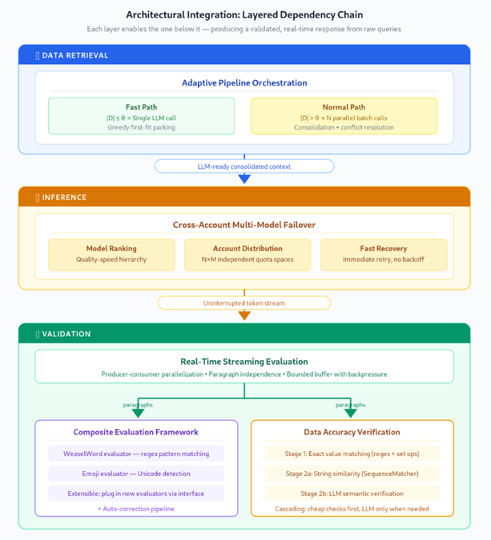

# NarrateAI: Production-Ready LLM Quality Assurance

Code samples for the blog post *NarrateAI: Building Production-Ready LLM
Applications with Advanced Quality Assurance*. Three techniques from the
production system, packaged so the core algorithms run on your laptop with
no AWS account, plus an opt-in live demo against real Amazon Bedrock.

## Overview

Executives ask data questions in live business reviews, where a wrong
number or a slow response has immediate consequences. Serving that audience
with an LLM means solving hallucinated metrics, API throttling, and
validation latency at the same time. These samples implement the three
techniques the blog describes:

| Technique | Module | What it does |
|---|---|---|
| Adaptive Pipeline Orchestration | `narrateai_qa.adaptive_pipeline` | Routes queries by retrieved data volume: ~90% take a single-call fast path, large queries get parallel batch analysis + consolidation |
| Cross-Account Multi-Model Failover | `narrateai_qa.multi_model_failover` | Treats every (model, account) pair as an independent Bedrock quota space; throttles trigger an immediate retry on the next pair instead of backoff |
| Real-Time Streaming Evaluation | `narrateai_qa.streaming_evaluation` | Evaluates and auto-corrects each paragraph while the next one is still generating; weasel words, emojis, and fabricated metrics are caught mid-stream |

The three techniques form a layered pipeline, each enabling the one below
it to turn raw queries into validated real-time responses:



See the accompanying blog post for the production results behind these
designs.

## Prerequisites

- Python 3.10+
- For the offline demos: nothing else (no AWS account or credentials)
- For the live demo only: an AWS account with Amazon Bedrock model access
  and an IAM role with `bedrock:InvokeModelWithResponseStream`

## Setup

Requires Python 3.10 or newer (verified with 3.11).

```bash
cd 02-use-cases/01-conversational-agents/llm-quality-assurance
```

Create a virtualenv and install:

```bash
python3.11 -m venv .venv311 && source .venv311/bin/activate
pip install -e .
```

Troubleshooting:

- **`command not found: python3.11`**: substitute any Python 3.10+
  (check with `python3 --version`). If none is installed, use
  [uv](https://docs.astral.sh/uv/) to fetch one; install uv outside any
  active virtualenv:

  ```bash
  curl -LsSf https://astral.sh/uv/install.sh | sh
  ~/.local/bin/uv venv --python 3.11 .venv311 && source .venv311/bin/activate
  ~/.local/bin/uv pip install -e .
  ```

- **`No matching distribution found for strands-agents`**: your
  interpreter is older than 3.10; upgrade Python, don't chase the package.
- Name the venv whatever you like (any `venv*`/`.venv*` name is
  gitignored), but pick the name up front, since venvs break if renamed later.

## Usage

Start with the offline demos. They need no AWS setup, and each one
illustrates a single technique and verifies its own invariants (exit
code 0 means all behaviors checked out). Run them before the live demo
so you know what each technique does on its own:

```bash
python examples/streaming_evaluation_demo.py    # catch + correct issues mid-stream
python examples/adaptive_pipeline_demo.py       # fast path vs normal path routing
python examples/multi_model_failover_demo.py    # quota-space walk on throttle
```

Then the live demo composes all three against real Bedrock (safe to run
unconfigured; it prints setup steps and exits):

```bash
cp .env.example .env      # fill in your role ARN, region, model IDs
python examples/live_demo.py "Which regions are missing their targets?"
```

The demo loads `.env` automatically into its own process, so no `export` is
needed, and your shell environment stays clean. (`.env` is gitignored,
so your real ARNs never end up in version control.)

Live-demo troubleshooting:

- **`The provided model identifier is invalid`**: the model IDs in your
  `.env` aren't enabled in the account(s) your roles reach. Enable them
  in the Bedrock console (Model access) or set `MODEL_ID_RANK_1/2` to
  models your accounts have.
- **`AccessDenied ... sts:AssumeRole`**: your current AWS identity
  can't assume the role(s) in `BEDROCK_ROLE_ARN`; check the role's trust
  policy.
- Prefer `.env` over `export BEDROCK_ROLE_ARN=...`: an exported value
  overrides any configured role list and lingers in your shell until you
  `unset` it, which also breaks the offline failover demo's fixed
  2x2-grid assertions.

### Using the pieces in your own code

```python
# Failover-wrapped Bedrock model (drop-in for strands BedrockModel)
from narrateai_qa.multi_model_failover import MultiModelBedrockModel
model = MultiModelBedrockModel(model_configs={
    1: {"model_id": "global.anthropic.claude-sonnet-5-20250929-v1:0",
        "region": "us-west-2",
        "client_kwargs": {"bedrock_role_arn_list": [
            "arn:aws:iam::your-account-id:role/BedrockCrossAccountRole",
        ]}},
})

# Streaming evaluation around any async token stream
from narrateai_qa.streaming_evaluation import (
    CompositeCorrector, CompositeEvaluator,
    StreamingEvalConfig, StreamingEvaluationPipeline,
)
config = StreamingEvalConfig()
pipeline = StreamingEvaluationPipeline(
    evaluator=CompositeEvaluator.from_config(config, consolidated_content=source_data),
    auto_corrector=CompositeCorrector.from_config(config),
    config=config,
)
async for chunk in pipeline.process_stream(llm_stream):
    ...  # chunks are already evaluated and corrected

# Volume-based routing (wire your own LLM analyzer behind the ABCs)
from narrateai_qa.adaptive_pipeline import AdaptivePipeline, ChunkAnalyzer
```

## Configuration

All configuration is optional; the demos run with defaults.

| Variable | Used by | Default |
|---|---|---|
| `BEDROCK_ROLE_ARN` | live demo, failover | — (comma-separate multiple roles) |
| `AWS_REGION` | live demo | `us-west-2` |
| `MODEL_ID_RANK_1` / `MODEL_ID_RANK_2` | live demo | Claude Sonnet / Claude Haiku |

Key code-level knobs: `StreamingEvalConfig` (buffer sizes, paragraph
detection, per-evaluator enable flags, fail-open behavior) and the
adaptive pipeline's `consolidation_threshold` (the routing threshold θ;
calibrate it so most of *your* queries land on the fast path, and keep it
below the model's context window).

## Project structure

```
├── pyproject.toml
├── .env.example                     # live-demo configuration template
├── images/architecture.png          # architecture diagram
├── src/narrateai_qa/
│   ├── adaptive_pipeline.py         # 3-phase routing (single module)
│   ├── multi_model_failover.py      # failover Bedrock provider (single module)
│   └── streaming_evaluation/
│       ├── pipeline.py              # producer-consumer orchestrator
│       ├── buffer.py                # bounded async queue with backpressure
│       ├── detector.py              # paragraph boundary detection
│       ├── evaluation.py            # eval + auto-correction contracts
│       ├── evaluators.py            # weasel word / emoji / data accuracy
│       ├── models.py                # data structures + config
│       └── streamer.py              # multi-word chunk delivery
└── examples/
    ├── streaming_evaluation_demo.py # offline, self-verifying
    ├── adaptive_pipeline_demo.py    # offline, self-verifying
    ├── multi_model_failover_demo.py # offline, self-verifying (mocked boto3)
    └── live_demo.py                 # opt-in, real Bedrock
```

## Disclaimer

Licensed under the repository's Apache-2.0 license.
