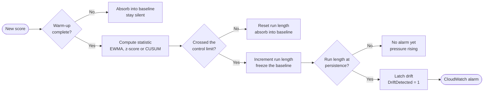
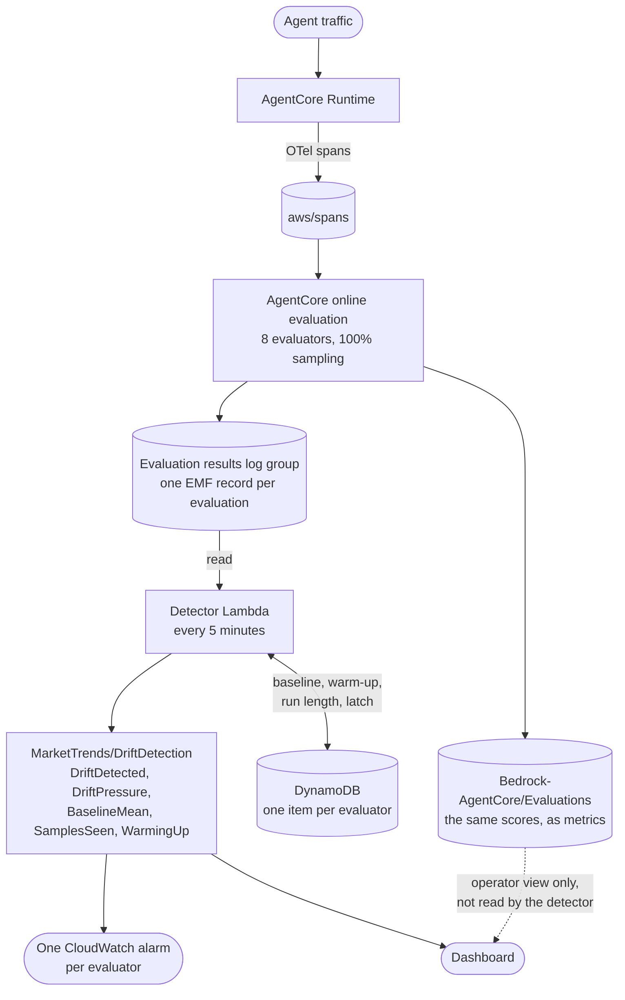

# Quality Drift Detection

The Market Trends Agent already scores itself. Eight evaluators run against live
traffic through an AgentCore online evaluation config, and their scores land in
CloudWatch.

Nothing watches whether those scores are getting worse.

This adds that. It reads the scores the evaluators already produce, tracks each
score stream against its own history, and raises a CloudWatch alarm naming the
specific stream that degraded and stayed degraded.

### Key findings, up front

- **Five of this agent's eight evaluators produced near-constant scores on healthy
  traffic.** A single detection method applied uniformly gets that majority wrong; the
  method has to be chosen per stream from its measured shape ([details](#how-the-detection-method-is-chosen)).
- **The most fixable root cause was an evaluator, not the detector.** One evaluator
  computed a real percentage price deviation internally, then discarded it for a
  pass/fail verdict. A detector can threshold a number; it cannot recover a number
  from a verdict ([details](#what-this-deployment-found)).
- **Tightening the evaluator threshold and scheduling the existing optimization loop
  both fail structurally, not just for this agent.** A threshold checks one score at
  a time and cannot see a mix shift; an A/B test compares two variants at the same
  moment, so both degrade together and the comparison reports nothing
  ([details](#why-this-when-agentcore-already-optimizes)).
- **On a real model swap, only the semantic judges caught it.** Structural checks
  (schema validity, PII) stayed correctly silent, because a weaker model still gets
  mechanics right; the failure was in tone and grounding, not tool use
  ([details](#what-this-deployment-found)).

## Contents

1. [Why this, when AgentCore already optimizes](#why-this-when-agentcore-already-optimizes)
2. [What drift is](#what-drift-is)
3. [The concepts](#the-concepts)
4. [How the detection method is chosen](#how-the-detection-method-is-chosen)
5. [How it works](#how-it-works)
6. [Running it](#running-it)
7. [What this deployment found](#what-this-deployment-found)
8. [Adding a trigger](#adding-a-trigger)
9. [Configuration](#configuration)
10. [Limits](#limits)

---

## Why this, when AgentCore already optimizes

AgentCore optimization generates prompt and tool-description recommendations from
production traces and validates them with batch evaluation or A/B tests, and this
sample ships a walkthrough of it in `optimization/optimize_agent.py`. So why add a
detector?

The answer is in AWS's own framing. The launch post describes the pre-existing
workflow as "check the evaluation scores to detect quality drop, deep dive into the
traces to determine the root cause and update the agent with an improved
configuration," and notes that improvement machinery "tends to move on weekly or
monthly cycles, while agents drift in production every day."

Optimization automates steps two and three. **Detecting the drop is still yours.**

### The difference is the axis of comparison

| | Optimization | This detector |
|---|---|---|
| Compares | Two variants, concurrently | One config, now vs its own history |
| Reference point | The other variant, live at the same moment | A persisted baseline learned from healthy traffic |
| Starts because | A human decided to improve something | A schedule |
| Answers | Is B better than A? | Has A gotten worse? |
| Output | Statistical significance on a split | An alarm naming the degraded stream |
| Survives the run | Nothing | Baseline, warm-up progress, latch |

An A/B test measures both arms over the same traffic window. That concurrency is
exactly what makes it statistically clean, and exactly what makes it blind to change
over time: if quality dropped last Tuesday, both arms dropped equally and the
comparison reports nothing unusual.

The table mentions **baseline**, **warm-up**, and **latch** before defining them.
[The concepts](#the-concepts) below spells each one out; the short version is that a
baseline is a learned normal for one evaluator's scores, and a latch is what keeps a
confirmed alarm declared until someone clears it.

### "So schedule the optimization loop instead"

The natural follow-up, and it does not work, for reasons that are structural rather
than about cadence.

**Scheduling changes when it runs, not what it compares.** An hourly A/B test gives
you a series of "T beats C" verdicts. It never yields "C is worse than C was last
month," because C is only ever compared against a variant that exists at the same
time. Drift needs one configuration tracked against a stored baseline, and no
optimization primitive persists a baseline between runs.

**Optimization changes the thing you would be measuring.** Its purpose is to alter the
configuration. A scheduled loop that promotes winners keeps re-tuning the prompt to
compensate for degrading upstream conditions, so scores stay flat while the cause
compounds underneath. That is not monitoring, it is an automated cover-up. A drift
baseline needs a configuration that holds still.

**The mechanics resist it.** Only one A/B test can run per gateway at a time, so a
permanent experiment blocks the feature's actual purpose. Each cycle creates a gateway,
bundles, and an evaluation config, routes production traffic through variants, and
takes 10 to 15 minutes to report. This detector is a Lambda that finishes in seconds
and mutates nothing.

**There would still be nothing to alarm on.** A p-value comparing two configs is not a
state that says "this stream is outside its normal range."

Running recommendations periodically is a sensible improvement cadence. It is just not
detection. **Drift detection is the trigger, optimization is the remediation.**

Two things to know if you plan to chain them, both measured on this agent. A
recommendation cannot target a custom code-based evaluator: aimed at
`mt_workflow_contract_gsr` it fails with `20/20 sessions could not be evaluated`, while
the same window against `Builtin.GoalSuccessRate` succeeds. And the recommendation
returns a rewritten prompt with no explanation field, so when the cause was a downgraded
model it silently added a rule forbidding malformed nested tool calls and never mentioned
the model. Use a drift alarm to trigger diagnosis by a human, not to fire a
recommendation.

The gap shows up even in this sample's walkthrough: Phase 1 computes baseline scores,
prints them as "your targets to beat," and never compares anything against them, and
Phase 8 deletes every resource it created.

---

## What drift is

**Quality drift** is a sustained decline in output quality with no corresponding
change to the code.

The agent stays up. Latency is normal. The error rate is flat. Every individual
response still looks plausible if you read it. What changes is the *rate* at which
responses are subtly wrong: prices quoted without retrieving them, a required tool
step skipped, tone slipping out of professional register.

Three properties make it its own problem rather than a variant of an outage.

**No deploy event.** The usual first question after a regression is "what shipped?"
For drift the answer is nothing. A provider updated a model behind an alias, a
scraped page changed layout, retrieved documents went stale. The code producing worse
output today is byte for byte the code that produced good output last week.

**Invisible to conventional monitoring.** Availability, latency, and error rate all
measure whether the machinery ran, and it ran fine. Drift lives in the content, which
those signals do not look at.

**Fixed thresholds do not catch it.** "Alert if quality is below 0.8" asks the wrong
question. An agent that has always scored 0.6 is healthy at 0.6. An agent that scored
0.95 for a month and now scores 0.85 has a problem and is still above the line. No
absolute number catches both, because the real question is whether quality is low
*relative to this agent's own normal*.

So detection has to be comparative: learn the agent's baseline from its own history,
then watch for departures from it.

---

## The concepts

| Concept | What it means here |
|---|---|
| **Score stream** | One evaluator's scores over time. Eight evaluators is eight independent streams, each with its own normal. |
| **Baseline** | Mean and variance learned from the stream's own recent healthy history, not a configured constant. |
| **Warm-up** | Samples consumed before the detector is allowed an opinion. A warming detector is silent, and that silence is not evidence of health. |
| **Statistic** and **control limit** | The number computed per sample, and what it must cross to raise a raw alarm. The limit comes from the baseline's own variance. |
| **Persistence** | How many consecutive raw alarms confirm drift. One crossing is noise, a run is signal. |
| **Latching** | Once confirmed, drift stays declared until an operator clears it, so one condition yields one alarm rather than a flapping series. |
| **Score shape** | How the scores are distributed. This decides which method to use. |

Those compose into one decision, made per incoming score:

EWMA, z-score, and CUSUM are the statistics; which one applies to which stream is
[the next section](#how-the-detection-method-is-chosen)'s subject.



Two behaviours there are easy to miss: the baseline **absorbs** non-alarming samples,
which keeps it current, and **freezes** while alarming, so degraded scores cannot
quietly become the new normal.

This is not a guardrail. A guardrail inspects one response and can block it. Drift is
a property of a distribution over many responses, so there is nothing useful to decide
about the response in front of you. This runs on a schedule, out of the request path,
and never alters agent output.

---

## How the detection method is chosen

One detector per evaluator rather than one per agent, with the method chosen from the
measured shape of each stream. An offline comparison ran every method over synthetic
streams of known shape, same stream, same persistence rule, and produced three
regimes.

| Shape | Method | Why |
|---|---|---|
| Continuous, or five or more levels | EWMA, smoothing 0.2, limit 3σ | Smoothing suppresses noise and the drift signal survives it. |
| Coarse but genuinely dispersed | EWMA, smoothing 0.1, limit 4σ | A binary score carries maximal Bernoulli variance, so the same quality drop is a smaller multiple of σ. Longer memory and a wider limit recover it. |
| Concentrated on one value with sparse outliers | Per-sample z-score, −2σ | No memory-based method works at any tuning. |

That last row is the counterintuitive one. When a stream sits on one value almost
always, its rare dips are isolated events rather than part of a distribution, and a
smoothing method carries a single dip forward across many later samples. Those
carried-forward samples then satisfy the persistence rule, and the detector declares
drift that never happened. A memoryless check alarms once, the next sample is healthy,
the run breaks, nothing is declared. **Memory is a liability in that regime.**

Two streams of the same shape, opposite outcomes, on real traffic:

- `mt_schema_validator`, 98% at 1.0 with a single 0.0 in 53 samples, and that dip
  occurred during known-healthy traffic. On an EWMA the detector carried it across
  eight consecutive samples, satisfied persistence, and latched a drift that had not
  happened. Reconfigured to a z-score, the same stream over the same data stayed quiet.
- `mt_pii_comprehend`, 94% at 0.5 with three isolated dips in 53 samples. On a z-score
  from the start, it never alarmed once.

So branch on **dispersion**, not on the count of distinct values. `detector/config.py`
treats any stream with 90% or more of its samples on one value as near-degenerate, and
`scripts/shape_report.py` flags any stream whose observed shape disagrees with its
configuration. Run that report on a new deployment before trusting the configuration.

---

## How it works



The detector reads the **results log group** rather than the metrics, though both carry
the same scores. A metric datapoint is an aggregate over a period, and these methods
are defined over individual scores, so a period average silently changes the statistic
being monitored by an amount that depends on how much traffic landed in that period.
Records also carry a session id, which is the stable identity a scheduled job needs to
consume each score exactly once. Metric datapoints have none.

State lives in DynamoDB keyed by evaluator. Runs use overlapping windows so a late
arriving evaluation is not missed, and deduplication by score key makes that safe.

### Files

```
drift_detection/
  detector/
    methods.py    EWMA, z-score, CUSUM, persistence and latch gate. Pure, serializable.
    config.py     per-evaluator method selection, and the shape classifier
    scores.py     reads evaluation results out of CloudWatch
    state.py      DynamoDB-backed baselines and latch
    handler.py    scheduled Lambda entry point
  scripts/
    deploy.py             table, role, Lambda, schedule, alarms, dashboard
    attach_evaluators.py  attach every registered evaluator to online evaluation
    shape_report.py       measured shape per stream, and config disagreements
    traffic.py            concurrent traffic generator
    induce_drift.py       apply or clear a drift trigger
    watch.py              per-detector state, pressure, and latch
    teardown.py           remove everything this feature created
```

---

## Running it

Prerequisites: the agent deployed and responding, and `evaluators/scripts/deploy.py`
already run. Everything below assumes you are in the agent directory with
`AWS_REGION` set.

```bash
export AWS_REGION=us-east-1
```

### 1. Attach all eight evaluators

Only one of the sample's two registration paths wires evaluators into online
evaluation. `evaluators/scripts/deploy.py` creates the five code-based evaluators and
an online config containing them; `evaluators/custom_evaluators.py` creates the three
LLM judges and stops, so by default they never score live traffic.

That gap matters for drift specifically. The code-based evaluators are structural
checks, a weaker model still satisfies structural checks, and so the most common cause
of drift produces no signal on any of them. The judges score semantic quality.

```bash
uv run python evaluators/custom_evaluators.py          # create the judges
uv run python drift_detection/scripts/attach_evaluators.py
```

### 2. Deploy the detector

`DRIFT_WARMUP=15` is a demo setting. The offline comparison ran at 100, which is the
honest production value. Lowering it reaches a verdict faster at the cost of a weaker
variance estimate and a twitchier detector.

```bash
DRIFT_WARMUP=15 DRIFT_CONSECUTIVE=3 \
  uv run python drift_detection/scripts/deploy.py
```

### 3. Build a baseline

```bash
uv run python drift_detection/scripts/traffic.py --sessions 18 --concurrency 6 --tag base
```

`DRIFT_WARMUP` above is lowered for a quick demo; the default and validated value is
100, which needs more traffic than 18 sessions to clear on every stream, particularly
the SESSION-level ones. Around five minutes for 18 sessions, with scores appearing a
few minutes after the session timeout. Then:

```bash
uv run python drift_detection/scripts/shape_report.py
uv run python drift_detection/scripts/watch.py --run
```

Confirm every stream reads `healthy` and that `shape_report.py` reports no
disagreements. A disagreement means the wrong method is watching that stream, and
fixing it before continuing is the point of the report. At 18 sessions a disagreement
can also just be sampling noise: a handful of turns landing on a value the healthy
stream rarely produces is enough to look like a shape change at this size and settle
back out with more traffic. Treat a disagreement here as a prompt to look, not an
instruction to reconfigure on the spot; the shapes in [What this deployment
found](#what-this-deployment-found) are the ones to trust.

### 4. Induce drift

```bash
uv run python drift_detection/scripts/induce_drift.py --list
uv run python drift_detection/scripts/induce_drift.py --trigger model_swap
```

This swaps Claude Haiku 4.5 for the much older Claude 3 Haiku by setting `MODEL_ID`
on the runtime. It takes seconds and needs no container rebuild, because the model is
read from the environment through `tools/model_config.py`.

```bash
uv run python drift_detection/scripts/traffic.py --sessions 16 --concurrency 6 --tag drift
```

### 5. Watch it get caught

```bash
uv run python drift_detection/scripts/watch.py --run
aws cloudwatch describe-alarms --alarm-name-prefix MarketTrends-Drift \
  --state-value ALARM --query 'MetricAlarms[].AlarmName' --output text
```

Expect `MarketTrends-Drift-mt_financial_professionalism` here. That is not a partial
result, it is the finding: not every stream sees a model swap, and this is the one
guaranteed to. At the quickstart's reduced warmup, `mt_market_data_accuracy` typically
runs under visible pressure without crossing, because a shorter warmup means a noisier
variance estimate and therefore a less sensitive limit, the same tradeoff called out in
step 2. Run the sample at the validated `DRIFT_WARMUP=100` and it also alarms; see
[What this deployment found](#what-this-deployment-found) for that result and the exact
numbers behind both.

The dashboard is `MarketTrendsDriftDetection` in the CloudWatch console.

`model_swap` is the quickstart trigger because it needs no rebuild. Two more triggers,
`stale_prices` and `skip_profile_step`, are implemented and produce different results;
see [The other two triggers](#the-other-two-triggers) once you have `agentcore deploy`
available.

### 6. Reset and teardown

```bash
uv run python drift_detection/scripts/induce_drift.py --clear   # restore the model
uv run python drift_detection/scripts/watch.py --reset          # rebuild baselines
```

Resetting state matters because a baseline that absorbed degraded traffic has moved
its own goalposts. To release an alarm while keeping warm-up progress, use
`watch.py --clear-latch <evaluator>` instead.

```bash
uv run python drift_detection/scripts/teardown.py --dry-run
uv run python drift_detection/scripts/teardown.py --yes
```

Teardown removes only what this feature created. The agent, evaluators, online config,
and evaluation results are left alone.

---

## What this deployment found

### Most streams carry almost no signal

`scripts/shape_report.py` on healthy traffic:

| Evaluator | n | mean | top value | shape | method |
|---|---|---|---|---|---|
| `mt_schema_validator` | 90 | 0.967 | 97% at 1.0 | near-degenerate | z-score |
| `mt_stock_price_drift` | 90 | 0.944 | 94% at 1.0 | near-degenerate | z-score |
| `mt_pii_regex` | 90 | 1.000 | 100% at 1.0 | near-degenerate, pinned | z-score |
| `mt_pii_comprehend` | 30 | 0.500 | 100% at 0.5 | near-degenerate, pinned | z-score |
| `mt_workflow_contract_gsr` | 30 | 1.000 | 100% at 1.0 | near-degenerate, pinned | z-score |
| `mt_market_data_accuracy` | 90 | 0.647 | 59% at 1.0 | ternary, dispersed | EWMA |
| `mt_broker_personalization` | 90 | 0.500 | 67% at 0.25 | binary, dispersed | EWMA |
| `mt_financial_professionalism` | 90 | 0.664 | 66% at 0.75 | binary, dispersed | EWMA |

Five of eight streams are near-degenerate. Three have genuine dispersion.

That adds a second problem rather than replacing the first. Choosing the right
statistic is hard, and the false alarm above is what getting it wrong costs. But method
choice sits downstream of a harder constraint: an evaluator written to answer "was this
response acceptable" emits a near-constant stream, and no statistic recovers signal
from a stream with no variance. Both have to be solved, and the second caps the first.
Two consequences:

**A stream pinned at the ceiling or floor has no measured variance.** `mt_pii_regex`,
`mt_pii_comprehend`, and `mt_workflow_contract_gsr` sit at a single value on every
sample measured. Their control limit comes entirely from the standard deviation floor
applied to avoid dividing by zero, so the limit is a convention rather than something
learned from the data.

**One evaluator throws away the signal it had.** `mt_stock_price_drift` computes a
continuous percentage deviation between the quoted price and a reference, then discards
the magnitude and returns a verdict against a fixed threshold. That continuous
measurement would have been the most monitorable stream on the agent; thresholding it
produced a stream that sits at 1.0 94% of the time instead. For evaluator authors:
**return the measurement, not the verdict.** A detector can always threshold a number;
it cannot recover a number from a verdict.

### The model swap run

At the validated `DRIFT_WARMUP=100`: over 100 healthy sessions, then 40 with the model
swapped.

**Healthy traffic produced no alarms.** All eight detectors warmed up and stayed quiet,
including the streams containing isolated dips.

**The swap was caught on two streams.** `mt_financial_professionalism` fell from a
healthy mean of 0.68 to 0.33 on swap traffic alone, with `Unprofessional` and
`Below Standard` scores replacing the mix that used to lean `Adequate`/`Professional`.
`mt_market_data_accuracy` fell from 0.65 to 0.18, with 63% of responses landing on
`No Data` instead of citing retrieved figures. Both crossed their limit after a run of
consecutive alarms, and both alarms named the specific stream. No code changed, no
deploy happened.

**One evaluator's failure rate rose sharply without the alarm confirming.**
`mt_stock_price_drift` is a near-degenerate stream: memoryless by design, so it only
confirms drift on a *run* of consecutive alarms, not on a higher overall rate. Its own
internal `DRIFT` verdict (unrelated to this feature's drift signal, just a name
collision) went from about 6% of healthy turns to 28% of turns under the weaker model,
a real and large increase. But those failures were scattered rather than clustered, so
each one alarmed individually and a passing turn kept resetting the run before it
reached the confirmation length. That is the tradeoff of a memoryless method: it is
immune to a single bad sample by design, and a failure rate that rises without
clustering can still read as healthy.

**The structural streams correctly did not move.** PII regex, PII Comprehend, schema
validity, and the workflow contract were flat across the swap. A weaker model still
avoids leaking SSNs, still emits well-formed tool calls, and still satisfies the
required tool sequence. Those evaluators are doing their job; their job is just not
sensitive to model capability.

### The other two triggers

`stale_prices` and `skip_profile_step` are code changes rather than an environment
toggle: the agent itself has to read the variable, so run `agentcore deploy` (or your
own container rebuild) after enabling either in code, before the trigger does anything.
Each was run for 40 sessions on a clean, fully warmed-up baseline.

**`stale_prices` mostly did not get caught, and that is itself the finding.** The
market-data tool returns a fixed cached quote instead of a live one.
`mt_stock_price_drift`'s own failure rate rose from about 6% to 39% of turns, a real
increase, but the failures were scattered rather than clustered, so the memoryless
method never confirmed it, the same near-miss shape the model swap produced on this
stream. `mt_market_data_accuracy` barely moved at all: a frozen price is still a
retrieved value, so the judge checking whether figures are grounded in retrieved data
has nothing to flag even though the source has gone stale. No evaluator on this agent
scores whether a quote is fresh, only whether it looks plausible, which is a coverage
gap this trigger makes visible rather than a detector failure.

**`skip_profile_step` is the cleanest signal of the three.** It removes the
broker-identification and profile tools from what the model is allowed to call, so the
failure is structural rather than probabilistic. `mt_workflow_contract_gsr` went from
100% PASS to 100% PARTIAL across all 40 sessions, and the detector confirmed after five.
`mt_broker_personalization` was predicted to move, since personalization depends on a
loaded profile, and stayed flat instead: this agent's personalization judge does not
lean on the tool-loaded profile as much as the contract evaluator leans on the tool call
itself. Being wrong here is the point of writing a prediction down before running the
trigger.

---

## Adding a trigger

Triggers are a registry in `scripts/induce_drift.py`. Append a `Trigger` and nothing
else changes:

```python
Trigger(
    name="drop_news_source",
    represents="A tool starts returning empty or degraded results silently",
    env={"DROP_NEWS_SOURCE": "1"},
    expected_to_move=["mt_financial_professionalism"],
    note="Makes search_news return an empty string instead of headlines.",
    requires_agent_support=True,
)
```

`requires_agent_support` marks a trigger whose variable the agent must actually read.
`model_swap` needs none, which is why it is the default: it works by changing the
runtime's `MODEL_ID` environment variable directly, nothing in the agent's own code has
to change. `stale_prices` and `skip_profile_step` are real, implemented triggers that do
need agent support: `get_stock_data` in `tools/browser_tool.py` checks `STALE_PRICES`
before doing its live lookup, and `create_market_trends_agent()` in
`market_trends_agent.py` checks `SKIP_PROFILE_STEP` before binding the profile tools.
Because these are code changes rather than a pure environment toggle, exercising them
needs a container rebuild (`agentcore deploy`) first, not just `--trigger`.

These triggers exist so drift can be demonstrated on a schedule instead of waited for.
In production drift arrives without a toggle, which is the whole reason detection is
needed. The detector knows nothing about them and reads only evaluator scores.

`model_swap` is primary because it is the canonical cause of drift with no deploy
event, and because it keeps the demo honest: nothing scripts which evaluator should
degrade, so the predictions above could be wrong. A hand-written degraded prompt would
make the demo circular, breaking citations and then observing that the citation
evaluator noticed.

---

## Configuration

| Variable | Default | Meaning |
|---|---|---|
| `DRIFT_WARMUP` | 100 | Samples before any drift claim. 100 is the validated value. |
| `DRIFT_CONSECUTIVE` | 5 | Consecutive raw alarms that confirm drift. |
| `DRIFT_LOOKBACK_SECONDS` | 21600 | How far back each run reads. Longer than the schedule on purpose. |
| `DRIFT_SCHEDULE_MINUTES` | 5 | Detector schedule. |
| `DRIFT_NAMESPACE` | `MarketTrends/DriftDetection` | Namespace for the drift metrics. |
| `ONLINE_EVAL_CONFIG_ID` | from `evaluators/scripts/.deploy_output.json` | Which online config to read. |

## Limits

- **Console and metric alarm only.** No SNS, no email, no paging. Adding notification
  is an SNS topic on the existing alarms.
- **No remediation and nothing blocked.** Detection reports, a human decides, and no
  response is ever inspected or altered.
- **Warm-up is real.** A fresh detector cannot detect anything, which is why
  `WarmingUp` is published: silence must not be mistaken for health.
- **Baselines absorb slow decline.** Non-alarming samples fold into the baseline, so a
  decline gradual enough stays inside the limit while moving it. Freezing the baseline
  while alarming bounds this without eliminating it. Detecting arbitrarily slow drift
  against a self-learned baseline is an open problem, not something solved here.
- **Detection needs traffic.** Every number here is per sample, not per hour. A
  low-traffic agent takes proportionally longer to reach any verdict.
- **Diagnosis is manual.** The detector reports which stream degraded and by how much,
  not why. The evaluator's explanation text in the results log group is the best
  starting point and is not surfaced in the alarm today.
