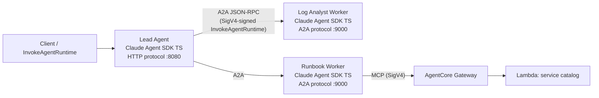

# Multi-Agent DevOps Triage Copilot — Claude Agent SDK (TypeScript) with A2A on Amazon Bedrock AgentCore

Three [Claude Agent SDK](https://docs.claude.com/en/api/agent-sdk/overview) agents written in **TypeScript**, hosted on [Amazon Bedrock AgentCore Runtime](https://docs.aws.amazon.com/bedrock-agentcore/latest/devguide/agents-tools-runtime.html), communicating via the [Agent-to-Agent (A2A) protocol](https://a2a-protocol.org/latest/), with one agent consuming a tool through **AgentCore Gateway** (MCP) — authenticated end to end with **IAM/SigV4** instead of OAuth.

The scenario is a DevOps incident-triage copilot: a **lead agent** takes an incident description, delegates to a **log-analyst worker** and a **runbook worker** over A2A, and composes a triage summary. The runbook worker looks up service ownership and runbook steps through an MCP tool exposed by AgentCore Gateway (backed by a Lambda target).

| Component | Technology |
|---|---|
| Agent framework | Claude Agent SDK (TypeScript) |
| Hosting | AgentCore Runtime — HTTP protocol (lead), A2A protocol (workers) |
| Agent ↔ agent | A2A JSON-RPC over SigV4-signed `InvokeAgentRuntime` |
| Agent ↔ tools | MCP via AgentCore Gateway (IAM auth), in-process SigV4 signing |
| Outbound credentials | AgentCore Identity (`withApiKey`) |
| Models | Amazon Bedrock (Claude, via `CLAUDE_CODE_USE_BEDROCK`) |
| Infrastructure | CDK (Gateway, Lambda target, IAM, ECR) + deploy script |

## Architecture



**Protocol rationale — A2A is horizontal (agent ↔ agent), MCP is vertical (agent ↔ tools):**

- The **lead** uses the AgentCore **HTTP protocol** (port 8080) because its caller is an application, not an agent.
- The **workers** use the **A2A protocol** path (port 9000). AgentCore proxies `InvokeAgentRuntime` payloads to the container **unmodified**, so there is zero envelope unwrap/rewrap code in this sample.
- The **runbook worker** consumes its tool over **MCP** — a local mock server in dev, the real Gateway (SigV4) when deployed.

### How this differs from the Python A2A sample

The [A2A-multi-agent-incident-response](../A2A-multi-agent-incident-response/) use case demonstrates A2A with Python agents (Google ADK, Strands, OpenAI Agents SDK) authenticated via Cognito OAuth. This sample is its TypeScript counterpart with a different auth architecture:

- **TypeScript + Claude Agent SDK** end to end — no A2A sample exists for either elsewhere in this repository.
- **IAM/SigV4 everywhere**: agents authenticate to each other and to the Gateway with SigV4-signed requests using the runtime's execution role — no identity provider, tokens, or secrets to manage.
- **Gateway integration**: the tool path goes through AgentCore Gateway with IAM inbound auth, signed in-process (no sidecar proxy).

## What this sample provides beyond the scenario

The AgentCore **Python** SDK ships A2A hosting (`serve_a2a`) and framework executors. The **TypeScript** SDK (`bedrock-agentcore`) does not yet — so this sample includes two scenario-agnostic packages that fill the gap and are structured for potential upstreaming:

| Package | What it does |
|---|---|
| [`packages/claude-a2a-executor`](packages/claude-a2a-executor/) | `ClaudeAgentExecutor` — bridges a Claude Agent SDK `query()` stream to the `@a2a-js/sdk` `AgentExecutor` interface (task lifecycle, streaming, cancellation). `serveA2A()` — implements the AgentCore A2A container contract in one call (JSON-RPC at `POST /`, agent card, `GET /ping`, AgentCore header extraction via `AsyncLocalStorage`), mirroring the Python SDK's `serve_a2a`. |
| [`packages/aws-sigv4-fetch`](packages/aws-sigv4-fetch/) | `createSigV4Fetch` — a fetch-shaped SigV4 signer usable by any fetch-injectable client (MCP SDK, a2a-js). `createMcpProxy` — an in-process MCP server that mirrors the Gateway's tools over the signing fetch and plugs into the Claude Agent SDK as an SDK MCP server, replacing the localhost signing-sidecar workaround. |

Everything in `agents/` is thin assembly on top of these packages — each agent is under ~150 lines.

## Prerequisites

1. **AWS account** with Amazon Bedrock model access (Claude models enabled in your region)
2. **AWS CLI** configured with credentials
3. **Node.js 20+** and npm 9+
4. **Docker** (or another engine) with `linux/arm64` build support — for compose mode and deployment
5. **CDK bootstrapped** in the target account/region — for deployment

Defaults: region `us-east-1`, model `global.anthropic.claude-haiku-4-5-20251001-v1:0` — both overridable via `AWS_REGION` / `ANTHROPIC_MODEL`.

## Running locally (no AWS deployment)

Only Bedrock model access is required; the Gateway is stood in for by a local MCP mock.

```bash
npm ci
npm run build
npm test                      # unit tests (no AWS access needed)

# Terminal 1–4, or use docker compose (below):
npm run dev:mock-catalog                                     # :8900
PORT=9001 npm run dev:log-analyst                            # A2A worker
PORT=9002 SERVICE_CATALOG_MCP_URL=http://localhost:8900/mcp \
  npm run dev:runbook                                        # A2A worker
LOG_ANALYST_URL=http://localhost:9001 RUNBOOK_URL=http://localhost:9002 \
  npm run dev:lead                                           # :8080

# Ask the copilot:
curl -s -X POST localhost:8080/invocations \
  -H 'Content-Type: application/json' \
  -H "x-amzn-bedrock-agentcore-runtime-session-id: $(uuidgen)" \
  -d '{"prompt": "orders-api latency spiked after the 14:00 deploy. Logs: ERROR timeout connecting to postgres-orders x40 since 14:02. What happened?"}'
```

Or run everything with compose:

```bash
eval "$(aws configure export-credentials --format env)"
docker compose up --build
```

The end-to-end integration test (spawns all four processes, calls Bedrock):

```bash
npm run test:integration
```

## Deploying to AWS

```bash
cd infra && npx cdk deploy            # Gateway + Lambda target + roles + ECR
cd .. && ./deploy.sh                  # push arm64 image, create/update 3 runtimes

# End-to-end against the deployed stack:
./invoke.sh <lead-runtime-arn> \
  'orders-api latency spiked after the 14:00 deploy — what happened?'
```

Deployed topology: the lead's A2A calls go through SigV4-signed `InvokeAgentRuntime` URLs (derived from the worker runtime ARNs), and the runbook worker reaches the real Gateway through the in-process SigV4 MCP proxy. The same agent code runs in all three modes (local processes, docker compose, deployed) — only env vars change.

## Cleanup

```bash
./cleanup.sh                          # delete runtimes, empty ECR, cdk destroy
```

## How it works

### The A2A bridge (`packages/claude-a2a-executor`)

`ClaudeAgentExecutor` translates the Claude Agent SDK's message stream into the A2A task lifecycle:

| Claude Agent SDK event | A2A event published |
|---|---|
| `execute()` called | `task` event, state `SUBMITTED` |
| query starts | `statusUpdate` → `WORKING` |
| each `assistant` message | `statusUpdate` → `WORKING` with streaming text |
| `result` (success) | `artifactUpdate` with the answer, then `statusUpdate` → `COMPLETED` |
| error / cancellation | `statusUpdate` → `FAILED` / `CANCELED` |

`serveA2A()` hosts any executor per the AgentCore A2A container contract: JSON-RPC at `POST /` on `0.0.0.0:9000`, the agent card at `/.well-known/agent-card.json` (URL resolved from `AGENTCORE_RUNTIME_URL`), and `GET /ping`. It also extracts the AgentCore-injected headers (session id, request id, workload access token) into an `AsyncLocalStorage` context, so tool handlers deep inside a Claude session can use AgentCore Identity — the same parity `BedrockAgentCoreApp` provides on the HTTP path.

### In-process SigV4 signing (`packages/aws-sigv4-fetch`)

AgentCore Gateway under IAM auth and `InvokeAgentRuntime` both require SigV4-signed requests. `createSigV4Fetch` returns a drop-in `fetch` replacement that signs with the standard credential chain — one wrapper serves both the a2a-js client (agent → agent) and the MCP client (agent → Gateway). The Claude Agent SDK's built-in HTTP MCP client doesn't accept a custom fetch, so `createMcpProxy` bridges it: an in-process MCP server forwards `tools/list` / `tools/call` to the Gateway over the signing fetch.

### Delegation as tools

The lead agent exposes `delegate_to_log_analyst` and `delegate_to_runbook` as in-process SDK tools whose handlers perform the A2A calls. Claude decides which workers to consult and in what order — the A2A mechanics stay out of the prompt entirely. One tool uses A2A `stream()` and the other `send()`, so both interaction styles are exercised.

### Observability: the delegation trail

Every component emits one-line, greppable `[a2a]` log entries (delegation sent/answered on the lead; RPC received, tool calls, task result on workers). Filter any agent's CloudWatch log group on `[a2a]` to reconstruct an invocation end to end. Log lines include truncated prompt/response content — set `A2A_LOG_CONTENT=0` to log metadata only.

## Repository layout

```
packages/claude-a2a-executor/   # Claude Agent SDK ↔ A2A bridge + serveA2A() hosting
packages/aws-sigv4-fetch/       # SigV4 fetch wrapper + in-process MCP proxy
agents/log-analyst/             # A2A worker: reasons over log snippets
agents/runbook/                 # A2A worker: service catalog via MCP (mock or Gateway)
agents/lead/                    # HTTP-protocol lead; A2A client (plain or SigV4) to workers
scripts/mock-service-catalog/   # Local MCP stand-in for Gateway + Lambda
infra/                          # CDK: Gateway, Lambda target, IAM, ECR
tests/integration/              # lead → workers → tool → composed answer
docker/ + docker-compose.yaml   # one arm64 image for all agents, local stack
deploy.sh / invoke.sh / cleanup.sh
```

## Limitations

- **This is sample code** for learning and prototyping — it omits authentication hardening, full observability, retries, and other production concerns.
- **The AgentCore TypeScript SDK (`bedrock-agentcore` 0.4.x) has no A2A support yet** — `serveA2A()` and `ClaudeAgentExecutor` in this sample fill that gap (the Python SDK covers it via `serve_a2a`). If the TS SDK gains A2A hosting, most of `packages/` collapses into SDK calls.
- **The Claude Agent SDK's HTTP MCP client cannot SigV4-sign requests**, which Gateway requires under IAM inbound auth — the in-process proxy works around this.
- **A2A protocol version skew**: AgentCore's documented A2A examples use protocol v0.3 shapes; `@a2a-js/sdk` 1.x speaks v1.0. This sample enables the SDK's compat layer so both client styles work.
- **Agent-card discovery on AgentCore requires the `bedrock-agentcore:GetAgentCard` IAM action** in addition to `InvokeAgentRuntime` — missing it fails as a 403 on `/invocations/.well-known/agent-card.json`. The CDK stack grants both.
- The AgentCore Identity `withApiKey` path is exercised only when deployed (it needs the runtime-injected workload access token); local runs log and skip it.
