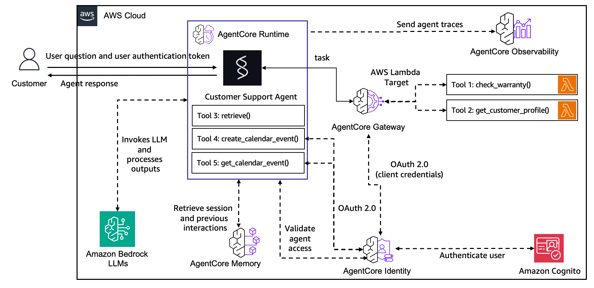
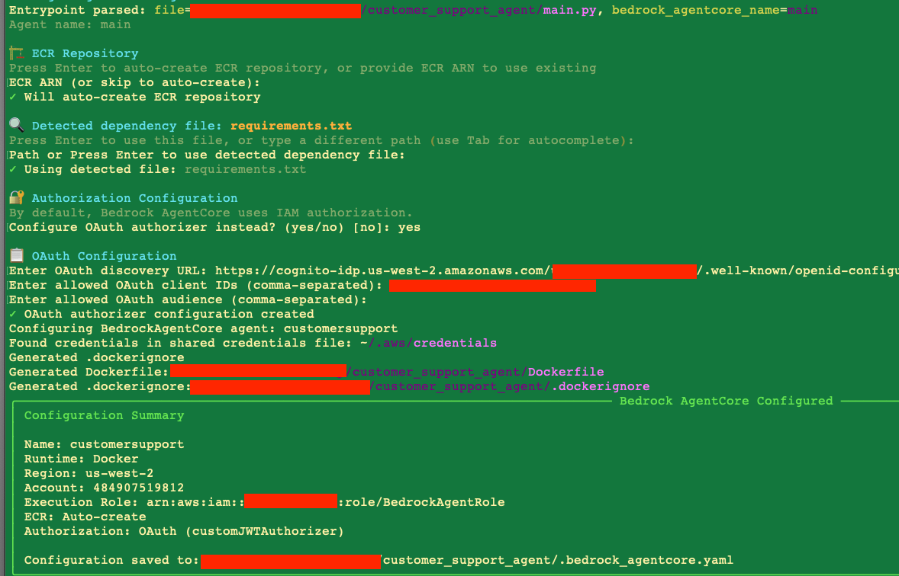

# Customer Support Agent

```bash
TODO: Updated Architecture Diagram
```



## Prerequisites

```bash
TODO: Write Prerequisites
```

## Deploy

1. Create infrastructure

    ```bash
    python -m venv .venv
    source .venv/bin/activate

    pip install -r dev-requirements.txt
    chmod +x scripts/prereq.sh
    ./scripts/prereq.sh

    chmod +x scripts/list_ssm_parameters.sh
    ./scripts/list_ssm_parameters.sh
    ```

2. Create Agentcore Gateway

    ```bash
    pip install -r requirements.txt
    pip install wheelhouse/bedrock_agentcore_starter_toolkit-0.1.0-py3-none-any.whl
    pip install wheelhouse/botocore-1.39.5-py3-none-any.whl
    pip install wheelhouse/boto3-1.39.5-py3-none-any.whl
    python scripts/agentcore_gateway.py --gateway_name <GatewayName>
    ```

    This create `gateway.config` file.

3. Setup Agentcore Identity

    - Setup Cognito Credential Provider

    ```bash
    python scripts/cognito_credentials_provider.py

    python test/test_gateway.py --prompt "Check warranty with serial number MNO33333333"
    ```

    - Setup Google Credential Provider

    Follow instructions to setup [Google Credentials](./prerequisite/google_oauth_setup.md).

    ```bash
    python scripts/google_credentials_provider.py

    python test/test_google_tool.py
    ```

4. Create Memory

    ```bash
    python scripts/agentcore_memory.py create
    TODO: Test Memory Script
    ```

5. Setup Agent Runtime

    ```bash

    agentcore configure --entrypoint main.py -er arn:aws:iam::<Account-Id>:role/<Role> --name customersupport<AgentName>
    ```

    Use `./scripts/list_ssm_parameters.sh` to fill:
    - `Role = ValueOf(/app/customersupport/agentcore/agentcore_iam_role)`
    - `Oath Discovery URL = ValueOf(/app/customersupport/agentcore/cognito_discovery_url)`
    - `Oath client id = ValueOf(/app/customersupport/agentcore/web_client_id)`.

    

    ```bash
    agentcore launch

    python test/test_agent.py customersupport<AgentName> -p "Hi"
    ```

6. Local Host Streamlit UI

Create `.streamlit/secrets.toml` file using [.streamlit/secrets.template.toml](./.streamlit/secrets.template.toml).

```bash
pip install streamlit
streamlit run app.py -- --agent=customersupport<AgentName>
```

## Cleanup

```bash
chmod +x scripts/cleanup.sh
./scripts/cleanup.sh

python scripts/agentcore_memory.py delete
TODO: Cleanup for Gateway
TODO: Cleanup for Identity
TODO: Cleanup for Runtime
```
