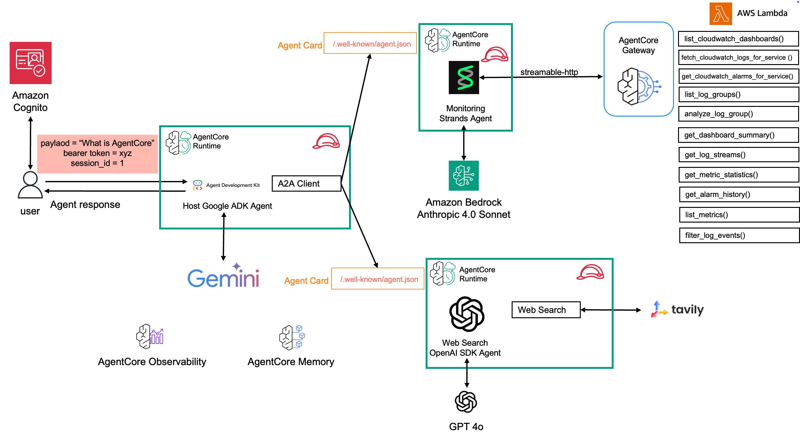

# Agent-to-Agent (A2A) Multi-Agent System on Amazon Bedrock AgentCore for Incident Response Logging

A comprehensive implementation of the [Agent-to-Agent (A2A)](https://a2a-protocol.org/latest/) protocol using specialized agents running on [Amazon Bedrock `AgentCore` runtime](https://docs.aws.amazon.com/bedrock-agentcore/latest/devguide/runtime-a2a.html), demonstrating intelligent coordination for AWS infrastructure monitoring and operations management. This repository walks you through setting up three core agents to answer questions about incidents and metrics in your AWS accounts and search for best remediation strategies. A monitoring agent (built using the [`Strands` Agents SDK](https://strandsagents.com/latest/)) is responsible for handling all questions related to metrics and logs within AWS and cross AWS accounts. A remediation agent (built using [`OpenAI`'s Agents SDK](https://openai.github.io/openai-agents-python/)) is responsible to doing efficient web searches for best remediation strategies and optimization techniques that the user can ask for. Both agents run on separate runtimes as `A2A` servers and utilize all `AgentCore` primitives - memory for context management, observability for deep level analysis about both agents, gateway for access to tools (`Cloudwatch`, `JIRA` and `TAVILY` APIs) and `AgentCore` identity for enabling inbound and outbound access into the agent and then into the resources that the agent can access using OAuth 2.0 and APIs. These two agents are then managed by a host [`Google ADK` agent](https://google.github.io/adk-docs/) that acts as a client and delegates tasks to each of these agents using A2A on Runtime. The Google ADK host agent runs on a separate `AgentCore` runtime of its own.

## Demo


## Architecture Overview



## What is A2A?

<details>
  <summary>Agent-to-Agent (A2A)</summary>
   **Agent-to-Agent (A2A)** is an open standard protocol that enables seamless communication and collaboration between AI agents across different platforms and implementations. The A2A protocol defines:

   - **Agent Discovery**: Standardized agent cards that describe capabilities, skills, and communication endpoints
   - **Communication Format**: JSON-RPC 2.0-based message format for reliable agent-to-agent communication
   - **Authentication**: OAuth 2.0-based security model for secure inter-agent communication
   - **Interoperability**: Platform-agnostic design allowing agents from different frameworks to collaborate

   Learn more about the A2A protocol: [A2A Specification](https://a2a.foundation/)

   ## A2A Support on Amazon Bedrock AgentCore

   Amazon Bedrock AgentCore provides native support for the A2A protocol, enabling you to:

   - **Deploy A2A-compliant agents** as runtime services with automatic endpoint management
   - **Secure authentication** via AWS Cognito OAuth 2.0 integration
   - **Agent discovery** through standardized agent card endpoints
   - **Scalable deployment** leveraging AWS infrastructure for production workloads
   - **Built-in observability** with CloudWatch integration and OpenTelemetry support

   AgentCore simplifies A2A agent deployment by handling infrastructure, authentication, scaling, and monitoring automatically.
</details>

## Prerequisites

1. **AWS Account**: You need an active AWS account with appropriate permissions
   - [Create AWS Account](https://aws.amazon.com/account/)
   - [AWS Console Access](https://aws.amazon.com/console/)

2. **AWS CLI**: Install and configure AWS CLI with your credentials
   - [Install AWS CLI](https://docs.aws.amazon.com/cli/latest/userguide/getting-started-install.html)
   - [Configure AWS CLI](https://docs.aws.amazon.com/cli/latest/userguide/cli-configure-quickstart.html)

   ```bash
   aws configure
   ```

3. **Bedrock Model Access**: Enable access to Amazon Bedrock Anthropic Claude 4.0 models in your AWS region
   - Navigate to [Amazon Bedrock Console](https://console.aws.amazon.com/bedrock/)
   - Go to "Model access" and request access to:
     - Anthropic Claude 4.0 Sonnet model
     - Anthropic Claude 3.5 Haiku model
   - [Amazon Bedrock Model Access Guide](https://docs.aws.amazon.com/bedrock/latest/userguide/model-access.html)

4. Install uv using [guide](https://docs.astral.sh/uv/getting-started/installation/).

5. **Supported Regions**: This solution is currently tested and supported in the following AWS regions:

   | Region Code   | Region Name          | Status      |
   |---------------|----------------------|-------------|
   | `us-west-2`   | US West (Oregon)     | ✅ Supported |

   > **Note**: To deploy in other regions, you'll need to update the DynamoDB prefix list mappings in `cloudformation/vpc-stack.yaml`. See the [VPC Stack documentation](cloudformation/vpc-stack.yaml) for details.

## Deployment Steps

```bash
git clone https://github.com/awslabs/amazon-bedrock-agentcore-samples.git
cd 02-use-cases/A2A-multi-agent-incident-response
```

### Step 1: Deploy AWS Cognito Stack

```bash
aws cloudformation create-stack \
    --stack-name cognito-stack-a2a \
    --template-body file://cloudformation/cognito.yaml \
    --capabilities CAPABILITY_IAM \
    --region us-west-2 && \
aws cloudformation wait stack-create-complete \
    --stack-name cognito-stack-a2a \
    --region us-west-2
```

> [!WARNING]
> This deployment typically takes 2-3 minutes. The command will wait for
> the stack to complete before returning. Do not proceed to Step 2 until
> this completes successfully.

### Step 2: Deploy Monitoring Strands Agent

```bash
aws cloudformation create-stack \
    --stack-name monitor-agent-a2a \
    --template-body file://cloudformation/monitoring_agent.yaml \
    --parameters \
ParameterKey=GitHubURL,\
ParameterValue=https://github.com/awslabs/amazon-bedrock-agentcore-samples.git \
ParameterKey=AgentDirectory,\
ParameterValue=monitoring_agent \
ParameterKey=CognitoStackName,\
ParameterValue=cognito-stack-a2a \
    --capabilities CAPABILITY_IAM \
    --region us-west-2 && \
aws cloudformation wait stack-create-complete \
    --stack-name monitor-agent-a2a \
    --region us-west-2
```

> [!WARNING]
> This deployment typically takes 15-20 minutes due to Docker image
> building via CodeBuild. The command will wait for the stack to complete
> before returning. Do not proceed to Step 3 until this completes
> successfully.

### Step 3: Deploy Web Search OpenAI SDK Agent

> [!IMPORTANT]
> Replace the following placeholders:
> - `<your-openai-api-key>`: Your OpenAI API key
> - `<your-openai-model>`: OpenAI model ID (default: `gpt-4o-2024-08-06`)
> - `<your-tavily-api-key>`: Your Tavily API key for web search

```bash
aws cloudformation create-stack \
    --stack-name web-search-agent-a2a \
    --template-body file://cloudformation/web_search_agent.yaml \
    --parameters \
ParameterKey=OpenAIKey,ParameterValue=<your-openai-api-key> \
ParameterKey=OpenAIModelId,ParameterValue=<your-openai-model> \
ParameterKey=TavilyAPIKey,ParameterValue=<your-tavily-api-key> \
ParameterKey=GitHubURL,ParameterValue=https://github.com/awslabs/amazon-bedrock-agentcore-samples.git \
ParameterKey=AgentDirectory,\
ParameterValue=web_search_openai_agents \
ParameterKey=CognitoStackName,\
ParameterValue=cognito-stack-a2a \
    --capabilities CAPABILITY_IAM \
    --region us-west-2 && \
aws cloudformation wait stack-create-complete \
    --stack-name web-search-agent-a2a \
    --region us-west-2
```

> [!WARNING]
> This deployment typically takes 15-20 minutes due to Docker image
> building via CodeBuild. The command will wait for the stack to complete
> before returning. Do not proceed to Step 4 until this completes
> successfully.

### Step 4: Deploy Google ADK Host Agent

> [!IMPORTANT]
> Replace the following placeholders:
> - `<your-google-api-key>`: Your Google API key for ADK

```bash
aws cloudformation create-stack \
    --stack-name host-agent-a2a \
    --template-body file://cloudformation/host_agent.yaml \
    --parameters \
ParameterKey=GoogleApiKey,ParameterValue=<your-google-api-key> \
ParameterKey=GitHubURL,ParameterValue=https://github.com/awslabs/amazon-bedrock-agentcore-samples.git \
ParameterKey=AgentDirectory,\
ParameterValue=host_adk_agent \
ParameterKey=CognitoStackName,\
ParameterValue=cognito-stack-a2a \
    --capabilities CAPABILITY_IAM \
    --region us-west-2 && \
aws cloudformation wait stack-create-complete \
    --stack-name host-agent-a2a \
    --region us-west-2
```

> [!WARNING]
> This deployment typically takes 15-20 minutes due to Docker image
> building via CodeBuild. The command will wait for the stack to complete
> before returning. Once this completes successfully, all stacks are
> deployed and you can proceed to test the agents or run the React
> frontend.

## React Frontend

Run the frontend using following commands.

```bash
cd frontend
npm install

chmod +x ./setup-env.sh
./setup-env.sh

npm run dev
```

## Google ADK Web App

[Agent Development Kit Web](https://github.com/google/adk-web) is the built-in developer UI that integrated with Google Agent Development Kit for easier agent development and debug.


1. Follow setup [instructions](https://github.com/google/adk-web?tab=readme-ov-file#-prerequisite).
2. From the root of this [project](./) run `adk web`.

## A2A Protocol Inspector

The [A2A Inspector](https://github.com/a2aproject/a2a-inspector) is a web-based tool designed to help developers inspect, debug, and validate servers that implement the A2A (Agent2Agent) protocol. It provides a user-friendly interface to interact with an A2A agent, view communication, and ensure specification compliance.


1. Follow Setup and Running the Application [instructions](https://github.com/a2aproject/a2a-inspector?tab=readme-ov-file#setup-and-running-the-application).
2. Get URL and bearer token from:

   ```bash

   uv run monitoring_strands_agent/scripts/get_m2m_token.py   
   # OR
   uv run web_search_openai_agents/scripts/get_m2m_token.py   
   ```

3. Paste the URL & bearer token (`Bearer <Add Here>`) on A2A Inspector and add two headers `Authorization` and `X-Amzn-Bedrock-AgentCore-Runtime-Session-Id`. The value of `X-Amzn-Bedrock-AgentCore-Runtime-Session-Id` should be atleast 32 characters (`550e8400-e29b-41d4-a716-446655440000
`).

## Test Scripts

Test individual agents using the interactive script:

```bash
# Test monitoring agent
uv run test/connect_agent.py --agent monitor

# Test web search agent
uv run test/connect_agent.py --agent websearch

# Test host agent
uv run test/connect_agent.py --agent host
```

## Cleanup

To remove all resources created by this solution, delete the CloudFormation stacks in reverse order of deployment:

### Step 1: Delete Host Agent Stack

```bash
aws cloudformation delete-stack \
    --stack-name host-agent-a2a \
    --region us-west-2
```

Wait for deletion to complete:
```bash
aws cloudformation wait stack-delete-complete \
    --stack-name host-agent-a2a \
    --region us-west-2
```

### Step 2: Delete Web Search Agent Stack

```bash
aws cloudformation delete-stack \
    --stack-name web-search-agent-a2a \
    --region us-west-2
```

Wait for deletion to complete:

```bash
aws cloudformation wait stack-delete-complete \
    --stack-name web-search-agent-a2a \
    --region us-west-2
```

### Step 3: Delete Monitoring Agent Stack

```bash
aws cloudformation delete-stack \
    --stack-name monitor-agent-a2a \
    --region us-west-2
```

Wait for deletion to complete:

```bash
aws cloudformation wait stack-delete-complete \
    --stack-name monitor-agent-a2a \
    --region us-west-2
```

### Step 4: Delete Cognito Stack

```bash
aws cloudformation delete-stack \
    --stack-name cognito-stack-a2a \
    --region us-west-2
```

Wait for deletion to complete:

```bash
aws cloudformation wait stack-delete-complete \
    --stack-name cognito-stack-a2a \
    --region us-west-2
```

### Additional Cleanup (if needed)

**CloudWatch Logs**: Log groups created by the agents may not be automatically deleted. Remove them manually if needed:

   ```bash
   aws logs describe-log-groups --region us-west-2 | grep -i a2a
   aws logs delete-log-group --log-group-name <log-group-name> --region us-west-2
   ```
