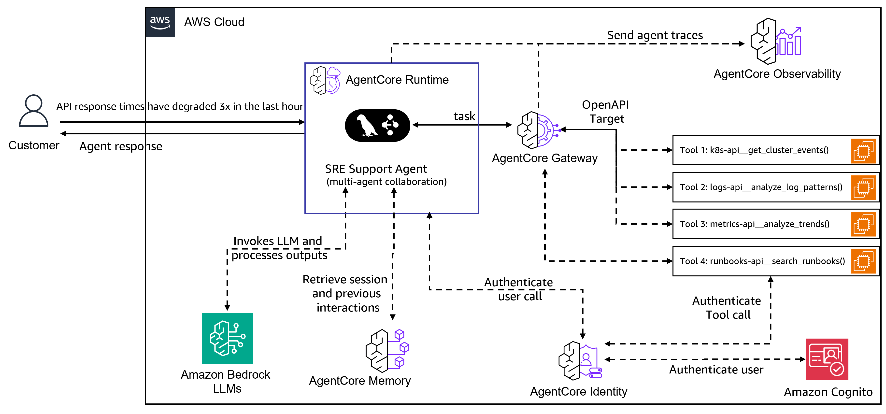

# Solution Architecture

## Three-Layer Intelligent System

### **Layer 1: Multi-Agent Orchestration**
- **Supervisor Agent**: Creates investigation plans and routes work
- **Specialist Agents**: Domain experts for K8s, Logs, Metrics, Runbooks
- **Built on LangGraph**: Production-grade multi-agent framework

### **Layer 2: AgentCore Gateway (MCP Protocol)**
- Converts backend APIs into standardized MCP tools
- JWT authentication and credential management  
- Health monitoring with circuit breakers

### **Layer 3: Infrastructure Data Sources**  
- **Kubernetes API** (:8011) - Cluster operations and pod status
- **Logs API** (:8012) - Log aggregation and analysis
- **Metrics API** (:8013) - Performance and availability data
- **Runbooks API** (:8014) - Operational procedures

---

### **Why This Architecture Works**
✅ **Separation of concerns** - Each agent masters one domain  
✅ **Protocol standardization** - Any API becomes an MCP tool  
✅ **Enterprise ready** - Built-in security, monitoring, and scaling