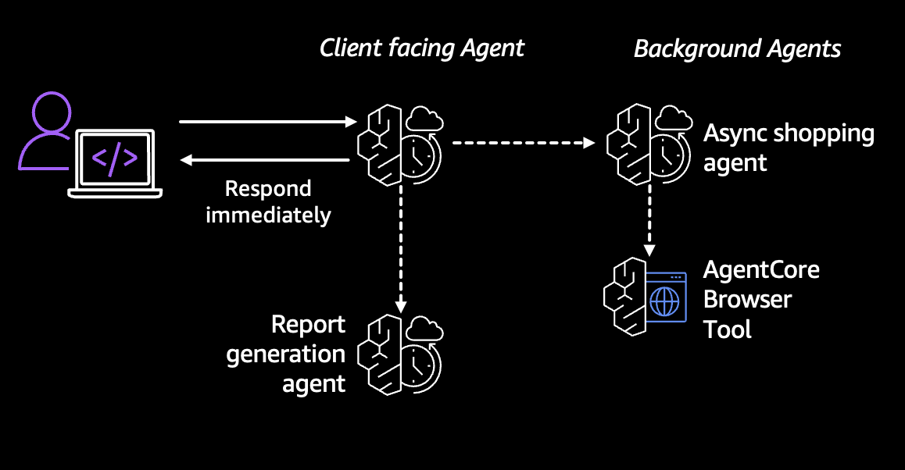

# Asynchronous Shopping Assistant with Strands

> [!CAUTION]
> The examples provided in this repository are for experimental and educational purposes only. They demonstrate concepts and techniques but are not intended for direct use in production environments. Make sure to have Amazon Bedrock Guardrails in place to protect against [prompt injection](https://docs.aws.amazon.com/bedrock/latest/userguide/prompt-injection.html).

This is an asynchronous shopping assistant implementation using AWS Bedrock AgentCore framework with Strands multi-agent orchestration. The system provides an AI-powered shopping interface that can search for products on Amazon while maintaining responsive conversations with users through background task management.



## Table of Contents

- [Overview](#overview)
- [Prerequisites](#prerequisites)
- [Key Features](#key-features)
- [Architecture](#architecture)
- [Installation](#installation)
- [Usage](#usage)
- [Components](#components)
- [Deployment](#deployment)
- [Sample Queries](#sample-queries)
- [Cleanup](#cleanup)
- [🤝 Contributing](#-contributing)
- [📄 License](#-license)

## Overview

This shopping assistant demonstrates a powerful pattern for building responsive AI agents that can handle time-consuming tasks without blocking the conversation flow with a user. The agent uses Amazon Bedrock AgentCore Runtime's asynchronous capabilities combined with Strands multi-agent orchestration to create a seamless shopping experience, where a fronting agent talks to the customer, but also sets tasks for a background shopping and reporting agent.

### Use Case Details

| Information         | Details                                                                      |
|---------------------|------------------------------------------------------------------------------|
| Use case type       | Shopping Assistant                                                           |
| Agent type          | Asynchronous                                                                 |
| Agentic Framework   | Strands                                                                      |
| LLM model           | Anthropic Claude 3.5 Sonnet & Haiku                                         |
| Components          | AgentCore Runtime, Browser Tool, Async Tasks                                |
| Example complexity  | Intermediate                                                                 |
| SDK used            | Amazon BedrockAgentCore Python SDK                                           |

## Prerequisites

### AWS Account Setup

1. **AWS Account**: You need an active AWS account with appropriate permissions
   - [Create AWS Account](https://aws.amazon.com/account/)
   - [AWS Console Access](https://aws.amazon.com/console/)

2. **AWS CLI**: Install and configure AWS CLI with your credentials
   - [Install AWS CLI](https://docs.aws.amazon.com/cli/latest/userguide/getting-started-install.html)
   - [Configure AWS CLI](https://docs.aws.amazon.com/cli/latest/userguide/cli-configure-quickstart.html)

3. **Bedrock Model Access**: Enable access to Amazon Bedrock Anthropic Claude models in your AWS region
   - Navigate to [Amazon Bedrock Console](https://console.aws.amazon.com/bedrock/)
   - Go to "Model access" and request access to:
     - Anthropic Claude 3.5 Sonnet model
     - Anthropic Claude 3.5 Haiku model

4. **Python 3.10+**: Required for running the application
   - [Python Downloads](https://www.python.org/downloads/)

5. **Docker**: Required for local testing and deployment
   - [Docker Installation](https://docs.docker.com/get-docker/)

6. **Nova Act API Key**: Required for browser automation
   - Set the `NOVA_ACT_API_KEY` environment variable

## Key Features

- **Asynchronous Task Management**: Launch background tasks that don't block the conversation
- **Browser Tool Integration**: Use AgentCore's Browser Tool to search and extract product information
- **Multi-Agent Orchestration**: Coordinate between fronting, shopping, and reporting agents using Strands
- **File System Integration**: Store and retrieve search results using file system tools
- **Parallel Processing**: Handle multiple product searches simultaneously
- **Streamlit Chat Interface**: Interactive web interface for testing and demonstration

## Architecture

The shopping assistant uses a multi-agent architecture with three specialized agents:


### Agent Workflow

1. **User Request**: The user makes a shopping-related query
2. **Fronting Agent**: Evaluates the request and determines if it requires product search
3. **Conditional Routing**: If shopping is needed, the request is routed to the Shopping Agent
4. **Background Task**: The Shopping Agent launches a background browser task using NovaAct
5. **Parallel Conversation**: While the search runs, the Fronting Agent continues conversing with the user
6. **Result Storage**: When the browser task completes, results are saved to a file
7. **Task Completion**: The background task is marked as complete in AgentCore
8. **Result Retrieval**: When the user asks for results, the Reporting Agent reads the file and presents findings


## Installation

1. **Clone the repository and navigate to the example directory**

2. **Install dependencies**:
   ```bash
   uv venv
   source .venv/bin/activate
   uv pip install -r requirements.txt
   ```

## Usage

### Local Testing

You can test the agent locally using the Jupyter notebook:

```bash
uv add --dev ipykernel
uv run ipython kernel install --user --env VIRTUAL_ENV $(pwd)/.venv --name=async_shop_agent
uv run --with jupyter jupyter lab
```

In Jupyter Lab environment open asynchronous_shopping_assistant_strands.ipynb ny double clicking from the file browser.

### Streamlit Chat Interface

Launch the interactive chat interface:

```bash
uv run streamlit run agentcore_chat.py
```

This provides a web-based chat interface where you can:
- Select your deployed agent
- Chat with the shopping assistant
- View real-time responses
- Monitor background tasks

## Deployment

### Using AgentCore Runtime

1. **Create IAM Role**: Create an execution role for AgentCore Runtime

2. **Configure Runtime**:
   ```python
   from bedrock_agentcore_starter_toolkit import Runtime
   
   agentcore_runtime = Runtime()
   response = agentcore_runtime.configure(
       entrypoint="async_shopping_with_strands.py",
       execution_role=your_iam_role_arn,
       auto_create_ecr=True,
       requirements_file="requirements.txt"
   )
   ```

3. **Launch Agent**:
   ```python
   launch_result = agentcore_runtime.launch()
   ```

4. **Check Status**:
   ```python
   status = agentcore_runtime.status()
   ```

## Sample Queries

Try these example queries with your shopping assistant:

1. "What's the price of Echo Dot on Amazon?"
2. "Can you search for wireless headphones under $100?"
3. "Compare the prices of iPhone 15 and Samsung Galaxy S24"
4. "Any deals on Smeg coffee makers?"
5. "While you're searching for laptops, can you tell me about different brands?"

## Components

### Main Files

- **`async_shopping_with_strands.py`**: Main agent implementation with Strands orchestration
- **`agentcore_chat.py`**: Streamlit chat interface for interactive testing
- **`asynchronous_shopping_assistant_strands.ipynb`**: Complete tutorial and deployment guide
- **`requirements.txt`**: Python dependencies

### Key Functions

- **`call_browser_tool()`**: Initiates background browser tasks
- **`get_tasks_info()`**: Monitors task status and retrieves results
- **`_run_browser_task()`**: Executes browser automation using NovaAct
- **Multi-agent graph**: Orchestrates workflow between specialized agents

## Cleanup

To clean up deployed resources:

```python
# Delete agent runtime
agentcore_control_client.delete_agent_runtime(agentRuntimeId=agent_id)

# Delete ECR repository
ecr_client.delete_repository(repositoryName=repo_name, force=True)

# Delete IAM role
iam_client.delete_role(RoleName=role_name)
```

## 🤝 Contributing

We welcome contributions! Please see our [Contributing Guidelines](../../CONTRIBUTING.md) for details on:
- Adding new samples
- Improving existing examples
- Reporting issues
- Suggesting enhancements

## 📄 License

This project is licensed under the MIT License - see the [LICENSE](../../LICENSE) file for details.

---

**Note**: This example demonstrates asynchronous agent patterns and is designed for educational purposes. For production use, ensure proper error handling, security measures, and resource management are implemented.