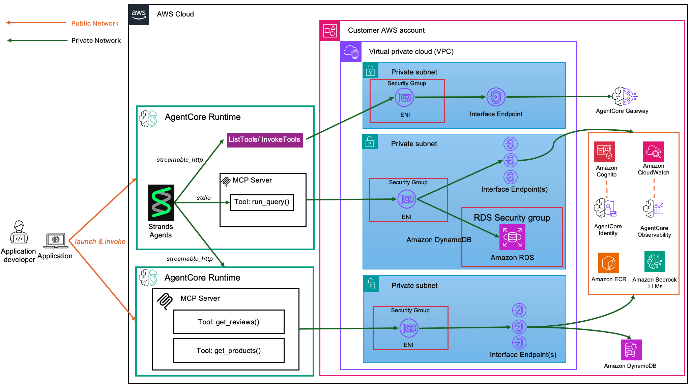

# Custome Support Assistant - Private VPC

> [!IMPORTANT]
> The examples provided in this repository are for experimental and educational purposes only. They demonstrate concepts and techniques but are not intended for direct use in production environments.

This is a customer support agent implementation using AWS Bedrock AgentCore framework. The system provides an AI-powered customer support interface with capabilities for warranty checking, customer profile management, Google calendar integration, and Amazon Bedrock Knowledge Base retrieval.

## Architecture Overview

## Prerequisites

1. AWS CLI configured with appropriate permissions
2. An existing EC2 Key Pair for SSH access
3. cfn-lint installed (optional, for validation)

## Deployment Steps

## Cleanup

## Sample Queries

### Customer Profile & Purchase History

**Query**: *"Can you provide a complete profile for customer CUST001 including their purchase history and support details?"*
**Expected Response**: Complete customer view with personal details, VIP tier status, $3,250.99 lifetime value, purchase history including laptop and coffee mug orders, and product reviews.

### Product Information & Customer Feedback

**Query**: *"Tell me about the Laptop Pro product including customer reviews, inventory status, and warranty information."*
**Expected Response**: Product specifications, average customer rating, review summaries, current stock levels across warehouses, and warranty coverage details.

### Customer Support Case Analysis

**Query**: *"What can you tell me about Bob Johnson's account and any issues he might have had with his recent purchases?"*
**Expected Response**: VIP customer profile, business account holder status, multiple support interactions, recent purchases with shipping status, and positive product feedback.

### Inventory & Purchase Correlation

**Query**: *"Which customers have purchased laptops and what do they think about them? Also check current inventory levels."*
**Expected Response**: John Doe (CUST001) and Jane Smith (CUST002) purchased laptops, with 5-star and 4-star reviews respectively, plus current inventory: 50 units across 3 warehouses.

### Warranty Status & Customer Relationship

**Query**: *"Check the warranty status for laptop serial number LAPTOP001A1B2C and tell me about the customer who owns it."*
**Expected Response**: Extended warranty valid until 2025-08-15, owned by John Doe (Premium tier customer), $3,250.99 lifetime value, who gave the laptop a 5-star review praising its performance.

### Category Analysis & Customer Preferences

**Query**: *"Show me all Electronics category products, their reviews, and which customers prefer this category based on their purchase patterns."*
**Expected Response**: Electronics products (laptops, mice, keyboards, webcams), category breakdown including subcategories, customer review summaries, and customer segments (Premium/VIP customers prefer electronics).

### Comprehensive Customer Journey

**Query**: *"Trace the complete customer journey for Jane Smith from registration to her latest interaction."*
**Expected Response**: Registered March 2023, Gold tier customer, prefers email + phone communication, purchased smartphone and desk chair totaling $1,899.50, left positive reviews, tech enthusiast profile, 1 support case resolved.

### Cross-System Data Validation

**Query**: *"Verify data consistency between systems for customer CUST004 and highlight any discrepancies."*
**Expected Response**: Alice Brown consistent across all systems, Standard tier in DynamoDB matches single purchase in Aurora, USB cable review in FastAPI aligns with customer profile and purchase data.

### Business Intelligence Query

**Query**: *"Which customers are most valuable and what products do they prefer? Include their support engagement levels."*
**Expected Response**: VIP/Premium customers identified (CUST001: $3,250.99, CUST003: $8,750.25), preferred Electronics category, positive review patterns, varying support engagement levels indicating satisfaction.