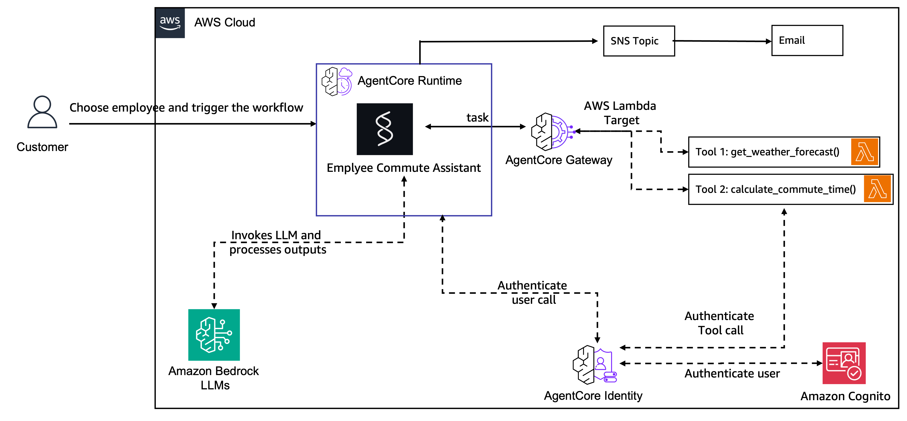

# Employee Commute Advisor - Multi-Region AgentCore Solution

An AI-powered employee commute advisor that provides real-time traffic and weather information using Amazon Bedrock AgentCore. Demonstrates complete integration of AgentCore Runtime, Gateway, Identity services with OAuth2 authentication, and SNS email notifications.

## 📋 Table of Contents

- [Overview](#overview)
- [Architecture](#architecture)
- [Multi-Region Support](#multi-region-support)
- [Prerequisites](#prerequisites)
- [Project Structure](#project-structure)
- [Deployment Guide](#deployment-guide)
- [Testing](#testing)
- [Cleanup](#cleanup)
- [Troubleshooting](#troubleshooting)

---

## Overview

This application demonstrates a production-ready, multi-region AgentCore implementation where an AI agent:

1. **Receives** employee commute requests (from/to addresses)
2. **Authenticates** using OAuth2 with Amazon Cognito (M2M flow)
3. **Invokes** two Lambda tools through AgentCore Gateway:
   - **Weather Forecast** (WeatherAPI integration)
   - **Traffic Data** (TomTom API integration)
4. **Analyzes** real-time data with Claude 3.7 Sonnet
5. **Sends** personalized email notifications via Amazon SNS

**Key Features:**
- ✅ **Multi-Region**: Deploy in us-east-1, us-west-2, or eu-west-1
- ✅ **Auto-Configuration**: Region-aware model selection and permissions
- ✅ **OAuth2 Authentication**: Secure M2M authentication with Cognito
- ✅ **Real-Time Data**: Weather forecasts and traffic conditions
- ✅ **Email Notifications**: Automated SNS email delivery
- ✅ **Production-Ready**: Comprehensive error handling and logging

---

## Architecture



### Component Flow

```
┌─────────────┐
│  Customer   │ Choose employee and trigger workflow
└──────┬──────┘
       │
       ▼
┌─────────────────────────────────────────────────────────────┐
│  AgentCore Runtime                                          │
│  ┌───────────────────────────────────────────────────────┐ │
│  │  Employee Commute Assistant (Strands Agent)           │ │
│  │  - Claude 3.7 Sonnet (region-aware model ID)          │ │
│  │  - Invokes LLM and processes outputs                  │ │
│  └────────┬──────────────────────────────────────┬────────┘ │
└───────────┼──────────────────────────────────────┼──────────┘
            │                                      │
            │ Invokes LLM                         │ task
            ▼                                      ▼
    ┌───────────────┐              ┌──────────────────────────┐
    │ Amazon Bedrock│              │  AgentCore Gateway       │
    │     LLMs      │              │  (Lambda Target)         │
    └───────────────┘              └────────┬─────────────────┘
                                            │
                       ┌────────────────────┼────────────────────┐
                       │                    │                    │
                       │ Authenticate       │ Authenticate       │
                       │ tool call          │ user call          │
                       ▼                    ▼                    │
              ┌─────────────────┐  ┌─────────────────┐         │
              │ AgentCore       │  │ Amazon Cognito  │         │
              │ Identity        │◄─┤ (OAuth2)        │         │
              └────────┬────────┘  └─────────────────┘         │
                       │                                        │
                       │ Authenticate tool call                 │
                       └────────────────────┬───────────────────┘
                                           │
                       ┌───────────────────┼────────────────────┐
                       ▼                   ▼                    │
              ┌──────────────────┐  ┌──────────────────┐       │
              │ Tool 1: Lambda   │  │ Tool 2: Lambda   │       │
              │ get_weather_     │  │ calculate_       │       │
              │ forecast()       │  │ commute_time()   │       │
              │ (WeatherAPI)     │  │ (TomTom API)     │       │
              └──────────────────┘  └──────────────────┘       │
                                                               │
                                                               ▼
                                                    ┌────────────────┐
                                                    │  SNS Topic     │
                                                    │  Email         │
                                                    │  Notification  │
                                                    └────────────────┘
```

### Component Details

| Component | Purpose | Technology |
|-----------|---------|------------|
| **Customer Interface** | Trigger commute analysis for employees | Streamlit App / Lambda Invoker |
| **AgentCore Runtime** | Hosts AI agent with serverless execution | Bedrock AgentCore |
| **Strands Agent** | Agentic framework orchestrating tools | Strands SDK |
| **Amazon Bedrock** | Large Language Model (Claude 3.7 Sonnet) | Region-aware model selection |
| **AgentCore Identity** | OAuth2 credential management | AgentCore Identity Service |
| **Amazon Cognito** | OAuth2 authorization server (M2M flow) | Cognito User Pool |
| **AgentCore Gateway** | Secure API gateway exposing tools | MCP Protocol |
| **Lambda Tool 1** | Weather forecast with commute impact | WeatherAPI Integration |
| **Lambda Tool 2** | Real-time traffic and travel times | TomTom API Integration |
| **Amazon SNS** | Email notification delivery | SNS Topic with Email Protocol |

---

## Multi-Region Support

### Supported Regions

This solution can be deployed in any of these AWS regions where Bedrock AgentCore is available:

| Region | Region Code | Model Prefix |
|--------|-------------|--------------|
| **US East (N. Virginia)** | us-east-1 | us. |
| **US West (Oregon)** | us-west-2 | us. |
| **Europe (Ireland)** | eu-west-1 | eu. |

### Region-Specific Features

The solution automatically handles region-specific configurations:

1. **Model Selection**: Automatically uses correct Bedrock model ID
   - US regions: `us.anthropic.claude-3-7-sonnet-20250219-v1:0`
   - EU regions: `eu.anthropic.claude-3-7-sonnet-20250219-v1:0`

2. **IAM Permissions**: Auto-configures Runtime execution role with SSM access

3. **Region Detection**: Runtime automatically detects its deployment region

4. **Cleanup**: Auto-detects deployment region for resource cleanup

### Important Fixes Applied

Four critical issues were fixed to enable multi-region support:

1. ✅ **Dynamic Region Detection**: Agent reads region from environment instead of hardcoding us-west-2
2. ✅ **Auto SSM Permissions**: Deployment script adds SSM permissions to Runtime role
3. ✅ **Region-Aware Models**: Correct Bedrock model prefix (us. vs eu.) selected automatically
4. ✅ **Auto Secrets Manager Permissions**: Deployment script adds OAuth2 token retrieval permissions

See `REGION_FIX_INSTRUCTIONS.md` for technical details about these fixes.

---

## Prerequisites

### Required Services

- **AWS Account** with appropriate permissions
- **AWS CLI** configured with default profile  
- **Python 3.12+**
- **TomTom API Key** (free tier: https://developer.tomtom.com/)
- **WeatherAPI Key** (free tier: https://www.weatherapi.com/ - 1M calls/month)

### Required AWS Permissions

Your IAM user/role needs permissions for:

- **Bedrock AgentCore**: Runtime, Gateway, Identity services
- **Amazon Cognito**: User pools, app clients, domains
- **AWS Lambda**: Create, update, invoke functions
- **IAM**: Create roles, attach policies (for SSM permissions)
- **SSM Parameter Store**: Read/write parameters
- **CloudFormation**: Stack operations
- **Amazon SNS**: Create topics, publish messages, manage subscriptions

---

## Project Structure

```
employee-commute-advisor/
├── main.py                          # Runtime entry point (agent logic)
├── requirements.txt                 # Python dependencies
├── streamlit_app.py                 # Interactive web UI for testing
├── employees.csv                    # Sample employee database
├── cleanup.py                       # Resource cleanup script (region-aware)
├── deployment/
│   ├── deploy_all.py               # Deploy all components (with region selection)
│   ├── deploy_gateway.py           # Deploy Gateway + Cognito + Lambda tools
│   ├── deploy_runtime.py           # Deploy Runtime + auto-configure IAM
│   ├── deploy_invoker.py           # Deploy Lambda invoker + SNS
│   └── verify_weather_tool.py      # Verify weather tool setup
├── lambda_functions/
│   ├── tomtom_traffic_realtime.py  # Traffic data Lambda function
│   └── weatherapi_forecast.py      # Weather forecast Lambda function

```

---

## Deployment Guide

### Quick Start (Recommended)

Deploy everything with a single command:

```bash
cd 02-use-cases/employee-commute-advisor
AWS_PROFILE=default python deployment/deploy_all.py
```

**You will be prompted to select a region:**

```
================================================================================
SELECT DEPLOYMENT REGION
================================================================================

Supported AWS regions for Bedrock AgentCore:
  1. us-east-1 (US East - N. Virginia)
  2. us-west-2 (US West - Oregon)
  3. eu-west-1 (Europe - Ireland)

Select region (1-3): 
```

**The script will:**
1. Deploy Gateway infrastructure (Cognito + Lambda tools)
2. Register OAuth2 credential provider
3. Deploy AgentCore Runtime with auto-configured permissions
4. Deploy Lambda invoker with SNS
5. Prompt for TomTom and WeatherAPI keys
6. Run end-to-end test

### Step-by-Step Deployment

If you prefer manual control over each step:

#### Step 1: Get API Keys

**TomTom API Key:**
1. Visit https://developer.tomtom.com/
2. Sign up for free account
3. Create API key
4. Save for Step 5

**WeatherAPI Key:**
1. Visit https://www.weatherapi.com/
2. Sign up for free account (1M calls/month)
3. Get API key from dashboard
4. Save for Step 5

#### Step 2: Deploy Gateway Infrastructure

```bash
# Deploy to your chosen region
AWS_PROFILE=default python deployment/deploy_gateway.py us-west-2

# Or for other regions:
# python deployment/deploy_gateway.py us-east-1
# python deployment/deploy_gateway.py eu-west-1
```

**Creates:**
- Cognito User Pool with OAuth2 M2M configuration
- AgentCore Gateway with JWT authorization
- Two Lambda functions (TomTom + WeatherAPI)
- Both Lambda functions registered as Gateway targets

#### Step 3: Deploy AgentCore Runtime

```bash
# Use the SAME region as Step 2
AWS_PROFILE=default python deployment/deploy_runtime.py us-west-2
```

**Creates:**
- AgentCore Runtime with agent code
- **Auto-adds SSM permissions** to execution role
- Selects correct Bedrock model for region

**Look for:**
```
Found Runtime role: AmazonBedrockAgentCoreSDKRuntime-{region}-xxxxxxxxxx
✅ Added SSM and Secrets Manager permissions to Runtime role
✅ Saved runtime details to SSM
```

#### Step 4: Deploy Lambda Invoker

```bash
# Use the SAME region as Steps 2 & 3
AWS_PROFILE=default python deployment/deploy_invoker.py us-west-2
```

**Creates:**
- Lambda invoker function
- SNS topic for email notifications  
- Email subscription (requires confirmation)

**⚠️ Important:** Check your email and confirm the SNS subscription!

#### Step 5: Configure API Keys

```bash
# Configure TomTom (replace REGION and YOUR_KEY)
aws lambda update-function-configuration \
  --function-name TomTomTrafficFunction \
  --environment "Variables={TOMTOM_API_KEY=YOUR_TOMTOM_KEY}" \
  --region REGION

# Configure WeatherAPI (replace REGION and YOUR_KEY)
aws lambda update-function-configuration \
  --function-name WeatherAPIFunction \
  --environment "Variables={WEATHERAPI_KEY=YOUR_WEATHERAPI_KEY}" \
  --region REGION
```

---

## Testing

### Option 1: Streamlit Web Application (Recommended)

Interactive web interface for testing:

```bash
cd 02-use-cases/employee-commute-advisor
pip install streamlit pandas
streamlit run streamlit_app.py
```

**The app will automatically detect which region you deployed to.**

If you need to override the region detection:
```bash
# For eu-west-1
AWS_REGION=eu-west-1 streamlit run streamlit_app.py

# For us-east-1
AWS_REGION=us-east-1 streamlit run streamlit_app.py

# For us-west-2
AWS_REGION=us-west-2 streamlit run streamlit_app.py
```

Opens at http://localhost:8501 with:
- Employee selection dropdown
- Real-time traffic and weather analysis
- Email notification confirmation
- Professional UI
- **Shows detected AWS region** in sidebar

### Option 2: AWS CLI Direct Invocation

Test with custom addresses:

```bash
# Create payload
cat > payload.json << 'EOF'
{
  "from_address": "Dublin, Ireland",
  "to_address": "Wicklow, Ireland"
}
EOF

# Invoke (replace REGION)
aws lambda invoke \
  --function-name employee-commute-advisor-invoker \
  --cli-binary-format raw-in-base64-out \
  --payload file://payload.json \
  --region REGION \
  response.json

# View result
cat response.json | python -m json.tool
```

### Expected Response

```json
{
  "statusCode": 200,
  "body": {
    "response": "# Dublin to Wicklow Commute Details\n\n...",
    "sessionId": "xxx-xxx-xxx",
    "runtimeId": "employee_commute_advisor",
    "from_address": "Dublin, Ireland",
    "to_address": "Wicklow, Ireland",
    "email_sent": true,
    "email_message_id": "..."
  }
}
```

**Success Indicators:**
- ✅ `statusCode: 200`
- ✅ `email_sent: true`
- ✅ Response contains traffic and weather analysis
- ✅ Email received with commute details

---

## Cleanup

### Automated Cleanup (Recommended)

The cleanup script auto-detects your deployment region:

```bash
AWS_PROFILE=default python cleanup.py
```

**Output:**
```
✅ Detected deployment in region: eu-west-1

Cleanup resources in eu-west-1? (yes/no): yes
```

**Or specify region explicitly:**

```bash
python cleanup.py us-west-2
```

**Deletes:**
- Lambda Invoker + SNS Topic
- AgentCore Runtime
- OAuth2 Identity Provider  
- AgentCore Gateway
- Cognito User Pool
- Lambda tools
- All SSM parameters

### Manual Cleanup

```bash
# Replace REGION with your deployment region

# CloudFormation stacks
aws cloudformation delete-stack --stack-name employee-commute-advisor-invoker --region REGION
aws cloudformation delete-stack --stack-name employee-commute-advisor-support --region REGION
aws cloudformation delete-stack --stack-name employee-commute-cognito --region REGION

# Runtime
aws bedrock-agentcore-control delete-agent-runtime \
  --agent-runtime-arn arn:aws:bedrock-agentcore:REGION:ACCOUNT:runtime/RUNTIME_ID \
  --region REGION

# OAuth2 Provider
aws bedrock-agentcore-control delete-oauth2-credential-provider \
  --name employee-commute-cognito-provider \
  --region REGION
```

---

## Troubleshooting

### Common Issues

#### Issue: AccessDeniedException when reading SSM parameters

**Symptom**: `User is not authorized to perform: ssm:GetParameter`

**Solution**: Redeploy Runtime to auto-add SSM permissions:
```bash
python deployment/deploy_runtime.py REGION
```

See `REGION_FIX_INSTRUCTIONS.md` for details.

#### Issue: ValidationException with Bedrock model

**Symptom**: `The provided model identifier is invalid`

**Cause**: Wrong model prefix for region (us. vs eu.)

**Solution**: Redeploy Runtime with updated code:
```bash
python deployment/deploy_runtime.py REGION
```

The latest code automatically selects the correct model for your region.

#### Issue: Email notifications not received

**Causes & Solutions:**

1. **SNS subscription not confirmed**
   - Check email inbox and spam folder
   - Click confirmation link in SNS email

2. **SNS topic in wrong region**
   - Ensure all components deployed to same region
   - Redeploy invoker if needed

#### Issue: Streamlit app shows wrong region

**Symptom**: After deploying to a new region, Streamlit app still shows old region (e.g., showing us-west-2 when deployed to eu-west-1)

**Cause**: Streamlit caches the old code and needs to be restarted to load updated region detection

**Solution**: Stop and restart Streamlit:
```bash
# Press Ctrl+C to stop the current session
# Then restart:
streamlit run streamlit_app.py

# Or with explicit region override:
AWS_REGION=eu-west-1 streamlit run streamlit_app.py
```

The app will now show the correct deployment region in the sidebar.

#### Issue: Tools not available to agent

**Solution**: Verify tool registration:
```bash
python deployment/verify_weather_tool.py REGION
```

### Getting Help

1. Check CloudWatch Logs:
   ```bash
   # Runtime logs
   aws logs tail /aws/bedrock-agentcore-runtime/employee_commute_advisor \
     --since 10m --region REGION
   
   # Lambda invoker logs
   aws logs tail /aws/lambda/employee-commute-advisor-invoker \
     --since 10m --region REGION
   ```

2. Review `REGION_FIX_INSTRUCTIONS.md` for technical details

3. Ensure all components deployed to same region

---

## Key Technical Concepts

### OAuth2 M2M Authentication

The solution uses OAuth2 Client Credentials Grant for machine-to-machine authentication:

- **No user passwords** or long-lived credentials in code
- **Automatic token management** by AgentCore Identity
- **60-minute token expiration** with automatic refresh
- **Industry-standard** authorization flow

### Region-Aware Architecture

Three key aspects enable multi-region support:

1. **Dynamic Region Detection**
   ```python
   # Runtime reads AWS_REGION environment variable
   session = boto3.Session()
   region = session.region_name
   ```

2. **Automatic Model Selection**
   ```python
   # Selects correct model prefix
   model_prefix = 'eu' if region.startswith('eu-') else 'us'
   model_id = f"{model_prefix}.anthropic.claude-3-7-sonnet-20250219-v1:0"
   ```

3. **Auto-Configured IAM**
   ```python
   # Deployment script adds SSM and Secrets Manager permissions
   policy = {
       "Effect": "Allow",
       "Action": ["ssm:GetParameter", "secretsmanager:GetSecretValue"],
       "Resource": [
           f"arn:aws:ssm:{region}:*:parameter/app/employee-commute-advisor/*",
           f"arn:aws:secretsmanager:{region}:*:secret:employee-commute-*"
       ]
   }
   ```

### Real-Time Data Integration

**TomTom API** provides:
- Address geocoding
- Traffic-aware routing
- Current traffic conditions
- Travel time estimates

**WeatherAPI** provides:
- Current weather conditions
- Hourly forecasts
- Visibility and precipitation
- Weather impact assessment

---


## Additional Resources

- [AgentCore Documentation](https://docs.aws.amazon.com/bedrock/latest/userguide/agentcore.html)
- [OAuth2 Client Credentials](https://oauth.net/2/grant-types/client-credentials/)
- [TomTom API Documentation](https://developer.tomtom.com/)
- [WeatherAPI Documentation](https://www.weatherapi.com/docs/)
- [Strands Framework](https://github.com/awslabs/strands)

---

## License

This solution is provided as a sample. See the main repository LICENSE file for details.
