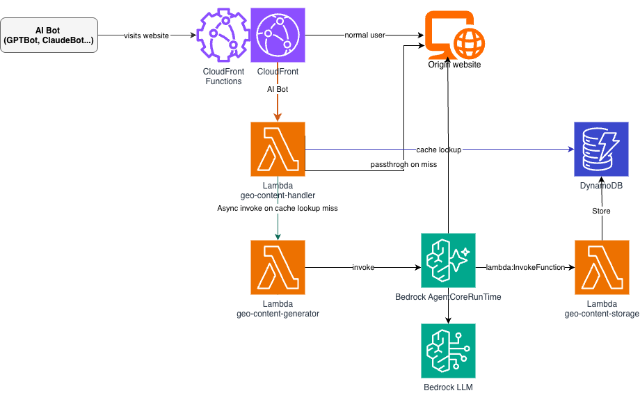

# GEO Agent

Generative Engine Optimization (GEO) agent deployed via [Amazon Bedrock AgentCore](https://docs.aws.amazon.com/bedrock/latest/userguide/agentcore.html), with Amazon CloudFront OAC + AWS Lambda Function URL for edge serving. AI search engine crawlers receive GEO-optimized content automatically.

## Architecture & Overview



```
AI Bot (GPTBot, ClaudeBot, etc.)
     │
     ▼
Amazon CloudFront ──► CloudFront Function (detect bot User-Agent)
     │                        │
  Normal User              AI Bot
     │                        ▼
  Origin site         AWS Lambda Function URL (OAC SigV4)
                              │
                        ┌─────▼──────┐
                        │ Amazon     │     Amazon Bedrock AgentCore
                        │ DynamoDB   │◄──── (GEO Agent + Guardrail)
                        │ geo-content│
                        └────────────┘
```

1. Amazon CloudFront Function detects AI bot User-Agents and routes them to an AWS Lambda Function URL (OAC + SigV4)
2. The Lambda handler checks Amazon DynamoDB for cached GEO content
3. On cache miss, it triggers async generation via Amazon Bedrock AgentCore — the agent fetches the original page, rewrites it for GEO, and stores the result
4. Normal users bypass this path entirely — zero impact on standard web performance

The agent has four tools:

| Tool | Description |
|------|-------------|
| `rewrite_content_for_geo` | Rewrites content into GEO-optimized format |
| `evaluate_geo_score` | Three-perspective GEO readiness scoring |
| `generate_llms_txt` | Generates AI-friendly `llms.txt` for websites |
| `store_geo_content` | Fetch → Rewrite → Score → Store to Amazon DynamoDB |

Multi-tenancy is built in: multiple Amazon CloudFront distributions share a single Lambda + Amazon DynamoDB set, isolated via `{host}#{path}` composite keys.

## Prerequisites

| Tool | Version | Installation |
|------|---------|-------------|
| Python | >= 3.10 | macOS: `brew install python@3.12` / Windows: [python.org](https://www.python.org/downloads/) |
| Node.js | >= 20 | macOS: `brew install node@20` / Windows: [nodejs.org](https://nodejs.org/) / Any: `nvm install 20` |
| AWS CLI | v2 | macOS: `brew install awscli` / Windows: [AWS CLI MSI installer](https://awscli.amazonaws.com/AWSCLIV2.msi) |
| AWS CDK | >= 2.150 | `npm install -g aws-cdk` |

You also need an AWS account with credentials configured (`aws configure`).

## Deployment Steps

### 1. Set up the Python environment

**macOS / Linux:**

```bash
python3 -m venv .venv
source .venv/bin/activate
pip install -e .
```

**Windows (PowerShell):**

```powershell
python -m venv .venv
.\.venv\Scripts\Activate.ps1
pip install -e .
```

### 2. Deploy the Amazon Bedrock AgentCore agent

```bash
agentcore configure   # Entrypoint: src/main.py, Region: us-east-1
agentcore deploy
```

### 3. Deploy edge serving infrastructure (CDK)

```bash
cd infra/cdk
pip install -r requirements.txt
```

Edit `cdk.json` context values with your configuration:

```json
{
  "context": {
    "default_origin_host": "www.example.com",
    "agent_runtime_arn": "<YOUR_AGENT_ARN>",
    "origin_verify_secret": "<YOUR_SECRET>",
    "table_name": "geo-content",
    "create_distribution": true
  }
}
```

Then deploy:

```bash
cdk bootstrap   # First time only
cdk deploy
```

Or pass context values directly:

```bash
cdk deploy \
  -c default_origin_host=www.example.com \
  -c agent_runtime_arn=<AGENT_ARN> \
  -c origin_verify_secret=<SECRET> \
  -c create_distribution=true
```

## Sample Queries / Usage Examples

### Local development

```bash
agentcore dev
agentcore invoke --dev "Rewrite this article for GEO: https://example.com/article/123"
agentcore invoke --dev "Evaluate GEO score for https://example.com/article/123"
agentcore invoke --dev "Generate llms.txt for example.com"
agentcore invoke --dev "Store GEO content for https://example.com/article/123"
```

### Production

```bash
agentcore invoke "Evaluate GEO score for https://example.com/article/123"
agentcore invoke "Store GEO content for https://example.com/article/123"
```

### Testing edge serving via Amazon CloudFront

```bash
curl "https://<CF_DOMAIN>/article/123?ua=genaibot"              # passthrough (default)
curl "https://<CF_DOMAIN>/article/123?ua=genaibot&mode=sync"    # wait for generation
curl "https://<CF_DOMAIN>/article/123?ua=genaibot&mode=async"   # 202 + background generation
curl "https://<FUNCTION_URL>/article/123"                        # should return 403
curl "https://<CF_DOMAIN>/llms.txt?ua=genaibot"                 # llms.txt
```

Scores dashboard: `https://<CF_DOMAIN>/?ua=genaibot&action=scores`

### Environment variables

| Variable | Default | Description |
|----------|---------|-------------|
| `MODEL_ID` | `us.anthropic.claude-sonnet-4-20250514-v1:0` | Amazon Bedrock model ID |
| `AWS_REGION` | `us-east-1` | AWS region |
| `GEO_TABLE_NAME` | `geo-content` | Amazon DynamoDB table name |
| `BEDROCK_GUARDRAIL_ID` | _(empty)_ | Amazon Bedrock Guardrail ID (optional) |
| `BEDROCK_GUARDRAIL_VERSION` | `DRAFT` | Guardrail version |

## Cleanup Instructions

### Remove infrastructure

```bash
cd infra/cdk
cdk destroy
```

### Remove the agent

```bash
agentcore destroy
```

### Clean up local environment

**macOS / Linux:**

```bash
deactivate
rm -rf .venv
```

**Windows (PowerShell):**

```powershell
deactivate
Remove-Item -Recurse -Force .venv
```
