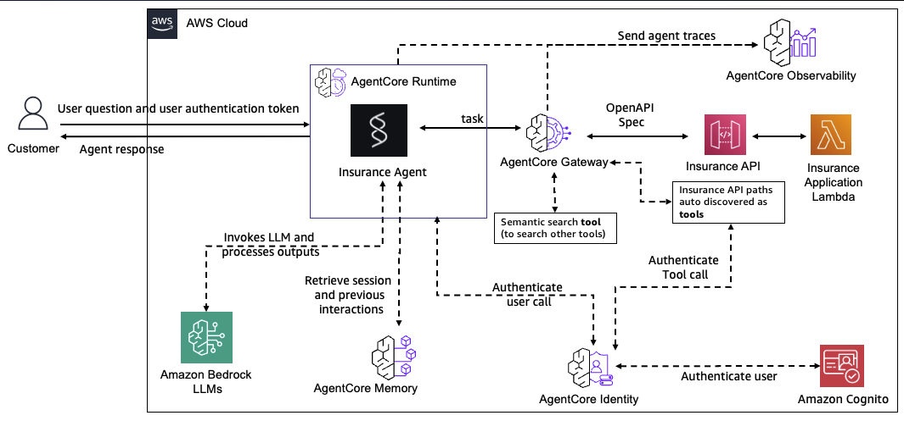

# From Prototype to Production: Agentic Applications with AWS Bedrock AgentCore

<div align="center">
  
  
  
  
</div>

This project demonstrates how to migrate a local agent-based MCP application with an API tool to AWS cloud for production benefits. The implementation leverages AWS Bedrock AgentCore, which helps productionalize agentic applications with features like authentication, observability, and managed runtime environments.


## Overview

The `production_using_agentcore` folder contains cloud-based implementations of the insurance application components found in the `local_prototype` folder, modified to leverage AWS Bedrock AgentCore services.

## Architecture



The solution consists of three main components:

1. **Cloud Insurance API** (`cloud_insurance_api/`): A FastAPI application deployed as an AWS Lambda function with API Gateway integration
2. **Cloud MCP Server** (`cloud_mcp_server/`): A gateway configuration that exposes the insurance API as an MCP tool through AWS Bedrock AgentCore Gateway
3. **Cloud Strands Insurance Agent** (`cloud_strands_insurance_agent/`): A Strands-based agent implementation that connects to the AgentCore Gateway to access the insurance API tools

## Prerequisites

- AWS account with appropriate permissions
- AWS CLI configured with admin access
- Python 3.10 or higher
- Docker Desktop or Finch installed (for local testing and deployment)
- Bedrock model access enabled in your AWS account
- jq command-line JSON processor

## Quick Start

📚 **[Complete Deployment Guide](DEPLOYMENT_GUIDE.md)** - Comprehensive guide with both automated and manual options

### Option A: Automated Full Deployment (Recommended)

Deploy everything at once with a single script:

```bash
# Run the automated deployment script
./deploy_all.sh
```

**Time**: 5-10 minutes | **Best for**: Quick setup, demos

This script will:
1. ✅ Deploy the Insurance API
2. ✅ Setup the MCP Gateway
3. ✅ Configure AgentCore Identity
4. ✅ Deploy the Strands Agent
5. ✅ Test the deployment

See [Automated Deployment](#automated-deployment) section below for details.

### Option B: Manual Step-by-Step Setup

**Time**: 20-30 minutes | **Best for**: Learning, customization

Follow the detailed steps below for manual deployment and learning.

---

## Manual Setup Process

The setup involves four main steps:

### 1. Deploy the Cloud Insurance API

The first step is to deploy the insurance API as a serverless application using AWS Lambda and API Gateway:

```bash
cd cloud_insurance_api/deployment
chmod +x ./deploy.sh
./deploy.sh
```

This deploys the FastAPI application using AWS SAM and creates all necessary resources including Lambda function, API Gateway, and permissions.

### 2. Setup the MCP Server with AgentCore Gateway

Next, configure the AWS Bedrock AgentCore Gateway to expose the insurance API as an MCP tool:

**Option A: Automated Setup (Recommended)**
```bash
cd ../../cloud_mcp_server

# Run automated setup script
./setup.sh
```

**Option B: Manual Setup**
```bash
cd ../../cloud_mcp_server

# Create and activate virtual environment (required on macOS)
python3 -m venv .venv
source .venv/bin/activate

# Install required packages
pip install -r requirements.txt

# Setup AgentCore Gateway with OpenAPI integration
python agentcore_gateway_setup_openapi.py
```

**Note**: On macOS, you must use a virtual environment due to system Python restrictions (PEP 668). The virtual environment keeps packages isolated from your system Python.

This creates an AgentCore Gateway with OAuth authorization that provides an MCP endpoint for accessing insurance API tools.

### 3. Setup AgentCore Identity (Optional but Recommended)

Configure AgentCore Identity for secure credential management:

```bash
cd ../cloud_strands_insurance_agent

# Copy example environment file and edit with your values
cp .env_example .env
#nano .env

# Run the identity setup script
./setup_identity.sh
```

This sets up:
- **Phase 1 (Outbound)**: API Key Provider for Insurance API access
- **Phase 2 (Inbound)**: Workload Identity for agent authentication

See [IDENTITY_INTEGRATION.md](cloud_strands_insurance_agent/IDENTITY_INTEGRATION.md) for detailed information.

### 4. Deploy the Strands Insurance Agent

Finally, deploy the agent that will interact with the MCP Gateway:

```bash
# Setup IAM execution role (if not already done)
cd 1_pre_req_setup/iam_roles_setup
./setup_role.sh

# Setup Cognito authentication
cd ../cognito_auth
./setup_cognito.sh

# Go back to project root
cd ../../

# Get your role ARN from the setup output or AWS console
ROLE_ARN=$(aws iam get-role --role-name BedrockAgentCoreExecutionRole --query 'Role.Arn' --output text)

# Configure the agent
agentcore configure -e "agentcore_strands_insurance_agent.py" \
  --name insurance_agent_strands \
  -er $ROLE_ARN

# Load environment variables from .env file
source .env

# Deploy to cloud (with Identity configuration if set up)
agentcore launch \
  -env MCP_SERVER_URL=$MCP_SERVER_URL \
  -env MCP_ACCESS_TOKEN=$MCP_ACCESS_TOKEN \
  -env WORKLOAD_IDENTITY_ARN=$WORKLOAD_IDENTITY_ARN \
  -env WORKLOAD_IDENTITY_ID=$WORKLOAD_IDENTITY_ID \
  -env API_KEY_PROVIDER_NAME=$API_KEY_PROVIDER_NAME
```

## Component Details

### Cloud Insurance API

A FastAPI application deployed as an AWS Lambda function that provides endpoints for:
- Customer information retrieval
- Vehicle information lookup
- Insurance quote generation
- Policy management

See the [Cloud Insurance API README](cloud_insurance_api/README.md) for detailed information.

### Cloud MCP Server

Provides gateway configuration for AWS Bedrock AgentCore that:
- Exposes the Insurance API endpoints as MCP tools
- Configures authentication using Amazon Cognito
- Sets up the execution environment for the tools
- Enables observability through CloudWatch

### Cloud Strands Insurance Agent

A Strands-based agent implementation that:
- Connects to the AgentCore Gateway MCP server
- Uses the available tools to process insurance-related queries
- Handles user interactions through a conversational interface

See the [Cloud Strands Insurance Agent README](cloud_strands_insurance_agent/README.md) for detailed information.


## Benefits of AgentCore

- **Authentication**: Secure access through OAuth2 with Cognito
- **Identity Management**: Centralized credential management with AgentCore Identity
- **Observability**: Monitoring and logging through CloudWatch
- **Memory**: Conversation history and context with AgentCore Memory
- **Scalability**: Managed runtime environments that scale automatically
- **Compliance**: Managed service with built-in security controls
- **Cost Optimization**: Pay-per-use pricing model

## AgentCore Services Used

This demo showcases the following AgentCore services:

1. **AgentCore Runtime**: Managed execution environment for the Strands agent
2. **AgentCore Gateway**: MCP server that exposes Insurance API as tools
3. **AgentCore Identity**: 
   - Workload Identity for agent authentication (Inbound)
   - API Key Provider for secure credential storage (Outbound)
4. **AgentCore Memory**: Conversation history and customer preference tracking
5. **AgentCore Observability**: CloudWatch integration for monitoring and tracing

## Usage Example

```bash
# Go to the cognito_auth directory
cd cloud_strands_insurance_agent/1_pre_req_setup/cognito_auth

# Refresh token if needed
./refresh_token.sh

# Export token
export BEARER_TOKEN=$(jq -r '.bearer_token' cognito_config.json)

# Go back to project root
cd ../../

# Invoke agent
agentcore invoke '{"user_input": "Can you help me get a quote for auto insurance?"}' --bearer-token $BEARER_TOKEN
```

## Troubleshooting

- **424 Failed Dependency**: Check agent logs in CloudWatch
- **Token expired**: Run `./1_pre_req_setup/cognito_auth/refresh_token.sh` and update your `.env` file
- **Permission denied**: Verify execution role has Bedrock model access
- **Local testing fails**: Ensure Docker is running
- **Authentication errors**: Check that MCP_ACCESS_TOKEN in your .env file is valid and not expired
- **IAM role errors**: Make sure the IAM role has all required permissions specified in `iam_roles_setup/README.md`
- **Cognito authentication issues**: Check the documentation in `cognito_auth/README.md` for troubleshooting

## Automated Deployment

The `deploy_all.sh` script automates the entire deployment process:

```bash
# Make the script executable
chmod +x deploy_all.sh

# Run the automated deployment
./deploy_all.sh
```

### What the Script Does

1. **Checks Prerequisites**: Verifies AWS CLI, Python, jq, and Docker are installed
2. **Deploys Insurance API**: Runs the SAM deployment for the Lambda function
3. **Sets up MCP Gateway**: Creates the AgentCore Gateway with OAuth
4. **Configures Identity**: Sets up workload identity and API key provider
5. **Deploys Agent**: Configures IAM, Cognito, and deploys the Strands agent
6. **Tests Deployment**: Invokes the agent to verify everything works

### Auto-Configuration

The script automatically:
- Extracts API Gateway URL from CloudFormation
- Configures MCP server URL and access token
- Sets up environment variables
- Creates `.env` files with correct values

### Troubleshooting Automated Deployment

If the automated deployment fails:
1. Check the error message for which step failed
2. Run that step manually following the manual setup instructions
3. Continue from where it failed

---

## Clean Up

When you're done using the agentcore app, follow these steps to clean up resources:

1. **Delete Gateway and Targets**:
   ```bash
   # Get gateway ID
   aws bedrock-agentcore-control list-gateways
   
   # List targets for your gateway
   aws bedrock-agentcore-control list-gateway-targets --gateway-identifier your-gateway-id
   
   # Delete targets first (if not deleting the entire gateway)
   aws bedrock-agentcore-control delete-gateway-target --gateway-identifier your-gateway-id --target-id your-target-id
   
   # Delete gateway (this will also delete all associated targets)
   aws bedrock-agentcore-control delete-gateway --gateway-identifier your-gateway-id
   ```

2. **Delete AgentCore Runtime Resources**:
   ```bash
   # List agent runtimes
   aws bedrock-agentcore-control list-agent-runtimes
   
   # List agent runtime endpoints
   aws bedrock-agentcore-control list-agent-runtime-endpoints --agent-runtime-identifier your-agent-runtime-id
   
   # Delete agent runtime endpoints
   aws bedrock-agentcore-control delete-agent-runtime-endpoint --agent-runtime-identifier your-agent-runtime-id --agent-runtime-endpoint-identifier your-endpoint-id
   
   # Delete agent runtime
   aws bedrock-agentcore-control delete-agent-runtime --agent-runtime-identifier your-agent-runtime-id
   ```

3. **Delete OAuth2 Credential Providers**:
   ```bash
   # List OAuth2 credential providers
   aws bedrock-agentcore-control list-oauth2-credential-providers
   
   # Delete OAuth2 credential provider
   aws bedrock-agentcore-control delete-oauth2-credential-provider --credential-provider-identifier your-provider-id
   ```

4. **Cognito Resources**:
   ```bash
   aws cognito-idp delete-user-pool-client --user-pool-id your-user-pool-id --client-id your-app-client-id
   aws cognito-idp delete-user-pool --user-pool-id your-user-pool-id
   ```

## Next Steps

- Add more insurance products and services
- Implement conversational memory
- Add a web UI for agent interaction
- Integrate with additional data sources for enhanced insurance offerings