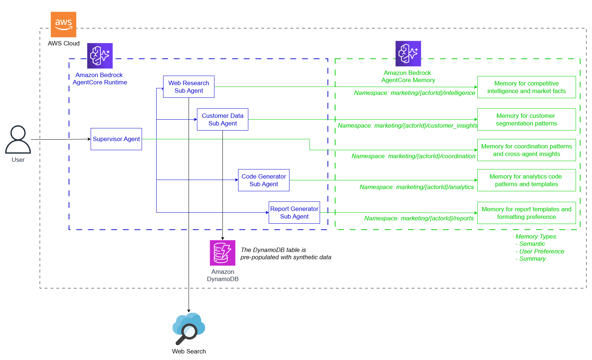

# Marketing Research Agent with AgentCore Memory

A sophisticated multi-agent system for marketing research and competitive intelligence that leverages Amazon Bedrock AgentCore Memory to provide persistent, context-aware insights across research sessions.

## Overview

The Marketing Research Agent transforms traditional marketing research by combining multiple specialized AI agents with persistent memory capabilities. Unlike stateless research tools, this system learns and builds upon previous research sessions, creating an evolving knowledge base of market insights, competitive intelligence, and customer preferences.

## Architecture

### Multi-Agent System

The system employs a supervisor-worker pattern with five specialized agents:



### Agent Responsibilities

**Supervisor Agent**
- Orchestrates research workflow and task delegation
- Coordinates between specialized agents
- Synthesizes findings into comprehensive insights
- Manages cross-agent memory sharing and context

**Research Agent**
- Conducts web research using DDGSEngine integration
- Performs competitive analysis and market positioning studies
- Identifies industry trends and market opportunities
- Builds competitive intelligence database

**Database Agent**
- Analyzes customer purchase data from single DynamoDB table (`marketing-customer-data`)
- Performs customer segmentation using GSI indexes (marketing channel, customer segment)
- Identifies purchase patterns and demographic trends from unified customer records
- Analyzes pricing, product preferences, and acquisition channel effectiveness

**Code Generator Agent**
- Generates Python code for marketing analytics
- Creates data visualizations and statistical analysis
- Develops custom analytics tools and dashboards
- Builds reusable code templates and patterns

**Reporting Agent**
- Creates comprehensive marketing reports
- Generates executive summaries and presentations
- Synthesizes multi-agent findings into actionable recommendations
- Formats professional output with proper structure

### Memory System

The system uses Amazon Bedrock AgentCore Memory with two key capabilities:

**Short-term Memory**
- Maintains conversation context within active sessions
- Stores raw interactions for immediate reference
- Expires after configurable duration (default: 1 day)

**Long-term Memory**
- Extracts and persists insights across multiple sessions
- Uses semantic memory for market facts and competitive intelligence
- Tracks user preferences for research methodologies and reporting styles
- Builds institutional knowledge that improves over time

**Memory Organization**
Each agent maintains dedicated namespaces:
```
marketing/
├── supervisor_agent_xxx/coordination/     # Research coordination patterns
├── research_agent_xxx/intelligence/       # Competitive intelligence
├── database_agent_xxx/customer_insights/  # Customer analysis patterns  
├── code_generator_agent_xxx/analytics/    # Code patterns and templates
└── reporting_agent_xxx/reports/           # Report templates and structures
```

## Project Structure

```
marketing-research-agent/
├── src/                           # Core application source code
│   ├── agent_tools/              # Agent wrapper tools for supervisor delegation
│   │   ├── code_analysis_agent_tool.py    # Code generator agent wrapper
│   │   ├── database_query_agent_tool.py   # Database agent wrapper
│   │   ├── marketing_report_agent_tool.py # Reporting agent wrapper
│   │   └── web_research_agent_tool.py     # Research agent wrapper
│   ├── core_tools/               # Direct tool implementations
│   │   ├── code_execution_tool.py         # Python code execution
│   │   ├── dynamodb_tool.py              # DynamoDB query operations
│   │   ├── report_generation_tool.py     # Report formatting and generation
│   │   └── web_search_tools.py           # Web search via DuckDuckGo
│   ├── memory/                   # AgentCore Memory integration
│   │   ├── hooks.py              # Automatic conversation capture
│   │   └── memory_manager.py     # Memory lifecycle management
│   ├── prompts/                  # Agent system prompts
│   │   ├── code_generator_prompt.py      # Code generation instructions
│   │   ├── database_prompt.py            # Customer analysis instructions
│   │   ├── reporting_prompt.py           # Report synthesis instructions
│   │   ├── research_prompt.py            # Market research instructions
│   │   └── supervisor_prompt.py          # Coordination instructions
│   ├── base_agent.py             # Common agent functionality
│   ├── code_generator_agent.py   # Python analytics code generation
│   ├── config.py                 # Application configuration
│   ├── database_agent.py         # Customer data analysis
│   ├── reporting_agent.py        # Report synthesis and formatting
│   ├── research_agent.py         # Web research and competitive analysis
│   ├── supervisor_agent.py       # Main orchestration agent
│   └── utils.py                  # Shared utilities
├── infra/                        # AWS CDK infrastructure code
│   ├── src/
│   │   └── marketing_research_stack.py   # CDK stack definition
│   ├── app.py                    # CDK application entry point
│   └── cdk.json                  # CDK configuration
├── scripts/                      # Deployment and management scripts
│   ├── clean_and_recreate_memory.py     # Memory troubleshooting
│   ├── deploy.py                 # Deployment orchestration
│   ├── initialize_memory.py      # Memory setup and bootstrap
│   └── populate_dynamodb.py      # Sample data generation
├── agent.py                      # FastAPI application entry point
├── docker-compose.yml            # Local development setup
├── Dockerfile                    # Container image definition
├── Taskfile.yml                 # Task automation commands
├── pyproject.toml               # Python dependencies and project config
└── README.md                    # Project documentation
```

### Key Directories

**`src/`** - Contains all application logic organized by functionality:
- **Agent implementations** - Individual specialized agents (supervisor, research, database, code generator, reporting)
- **Tools** - Both direct tools and agent wrapper tools for delegation
- **Memory** - AgentCore Memory integration for persistent learning
- **Prompts** - System prompts that define each agent's behavior and expertise

**`infra/`** - AWS infrastructure as code using CDK:
- Defines AgentCore Runtime, DynamoDB table, IAM roles, and ECR repository
- Handles deployment of containerized agents to AWS

**`scripts/`** - Operational scripts for deployment and maintenance:
- Memory initialization and troubleshooting
- DynamoDB data population
- Deployment orchestration

## Prerequisites

- Python 3.10+
- AWS Account with Bedrock access
- AWS CLI configured with appropriate credentials
- UV package manager
- Task (Taskfile runner)
- Docker

## Required AWS Permissions

Your AWS credentials need access to:
- Amazon Bedrock (Claude models and embedding models)
- Amazon Bedrock AgentCore (Runtime and Memory)
- Amazon ECR (for container images)
- Amazon DynamoDB (for customer data)
- AWS CloudFormation (for CDK deployment)
- AWS IAM (for role management)

## Installation

1. Clone the repository:
```bash
git clone <repository-url>
cd marketing-research-agent
```

2. Install dependencies:
```bash
uv sync
cd infra && uv sync && cd ..
```

3. Configure environment:
```bash
cp .env.example .env
# Edit .env with your AWS region and model preferences
```

4. Set required environment variables:
```bash
# Mac / Unix
export AWS_ACCOUNT_ID=$(aws sts get-caller-identity --query Account --output text)
export AWS_REGION=us-east-1

# Window (Powershell)
$Env:AWS_ACCOUNT_ID = (aws sts get-caller-identity --query Account --output text)
$Env:AWS_REGION = "us-east-1"
```

## Configuration

Edit `.env` with your settings:

```bash
# AWS Configuration
AWS_REGION=us-east-1

# Agent Models (Claude 3 Sonnet recommended)
RESEARCH_MODEL=anthropic.claude-3-sonnet-20240229-v1:0
SUPERVISOR_MODEL=anthropic.claude-3-sonnet-20240229-v1:0
DATABASE_MODEL=anthropic.claude-3-sonnet-20240229-v1:0
CODE_GENERATOR_MODEL=anthropic.claude-3-sonnet-20240229-v1:0
REPORTING_MODEL=anthropic.claude-3-sonnet-20240229-v1:0

# Memory Configuration
MEMORY_ENABLED=true
MEMORY_EVENT_EXPIRY_DAYS=1

# Optional: Enable thinking mode for debugging
RESEARCH_THINKING_ENABLED=false
SUPERVISOR_THINKING_ENABLED=false
```

## Deployment

Complete deployment to AWS:
```bash
task deploy
```

This single command will:
1. Bootstrap CDK if needed
2. Create ECR repository
3. Build and push Docker image
4. Deploy infrastructure (AgentCore Runtime + DynamoDB + IAM roles)
5. Initialize AgentCore Memory with marketing intelligence strategies
6. Populate DynamoDB with sample customer data

## Local Development

Run the agent locally:
```bash
task run
```

Use Docker Compose:
```bash
task start    # Build and run
task stop     # Stop services
```

## Usage

### Web Interface (Streamlit Frontend)

A Streamlit web interface is available for easier interaction with the deployed agent. **Note: The frontend runs locally and connects to localhost.**

After deployment, start the web interface:
```bash
# Install dependencies (if not already done)
uv sync

# Run the task locally
task run

# (In another shell) Start the Streamlit frontend
uv run streamlit run src/app.py
```

The web interface provides:
- Interactive chat interface with real-time streaming responses
- Report preview and download functionality
- Session management and conversation history
- Example prompts for common research tasks
- Configuration options for the agent endpoint

The frontend automatically connects to your deployed AgentCore runtime. If you need to change the endpoint, use the sidebar configuration in the web interface.

### API Access (Direct)

You can also interact directly with the deployed AgentCore runtime via API calls:

```bash
# Mac / Unix
curl -X POST http://localhost:8080/invocations \
  -H "Content-Type: application/json" \
  -d '{
    "input": {
      "prompt": "Analyze the competitive landscape for B2B SaaS marketing automation tools, including pricing strategies, feature differentiation, and market positioning of the top 5 players."
    }
  }'

# Windows (Powershell)
Invoke-RestMethod -Uri "http://localhost:8080/invocations" `
   -Method POST `
   -ContentType "application/json" `
   -Body '{"input": {"prompt": "Conduct a comprehensive competitive analysis of the email marketing software market, our customer base, focusing on pricing strategies, feature differentiation, and market positioning of the top 5 players."}}'                  
```

### Example Research Queries

**Competitive Analysis:**
```json
{
  "input": {
    "prompt": "Conduct a comprehensive competitive analysis of the email marketing software market, focusing on pricing strategies and feature differentiation."
  }
}
```

**Customer Purchase Analysis:**
```json
{
  "input": {
    "prompt": "Analyze our customer purchase data to identify high-value customer segments, popular products, and effective marketing channels for acquisition."
  }
}
```

**Market Opportunity Assessment:**
```json
{
  "input": {
    "prompt": "Evaluate the market opportunity for AI-powered marketing analytics tools in the mid-market segment, including market size and growth trends."
  }
}
```

### Expected Output

The system produces comprehensive markdown reports including:

- **Executive Summary**: Key findings and strategic recommendations
- **Market Analysis**: Industry trends, market size, and growth projections  
- **Competitive Intelligence**: Competitor positioning, strengths, and weaknesses
- **Customer Insights**: Purchase pattern analysis, demographic segmentation, and marketing channel effectiveness
- **Data Visualizations**: Charts and graphs supporting key findings
- **Actionable Recommendations**: Specific next steps and implementation guidance
- **Supporting Code**: Python analytics code for further analysis

## Memory Benefits

**Institutional Learning**: Each research session builds upon previous knowledge, making agents smarter over time.

**Context Continuity**: Agents remember previous research topics, methodologies, and findings across sessions.

**Personalized Experience**: The system adapts to your team's research preferences and reporting styles.

**Knowledge Accumulation**: Builds a comprehensive competitive intelligence database that grows with usage.

**Efficient Research**: Avoids repeating previous research by leveraging stored insights and patterns.

## Data Model

### DynamoDB Table Structure

The system uses a single DynamoDB table (`marketing-customer-data`) with the following structure:

**Primary Keys:**
- **Partition Key**: `customer_id` (STRING) - Unique customer identifier
- **Sort Key**: `timestamp` (STRING) - ISO timestamp of purchase event

**Attributes:**
- Customer demographics: `first_name`, `last_name`, `age`, `gender`
- Purchase data: `purchase_id`, `item`, `price`, `date_purchased`
- Marketing data: `customer_segment`, `marketing_channel`, `campaign_id`

**Global Secondary Indexes:**
- **marketing-channel-index**: Partition Key = `marketing_channel`, Sort Key = `timestamp`
- **customer-segment-index**: Partition Key = `customer_segment`, Sort Key = `timestamp`

**Sample Record:**
```json
{
  "customer_id": "customer_000293",
  "timestamp": "2025-04-11T01:32:18.362859",
  "age": 34,
  "campaign_id": "campaign_3199",
  "customer_segment": "casual_user",
  "date_purchased": "2025-04-11",
  "first_name": "Olivia",
  "gender": "Male",
  "item": "Keyboard",
  "last_name": "Gonzalez",
  "marketing_channel": "webinar",
  "price": 1964.53,
  "purchase_id": "3de6b9cc-96ae-4259-854c-c003e1300336"
}
```

## Infrastructure Components

**AgentCore Runtime**: Containerized agent system deployed via CDK
**AgentCore Memory**: Persistent memory store for cross-session learning
**DynamoDB**: Single table (`marketing-customer-data`) with customer purchase records and GSI indexes for marketing channel and customer segment analysis
**ECR**: Container registry for Docker images
**IAM Roles**: Secure access to AWS services with least privilege

## Individual Tasks

If you need to run specific deployment steps:

```bash
task ecr:push        # Build and push Docker image
task cdk:bootstrap   # Bootstrap CDK
task cdk:deploy      # Deploy infrastructure only
task memory:init     # Initialize memory only  
task dynamo:populate # Populate sample data only
task memory:clean    # Clean up duplicate memories and create fresh one
task cdk:destroy     # Destroy infrastructure
```

### Memory Management

**Clean and Recreate Memory**
```bash
task memory:clean
```

Use this command if you encounter memory-related issues or need to reset the memory system:
- Deletes all existing MarketingResearchAgentMemory resources
- Creates a fresh memory resource with proper strategies (semantic, user preference, summary)
- Tests the new memory to ensure it's working correctly
- Provides the new memory ID for reference

This is useful when:
- Memory resources were created without proper strategies
- You have duplicate or corrupted memory resources
- Memory initialization failed during deployment
- You want to start with a clean memory state