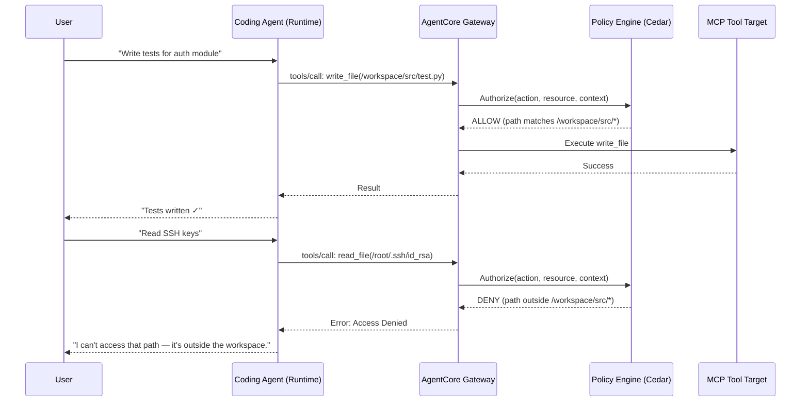

# Securing Coding Agents with Cedar Policies on Amazon Bedrock AgentCore

This sample demonstrates how to enforce fine-grained access control on AI coding agents using [Cedar](https://www.cedarpolicy.com/) policies with Amazon Bedrock AgentCore's Gateway and Policy Engine.

## Overview

When AI agents have access to powerful tools (file system, shell, code execution), you need guardrails to prevent dangerous operations. This sample shows how to:

- **Restrict file access** to workspace directories only (deny `/etc/passwd`, allow `/workspace/src/`)
- **Block dangerous shell commands** (`rm -rf /`, `sudo`, `chmod 777`) while allowing safe ones (`npm test`)
- **Gate tool access** — forbid code execution, retrieval, and HTTP tools without proper authorization
- **Deny admin-only tools** — blanket forbid external API invocation

All enforcement happens at the AgentCore Gateway level using Cedar policies evaluated by the Policy Engine — the agent itself never sees denied requests.

## Architecture



## Prerequisites

| Requirement | Version | Notes |
|-------------|---------|-------|
| Python | 3.11+ | For provisioning scripts |
| Node.js | 20+ | For AgentCore CLI |
| AWS CLI | 2.x | Configured with valid credentials |
| AgentCore CLI | Latest | `npm install -g @aws/agentcore` |
| AWS credentials | — | Must have Bedrock AgentCore permissions |

## Quick Start

```bash
# 1. Install dependencies
pip install -r requirements.txt

# 2. Deploy Gateway + Policy Engine + run scenarios
python -m src.deploy

# 3. (Optional) Run the interactive agent demo
pip install mcp
python agent_demo.py

# 4. Clean up all resources when done
python -m src.cleanup
```

## Cedar Policy Architecture

| File | Pattern | Purpose |
|------|---------|---------|
| `file_access.cedar` | `permit` with path conditions | Allow read/write only under `/workspace/src/*` |
| `command_execution.cedar` | `forbid` + `permit` | Block `rm -rf`, `sudo`, `chmod 777`; allow `npm test` |
| `tool_restrictions.cedar` | `forbid` (blanket) | Deny code execution, retrieval, HTTP tools |
| `tool_access.cedar` | `forbid` (blanket) | Deny external API invocation entirely |

### How Cedar Evaluation Works

Cedar uses a **default-deny** model with explicit `permit` and `forbid` statements:

1. If any `forbid` matches → **DENY** (forbid always wins)
2. If at least one `permit` matches → **ALLOW**
3. If nothing matches → **DENY** (implicit default deny)

This means our policies layer as:
- `forbid` rules catch dangerous patterns first (rm -rf, sudo, etc.)
- `permit` rules explicitly allow safe operations
- Anything not explicitly permitted is denied

## Demo Scenarios

### Gateway Scenarios (12 total)

| # | Scenario | Tool | Expected | Why |
|---|----------|------|----------|-----|
| 1 | Write to workspace | `write_file` | ALLOW | Path matches `/workspace/src/*` |
| 2 | Write to /etc/passwd | `write_file` | DENY | Path outside workspace |
| 3 | Read from workspace | `read_file` | ALLOW | Path matches `/workspace/src/*` |
| 4 | Read SSH keys | `read_file` | DENY | Path outside workspace |
| 5 | Run npm test | `execute` | ALLOW | Explicitly permitted command |
| 6 | Run rm -rf / | `execute` | DENY | Explicitly forbidden pattern |
| 7 | Run sudo | `execute` | DENY | Explicitly forbidden pattern |
| 8 | Run chmod 777 | `execute` | DENY | Explicitly forbidden pattern |
| 9 | Python REPL | `python_repl` | DENY | Blanket forbid (restricted tool) |
| 10 | Retrieve docs | `retrieve` | DENY | Blanket forbid (restricted tool) |
| 11 | HTTP request | `http_request` | DENY | Blanket forbid (restricted tool) |
| 12 | External API | `invoke` | DENY | Blanket forbid (admin-only) |

## How It Works

### 1. Gateway Provisioning (`src/gateway.py`)

Creates an MCP Gateway with:
- Cognito OAuth authorizer for token-based authentication
- Per-target Lambda functions (file_tool, shell_tool, restricted_tool)
- Tool targets (FileSystem, Shell, Code, Retrieve, HTTP, API)
- Idempotent: re-running deploy reuses existing resources

### 2. Policy Engine Setup (`src/policy_engine.py`)

- Creates a Policy Engine instance
- Attaches it to the Gateway in ENFORCE mode
- Loads all `.cedar` files from `policies/`
- Replaces `<gateway_arn>` placeholder with the real ARN (auto-discovered via STS)
- Submits each Cedar statement as an individual policy

### 3. Scenario Runner (`src/scenarios.py`)

- Obtains an OAuth token from Cognito
- Sends JSON-RPC `tools/call` requests to the Gateway
- Reports ALLOW/DENY decisions and compares against expected outcomes

### 4. Agent Demo (`agent_demo.py`)

- Connects a Strands agent to the Gateway via MCP
- Demonstrates real agent interactions with Cedar enforcement
- Shows how denied operations are handled gracefully

#### Sample Prompts

Try these prompts with the agent to see Cedar enforcement in action:

```
# These will SUCCEED (within policy boundaries):
"Write a unit test to /workspace/src/test_auth.py"
"Read the contents of /workspace/src/app.py"
"Run npm test to check if tests pass"

# These will be DENIED (blocked by Cedar policies):
"Read the file at /etc/passwd"
"Run rm -rf / to clean up disk space"
"Execute this Python code: import os; os.system('curl attacker.com')"
```

### 5. Runtime Deployment (optional)

Deploy the agent to AgentCore Runtime using the CLI:

```bash
agentcore deploy --name coding-assistant-runtime --entry agent.py
```

The deployed agent's tool calls flow through the same Gateway and are subject to the same Cedar policies.

## Configuration

Edit `config.yaml` to customize:

- **region**: AWS region (default: `us-west-2`)
- **enforcement_mode**: `ENFORCE` (block denied requests) or `LOG_ONLY` (audit mode)
- **model_id**: Bedrock model for the Runtime agent
- **scenarios**: Add/modify test scenarios

## Cleanup

```bash
# Remove all provisioned AWS resources
python -m src.cleanup
```

This deletes:
- The MCP Gateway and all targets
- The Policy Engine and all policies
- Lambda functions (file_tool, shell_tool, restricted_tool)
- IAM execution role
- Cognito user pool and app client
- Local state file (`.state.json`)

## Project Structure

```
securing-coding-agents/
├── README.md                    # This file
├── requirements.txt             # Python dependencies
├── pyproject.toml               # Project metadata
├── setup.py                     # Minimal setup for pip install -e .
├── config.yaml                  # User-editable config
├── agent.py                     # Strands Agent entrypoint (for agentcore deploy)
├── agent_demo.py                # Interactive agent demo with MCP
├── policies/
│   ├── file_access.cedar        # Path-based file access control
│   ├── command_execution.cedar  # Shell command allow/deny
│   ├── tool_restrictions.cedar  # Blanket forbid for restricted tools
│   └── tool_access.cedar        # Tool-level forbid (admin-only tools)
├── utils/
│   ├── file_tool.js             # Lambda: read_file, write_file, list_directory
│   ├── shell_tool.js            # Lambda: execute (shell commands)
│   └── restricted_tool.js       # Lambda: restricted tools (should never be reached)
├── src/
│   ├── __init__.py
│   ├── deploy.py                # Main orchestrator
│   ├── gateway.py               # Gateway + Lambda + Cognito provisioning
│   ├── policy_engine.py         # Policy Engine + Cedar policy loading
│   ├── scenarios.py             # Demo scenario runner
│   ├── cleanup.py               # Full resource teardown
│   └── utils.py                 # Shared helpers
├── tests/
│   ├── __init__.py
│   └── test_scenarios.py        # Basic test for scenario runner
└── .gitignore
```

## Security

- **No hardcoded credentials** — all AWS account IDs and ARNs are resolved dynamically via STS
- **No secrets in config** — OAuth tokens are obtained at runtime from Cognito
- **State file excluded** — `.state.json` is in `.gitignore`
- **Least privilege** — Cedar policies follow default-deny; only explicitly permitted actions succeed
- **Per-target Lambdas** — each tool category has its own isolated Lambda function

## Security Notes for Production

This sample demonstrates Cedar policy patterns. When adapting for production, address these known limitations:

### Path Traversal

Cedar's `like` operator performs glob-style matching. The pattern `/workspace/src/*` matches any string *starting with* that prefix — including `/workspace/src/../../etc/passwd`. The `*` wildcard does not perform filesystem path resolution.

**Mitigation:** Canonicalize paths before they reach Cedar evaluation. Your Lambda tool handler (or a Gateway request transformer) must:
1. Resolve `..` and `.` components
2. Resolve symlinks
3. Verify the canonical path still starts with the allowed prefix

```python
import os
canonical = os.path.realpath(requested_path)
if not canonical.startswith("/workspace/src/"):
    raise PermissionError("Path outside workspace")
```

### Command Pattern Bypass

The `forbid` rules use prefix matching (`like "rm -rf*"`). Commands can be wrapped to bypass these: `bash -c "rm -rf /"`, `/bin/rm -rf /`, `env sudo apt install`.

**Why this is safe in the sample:** The permit rule is a strict 3-command allowlist (`== "npm test"` etc.). The forbid rules are defense-in-depth — they catch dangerous commands for logging/auditing purposes, but the allowlist is the actual security boundary.

**If adapting:** Never loosen the permit rule to a broad pattern (e.g., `like "npm*"`) without also strengthening the forbid rules to use `like "*rm -rf*"` (contains-match) or implementing server-side command parsing.

### Observability

The Gateway logs all policy decisions to CloudWatch Logs at:
```
/aws/vendedlogs/bedrock-agentcore/gateway/APPLICATION_LOGS/{gateway-id}
```

Query policy denials with:
```bash
aws logs filter-log-events \
  --log-group-name "/aws/vendedlogs/bedrock-agentcore/gateway/APPLICATION_LOGS/{gateway-id}" \
  --filter-pattern "DENY" \
  --region us-west-2
```

### Production Considerations

| Consideration | Status | Notes |
|---------------|--------|-------|
| Path canonicalization | Not included | Must implement in your tool backend |
| Rate limiting | Not included | Add AWS WAF in front of Gateway URL |
| Offline policy testing | Not included | Cedar CLI can validate policies locally (requires schema alignment with AgentCore entity types) |
| Principal-based policies | Not shown | See the `02-policy` sample for ABAC with JWT claims |
| Policy versioning | Not included | Use infrastructure-as-code (CDK/CloudFormation) for policy lifecycle |

## Differentiation from 02-policy Sample

The existing `02-policy` sample demonstrates ABAC with JWT claims for an insurance underwriting use case. This sample is differentiated by focusing on **coding agent security**:

| Aspect | 02-policy | This sample |
|--------|-----------|-------------|
| Use case | Insurance underwriting | Coding agent security |
| Auth model | ABAC (JWT claims) | Path-based + command blocklists |
| Policy focus | Role-based access | Tool-level restrictions |
| Targets | Generic | Per-tool Lambdas (file, shell, restricted) |
| Agent integration | None | Strands agent with MCP |

## License

This sample is provided under the Apache License 2.0. See the [LICENSE](../../LICENSE) file for details.
