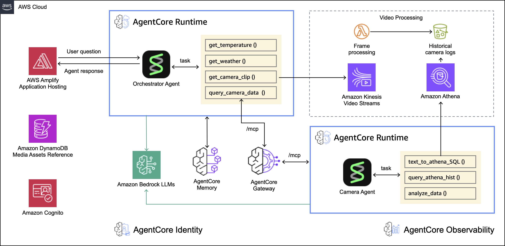
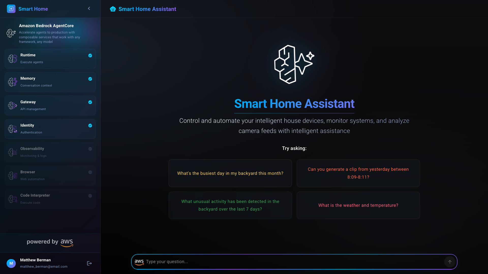
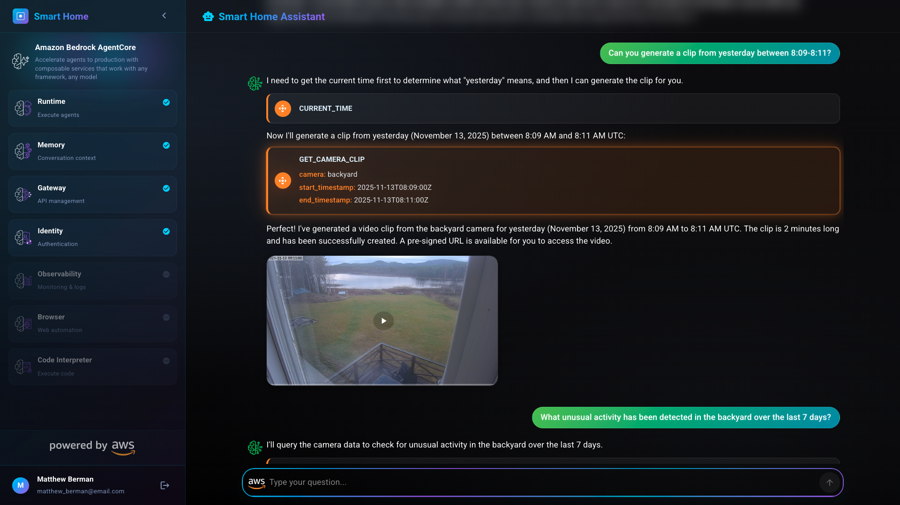

# AI-Powered Smart Home Assistant with Amazon Bedrock AgentCore

A complete end-to-end reference solution demonstrating **[Amazon Bedrock AgentCore](https://aws.amazon.com/bedrock/agentcore/)** capabilities for building intelligent, production-ready AI agents with real-time camera monitoring, natural language processing, and conversational AI.

## Overview

This project showcases how to leverage **Amazon Bedrock AgentCore** to build sophisticated AI agents that can:

- **Process Natural Language**: Understand and respond to complex user queries
- **Execute Tools Dynamically**: Call MCP servers for text-to-SQL and data retrieval
- **Stream Responses**: Provide real-time, token-by-token responses
- **Manage Context**: Maintain conversation history and session state
- **Handle Media Assets**: Process and display videos and images from camera streams
- **Integrate Multiple Services**: Orchestrate AWS services seamlessly

## Architecture

*Complete architecture showing the integration between Amazon Bedrock AgentCore, Kinesis Video Streams, DynamoDB, and the React frontend.*

> [!IMPORTANT]
> This sample application is for demonstration purposes only and is not production-ready. Please validate the code against your organization's security best practices.

## Agent Experience

This solution delivers a complete agent experience from backend to frontend:

### AgentCore Runtime
- **Agent Execution**: Process natural language queries and determine appropriate actions
- **Tool Orchestration**: Dynamically call MCP servers for SQL queries and data retrieval
- **Streaming Responses**: Generate and stream responses in real-time
- **Memory Management**: Maintain conversation context across multiple turns
- **Error Handling**: Gracefully handle and communicate errors

### User Interface
- **Conversational Interface**: Natural chat experience with the AI assistant
- **Real-time Updates**: See agent responses appear token-by-token
- **Tool Transparency**: Visualize when the agent is using tools with loading indicators
- **Rich Media**: Display videos and images inline with analysis results

## Getting Started

This project consists of two main components that need to be deployed in order:

### 1️⃣ Agent and Backend Deployment

Deploy the AI agent runtime, MCP servers, and data processing infrastructure.

📖 **[Follow the Backend Deployment Guide →](agentcore-smart-home/)**

**What you'll deploy:**
- **Amazon Bedrock AgentCore Runtime**: Core agent execution environment
- **MCP Servers**: Text-to-SQL tools for data queries (sync and async)
- **Agent Configuration**: Runtime ARN and endpoint setup
- **DynamoDB Tables**: Media assets and session storage
- **Kinesis Video Streams**: Camera stream ingestion
- **Lambda Functions**: Data processing and frame analysis

### 2️⃣ Frontend Deployment

Deploy the React web application that provides a rich conversational interface for interacting with your AgentCore-powered assistant.

📖 **[Follow the Frontend Deployment Guide →](amplify-smart-home/)**

**What you'll deploy:**
- **Conversational UI**: Modern chat interface with Material-UI components
- **Real-time Streaming**: Display AgentCore responses token-by-token as they arrive
- **Tool Use Visualization**: Show when and how the agent uses tools (with loading states)
- **Media Asset Display**: Inline rendering of videos and images from camera analysis
- **Error Handling**: User-friendly error messages from AgentCore
- **Sample Questions**: Quick-start prompts to explore agent capabilities
- Amazon Cognito authentication
- AWS Amplify hosting

## Application UI Previews

The Smart Home Assistant provides an intuitive conversational interface:

<table border="0">
<tr>
<td width="50%" valign="top">

### Welcome Assistant

*The Smart Home Assistant interface showing the conversational AI powered by Amazon Bedrock AgentCore.*

</td>
<td width="50%" valign="top">

### Media Assets Display

*Real-time display of security camera videos and images with AI-powered analysis and object detection.*

</td>
</tr>

<tr>
<td>

### App Demo

</td>
</tr>

</table>

## Contributing

Contributions are welcome! Please feel free to submit issues or pull requests.

## License

This project is licensed under the Apache-2.0 License.

## Thanks

Thank you for exploring this AI-powered smart home assistant solution! We hope this helps you build amazing agent experiences with Amazon Bedrock AgentCore.
