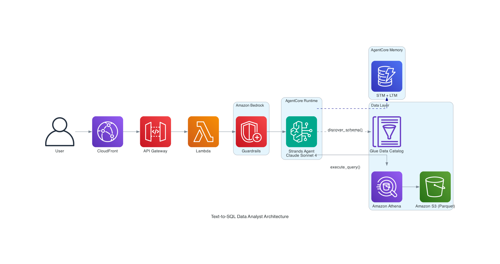

# Text-to-SQL Data Analyst Assistant

A natural language to SQL data analyst assistant built with Amazon Bedrock AgentCore, Strands Agents SDK, and Amazon Athena. Users ask questions in plain language, and the agent discovers schema from AWS Glue Data Catalog, generates optimized SQL, executes it on Athena, and returns formatted results.

> **🚀 Ready-to-Deploy Agent Web Application**: Use this reference solution to build natural language data query interfaces across different industries. Extend the agent capabilities by adding custom tools, connecting to different data sources, and adapting the business dictionary to your domain.

## 🎯 Overview

Text-to-SQL Data Analyst Assistant enables users to:

- Ask questions about their data in natural language
- Get AI-generated SQL queries executed automatically on Amazon Athena
- View results in a clean web interface with schema visualization
- Benefit from conversational memory (STM + LTM) that learns query patterns across sessions
- Configure tables and business context via YAML — no code changes needed

### Key Features

- 🤖 **AI-Powered SQL Generation** using Claude Sonnet 4 via Strands Agents SDK
- 🗄️ **Automatic Schema Discovery** from AWS Glue Data Catalog
- 🔒 **4-Layer Security**: Amazon Bedrock Guardrails → System Prompt → PolicyValidator → AWS Lake Formation
- 🧠 **Dual Memory**: STM (session context) + LTM (learned SQL patterns, TTL 90 days)
- ⚙️ **YAML-Driven Configuration**: Define tables in `config/tables.yaml`, business context in `config/system_prompt.yaml`
- 🏗️ **CDK Infrastructure**: One-command deployment of Glue, Athena, S3, Lambda, API Gateway, CloudFront
- 🔄 **Dual Engine Support**: Works with Amazon Athena (default) and Amazon Redshift
- 🌐 **Web Frontend**: Clean UI with example queries and live schema panel

## 🏗️ Architecture



### Component Details

#### Frontend (HTML + CSS + JavaScript)
- Query input with natural language support
- Example query buttons for quick exploration
- Schema visualization panel showing available tables and columns
- Results table with execution metrics

#### Backend (AgentCore Runtime + Strands Agents)
- **discover_schema**: Discovers tables and columns from Glue Data Catalog using keyword-based relevance scoring
- **execute_query**: Validates SQL (SELECT-only), executes on Athena, returns typed results
- **PolicyValidator**: Code-level SQL validation — rejects DDL/DML, auto-applies LIMIT
- **System Prompt**: Loaded dynamically from `config/system_prompt.yaml` with business dictionary and few-shot examples

#### AI Model (Amazon Bedrock)
- Primary: Claude Sonnet 4 — `us.anthropic.claude-sonnet-4-20250514-v1:0`

#### Semantic Layer (AWS Glue + Athena)
- Glue Data Catalog as the schema metastore (tables, columns, types, comments)
- Amazon Athena as the serverless SQL engine over S3 Parquet data
- Tables defined in `config/tables.yaml` and created dynamically by CDK

### AWS Services

| Service | Purpose |
|---------|---------|
| Amazon Bedrock AgentCore | Agent runtime with conversational memory (STM + LTM) |
| Claude Sonnet 4 (Amazon Bedrock) | LLM for SQL generation and response formatting |
| AWS Glue Data Catalog | Schema registry / semantic layer |
| Amazon Athena | Serverless SQL engine over S3 |
| Amazon S3 | Data lake (Parquet) + frontend hosting |
| AWS Lambda | Backend orchestrator |
| Amazon API Gateway | REST API with CORS |
| Amazon CloudFront | CDN for frontend + API proxy |
| Amazon Bedrock Guardrails | Content filtering (hate, violence, prompt injection) |
| AWS CDK | Infrastructure as Code |

## 🚀 Quick Start

### Prerequisites

- Python 3.11+
- Node.js 18+ (for CDK and AgentCore CLI)
- AWS CLI configured with credentials
- Docker (for Lambda asset bundling)
- AWS account with Amazon Bedrock access (Claude model enabled)
- AWS Permissions: `BedrockAgentCoreFullAccess`, `AmazonBedrockFullAccess`

### 1. Setup

```bash
cd 02-use-cases/text-to-sql-data-analyst

python3 -m venv .venv

# macOS / Linux
source .venv/bin/activate

# Windows
.venv\Scripts\activate

pip install -r requirements.txt

cp .env.example .env
# Edit .env with your values
```

### 2. Define Your Tables

Edit `config/tables.yaml` with your data structure:

```yaml
database_name: "my_company_demo"
tables:
  - name: customers
    description: "Registered customers. Related to sales via customer_id."
    columns:
      - name: customer_id
        type: bigint
        comment: "PK - Unique customer identifier"
      - name: name
        type: string
        comment: "Full name"
      # ... more columns
```

### 3. Configure Business Context

Edit `config/system_prompt.yaml`:
- `business_dictionary`: Define terms your users commonly use
- `examples`: Add 10-15 relevant SQL query examples (few-shot learning)
- `naming_conventions`: Document your tables and relationships

### 4. Generate Sample Data (Optional)

```bash
python scripts/init_demo_data.py
aws s3 cp data/demo/ s3://YOUR-BUCKET/data/ --recursive
```

### 5. Deploy Infrastructure

```bash
cd cdk/
pip install -r requirements.txt
cdk bootstrap aws://YOUR_ACCOUNT_ID/us-east-1
cdk deploy --all
```

### 6. Deploy AgentCore Agent

```bash
pip install bedrock-agentcore-starter-toolkit
agentcore configure -e agentcore_agent.py
agentcore launch
```

### 7. Test Locally

```bash
# Start agent locally
python agentcore_agent.py

# Test (in another terminal)
curl -X POST http://localhost:8080/invocations \
  -H "Content-Type: application/json" \
  -d '{"query": "How many customers do we have?"}'
```

## 📋 Usage

### Sample Queries

Once deployed, try these example queries in the web interface:

| Natural Language Query | What It Does |
|----------------------|--------------|
| "How many customers do we have?" | Counts all records in the customers table |
| "What are the top 10 best-selling products?" | Ranks products by total sales volume |
| "Show me total revenue by month for 2024" | Aggregates sales by month |
| "Which customers spent more than $500?" | Filters customers by total purchase amount |
| "What is the average ticket per customer segment?" | Calculates average sale amount grouped by segment |
| "List products with low stock (less than 50 units)" | Filters products by inventory level |
| "Who are our premium customers?" | Finds customers in the premium segment |

You can customize the example queries shown in the UI by editing `config/system_prompt.yaml`.

### Asking Questions

1. Open the frontend URL (CloudFront output from CDK deploy)
2. Type a natural language question (e.g., "What are the top 10 best-selling products?")
3. Or click one of the example query buttons
4. View the generated SQL and results

### Adding Tables

1. Add the table definition in `config/tables.yaml`
2. Upload Parquet data to S3
3. Redeploy CDK: `cd cdk/ && cdk deploy`
4. Add relevant examples in `config/system_prompt.yaml`

### Using Redshift Instead of Athena

The `execute_query` tool supports Redshift out of the box. Set `engine_type="redshift"` and configure connection variables in `.env`.

## 🛠️ Project Structure

```
text-to-sql-data-analyst/
├── agentcore_agent.py              # AgentCore entry point (Strands SDK)
├── config/
│   ├── tables.yaml                 # ⚙️ CONFIGURE: Define your tables here
│   └── system_prompt.yaml          # ⚙️ CONFIGURE: Prompt, examples, dictionary
├── src/
│   ├── policy_validator.py         # SQL validation (SELECT-only enforcement)
│   └── tools/
│       ├── discover_schema.py      # Schema discovery (Glue Data Catalog)
│       └── execute_query.py        # Query execution (Athena / Redshift)
├── cdk/
│   ├── app.py                      # CDK app entry point
│   └── stack.py                    # AWS infrastructure (reads tables.yaml)
├── scripts/
│   └── init_demo_data.py           # Sample data generator
├── frontend/                       # Web interface
│   ├── index.html
│   └── static/styles.css
├── tests/
│   └── test_policy_validator.py    # Unit tests
└── docs/
    └── DEEP-DIVE.md                # Technical deep dive
```

## 🔒 Security

### 4-Layer Validation

```
Layer 1: Amazon Bedrock Guardrails → Blocks inappropriate content before LLM
Layer 2: System Prompt             → Instructs SELECT-only, LIMIT required
Layer 3: PolicyValidator           → Code-level SQL validation (rejects DDL/DML)
Layer 4: AWS Lake Formation        → IAM-level permissions (SELECT only on specific tables)
```

### Important

> **⚠️** This sample application is meant for demo purposes and is not production ready. Please make sure to validate the code with your organization's security best practices.

## 💰 Cost Estimate (~1,000 queries/month)

| Service | Monthly Cost |
|---------|-------------|
| Bedrock (Claude Sonnet 4) | ~$15-30 |
| Athena | ~$2-5 |
| Lambda | ~$1-3 |
| S3 + CloudFront | ~$1-3 |
| AgentCore Runtime | Included with Bedrock |
| **Total** | **~$20-40/month** |

## 🧹 Cleanup

```bash
# Destroy CDK stack
cd cdk/
cdk destroy --all

# Destroy AgentCore
agentcore destroy
```

## 📄 License

This project is licensed under the Apache-2.0 License.

## 📚 Additional Resources

For a detailed technical deep dive including request flow analysis, scaling strategies, and cost breakdowns, see [docs/DEEP-DIVE.md](docs/DEEP-DIVE.md).
