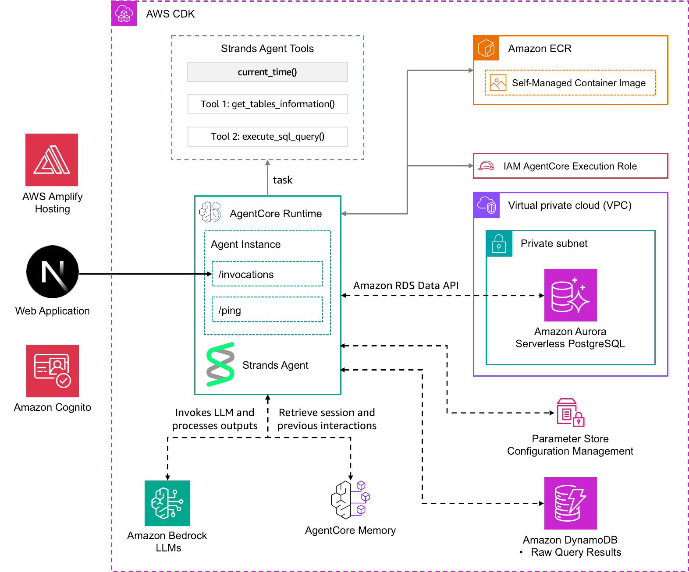
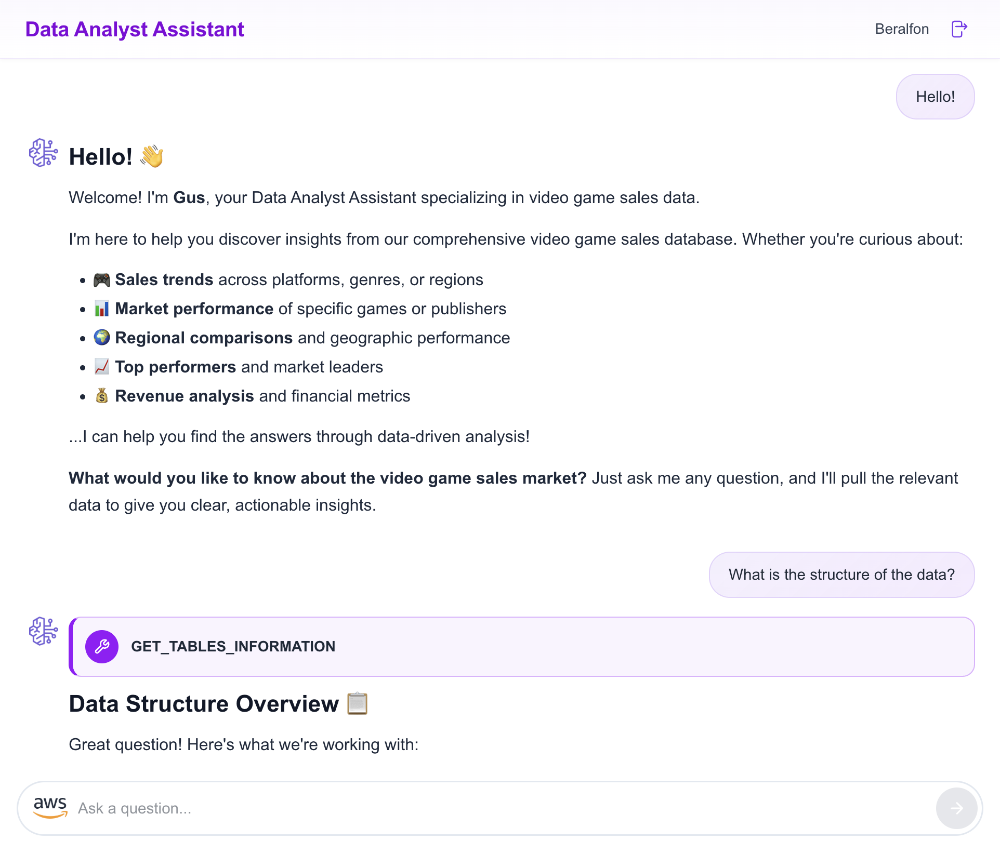
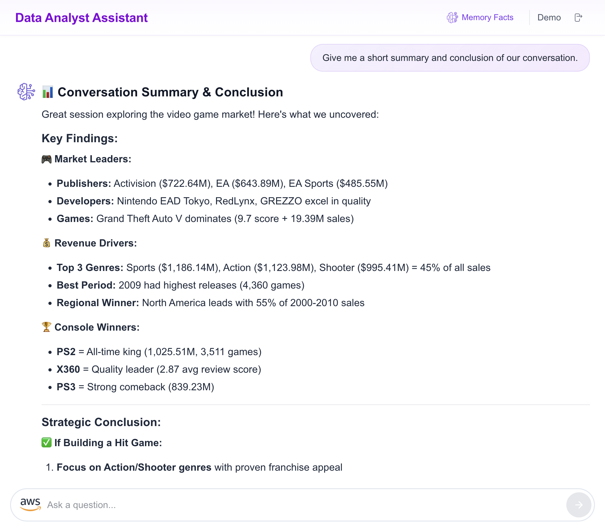

# Video Games Sales Data Analyst Assistant

> **Full-stack AI agent** powered by Amazon Bedrock AgentCore, Strands Agents SDK, and AWS Amplify Gen 2 — demonstrating Runtime, Memory, Gateway, Observability, Policy, Evaluations, and Identity in a single sample.

A production-grade reference solution that lets users interact with a PostgreSQL database of 64,000+ video game titles through natural language conversations, receive AI-generated SQL analysis, view results in tabular and chart formats, and retain cross-session memory of insights.


## Architecture



### AgentCore Features Used

| Feature | What It Does in This Sample |
|---------|----------------------------|
| **Runtime** | Hosts the Strands Agent in a container (ARM64). Provides `/invocations` streaming endpoint and `/ping` health check. |
| **Memory** | **STM**: conversation history scoped by `sessionId` + `actorId`. **LTM**: semantic "Facts" strategy extracting knowledge into `/facts/{actorId}` namespace. 90-day event retention. |
| **Gateway** | Exposes PostgreSQL query tools (`get_tables_information`, `execute_sql_query`) as a Lambda target behind an MCP Gateway — decoupling the agent from direct tool implementations. |
| **Observability** | OpenTelemetry tracing via ADOT auto-instrumentation. Custom spans for agent invocations, SQL execution, memory operations. Traces flow to CloudWatch Transaction Search + X-Ray. |
| **Policy (Guardrails)** | Bedrock Guardrail blocks queries for internal cost data and raw PII. Topic + sensitive information policies enforce content filtering at the model layer. |
| **Evaluations** | Evaluation harness measuring SQL generation accuracy and response quality across 8 test scenarios, with support for AgentCore built-in evaluators. |
| **Identity** | Cognito User Pool (via Amplify Gen 2) authenticates frontend users. Each user's `sub` maps to the `actorId` for memory isolation. |

## Data Model

### PostgreSQL — `video_games_sales_units`

| Column | Type | Description |
|--------|------|-------------|
| `title` | TEXT | Game title (unique per record) |
| `console` | TEXT | Platform (PS4, Xbox One, Switch, etc.) |
| `genre` | TEXT | Game genre (Action, Sports, RPG, etc.) |
| `publisher` | TEXT | Publisher name |
| `developer` | TEXT | Developer studio |
| `critic_score` | NUMERIC(3,1) | Metacritic score (0–10) |
| `na_sales` | NUMERIC(4,2) | North America sales (millions of units) |
| `jp_sales` | NUMERIC(4,2) | Japan sales (millions of units) |
| `pal_sales` | NUMERIC(4,2) | Europe & Africa sales (millions of units) |
| `other_sales` | NUMERIC(4,2) | Rest of world sales (millions of units) |
| `release_date` | DATE | Release date |

**64,016 titles** from 1971 to 2024.

### DynamoDB — `RawQueryResults`

Stores SQL query results for the frontend audit trail:

| Key | Type | Description |
|-----|------|-------------|
| `id` (PK) | String | Query UUID |
| `my_timestamp` (SK) | Number | Epoch milliseconds |
| `sql_query` | String | Executed SQL statement |
| `sql_query_description` | String | What the query retrieves |
| `user_prompt` | String | Original user question |
| `data` | String | JSON-serialized query results |

## Prerequisites

- **AWS Account** with Bedrock model access enabled (Claude Haiku 4.5)
- **AWS CLI** v2 configured (`aws configure`)
- **Node.js** 20+ and **pnpm** 9+
- **Python** 3.12+
- **Docker** running (for container builds)
- **AgentCore CLI**: `npm install -g @aws/agentcore`

## Quickstart (5 commands)

```bash
# 1. Deploy backend infrastructure (Aurora, DynamoDB, VPC, AgentCore resources)
cd cdk-data-analyst-assistant-agentcore-strands
npm install && npx cdk deploy --all

# 2. Load video game sales data into Aurora
python3 resources/create-sales-database.py
python3 resources/create-readonly-user.py

# 3. Deploy agent to AgentCore (alternative to CDK-managed runtime)
cd ..
agentcore deploy

# 4. Start the Amplify frontend (local dev)
cd amplify-video-games-sales-assistant-agentcore-strands
pnpm install && pnpm ampx sandbox

# 5. Open browser
open http://localhost:3000
```

## Detailed Setup

### Option A: AgentCore CLI Deploy (Recommended for Development)

The `agentcore/agentcore.json` config defines all AgentCore resources. The CLI handles packaging, CDK synthesis, and deployment:

```bash
# Install the AgentCore CLI
npm install -g @aws/agentcore

# From the project root
agentcore deploy
```

After deployment:
```bash
# Check resource status
agentcore status

# Invoke the agent directly
agentcore invoke "What are the top 5 selling games?"

# Stream logs
agentcore logs

# View traces
agentcore traces list
```

### Option B: Script-based Deploy (Recommended for CI/CD)

The `deploy.py` script uses boto3 directly for teams that need programmatic/scripted deployments:

```bash
# Deploy with CDK outputs
python deploy.py \
  --region us-east-1 \
  --aurora-arn arn:aws:rds:us-east-1:123456789012:cluster:assistant-cluster \
  --secret-arn arn:aws:secretsmanager:us-east-1:123456789012:secret:ReadOnlySecret-xxx \
  --dynamodb-table RawQueryResults-xxx \
  --db-tools-lambda-arn arn:aws:lambda:us-east-1:123456789012:function:DatabaseTools

# Or with a pre-built container
python deploy.py \
  --region us-east-1 \
  --container-uri 123456789012.dkr.ecr.us-east-1.amazonaws.com/video-games-agent:latest \
  --aurora-arn ... \
  --secret-arn ...
```

The script creates: IAM role, Memory, Runtime, Gateway + Lambda target, and Guardrail. Outputs are saved to `deploy_outputs.json`.

### Option C: Full CDK Deploy (Production Infrastructure)

The CDK stack deploys the complete infrastructure including VPC, Aurora, DynamoDB, and all AgentCore resources:

```bash
cd cdk-data-analyst-assistant-agentcore-strands
npm install
npx cdk bootstrap   # First time only
npx cdk deploy --all
```

CDK outputs provide the ARNs needed for the frontend `.env.local`:
- `AgentRuntimeArn`
- `MemoryId`
- `QuestionAnswersTableName`
- `AuroraServerlessDBClusterARN`
- `ReadOnlySecretARN`

### Data Loading

After the CDK stack deploys Aurora:

```bash
cd cdk-data-analyst-assistant-agentcore-strands/resources

# Create tables and import CSV data (uses RDS Data API)
python3 create-sales-database.py

# Create read-only user for the agent (least-privilege)
python3 create-readonly-user.py
```

### Frontend Setup (Amplify Gen 2)

```bash
cd amplify-video-games-sales-assistant-agentcore-strands
pnpm install
```

Create `.env.local` from the CDK outputs:
```env
AGENT_RUNTIME_ARN=arn:aws:bedrock-agentcore:us-east-1:123456789012:runtime/xxx
QUESTION_ANSWERS_TABLE_NAME=RawQueryResults-xxx
MEMORY_ID=xxx-xxx-xxx
AGENT_ENDPOINT_NAME=DEFAULT
MODEL_ID_FOR_CHART=us.anthropic.claude-haiku-4-5-20251001-v1:0
APP_NAME=Data Analyst Assistant
WELCOME_MESSAGE=I'm your AI Data Analyst Assistant for video game sales. Ask me anything about sales trends, top games, publisher performance, and more!
```

Deploy Cognito + IAM (local sandbox):
```bash
pnpm ampx sandbox
```

Start the dev server:
```bash
pnpm dev
# Open http://localhost:3000
```

For production hosting, connect the repository to AWS Amplify Hosting and configure environment variables in the Amplify Console.

## AgentCore Gateway

The Gateway exposes the database tools as an MCP endpoint. No standalone MCP server is needed — tools are registered as **Lambda targets** with inline schemas.

### How It Works

1. **At deploy time**: `deploy.py` registers the Lambda as a Gateway target with the tool schema (`lambdas/db_tools/tool_schema.json`)
2. **At runtime**: The agent connects to the Gateway as an MCP client, discovers available tools via `tools/list`, and calls them via `tools/call`
3. **Gateway handles**: Authentication, tool routing, Lambda invocation, MCP protocol conversion

### Lambda Handler

The Lambda at `lambdas/db_tools/lambda_function.py` extracts the tool name from context:
```python
tool_name = context.client_context.custom['bedrockAgentCoreToolName']
# Format: {targetId}___get_tables_information
tool_name = tool_name[tool_name.index("___") + 3:]
```

### Tool Schema

Registered inline during gateway target creation:
```json
[
  {
    "name": "get_tables_information",
    "description": "Get database schema metadata...",
    "inputSchema": { "type": "object", "properties": {} }
  },
  {
    "name": "execute_sql_query",
    "description": "Execute a read-only SQL query...",
    "inputSchema": {
      "type": "object",
      "properties": {
        "sql_query": { "type": "string" },
        "description": { "type": "string" }
      },
      "required": ["sql_query", "description"]
    }
  }
]
```

## Observability

The agent uses OpenTelemetry via AWS Distro for OpenTelemetry (ADOT):

### Setup

1. `aws-opentelemetry-distro>=0.10.0` in `requirements.txt`
2. Dockerfile CMD: `opentelemetry-instrument python -m app`
3. Custom spans in `app.py` for agent invocations, SQL execution, and memory operations

### What Gets Traced

| Span | Attributes |
|------|-----------|
| `agent_invocation` | `gen_ai.system`, `gen_ai.request.model`, `session.id`, `user.id`, `prompt.uuid` |
| `execute_sql_query` | `db.system`, `db.statement`, `db.result.row_count`, `db.result.saved` |
| `memory_configure` | `memory.id`, `memory.session_id`, `memory.actor_id` |
| `memory_flush` | (timing of session close) |

ADOT auto-instruments Bedrock model invocations and HTTP calls. Combined with AgentCore service-generated metrics, you get full end-to-end visibility in CloudWatch GenAI Observability.

### Viewing Traces

```bash
# Via AgentCore CLI
agentcore traces list
agentcore logs

# Via CloudWatch Console
# Navigate to Application Signals > Transaction Search
```

## Policy (Guardrails)

The Bedrock Guardrail blocks:

| Policy | Type | What It Blocks |
|--------|------|----------------|
| InternalCostData | Topic DENY | Queries about margins, wholesale costs, procurement pricing |
| RawCustomerPII | Topic DENY | Requests to expose customer emails, phones, addresses |
| EMAIL, PHONE | PII ANONYMIZE | Redacts emails/phones if they appear in responses |
| SSN, Credit Card | PII BLOCK | Hard-blocks SSN and credit card numbers |

The guardrail is created by `deploy.py` and can be attached to the Strands agent via `guardrail_config`.

## Evaluations

Run the evaluation harness to measure agent quality:

```bash
python evaluations/evaluate.py \
  --region us-east-1 \
  --agent-runtime-arn arn:aws:bedrock-agentcore:us-east-1:123456789012:runtime/xxx

# Also run AgentCore built-in evaluators (requires traces in CloudWatch)
python evaluations/evaluate.py \
  --region us-east-1 \
  --agent-runtime-arn <ARN> \
  --use-agentcore-evals
```

### Test Scenarios

The harness includes 8 scenarios covering:
- **SQL aggregation**: Top sellers, averages by genre
- **Filtering**: Year/console/publisher-specific queries
- **Comparison**: Regional sales comparison
- **Trend analysis**: Releases over time
- **Out-of-scope**: Non-video-game questions (should decline gracefully)

Results are saved to `evaluations/eval_results.json`.

## Project Structure

```
video-games-sales-assistant/
├── README.md                          # This file
├── deploy.py                          # Script-based deployment (boto3)
├── agentcore/                         # AgentCore CLI project config
│   ├── agentcore.json                 # Resource declarations
│   └── aws-targets.json               # Account/region targets
├── lambdas/                           # Gateway Lambda targets
│   └── db_tools/
│       ├── lambda_function.py         # Tool routing handler
│       └── tool_schema.json           # MCP tool definitions
├── evaluations/                       # Evaluation harness
│   └── evaluate.py                    # SQL accuracy + response quality tests
├── cdk-data-analyst-assistant-agentcore-strands/  # CDK backend
│   ├── cdklib/                        # CDK stack (Aurora, VPC, DynamoDB, AgentCore)
│   ├── resources/                     # Data loading scripts + CSV
│   └── data-analyst-assistant-agentcore-strands/  # Agent code
│       ├── app.py                     # Agent entrypoint (Strands + OTEL)
│       ├── Dockerfile                 # Container with ADOT
│       ├── requirements.txt           # Python dependencies
│       ├── instructions.txt           # System prompt
│       └── src/                       # Tools and utilities
└── amplify-video-games-sales-assistant-agentcore-strands/  # Frontend
    ├── amplify/                       # Amplify Gen 2 (Cognito + IAM)
    ├── src/                           # Next.js App Router
    └── .env.local.example             # Environment variables template
```

## Customization

### Use a Different Database

1. Replace `lambdas/db_tools/lambda_function.py` with your database connection logic
2. Update `tool_schema.json` to describe your tables
3. Update `instructions.txt` system prompt with your domain context
4. Modify `resources/` data loading scripts for your schema

### Change the Model

Set `BEDROCK_MODEL_ID` environment variable. The agent works with any Bedrock-supported model:
```bash
# Claude Sonnet 4.6
BEDROCK_MODEL_ID=us.anthropic.claude-sonnet-4-6-20250514-v1:0

# Claude Haiku 4.5 (default, fastest)
BEDROCK_MODEL_ID=us.anthropic.claude-haiku-4-5-20251001-v1:0
```

### Add More Tools

1. Define the tool in `lambdas/db_tools/tool_schema.json`
2. Add the handler logic in `lambda_function.py`
3. The Gateway automatically discovers and exposes new tools to the agent

## Cleanup

```bash
# 1. Delete CDK stack (Aurora, DynamoDB, VPC, AgentCore resources)
cd cdk-data-analyst-assistant-agentcore-strands
npx cdk destroy --all

# 2. Delete Amplify sandbox
cd ../amplify-video-games-sales-assistant-agentcore-strands
pnpm ampx sandbox delete

# 3. (If using deploy.py) Delete resources manually or via AWS Console:
#    - AgentCore Runtime, Memory, Gateway
#    - IAM role: VideoGamesSalesAgentRole
#    - Bedrock Guardrail: VideoGamesSalesGuardrail
#    - Lambda: DatabaseTools
```

## Troubleshooting

| Issue | Solution |
|-------|----------|
| `agentcore deploy` fails | Ensure Docker is running and you have `bedrock-agentcore:*` permissions |
| Agent returns empty responses | Check CloudWatch logs: `agentcore logs` or `/aws/bedrock-agentcore/runtimes/{id}` |
| Memory facts not appearing | LTM extraction is async (20-40s). Wait, then check `/facts/{actorId}` namespace |
| SQL queries fail | Verify `READONLY_SECRET_ARN` and `AURORA_RESOURCE_ARN` env vars. Run `create-readonly-user.py` |
| Frontend can't invoke agent | Check `.env.local` has correct `AGENT_RUNTIME_ARN`. Verify Cognito Identity Pool IAM policy includes `bedrock-agentcore:InvokeAgentRuntime` |
| Gateway tools not discovered | Ensure Lambda has resource policy allowing `bedrock-agentcore.amazonaws.com` to invoke it |
| Traces not appearing | Enable CloudWatch Transaction Search. Verify Dockerfile uses `opentelemetry-instrument` in CMD |
| Guardrail not blocking | Verify guardrail is attached to the agent. Check `deploy_outputs.json` for guardrail ID |

## Deployment Options Comparison

| Method | Best For | What It Deploys |
|--------|----------|-----------------|
| `agentcore deploy` | Local dev, quick iteration | Runtime + Memory (reads `agentcore.json`) |
| `python deploy.py` | CI/CD pipelines, full control | IAM + Memory + Runtime + Gateway + Guardrail |
| `npx cdk deploy` | Production, full infrastructure | VPC + Aurora + DynamoDB + S3 + all AgentCore resources |

> **Recommended flow**: Use CDK for infrastructure (Aurora, VPC, DynamoDB), then `agentcore deploy` or `deploy.py` for the agent layer.

## Application Features

| Feature | Screenshot |
|---------|-----------|
| Welcome screen with Memory Facts |  |
| Long-term Memory Facts panel |  |
| Agent conversation with tool use |  |
| Query results in tabular format |  |
| Auto-generated chart visualization |  |
| Conversation summary |  |

## References

- [Amazon Bedrock AgentCore Documentation](https://docs.aws.amazon.com/bedrock-agentcore/latest/devguide/)
- [AgentCore CLI Getting Started](https://docs.aws.amazon.com/bedrock-agentcore/latest/devguide/runtime-get-started-cli.html)
- [Strands Agents SDK](https://strandsagents.com/)
- [AWS Amplify Gen 2](https://docs.amplify.aws/)
- [AgentCore Gateway — Lambda Targets](https://docs.aws.amazon.com/bedrock-agentcore/latest/devguide/gateway-add-target-lambda.html)
- [AgentCore Observability](https://docs.aws.amazon.com/bedrock-agentcore/latest/devguide/observability-configure.html)

## Important

> This sample application is for demonstration purposes and is not production-ready. Validate the code with your organization's security best practices before deploying to production.

Enhance AI safety by implementing [Amazon Bedrock Guardrails](https://aws.amazon.com/bedrock/guardrails/) via the [Strands Agents SDK guardrails integration](https://strandsagents.com/latest/user-guide/safety-security/guardrails/).

## License

This project is licensed under the Apache-2.0 License.