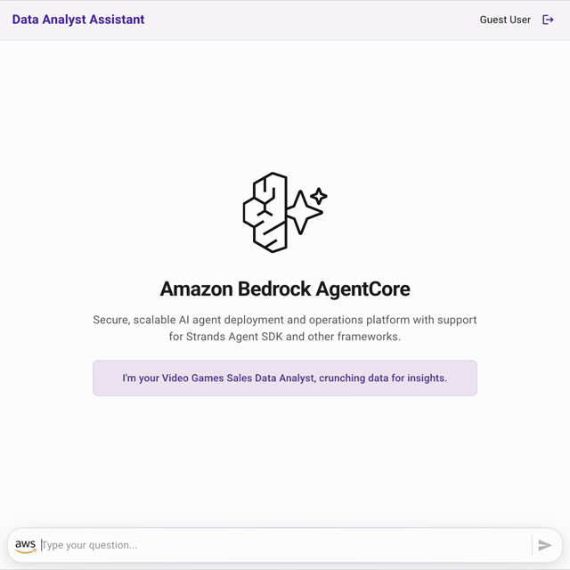
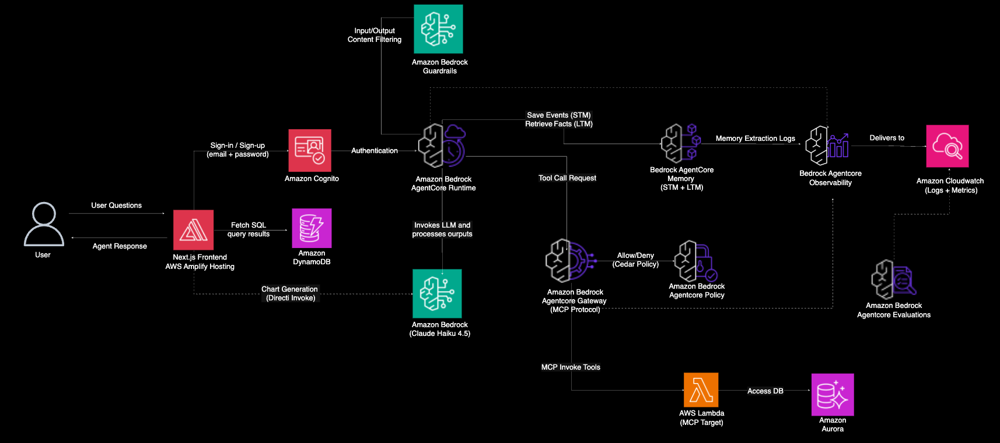
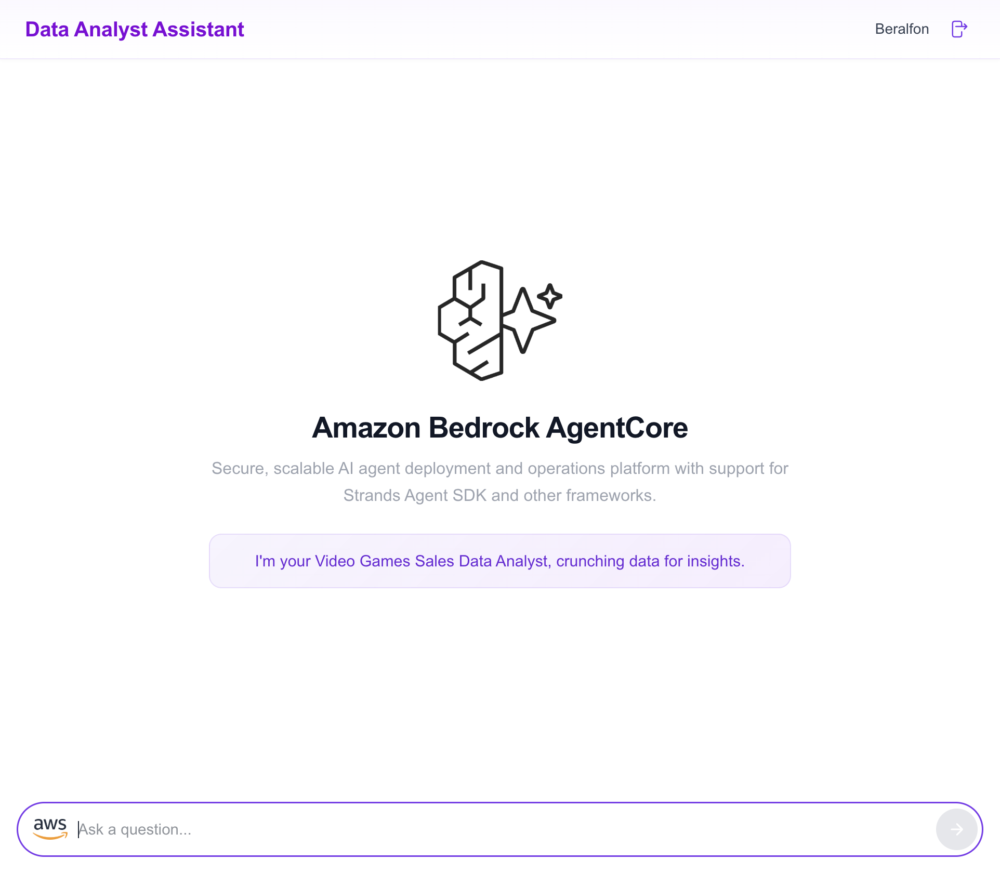
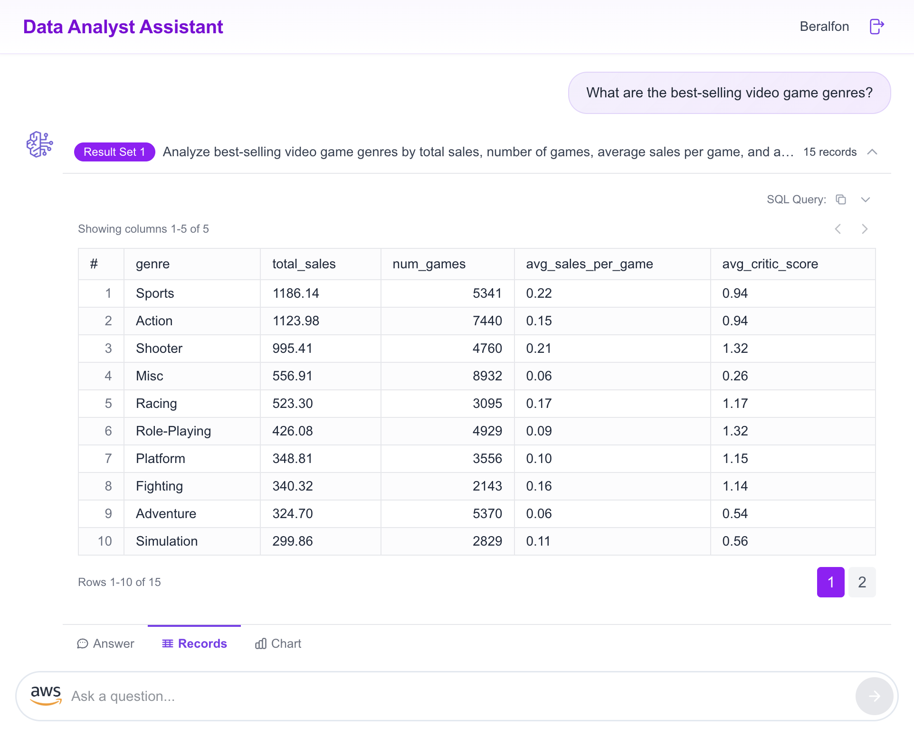
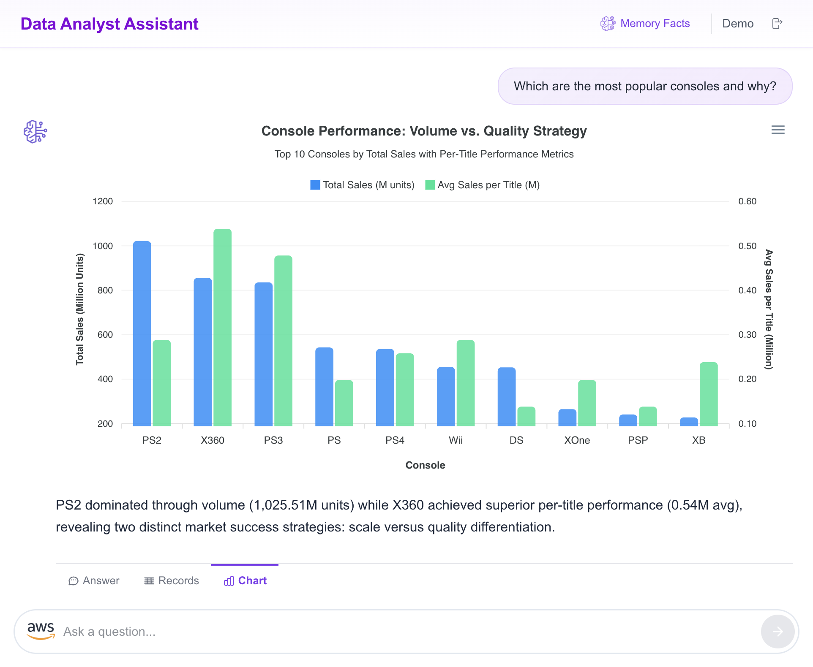

# Video Games Sales Data Analyst Assistant

> **Full-stack AI agent** powered by Amazon Bedrock AgentCore, Strands Agents SDK, and AWS Amplify Gen 2 — demonstrating **all** AgentCore features (Runtime, Memory, Gateway, Policy Engine, Guardrails, Evaluators, Observability, and Identity) in a single deployable sample.

A production-grade reference solution that lets users interact with a PostgreSQL database of 64,000+ video game titles through natural language conversations, receive AI-generated SQL analysis, view results in tabular and chart formats, and retain cross-session memory of insights.



## Architecture



### How It Works

1. **User** opens the Next.js frontend (hosted on Amplify Hosting or locally) and signs in via Amazon Cognito
2. **Cognito Identity Pool** issues temporary IAM credentials scoped to the authenticated role
3. **Frontend** invokes the AgentCore Runtime via `InvokeAgentRuntime` (SSE streaming)
4. **AgentCore Runtime** hosts the Strands Agent, which processes the user's question using Claude Haiku 4.5
5. **Bedrock Guardrails** filter input/output — blocking PII exposure and off-limits topics (internal cost data)
6. **Agent** makes tool calls to the **AgentCore Gateway** (MCP Protocol) to query the database
7. **Policy Engine** evaluates Cedar authorization policies before each tool call (blocks PII fields, cost columns)
8. **Gateway** invokes the **DB Tools Lambda** (MCP Target) which executes read-only SQL via RDS Data API against **Aurora PostgreSQL**
9. **AgentCore Memory** saves conversation events (STM) and asynchronously extracts semantic facts (LTM) for cross-session knowledge
10. **AgentCore Observability** captures runtime logs, gateway invocation logs, memory extraction logs, and X-Ray traces → delivers to CloudWatch
11. **AgentCore Evaluators** run offline to measure SQL accuracy and response quality using LLM-as-Judge scoring

### AgentCore Features Used

| Feature | What It Does in This Sample |
|---------|----------------------------|
| **Runtime** | Hosts the Strands Agent in a managed container (ARM64, DEFAULT endpoint) |
| **Memory** | **STM**: conversation history per session. **LTM**: semantic "Facts" strategy extracting knowledge into `/facts/{actorId}` namespace. 90-day retention. |
| **Gateway (MCP)** | Exposes `get_tables_information()` and `execute_sql_query()` as Lambda targets behind an MCP Gateway |
| **Policy Engine (Cedar)** | Cedar policies block SQL queries referencing PII columns or internal cost fields |
| **Guardrails** | Topic-based deny (cost data, raw PII) + sensitive info handling (anonymize email/phone, block SSN/credit cards) |
| **Evaluators** | Custom LLM-as-Judge evaluators: SqlAccuracy (TRACE level) and ResponseQuality (SESSION level) |
| **Observability** | CloudWatch Logs delivery for runtime, gateway, and memory. X-Ray traces for end-to-end request tracing. |
| **Identity** | Cognito User Pool authenticates users. Each user's `sub` maps to `actorId` for memory isolation. |

## Prerequisites

Before you begin, ensure you have:

- **AWS Account** with [Bedrock model access](https://docs.aws.amazon.com/bedrock/latest/userguide/model-access.html) enabled for Claude Haiku 4.5
- **AWS CLI** v2 configured (`aws sts get-caller-identity` should return your account)
- **Node.js** 22+ and **[pnpm](https://pnpm.io/installation)** 9+
- **Python** 3.10+
- **Docker** running (for building the agent container image)
- **AWS CDK** installed (`npm install -g aws-cdk`)

> [!NOTE]
> If you are using [Finch](https://runfinch.com/) instead of Docker Desktop, prefix CDK commands with `CDK_DOCKER=finch`.

## Deploy End-to-End

The entire solution deploys in 4 steps. Total time: ~15 minutes.

### Step 1: Deploy Backend Infrastructure (CDK)

This deploys: VPC, Aurora PostgreSQL, DynamoDB, S3, Lambda, and all AgentCore resources (Runtime, Memory, Gateway, Policy Engine, Guardrails, Evaluators, Observability).

```bash
cd cdk-data-analyst-assistant-agentcore-strands
pnpm install
cdk bootstrap    # First time only
cdk deploy
```

> [!NOTE]
> If you are using Finch: `CDK_DOCKER=finch cdk deploy`

Create the RDS service-linked role if this is a new account:
```bash
aws iam create-service-linked-role --aws-service-name rds.amazonaws.com
```

### Step 2: Load Sample Data

Still in the `cdk-data-analyst-assistant-agentcore-strands/` directory:

```bash
# Set environment variables from CDK outputs
export STACK_NAME=CdkDataAnalystAssistantAgentcoreStrandsStack
export SECRET_ARN=$(aws cloudformation describe-stacks --stack-name "$STACK_NAME" --query "Stacks[0].Outputs[?OutputKey=='SecretARN'].OutputValue" --output text)
export READONLY_SECRET_ARN=$(aws cloudformation describe-stacks --stack-name "$STACK_NAME" --query "Stacks[0].Outputs[?OutputKey=='ReadOnlySecretARN'].OutputValue" --output text)
export AURORA_SERVERLESS_DB_CLUSTER_ARN=$(aws cloudformation describe-stacks --stack-name "$STACK_NAME" --query "Stacks[0].Outputs[?OutputKey=='AuroraServerlessDBClusterARN'].OutputValue" --output text)
export DATABASE_NAME=$(aws cloudformation describe-stacks --stack-name "$STACK_NAME" --query "Stacks[0].Parameters[?ParameterKey=='DatabaseName'].ParameterValue" --output text)
export DATA_SOURCE_BUCKET_NAME=$(aws cloudformation describe-stacks --stack-name "$STACK_NAME" --query "Stacks[0].Outputs[?OutputKey=='DataSourceBucketName'].OutputValue" --output text)
export TABLE_NAME="video_games_sales_units"

# Create tables and load 64,000+ records
python3 resources/create-sales-database.py

# Create read-only database user (least privilege)
python3 resources/create-readonly-user.py
```

### Step 3: Configure and Start the Frontend

```bash
cd ../amplify-video-games-sales-assistant-agentcore-strands
pnpm install
```

Generate the `.env.local` from CDK outputs (or run `../setup-frontend.sh`):

```bash
export STACK_NAME=CdkDataAnalystAssistantAgentcoreStrandsStack
export AGENT_RUNTIME_ARN=$(aws cloudformation describe-stacks --stack-name "$STACK_NAME" --query "Stacks[0].Outputs[?OutputKey=='AgentRuntimeArn'].OutputValue" --output text)
export QUESTION_ANSWERS_TABLE_NAME=$(aws cloudformation describe-stacks --stack-name "$STACK_NAME" --query "Stacks[0].Outputs[?OutputKey=='QuestionAnswersTableName'].OutputValue" --output text)
export MEMORY_ID=$(aws cloudformation describe-stacks --stack-name "$STACK_NAME" --query "Stacks[0].Outputs[?OutputKey=='MemoryId'].OutputValue" --output text)

cat > .env.local << EOF
AGENT_RUNTIME_ARN=$AGENT_RUNTIME_ARN
QUESTION_ANSWERS_TABLE_NAME=$QUESTION_ANSWERS_TABLE_NAME
MEMORY_ID=$MEMORY_ID
AGENT_ENDPOINT_NAME=DEFAULT
MODEL_ID_FOR_CHART=us.anthropic.claude-haiku-4-5-20251001-v1:0
APP_NAME=Data Analyst Assistant
WELCOME_MESSAGE=I'm your AI Data Analyst Assistant for video game sales. Ask me anything about sales trends, top games, publisher performance, and more!
EOF
```

### Step 4: Deploy Authentication and Start

Deploy Cognito User Pool + Identity Pool + IAM policies:

```bash
QUESTION_ANSWERS_TABLE_NAME="$QUESTION_ANSWERS_TABLE_NAME" \
AGENT_RUNTIME_ARN="$AGENT_RUNTIME_ARN" \
MEMORY_ID="$MEMORY_ID" \
pnpm ampx sandbox
```

Wait for `✔ Deployment completed. File written: amplify_outputs.json`, then in another terminal:

```bash
pnpm dev
```

Open [http://localhost:3000](http://localhost:3000), create an account, and start chatting!

## Test the Agent

Try these queries to exercise different features:

| Query | Tests |
|-------|-------|
| "What is the structure of your data?" | Tool call → `get_tables_information()` |
| "What are the top 5 best-selling games?" | SQL generation → `execute_sql_query()` |
| "What were total sales by region 2000-2010?" | Complex aggregation + chart generation |
| "Which developers get the best reviews?" | Multi-column analysis |
| "What is our cost per unit?" | **Guardrail blocks** (internal cost data topic) |
| "Show me customer email addresses" | **Guardrail blocks** (raw PII topic) |
| "Show profit margins by publisher" | **Policy Engine blocks** (Cedar denies cost columns) |
| "Give me a summary of our conversation" | Memory recall (STM within session) |

## Run Evaluations

Measure agent quality with the evaluation harness:

```bash
# Run custom evaluators (SqlAccuracy + ResponseQuality)
python3 evaluations/evaluate.py --agent-runtime-arn $AGENT_RUNTIME_ARN

# Also include AgentCore built-in evaluators (Correctness, GoalSuccessRate)
python3 evaluations/evaluate.py --agent-runtime-arn $AGENT_RUNTIME_ARN --use-agentcore-evals
```

Results are saved to `evaluations/eval_results.json`.

## Deploy Frontend to AWS Amplify Hosting (Optional)

For a production URL instead of `localhost:3000`, deploy to Amplify Hosting. See the [Frontend README](./amplify-video-games-sales-assistant-agentcore-strands/README.md#deploy-your-application-with-amplify-hosting-optional) for detailed instructions.

## Data Model

### PostgreSQL — `video_games_sales_units`

| Column | Type | Description |
|--------|------|-------------|
| `title` | TEXT | Game title |
| `console` | TEXT | Platform (PS4, Xbox One, Switch, etc.) |
| `genre` | TEXT | Genre (Action, Sports, RPG, etc.) |
| `publisher` | TEXT | Publisher name |
| `developer` | TEXT | Developer studio |
| `critic_score` | NUMERIC(3,1) | Metacritic score (0–10) |
| `na_sales` | NUMERIC(4,2) | North America sales (millions) |
| `jp_sales` | NUMERIC(4,2) | Japan sales (millions) |
| `pal_sales` | NUMERIC(4,2) | Europe & Africa sales (millions) |
| `other_sales` | NUMERIC(4,2) | Rest of world sales (millions) |
| `release_date` | DATE | Release date |

**64,016 titles** from 1971 to 2024. Source: [Video Game Sales (Kaggle)](https://www.kaggle.com/datasets/asaniczka/video-game-sales-2024) — [ODC Attribution License](https://opendatacommons.org/licenses/odbl/1-0/).

## Project Structure

```
video-games-sales-assistant/
├── README.md                              ← You are here (overview + deploy guide)
├── setup-frontend.sh                      ← Auto-generates .env.local from CDK outputs
├── evaluations/                           ← Evaluation harness
│   └── evaluate.py                        ← SQL accuracy + response quality tests
│
├── cdk-data-analyst-assistant-agentcore-strands/    ← Backend (CDK)
│   ├── README.md                          ← Deep dive: CDK stack, Gateway, Policy, Guardrails, Evals
│   ├── cdklib/                            ← CDK stack definition
│   ├── resources/                         ← Data loading scripts + CSV
│   └── data-analyst-assistant-agentcore-strands/    ← Agent code
│       ├── app.py                         ← Strands Agent entrypoint
│       ├── Dockerfile                     ← Container with ADOT instrumentation
│       └── instructions.txt               ← System prompt
│
└── amplify-video-games-sales-assistant-agentcore-strands/  ← Frontend (Next.js)
    ├── README.md                          ← Deep dive: Auth, routes, AWS calls, Amplify Hosting
    ├── amplify/                           ← Amplify Gen 2 (Cognito + IAM policies)
    ├── src/                               ← Next.js App Router + Tailwind CSS
    └── .env.local.example                 ← Environment variables template
```

## Deep Dive

| Topic | Where to Look |
|-------|---------------|
| CDK stack details, Cedar policies, Guardrail config, Evaluators | [Backend README](./cdk-data-analyst-assistant-agentcore-strands/README.md) |
| Frontend routes, AWS SDK calls, Amplify Hosting deployment | [Frontend README](./amplify-video-games-sales-assistant-agentcore-strands/README.md) |
| Agent code, system prompt, tools | [`data-analyst-assistant-agentcore-strands/`](./cdk-data-analyst-assistant-agentcore-strands/data-analyst-assistant-agentcore-strands/) |
| Gateway Lambda handler | [`lambdas/db_tools/`](./lambdas/db_tools/) |

## Application Screenshots





## Clean Up

```bash
# 1. Delete CDK stack (all backend resources)
cd cdk-data-analyst-assistant-agentcore-strands
cdk destroy

# 2. Delete Amplify sandbox (Cognito + IAM)
cd ../amplify-video-games-sales-assistant-agentcore-strands
pnpm ampx sandbox delete

# 3. If using Amplify Hosting: delete the app from Amplify Console
```

## Troubleshooting

| Issue | Solution |
|-------|----------|
| CDK deploy fails on container build | Ensure Docker/Finch is running. Use `CDK_DOCKER=finch` for Finch. |
| Agent returns empty responses | Check CloudWatch logs at `/aws/vendedlogs/bedrock-agentcore/<runtimeId>` |
| Memory facts not appearing | LTM extraction is async (20-40s). Wait and query again in a new session. |
| SQL queries fail | Verify `create-readonly-user.py` ran successfully. Check Lambda logs. |
| Frontend can't invoke agent | Ensure `.env.local` has correct `AGENT_RUNTIME_ARN`. Run `ampx sandbox` to deploy IAM policies. |
| Guardrail not blocking | Check CDK deployed the guardrail. Verify `GUARDRAIL_ID` env var in runtime. |
| Gateway tools not discovered | Ensure Lambda resource policy allows `bedrock-agentcore.amazonaws.com`. |

## Important

> [!IMPORTANT]
> This sample application is for demonstration purposes. Validate the code with your organization's security best practices before deploying to production.

## License

This project is licensed under the Apache-2.0 License.