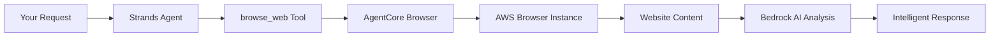

# 🚀 Quick Start: Strands + AgentCore Browser Tool

## 5-Minute Integration Walkthrough

This guide shows you how to get Strands agents working with AWS Bedrock AgentCore Browser Tool in 5 minutes.

### Step 1: Install Dependencies (2 minutes)

```bash
# Clone and navigate to the integration directory
cd 03-integrations/01-AgentCore-tools/02-Agent-Core-browser-tool/03-browser-with-Strands

# Quick setup (automated)
chmod +x setup.sh && ./setup.sh

# OR manual setup
python3.10 -m venv venv_310
source venv_310/bin/activate
pip install -r requirements.txt
playwright install
```

### Step 2: Configure AWS (1 minute)

```bash
# Set up AWS credentials (choose one method)

# Method 1: AWS CLI
aws configure

# Method 2: Environment variables
export AWS_ACCESS_KEY_ID=your_key_here
export AWS_SECRET_ACCESS_KEY=your_secret_here
export AWS_REGION=us-east-1

# Method 3: Copy and edit .env file
cp .env.template .env
# Edit .env with your AWS credentials
```

### Step 3: Test Basic Integration (1 minute)

```bash
# Test the browser tool directly
python bedrock_strands_browser_tool.py

# Expected output:
# 🧪 Testing Bedrock Strands Browser Tool
# ✅ Success: 1234 characters extracted
# ✅ Success: {"title": "Example Domain", ...}
```

### Step 4: Create Your First Strands Agent (1 minute)

Create `my_first_agent.py`:

```python
from strands import Agent
from bedrock_strands_browser_tool import browse_web

# Create an intelligent browsing agent
agent = Agent(
    tools=[browse_web],
    model="anthropic.claude-instant-v1",
    system_prompt="You are a web research assistant."
)

# Use the agent to browse and analyze a website
result = agent("Browse https://example.com and tell me what this website is about")
print(f"Agent Analysis: {result}")
```

Run it:
```bash
python my_first_agent.py
```

### Step 5: Verify Full Integration (30 seconds)

```bash
# Run comprehensive tests
python test_integration.py

# Expected output:
# ✅ AWS Bedrock connectivity verified
# ✅ Browser tool integration working  
# ✅ AI agent analysis functional
# 🎉 All tests passed!
```

## 🎯 What Just Happened?

You've successfully created a complete integration where:

1. **Strands Agent** receives your natural language request
2. **AgentCore Browser Tool** launches a secure AWS-hosted browser
3. **Browser automation** navigates to the website and extracts content
4. **Bedrock AI models** analyze the content and provide intelligent responses
5. **Strands orchestration** coordinates the entire workflow

## 🔄 The Complete Flow



## 🚀 Next Steps

Now that you have the basic integration working:

1. **Explore Examples**: Run `python example_usage.py` for more advanced scenarios
2. **Try Tutorials**: Check out the Jupyter notebooks in the tutorials directory
3. **Build Custom Agents**: Create agents for your specific use cases
4. **Production Deployment**: Follow the production patterns in the documentation

## 🆘 Troubleshooting

### Common Issues:

**AWS Authentication Error**:
```bash
# Verify AWS credentials
aws sts get-caller-identity
```

**Python Version Error**:
```bash
# Ensure Python 3.10+
python3.10 --version
```

**Strands Import Error**:
```bash
# Verify virtual environment is activated
source venv_310/bin/activate
pip list | grep strands
```

**Browser Tool Error**:
```bash
# Check Bedrock access
aws bedrock list-foundation-models --region us-east-1
```

## 🎉 Success!

You now have a working Strands + AgentCore Browser Tool integration! The agent can intelligently browse websites, extract content, and provide AI-powered analysis - all running on secure AWS infrastructure.

---

**Total Time**: ~5 minutes  
**Result**: Production-ready AI agents with secure browser automation capabilities