# LlamaIndex-AgentCore Integration: Architecture Flow

## 📋 File Structure and Connections

This document shows how all files in the LlamaIndex integration work together to create a complete browser automation solution.

## 🏗️ Architecture Overview

```mermaid
graph TB
    %% Entry Points
    User[User/Developer] --> Integration[integration.py]
    User --> Examples[examples/]
    
    %% Core Integration Layer
    Integration --> Config[config.py]
    Integration --> Client[client.py]
    Integration --> Tools[tools.py]
    Integration --> Workflow[workflow_orchestrator.py]
    
    %% Configuration Layer
    Config --> ConfigFile[config.example.yaml]
    Config --> EnvFile[.env.template]
    
    %% Client Layer
    Client --> Interfaces[interfaces.py]
    Client --> ErrorHandler[error_handler.py]
    Client --> ResponseParser[response_parser.py]
    Client --> Exceptions[exceptions.py]
    
    %% Tools Layer
    Tools --> CaptchaTools[captcha_tools.py]
    Tools --> CaptchaWorkflows[captcha_workflows.py]
    Tools --> VisionModels[vision_models.py]
    
    %% Processing Layer
    Integration --> DocumentProcessor[document_processor.py]
    Integration --> IncrementalProcessor[incremental_processor.py]
    DocumentProcessor --> HybridClient[hybrid_browser_client.py]
    
    %% Security & Privacy Layer
    Client --> SecurityManager[security_manager.py]
    Client --> PrivacyManager[privacy_manager.py]
    SecurityManager --> SecurityPrivacy[security_privacy_integration.py]
    
    %% Infrastructure Layer
    Client --> LocalBrowser[local_browser_backend.py]
    Integration --> Monitoring[monitoring.py]
    
    %% Setup & Installation
    User --> SetupEnv[setup_env.py]
    User --> Setup[setup.py]
    User --> Install[install.py]
    
    %% Testing
    Integration --> TestIntegration[test_integration.py]
    
    %% External Dependencies
    Client -.-> AWS[AWS AgentCore Service]
    Tools -.-> LlamaIndex[LlamaIndex Framework]
    VisionModels -.-> Bedrock[AWS Bedrock Vision Models]
    
    style Integration fill:#e1f5fe
    style Client fill:#f3e5f5
    style Tools fill:#e8f5e8
    style Config fill:#fff3e0
```



## 📁 File Connections and Dependencies

### 🎯 **Entry Point Files**

#### `integration.py` - Main Integration Class
**Purpose**: Primary entry point for developers
**Connects to**:
- `config.py` - Configuration management
- `client.py` - Browser client operations
- `tools.py` - LlamaIndex tool implementations
- `workflow_orchestrator.py` - Complex workflow management
- `document_processor.py` - Document processing
- `monitoring.py` - Observability

**Flow**:
```python
LlamaIndexAgentCoreIntegration() 
  → ConfigurationManager() 
  → AgentCoreBrowserClient() 
  → LlamaIndex Tools
  → Browser Operations
```

### ⚙️ **Configuration Layer**

#### `config.py` - Configuration Management
**Purpose**: Centralized configuration handling
**Connects to**:
- `config.example.yaml` - Configuration template
- `.env.template` - Environment variables
- `exceptions.py` - Configuration errors

**Data Flow**:
```
config.example.yaml → ConfigurationManager → Integration Components
.env.template → Environment Variables → AWS Credentials
```

### 🌐 **Browser Client Layer**

#### `client.py` - AgentCore Browser Client
**Purpose**: Core browser automation client
**Connects to**:
- `interfaces.py` - Abstract interfaces
- `error_handler.py` - Error handling and retries
- `response_parser.py` - Response processing
- `exceptions.py` - Custom exceptions
- `security_manager.py` - Security controls

**Operation Flow**:
```
Browser Request → Authentication → API Call → Response Parsing → Error Handling → Result
```

#### `interfaces.py` - Abstract Interfaces
**Purpose**: Defines contracts for browser operations
**Used by**:
- `client.py` - Concrete implementation
- `hybrid_browser_client.py` - Hybrid implementation
- `local_browser_backend.py` - Local fallback
- `tools.py` - Tool implementations

### 🛠️ **Tools Layer**

#### `tools.py` - LlamaIndex Tool Implementations
**Purpose**: LlamaIndex BaseTool implementations
**Connects to**:
- `interfaces.py` - Browser client interface
- `exceptions.py` - Error handling
- `captcha_tools.py` - CAPTCHA-specific tools
- LlamaIndex framework (external)

**Tool Chain**:
```
LlamaIndex Agent → BaseTool → Browser Client → AgentCore Service → Web Content → Tool Response
```

#### `captcha_tools.py` - Advanced CAPTCHA Tools
**Purpose**: Specialized CAPTCHA handling
**Connects to**:
- `tools.py` - Base tool functionality
- `captcha_workflows.py` - CAPTCHA workflows
- `vision_models.py` - Vision model integration
- `interfaces.py` - Browser operations

#### `captcha_workflows.py` - CAPTCHA Workflows
**Purpose**: Complex CAPTCHA solving workflows
**Connects to**:
- `captcha_tools.py` - Tool implementations
- `vision_models.py` - AI analysis
- `workflow_orchestrator.py` - Workflow management

### 🧠 **AI/Vision Layer**

#### `vision_models.py` - Bedrock Vision Models
**Purpose**: AI-powered image analysis
**Connects to**:
- `captcha_tools.py` - CAPTCHA analysis
- `captcha_workflows.py` - Workflow integration
- AWS Bedrock (external)

**Vision Flow**:
```
Screenshot → Vision Model → Analysis → CAPTCHA Solution → Browser Action
```

### 📄 **Document Processing Layer**

#### `document_processor.py` - Document Processing
**Purpose**: Convert web content to LlamaIndex documents
**Connects to**:
- `client.py` - Browser operations
- `hybrid_browser_client.py` - Browser client
- `response_parser.py` - Response processing
- LlamaIndex documents (external)

#### `incremental_processor.py` - Incremental Processing
**Purpose**: Track content changes over time
**Connects to**:
- `document_processor.py` - Document creation
- `client.py` - Browser operations
- `monitoring.py` - Change tracking

### 🔒 **Security Layer**

#### `security_manager.py` - Security Controls
**Purpose**: Security policy enforcement
**Connects to**:
- `client.py` - Browser client
- `privacy_manager.py` - Privacy controls
- `security_privacy_integration.py` - Integrated security

#### `privacy_manager.py` - Privacy Management
**Purpose**: Data privacy and PII protection
**Connects to**:
- `security_manager.py` - Security integration
- `document_processor.py` - Content processing
- `monitoring.py` - Privacy monitoring

### 🔧 **Infrastructure Layer**

#### `workflow_orchestrator.py` - Workflow Management
**Purpose**: Complex multi-step workflow coordination
**Connects to**:
- `integration.py` - Main integration
- `client.py` - Browser operations
- `captcha_workflows.py` - CAPTCHA workflows
- `monitoring.py` - Workflow monitoring

#### `hybrid_browser_client.py` - Hybrid Browser Client
**Purpose**: Combines AgentCore and local browser capabilities
**Connects to**:
- `client.py` - AgentCore client
- `local_browser_backend.py` - Local browser
- `interfaces.py` - Common interface

#### `local_browser_backend.py` - Local Browser Fallback
**Purpose**: Local browser automation fallback
**Connects to**:
- `hybrid_browser_client.py` - Hybrid client
- `interfaces.py` - Browser interface
- Playwright/Selenium (external)

### 📊 **Monitoring & Observability**

#### `monitoring.py` - Monitoring and Metrics
**Purpose**: Performance monitoring and observability
**Connects to**:
- `integration.py` - Main integration
- `client.py` - Browser operations
- `workflow_orchestrator.py` - Workflow metrics
- `document_processor.py` - Processing metrics

### 🚨 **Error Handling Layer**

#### `error_handler.py` - Error Handling and Retries
**Purpose**: Robust error handling with retry logic
**Connects to**:
- `client.py` - Browser client
- `exceptions.py` - Custom exceptions
- `monitoring.py` - Error metrics

#### `exceptions.py` - Custom Exceptions
**Purpose**: Domain-specific exception definitions
**Used by**: All modules for error handling

#### `response_parser.py` - Response Processing
**Purpose**: Parse and validate API responses
**Connects to**:
- `client.py` - Response processing
- `exceptions.py` - Parsing errors
- `document_processor.py` - Content extraction

### 🛠️ **Setup & Installation**

#### `setup_env.py` - Environment Setup
**Purpose**: Automated environment configuration
**Connects to**:
- `requirements.txt` - Dependencies
- `config.example.yaml` - Configuration template

#### `setup.py` - Package Setup
**Purpose**: Python package configuration
**Connects to**:
- `requirements.txt` - Dependencies
- `__init__.py` - Package structure

#### `install.py` - Installation Script
**Purpose**: Automated installation with validation
**Connects to**:
- `setup_env.py` - Environment setup
- `config.py` - Configuration validation

### 🧪 **Testing**

#### `test_integration.py` - Integration Testing
**Purpose**: End-to-end integration testing
**Connects to**:
- `integration.py` - Main integration
- `document_processor.py` - Processing tests
- `incremental_processor.py` - Incremental tests

## 🔄 **Complete Data Flow**

### 1. **Initialization Flow**
```
User Code → integration.py → config.py → client.py → AWS Authentication → Ready
```

### 2. **Browser Operation Flow**
```
LlamaIndex Agent → tools.py → client.py → error_handler.py → AgentCore API → Browser → response_parser.py → Tool Response
```

### 3. **Document Processing Flow**
```
URL → client.py → Browser Content → document_processor.py → LlamaIndex Document → User
```

### 4. **CAPTCHA Handling Flow**
```
CAPTCHA Detected → captcha_tools.py → vision_models.py → Bedrock Analysis → captcha_workflows.py → Solution → Browser Submission
```

### 5. **Error Handling Flow**
```
Error Occurs → exceptions.py → error_handler.py → Retry Logic → monitoring.py → Recovery/Failure
```

## 🎯 **Key Integration Points**

1. **LlamaIndex Integration**: `tools.py` implements `BaseTool` interface
2. **AWS Integration**: `client.py` handles AWS authentication and API calls
3. **Vision AI Integration**: `vision_models.py` connects to Bedrock vision models
4. **Security Integration**: `security_manager.py` and `privacy_manager.py` ensure compliance
5. **Monitoring Integration**: `monitoring.py` provides observability across all components

## 🚀 **Usage Patterns**

### Simple Usage
```python
from integration import LlamaIndexAgentCoreIntegration
integration = LlamaIndexAgentCoreIntegration()
agent = integration.create_agent()
result = agent.query("Browse https://example.com and summarize")
```

### Advanced Usage
```python
from integration import LlamaIndexAgentCoreIntegration
from tools import create_captcha_tools

integration = LlamaIndexAgentCoreIntegration(config_path="config.yaml")
captcha_tools = create_captcha_tools(integration.browser_client)
agent = integration.create_agent(additional_tools=captcha_tools)
```

This architecture provides a complete, production-ready integration between LlamaIndex and AWS Bedrock AgentCore Browser Tool with comprehensive error handling, security, and monitoring capabilities.