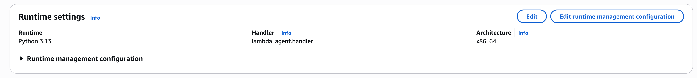
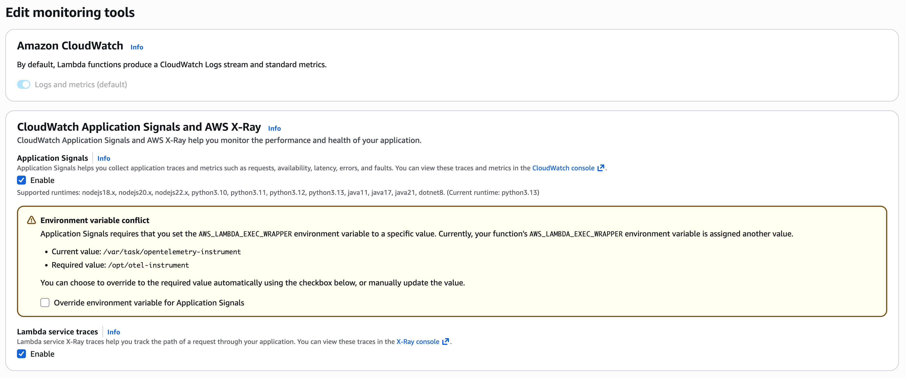
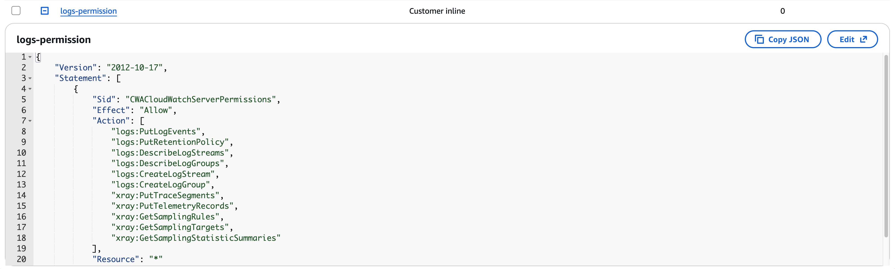

# Agent in Lambda with AgentCore Observability

This sample shows how to wrap a Strands agent directly inside an **AWS Lambda function** and
configure end-to-end AgentCore Gen AI observability using the AWS Distro for OpenTelemetry (ADOT).

The agent is **not** deployed on an AgentCore runtime — it runs entirely within Lambda's execution
environment. Observability traces appear in CloudWatch Application Signals / Gen AI observability
and X-Ray, identical to runtime-hosted agents.

## Architecture

```
Caller (test event / API Gateway)
  └── AWS Lambda  (lambda_agent.py)
        ├── ADOT — bundled via pip (aws-opentelemetry-distro)
        │     └── opentelemetry-instrument exec wrapper
        ├── X-Ray active tracing  (enabled in console)
        └── Strands Agent
              └── Amazon Bedrock (Claude)
                    └── Gen AI spans → CloudWatch Application Signals
```

## Files

| File | Description |
|:-----|:------------|
| `lambda_agent.py` | Lambda handler that initialises and invokes a Strands agent |
| `requirements.txt` | `strands-agents` + `aws-opentelemetry-distro` |
| `build.sh` | Builds a Lambda-compatible ZIP using the SAM build container |
| `images/` | Console screenshots referenced in this README |

---

## Step 1 — Build the deployment package

The ZIP must be built inside a Lambda-compatible container so that native dependencies compile
for the `x86_64` Lambda runtime.

```bash
chmod +x build.sh
./build.sh          # uses Finch; replace with Docker if preferred
```

This produces `package.zip` containing:
- `strands-agents` and its dependencies
- `aws-opentelemetry-distro` and its dependencies
- `opentelemetry-instrument` binary at the ZIP root (required for the exec wrapper)
- `lambda_agent.py`

---

## Step 2 — Create and configure the Lambda function

1. Create a Lambda function for **Python 3.13**, architecture **x86_64**, from scratch.
2. Upload `package.zip` as the deployment package.
3. Set the handler to `lambda_agent.handler`.
4. Under **Configuration → General configuration**, increase **Timeout** to at least **5 minutes**
   (LLM calls can be slow on first invocation).



---

## Step 3 — Enable X-Ray tracing and Application Signals

1. Navigate to **Configuration → Monitoring and operations tools**.
2. Enable **Application Signals** and **Lambda service traces** (X-Ray active tracing).
   This automatically attaches the AWS-managed ADOT Lambda layer to your function.



The managed ADOT layer provides the X-Ray segment exporter. It appears in the Layers section
of your function after enabling.


> **Why bundle `aws-opentelemetry-distro` via pip?**
> The managed ADOT layer provides the `/opt/otel-instrument` exec wrapper, but Strands requires
> the `aws-opentelemetry-distro` Python package to emit Gen AI spans correctly. By installing it
> in the deployment ZIP and pointing `AWS_LAMBDA_EXEC_WRAPPER` to the bundled
> `opentelemetry-instrument`, you get both the Strands instrumentation and the X-Ray exporter
> from the managed layer working together.

---

## Step 4 — Set environment variables

Add the following environment variables under **Configuration → Environment variables**:

| Variable | Value | Notes |
|:---------|:------|:------|
| `AGENT_OBSERVABILITY_ENABLED` | `true` | Enables Strands Gen AI span emission |
| `AWS_LAMBDA_EXEC_WRAPPER` | `/var/task/opentelemetry-instrument` | Uses the bundled OTel wrapper |
| `OTEL_PYTHON_DISTRO` | `aws_distro` | Activates the AWS OTel Python distro |
| `OTEL_PYTHON_CONFIGURATOR` | `aws_configurator` | Activates the AWS OTel configurator |
| `OTEL_TRACES_EXPORTER` | `otlp` | Exports traces via OTLP |
| `OTEL_EXPORTER_OTLP_PROTOCOL` | `http/protobuf` | OTLP over HTTP |
| `OTEL_METRICS_EXPORTER` | `none` | Disable metrics export (not needed) |
| `OTEL_RESOURCE_ATTRIBUTES` | `service.version=1.0,service.name=<your-service-name>` | Identifies your service in traces |
| `OTEL_EXPORTER_OTLP_LOGS_HEADERS` | `x-aws-log-group=/aws/lambda/<fn-name>,x-aws-log-stream=otel,x-aws-metric-namespace=<fn-name>` | Routes OTel logs to the right CW log group |

Replace `<your-service-name>` and `<fn-name>` with your Lambda function name.

Full example values:
```
AGENT_OBSERVABILITY_ENABLED=true
AWS_LAMBDA_EXEC_WRAPPER=/var/task/opentelemetry-instrument
OTEL_EXPORTER_OTLP_LOGS_HEADERS=x-aws-log-group=/aws/lambda/strands-lambda-obs-demo,x-aws-log-stream=otel,x-aws-metric-namespace=strands-lambda-obs-demo
OTEL_EXPORTER_OTLP_PROTOCOL=http/protobuf
OTEL_METRICS_EXPORTER=none
OTEL_PYTHON_CONFIGURATOR=aws_configurator
OTEL_PYTHON_DISTRO=aws_distro
OTEL_RESOURCE_ATTRIBUTES=service.version=1.0,service.name=strands-lambda-obs-demo
OTEL_TRACES_EXPORTER=otlp
```


---

## Step 5 — IAM execution role permissions

The Lambda execution role needs:

1. **Amazon Bedrock** and **AgentCore** service access — attach the AWS managed policy
   `BedrockAgentCoreFullAccess` to get started quickly.
2. **CloudWatch Logs + X-Ray write access** — add an inline policy:

```json
{
    "Version": "2012-10-17",
    "Statement": [
        {
            "Sid": "CWLogsAndXRay",
            "Effect": "Allow",
            "Action": [
                "logs:PutLogEvents",
                "logs:PutRetentionPolicy",
                "logs:DescribeLogStreams",
                "logs:DescribeLogGroups",
                "logs:CreateLogStream",
                "logs:CreateLogGroup",
                "xray:PutTraceSegments",
                "xray:PutTelemetryRecords",
                "xray:GetSamplingRules",
                "xray:GetSamplingTargets",
                "xray:GetSamplingStatisticSummaries"
            ],
            "Resource": "*"
        }
    ]
}
```



---

## Step 6 — Test the function

Send a test event from the Lambda console or AWS CLI:

```json
{ "prompt": "How far is the Moon from Earth?" }
```

```bash
aws lambda invoke \
  --function-name strands-lambda-obs-demo \
  --payload '{"prompt": "How far is the Moon from Earth?"}' \
  --cli-binary-format raw-in-base64-out \
  response.json && cat response.json
```

---

## Viewing traces

After invoking the function:

1. **CloudWatch Gen AI observability**:
   CloudWatch → Application Signals → Gen AI observability
   - Session view with LLM spans, tool calls, token usage

2. **X-Ray Service Map**:
   CloudWatch → X-Ray traces → Service map
   - Lambda → Bedrock topology

3. **Lambda Logs**:
   CloudWatch → Log groups → `/aws/lambda/<function-name>`

---

## Pattern: Lambda invoking an AgentCore runtime agent

This folder also contains a related pattern in
[`../01-lambda-invokes-runtime/`](../01-lambda-invokes-runtime/README.md): a Lambda function
that **calls an agent hosted on an AgentCore runtime**.

### The span suppression problem

When a Lambda function invokes an AgentCore runtime agent, Lambda's execution environment
**automatically suppresses outgoing OTel spans** from the Lambda function itself. This means
spans generated inside Lambda (e.g. any pre-processing logic) will not propagate to the
runtime's trace, breaking the end-to-end trace view.

### What is required for observability in that pattern

To produce a complete connected trace when Lambda triggers an AgentCore runtime:

| Requirement | Why |
|:------------|:----|
| ADOT Lambda Layer (`/opt/otel-instrument`) | Injects W3C `traceparent` header into outbound calls so Lambda and runtime spans share the same trace ID |
| `AWS_LAMBDA_EXEC_WRAPPER=/opt/otel-instrument` | Points Lambda to the layer's wrapper (not the bundled one) |
| X-Ray active tracing on the Lambda function | Sends Lambda segment data to X-Ray |
| AgentCore runtime observability enabled | The runtime automatically emits Gen AI spans linked to the incoming trace context |
| `AGENT_OBSERVABILITY_ENABLED=true` on the runtime agent | Activates Strands Gen AI span emission on the runtime side |

With this setup, the full trace path — Lambda invocation → AgentCore runtime → Bedrock LLM calls —
appears as a single connected trace in CloudWatch Application Signals.

See [`../01-lambda-invokes-runtime/`](../01-lambda-invokes-runtime/README.md) for the working
code sample of this pattern.

---

## Prerequisites

- Python 3.13, Docker or Finch (for `build.sh`)
- AWS credentials configured with Bedrock and Lambda permissions
- Amazon Bedrock Claude model enabled in your region
